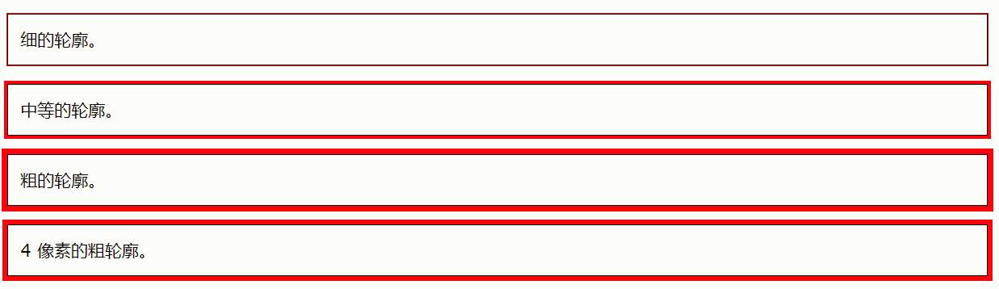
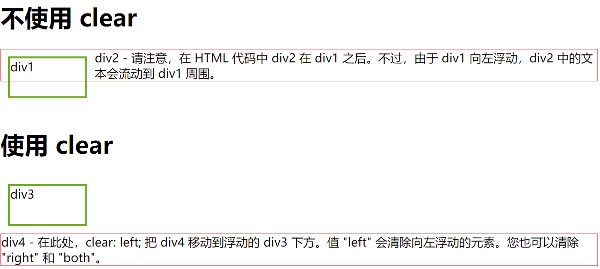
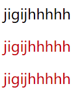
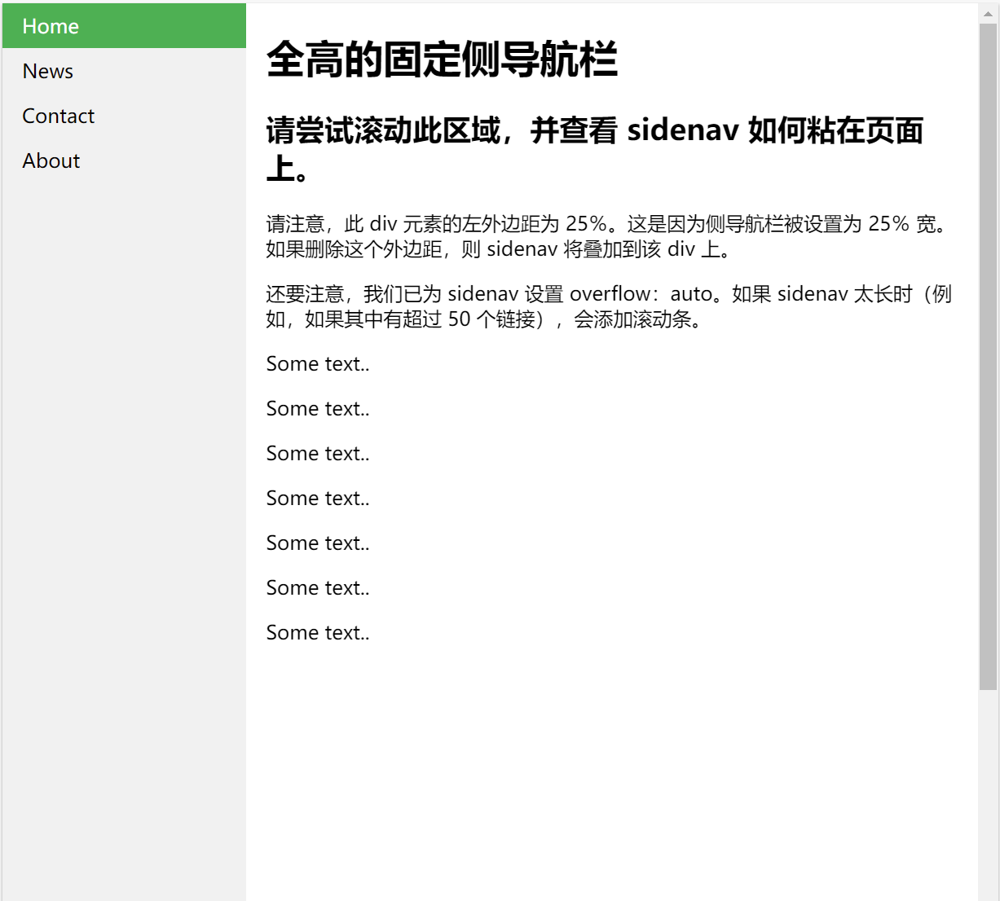

# ------CSS 基础知识------

# 1. CSS简介

### 1.1 什么是 CSS？

- *CSS* 指的是层叠样式表* (*C*ascading *S*tyle *S*heets)
- CSS 描述了*如何在屏幕、纸张或其他媒体上显示 HTML 元素*
- CSS *节省了大量工作*。它可以同时控制多张网页的布局
- 外部样式表存储在 *CSS 文件*中

***：**也称级联样式表。


### 1.2 为何使用 CSS？

CSS 用于定义网页的样式，包括针对不同设备和屏幕尺寸的设计和布局。


# 2. CSS 语法

CSS 规则集（rule-set）由选择器和声明块组成：


# 3. CSS选择器

**所有简单的 CSS 选择器**

| 选择器               | 例子       | 例子描述                             |
| :------------------- | :--------- | :----------------------------------- |
| class                | .intro     | 选取所有 class="intro" 的元素。      |
| id                   | #firstname | 选取 id="firstname" 的那个元素。     |
| *                    | *          | 选取所有元素。                       |
| element              | p          | 选取所有 <p> 元素。                  |
| element,*element*,.. | div, p     | 选取所有 <div> 元素和所有 <p> 元素。 |


# 4. CSS使用

### 4.1 三种使用 CSS 的方法

有三种插入样式表的方法：

- 外部 CSS

  ```html
  <link rel="stylesheet" type="text/css" href="mystyle.css">
  ```

- 内部 CSS

  ```html
  <style>
      body {
          background-color: linen;
      }
      h1 {
          color: maroon;
          margin-left: 40px;
      } 
  </style>
  ```

- 行内 CSS

  ```html
  <h1 style="color:blue;text-align:center;">This is a heading</h1>
  ```


### 4.2 层叠顺序

当为某个 HTML 元素指定了多个样式时，会使用哪种样式呢？

页面中的所有样式将按照以下规则“层叠”为新的“虚拟”样式表，其中第一优先级最高：

```
行内CSS>内部CSS>外部CSS>浏览器默认样式
```

因此，行内样式具有最高优先级，并且将覆盖外部和内部样式以及浏览器默认样式。


# 5. CSS 注释

### 5.1 CSS 注释

注释用于解释代码，以后在您编辑源代码时可能会有所帮助。

浏览器会忽略注释。

位于 <style> 元素内的 CSS 注释，以 /* 开始，以 */ 结束：

```html
<style> 
    /* 这是一条单行注释 */
    p {
        color: red;
    }
</style>
```


### 5.2 HTML

从 HTML 教程中，您学习到可以使用 <!--...--> 语法在 HTML 源代码中添加注释。

在下面的例子中，我们结合使用了 HTML 和 CSS 注释：

```html
<!DOCTYPE html>
<html>
    <head>
        <style>
            p {
                color: red; /* 将文字颜色设置为红色 */
            } 
        </style>
    </head>
    <body>
        <h2>My Heading</h2>

        <!-- 这些段落将是红色的 -->
        <p>Hello World!</p>
        <p>这段文本由 CSS 设置样式。</p>
        <p>CSS 注释不会在输出中显示。</p>
    </body>
</html>
```


# 6. CSS颜色

### 6.1 CSS 背景色

```html
<h1 style="background-color:DodgerBlue;">China</h1>
```


### 6.2 CSS 文本颜色

```html
<h1 style="color:blue;">China</h1>
```


### 6.3 CSS 边框颜色

```html
<h1 style="border:2px solid Tomato;">Hello World</h1>
```


### 6.4 CSS 颜色值

在 CSS 中，还可以使用 RGB 值、HEX 值、HSL 值、RGBA 值或者 HSLA 值

##### 6.4.1 CSS rgb 颜色

```
在 CSS 中，可以使用下面的公式将颜色指定为 RGB 值：

rgb(red, green, blue)
每个参数 (red、green 以及 blue) 定义了 0 到 255 之间的颜色强度。
例如，rgb(255, 0, 0) 显示为红色，因为红色设置为最大值（255），其他设置为 0。
要显示黑色，请将所有颜色参数设置为 0，如下所示：rgb(0, 0, 0)。
要显示白色，请将所有颜色参数设置为 255，如下所示：rgb(255, 255, 255)。
```


##### 6.4.2 CSS rgba 值

```
RGBA 颜色值是具有 alpha 通道的 RGB 颜色值的扩展 - 它指定了颜色的不透明度。

RGBA 颜色值指定为：
rgba(red, green, blue, alpha)
alpha 参数是介于 0.0（完全透明）和 1.0（完全不透明）之间的数字
```


##### 6.4.3 CSS HEX 颜色

```
HEX 值
在 CSS 中，可以使用以下格式的十六进制值指定颜色：

#rrggbb
其中 rr（红色）、gg（绿色）和 bb（蓝色）是介于 00 和 ff 之间的十六进制值（与十进制 0-255 相同）。
例如，#ff0000 显示为红色，因为红色设置为最大值（ff），其他设置为最小值（00）
```


##### 6.4.5 CSS HSL 颜色

```
在 CSS 中，可以使用色相、饱和度和明度（HSL）来指定颜色，格式如下：

hsla(hue, saturation, lightness)
色相（hue）是色轮上从 0 到 360 的度数。0 是红色，120 是绿色，240 是蓝色。
饱和度（saturation）是一个百分比值，0％ 表示灰色阴影，而 100％ 是全色。
亮度（lightness）也是百分比，0％ 是黑色，50％ 是既不明也不暗，100％是白色。
```


##### 6.4.6 HSLA 颜色

```
HSLA 颜色值是带有 Alpha 通道的 HSL 颜色值的扩展 - 它指定了颜色的不透明度。

HSLA 颜色值指定为：
hsla(*hue*, *saturation*, *lightness*, *alpha*)
*alpha* 参数是介于 0.0（完全透明）和 1.0（完全不透明）之间的数字
```


# 7. CSS背景

### 7.1 所有 CSS 背景属性

| 属性                  | 描述                                               |
| :-------------------- | :------------------------------------------------- |
| background            | 在一条声明中设置所有背景属性的简写属性。           |
| background-attachment | 设置背景图像是固定的还是与页面的其余部分一起滚动。 |
| background-clip       | 规定背景的绘制区域。                               |
| background-color      | 设置元素的背景色。                                 |
| background-image      | 设置元素的背景图像。                               |
| background-origin     | 规定在何处放置背景图像。                           |
| background-position   | 设置背景图像的开始位置。                           |
| background-repeat     | 设置背景图像是否及如何重复。                       |
| background-size       | 规定背景图像的尺寸。                               |


### 7.2 背景颜色 background-color

background-color 属性指定元素的背景色。

页面的背景色设置如下：

```html
<style>
body {
  background-color: lightblue;
}
</style>
```


### 7.3 背景图像 background-image

background-image 属性指定用作元素背景的图像。

默认情况下，图像会重复，以覆盖整个元素。

页面的背景图像可以像这样设置：

```html
<style>
body {
  background-image: url("paper.gif");
}
</style>
```


### 7.4 背景重复 background-repeat

默认情况下，background-image 属性在水平和垂直方向上都重复图像。

某些图像应只适合水平或垂直方向上重复，否则它们看起来会很奇怪，如下所示：

```html
<style>
*{
  background-image: url("tree.png");
  background-repeat: repeat-x;
  background-repeat: repeat-y;
  background-repeat: no-repeat;
}
</style>
```


### 7.5 背景位置 background-position

background-position 属性用于指定背景图像的位置。

把背景图片放在右上角：

```html
<style>
body {
  background-image: url("tree.png");
  background-repeat: no-repeat;
  background-position: right top;
}
</style>
```


### 7.6 背景定位 background-attachment

background-attachment 属性指定背景图像是应该滚动还是固定的（不会随页面的其余部分一起滚动）：

指定应该固定背景图像：

```html
<style>
body {
  background-image: url("tree.png");
  background-repeat: no-repeat;
  background-position: right top;
  background-attachment: fixed;
  /*指定背景图像应随页面的其余部分一起滚动*/
  background-attachment: scroll;
}
</style>
```


### 7.7 背景简写

##### 7.6.1 CSS background - 简写属性

如需缩短代码，也可以在一个属性中指定所有背景属性。它被称为简写属性。

而不是这样写：

```html
<style>
body {
  background-color: #ffffff;
  background-image: url("tree.png");
  background-repeat: no-repeat;
  background-position: right top;
}
</style>
```

使用简写属性在一条声明中设置背景属性：

```html
<style>
body {
  background: #ffffff url("tree.png") no-repeat right top;
}
</style>
```


# 8. CSS边框

### 8.1 所有 CSS 边框属性

| 属性                                                         | 描述                                                  |
| :----------------------------------------------------------- | :---------------------------------------------------- |
| [border](https://www.w3school.com.cn/cssref/pr_border.asp)   | 简写属性，在一条声明中设置所有边框属性。              |
| [border-color](https://www.w3school.com.cn/cssref/pr_border-color.asp) | 简写属性，设置四条边框的颜色。                        |
| [border-radius](https://www.w3school.com.cn/cssref/pr_border-radius.asp) | 简写属性，可设置圆角的所有四个 border-*-radius 属性。 |
| [border-style](https://www.w3school.com.cn/cssref/pr_border-style.asp) | 简写属性，设置四条边框的样式。                        |
| [border-width](https://www.w3school.com.cn/cssref/pr_border-width.asp) | 简写属性，设置四条边框的宽度。                        |
| [border-bottom](https://www.w3school.com.cn/cssref/pr_border-bottom.asp) | 简写属性，在一条声明中设置所有下边框属性。            |
| [border-bottom-color](https://www.w3school.com.cn/cssref/pr_border-bottom-color.asp) | 设置下边框的颜色。                                    |
| [border-bottom-style](https://www.w3school.com.cn/cssref/pr_border-bottom-style.asp) | 设置下边框的样式。                                    |
| [border-bottom-width](https://www.w3school.com.cn/cssref/pr_border-bottom-width.asp) | 设置下边框的宽度。                                    |
| [border-left](https://www.w3school.com.cn/cssref/pr_border-left.asp) | 简写属性，在一条声明中设置所有左边框属性。            |
| [border-left-color](https://www.w3school.com.cn/cssref/pr_border-left-color.asp) | 设置左边框的颜色。                                    |
| [border-left-style](https://www.w3school.com.cn/cssref/pr_border-left-style.asp) | 设置左边框的样式。                                    |
| [border-left-width](https://www.w3school.com.cn/cssref/pr_border-left-width.asp) | 设置左边框的宽度。                                    |
| [border-right](https://www.w3school.com.cn/cssref/pr_border-right.asp) | 简写属性，在一条声明中设置所有右边框属性。            |
| [border-right-color](https://www.w3school.com.cn/cssref/pr_border-right-color.asp) | 设置右边框的颜色。                                    |
| [border-right-style](https://www.w3school.com.cn/cssref/pr_border-right-style.asp) | 设置右边框的样式。                                    |
| [border-right-width](https://www.w3school.com.cn/cssref/pr_border-right-width.asp) | 设置右边框的宽度。                                    |
| [border-top](https://www.w3school.com.cn/cssref/pr_border-top.asp) | 简写属性，在一条声明中设置所有上边框属性。            |
| [border-top-color](https://www.w3school.com.cn/cssref/pr_border-top-color.asp) | 设置上边框的颜色。                                    |
| [border-top-style](https://www.w3school.com.cn/cssref/pr_border-top-style.asp) | 设置上边框的样式。                                    |
| [border-top-width](https://www.w3school.com.cn/cssref/pr_border-top-width.asp) | 设置上边框的宽度。                                    |


### 8.2 CSS 边框属性

CSS border 属性允许您指定元素边框的样式、宽度和颜色。

### 8.3 CSS 边框宽度

border-width 属性指定四个边框的宽度。

可以将宽度设置为特定大小（以 px、pt、cm、em 计），也可以使用以下三个预定义值之一：thin、medium 或 thick

```html
<style>
    p.four {
        border-style: dotted;
        border-width: thick;
    }
</style>
```


### 8.4 CSS 边框样式

border-style 属性指定要显示的边框类型。

允许以下值：

```
- dotted - 定义点线边框
- dashed - 定义虚线边框
- solid - 定义实线边框
- double - 定义双边框
- groove - 定义 3D 坡口边框。效果取决于 border-color 值
- ridge - 定义 3D 脊线边框。效果取决于 border-color 值
- inset - 定义 3D inset 边框。效果取决于 border-color 值
- outset - 定义 3D outset 边框。效果取决于 border-color 值
- none - 定义无边框
- hidden - 定义隐藏边框
```


##### 8.4.1 特定的宽度

border-width 属性可以设置一到四个值（用于上边框、右边框、下边框和左边框）

```html
<style>
p.three {
  border-style: solid;
  border-width: 25px 10px 4px 35px; /* 上边框 25px，右边框 10px，下边框 4px，左边框 35px */
}
</style>
```


### 8.5 CSS 边框颜色

border-color 属性用于设置四个边框的颜色。

可以通过以下方式设置颜色：

```
- name - 指定颜色名，比如 "red"
- HEX - 指定十六进制值，比如 "#ff0000"
- RGB - 指定 RGB 值，比如 "rgb(255,0,0)"
- HSL - 指定 HSL 值，比如 "hsl(0, 100%, 50%)"
- transparent
```

**注释：**如果未设置 `border-color`，则它将继承元素的颜色。


##### 8.5.1 特定边框的颜色

border-color 属性可以设置一到四个值（用于上边框、右边框、下边框和左边框）。

```html
<style>
p.one {
  border-style: solid;
  border-color: red green blue yellow; /* 上红、右绿、下蓝、左黄 */
}
</style>
```


##### 8.5.2 CSS 边框 - 单独的边

从上一章的例子中，您已经看到可以为每一侧指定不同的边框。

在 CSS 中，还有一些属性可用于指定每个边框（顶部、右侧、底部和左侧）：

```html
<style>
p {
  border-top-style: dotted;
  border-right-style: solid;
  border-bottom-style: dotted;
  border-left-style: solid;
}
</style>
```


### 8.6 CSS border - 简写属性

就像您在上一章中所见，处理边框时要考虑许多属性。

为了缩减代码，也可以在一个属性中指定所有单独的边框属性。

`border` 属性是以下各个边框属性的简写属性：

```
- border-width
- border-style（必需）
- border-color
```

```html
<style>
p {
  border: 5px solid red;
}
</style>
```


### 8.7 CSS 圆角边框

border-radius 属性用于向元素添加圆角边框


# 9. CSS 外边距

CSS margin 属性用于在任何定义的边框之外，为元素周围创建空间。

通过 CSS，您可以完全控制外边距。有一些属性可用于设置元素每侧（上、右、下和左）的外边距。

### 9.1 所有 CSS 外边距属性

| 属性                                                         | 描述                                       |
| :----------------------------------------------------------- | :----------------------------------------- |
| [margin](https://www.w3school.com.cn/cssref/pr_margin.asp)   | 用于在一条声明中设置外边距属性的简写属性。 |
| [margin-bottom](https://www.w3school.com.cn/cssref/pr_margin-bottom.asp) | 设置元素的下外边距。                       |
| [margin-left](https://www.w3school.com.cn/cssref/pr_margin-left.asp) | 设置元素的左外边距。                       |
| [margin-right](https://www.w3school.com.cn/cssref/pr_margin-right.asp) | 设置元素的右外边距。                       |
| [margin-top](https://www.w3school.com.cn/cssref/pr_margin-top.asp) | 设置元素的上外边距。                       |


### 9.2 margin

CSS 拥有用于为元素的每一侧指定外边距的属性：

```
- margin-top
- margin-right
- margin-bottom
- margin-left
```

所有外边距属性都可以设置以下值：

```
- auto - 浏览器来计算外边距
- length - 以 px、pt、cm 等单位指定外边距
- % - 指定以包含元素宽度的百分比计的外边距
- inherit - 指定应从父元素继承外边距
```

**提示：**允许负值。


### 9.3 简写属性

**工作原理是这样的：**

如果 margin 属性有四个值：

- margin: 25px 50px 75px 100px;

```
上外边距是 25px
右外边距是 50px
下外边距是 75px
左外边距是 100px
```


### 9.4 auto 值

您可以将 margin 属性设置为 auto，以使元素在其容器中水平居中。

然后，该元素将占据指定的宽度，并且剩余空间将在左右边界之间平均分配。

使用 `margin: auto`：

```html
<style>
div {
  width: 300px;
  margin: auto;
  border: 1px solid red;
}
</style>
```


### 9.5 inherit 值

使 <p class="ex1"> 元素的左外边距继承自父元素（<div>）

使用 inherit 值：

```html
<style>
p.ex1 {
  margin-left: inherit;
}
</style>
```


### 9.6 外边距合并

外边距合并（叠加）是一个相当简单的概念。但是，在实践中对网页进行布局时，它会造成许多混淆。

简单地说，外边距合并指的是，当两个垂直外边距相遇时，它们将形成一个外边距。合并后的外边距的高度等于两个发生合并的外边距的高度中的较大者。

当一个元素出现在另一个元素上面时，第一个元素的下外边距与第二个元素的上外边距会发生合并。


# 10. CSS 内边距

CSS padding 属性用于在任何定义的边界内的元素内容周围生成空间。

通过 CSS，您可以完全控制内边距（填充）。有一些属性可以为元素的每一侧（上、右、下和左侧）设置内边距。

### 10.1 所有 CSS 内边距属性

| 属性                                                         | 描述                                           |
| :----------------------------------------------------------- | :--------------------------------------------- |
| [padding](https://www.w3school.com.cn/cssref/pr_padding.asp) | 用于在一条声明中设置所有内边距属性的简写属性。 |
| [padding-bottom](https://www.w3school.com.cn/cssref/pr_padding-bottom.asp) | 设置元素的下内边距。                           |
| [padding-left](https://www.w3school.com.cn/cssref/pr_padding-left.asp) | 设置元素的左内边距。                           |
| [padding-right](https://www.w3school.com.cn/cssref/pr_padding-right.asp) | 设置元素的右内边距。                           |
| [padding-top](https://www.w3school.com.cn/cssref/pr_padding-top.asp) | 设置元素的上内边距。                           |


### 10.2 Padding - 单独的边

CSS 拥有用于为元素的每一侧指定内边距的属性：

```
- padding-top
- padding-right
- padding-bottom
- padding-left
```

所有内边距属性都可以设置以下值：

```
- length - 以 px、pt、cm 等单位指定内边距
- % - 指定以包含元素宽度的百分比计的内边距
- inherit - 指定应从父元素继承内边距
```

**提示：**不允许负值。

为 <div> 元素的所有四个边设置不同的内边距：

```html
<style>
div {
  padding-top: 50px;
  padding-right: 30px;
  padding-bottom: 50px;
  padding-left: 80px;
}
</style>
```


### 10.3 Padding - 简写属性

为了缩减代码，可以在一个属性中指定所有内边距属性。

`padding` 属性是以下各内边距属性的简写属性：

```
- padding-top
- padding-right
- padding-bottom
- padding-left
```

**工作原理是这样的：**

如果 padding 属性有四个值：

- padding: 25px 50px 75px 100px;

```
- 上内边距是 25px
- 右内边距是 50px
- 下内边距是 75px
- 左内边距是 100px
```

使用设置了四个值的 padding 简写属性：

```html
<style>
div {
  padding: 25px 50px 75px 100px;
}
</style>
```


### 10.4 内边距和元素宽度

CSS width 属性指定元素内容区域的宽度。内容区域是元素（盒模型）的内边距、边框和外边距内的部分。

因此，如果元素拥有指定的宽度，则添加到该元素的内边距会添加到元素的总宽度中。这通常是不希望的结果。

在这里，<div> 元素的宽度为 300px。但是，<div> 元素的实际宽度将是 350px（300px + 左内边距 25px + 右内边距 25px）：

```html
<style>
div {
  width: 300px;
  padding: 25px;
}
</style>
```

若要将宽度保持为 300px，无论填充量如何，那么您可以使用 box-sizing 属性。这将导致元素保持其宽度。如果增加内边距，则可用的内容空间会减少。

使用 box-sizing 属性将宽度保持为 300px，无论填充量如何：

```html
<style>
div {
  width: 300px;
  padding: 25px;
  box-sizing: border-box;
}
</style>
```


# 11. CSS 设置高度和宽度

height 和 width 属性用于设置元素的高度和宽度。

height 和 width 属性不包括内边距、边框或外边距。它设置的是元素内边距、边框以及外边距内的区域的高度或宽度。

### 11.1 CSS 高度和宽度值

height 和 width 属性可设置如下值：

```
- auto - 默认。浏览器计算高度和宽度。
- length - 以 px、cm 等定义高度/宽度。
- % - 以包含块的百分比定义高度/宽度。
- initial - 将高度/宽度设置为默认值。
- inherit - 从其父值继承高度/宽度。
```

**注意：**请记住，**height** 和 **width** 属性不包括内边距、边框或外边距！它们设置的是元素的内边距、边框和外边距内的区域的高度/宽度！


### 11.2 设置 max-width

max-width 属性用于设置元素的最大宽度。

可以用长度值（例如 px、cm 等）或包含块的百分比（％）来指定 max-width（最大宽度），也可以将其设置为 none（默认值。意味着没有最大宽度）。

当浏览器窗口小于元素的宽度（500px）时，会发生之前那个 <div> 的问题。然后，浏览器会将水平滚动条添加到页面。

在这种情况下，使用 max-width 能够改善浏览器对小窗口的处理。

**注释：**`max-width` 属性的值将覆盖 `width`（宽度）。

这个 <div> 元素的高度为 100 像素，最大宽度为 500 像素：

```html
<style>
div {
  max-width: 500px;
  height: 100px;
  background-color: powderblue;
}
</style>
```


### 11.3 设置 CSS 尺寸属性

| 属性                                                         | 描述                 |
| :----------------------------------------------------------- | :------------------- |
| [height](https://www.w3school.com.cn/cssref/pr_dim_height.asp) | 设置元素的高度。     |
| [max-height](https://www.w3school.com.cn/cssref/pr_dim_max-height.asp) | 设置元素的最大高度。 |
| [max-width](https://www.w3school.com.cn/cssref/pr_dim_max-width.asp) | 设置元素的最大宽度。 |
| [min-height](https://www.w3school.com.cn/cssref/pr_dim_min-height.asp) | 设置元素的最小高度。 |
| [min-width](https://www.w3school.com.cn/cssref/pr_dim_min-width.asp) | 设置元素的最小宽度。 |
| [width](https://www.w3school.com.cn/cssref/pr_dim_width.asp) | 设置元素的宽度。     |


# 12. CSS 框模型

所有 HTML 元素都可以视为方框。在 CSS 中，在谈论设计和布局时，会使用术语“盒模型”或“框模型”。

CSS 框模型实质上是一个包围每个 HTML 元素的框。它包括：外边距、边框、内边距以及实际的内容。下图展示了框模型：


对不同部分的说明：

```
- 内容 - 框的内容，其中显示文本和图像。
- 内边距 - 清除内容周围的区域。内边距是透明的。
- 边框 - 围绕内边距和内容的边框。
- 外边距 - 清除边界外的区域。外边距是透明的。
```


### 12.1 元素的宽度和高度

为了在所有浏览器中正确设置元素的宽度和高度，您需要了解框模型如何工作。

**重要提示：**使用 CSS 设置元素的 width 和 height 属性时，只需设置内容区域的宽度和高度。要计算元素的完整大小，还必须把内边距、边框和外边距加起来。

<div> 元素的总宽度将是 350px：

```html
<style>
div {
  width: 320px;
  padding: 10px;
  border: 5px solid gray;
  margin: 0; 
}
</style>
```

计算如下：

```
320px(宽度)
+ 20px（左+右内边距）
+ 10px（左+右边框）
+ 0px（左+右外边距）
= 350px
```

元素的总宽度应该这样计算：

```
元素总宽度 = 宽度 + 左内边距 + 右内边距 + 左边框 + 右边框 + 左外边距 + 右外边距
```

元素的总高度应该这样计算：

```
元素总高度 = 高度 + 上内边距 + 下内边距 + 上边框 + 下边框 + 上外边距 + 下外边距
```


# 13. CSS 轮廓

轮廓是在元素周围绘制的一条线，在边框之外，以凸显元素。

**注意：**轮廓与[边框](https://www.w3school.com.cn/css/css_border.asp)不同！不同之处在于：轮廓是在元素边框之外绘制的，并且可能与其他内容重叠。同样，轮廓也不是元素尺寸的一部分；元素的总宽度和高度不受轮廓线宽度的影响。

### 13.1 所有 CSS 轮廓属性

| 属性                                                         | 描述                                                         |
| :----------------------------------------------------------- | :----------------------------------------------------------- |
| [outline](https://www.w3school.com.cn/cssref/pr_outline.asp) | 简写属性，在一条声明中设置 outline-width、outline-style 以及 outline-color。 |
| [outline-color](https://www.w3school.com.cn/cssref/pr_outline-color.asp) | 设置轮廓的颜色。                                             |
| [outline-offset](https://www.w3school.com.cn/cssref/pr_outline-offset.asp) | 指定轮廓与元素的边缘或边框之间的空间。                       |
| [outline-style](https://www.w3school.com.cn/cssref/pr_outline-style.asp) | 设置轮廓的样式。                                             |
| [outline-width](https://www.w3school.com.cn/cssref/pr_outline-width.asp) | 设置轮廓的宽度。                                             |


### 13.2 CSS 轮廓样式

outline-style 属性指定轮廓的样式，并可设置如下值：

```
- dotted - 定义点状的轮廓。
- dashed - 定义虚线的轮廓。
- solid - 定义实线的轮廓。
- double - 定义双线的轮廓。
- groove - 定义 3D 凹槽轮廓。
- ridge - 定义 3D 凸槽轮廓。
- inset - 定义 3D 凹边轮廓。
- outset - 定义 3D 凸边轮廓。
- none - 定义无轮廓。
- hidden - 定义隐藏的轮廓。
```

下例展示了不同的 outline-style 值：

演示不同的轮廓样式：

```
p.dotted {outline-style: dotted;}
p.dashed {outline-style: dashed;}
p.solid {outline-style: solid;}
p.double {outline-style: double;}
p.groove {outline-style: groove;}
p.ridge {outline-style: ridge;}
p.inset {outline-style: inset;}
p.outset {outline-style: outset;}
```


### 13.3 CSS 轮廓宽度

outline-width 属性指定轮廓的宽度，并可设置如下值之一：

```
- thin（通常为 1px）
- medium（通常为 3px）
- thick （通常为 5px）
- 特定尺寸（以 px、pt、cm、em 计）
```




### 13.4 CSS 轮廓颜色

outline-color 属性用于设置轮廓的颜色。

可以通过以下方式设置颜色：

```
- name - 指定颜色名，比如 "red"
- HEX - 指定十六进制值，比如 "#ff0000"
- RGB - 指定 RGB 值，比如 "rgb(255,0,0)"
- HSL - 指定 HSL 值，比如 "hsl(0, 100%, 50%)"
- invert - 执行颜色反转（确保轮廓可见，无论是什么颜色背景）
```

下例展示了一些不同颜色的不同轮廓样式。请注意，这些元素在轮廓内还有黑色细边框：


##### 13.4.1 反转颜色

下例使用 outline-color: invert，执行了颜色反转。这样可以确保无论颜色背景如何，轮廓都是可见的：

反转颜色的实线轮廓。

```html
<style>
p.ex1 {
  border: 1px solid yellow;
  outline-style: solid;
  outline-color: invert;
}
</style>
```


### 13.5 CSS Outline - 简写属性

outline 属性是用于设置以下各个轮廓属性的简写属性：

```
- outline-width
- outline-style（必需）
- outline-color
```

从上面的列表中，outline 属性可指定一个、两个或三个值。值的顺序无关紧要

```html
<style>
p.ex1 {outline: dashed;}
p.ex2 {outline: dotted red;}
p.ex3 {outline: 5px solid yellow;}
p.ex4 {outline: thick ridge pink;}
</style>
```


### 13.6 CSS 轮廓偏移

outline-offset 属性在元素的轮廓与边框之间添加空间。元素及其轮廓之间的空间是透明的。

```html
<style>
p {
  margin: 50px;
  border: 1px solid black;
  outline: 1px solid red;
  outline-offset: 25px;
}
</style>
```


# 14. CSS 文本

### 14.1 所有 CSS 文本属性

| 属性                                                         | 描述                                                         |
| :----------------------------------------------------------- | :----------------------------------------------------------- |
| [color](https://www.w3school.com.cn/cssref/pr_text_color.asp) | 设置文本颜色。                                               |
| [direction](https://www.w3school.com.cn/cssref/pr_text_direction.asp) | 指定文本的方向 / 书写方向。                                  |
| [letter-spacing](https://www.w3school.com.cn/cssref/pr_text_letter-spacing.asp) | 设置字符间距。                                               |
| [line-height](https://www.w3school.com.cn/cssref/pr_dim_line-height.asp) | 设置行高。                                                   |
| [text-align](https://www.w3school.com.cn/cssref/pr_text_text-align.asp) | 指定文本的水平对齐方式。                                     |
| [text-decoration](https://www.w3school.com.cn/cssref/pr_text_text-decoration.asp) | 指定添加到文本的装饰效果。                                   |
| [text-indent](https://www.w3school.com.cn/cssref/pr_text_text-indent.asp) | 指定文本块中首行的缩进。                                     |
| [text-shadow](https://www.w3school.com.cn/cssref/pr_text-shadow.asp) | 指定添加到文本的阴影效果。                                   |
| [text-transform](https://www.w3school.com.cn/cssref/pr_text_text-transform.asp) | 控制文本的大小写。                                           |
| [text-overflow](https://www.w3school.com.cn/cssref/pr_text-overflow.asp) | 指定应如何向用户示意未显示的溢出内容。                       |
| [unicode-bidi](https://www.w3school.com.cn/cssref/pr_unicode-bidi.asp) | 与 direction 属性一起使用，设置或返回是否应重写文本来支持同一文档中的多种语言。 |
| [vertical-align](https://www.w3school.com.cn/cssref/pr_pos_vertical-align.asp) | 指定文本的垂直对齐方式。                                     |
| [white-space](https://www.w3school.com.cn/cssref/pr_text_white-space.asp) | 指定如何处理元素内的空白。                                   |
| [word-spacing](https://www.w3school.com.cn/cssref/pr_text_word-spacing.asp) | 设置单词间距。                                               |


### 14.2 CSS 文本颜色

color 属性用于设置文本的颜色。

background-color属性用于设置文本的背景色。


### 14.3 CSS 文本对齐

text-align 属性用于设置文本的水平对齐方式。

文本可以左对齐或右对齐，或居中对齐。

```
值：center left right justify
```

当 text-align 属性设置为 "justify" 后，将拉伸每一行，以使每一行具有相等的宽度，并且左右边距是直的（就像在杂志和报纸中)

```html
<!DOCTYPE html>
<html lang="en">
    <head>
        <meta charset="UTF-8">
        <title>Document</title>
        <style>
            span{
                width: 100px;
                text-align: justify;
                float: left;
            }
            span:after{
                content:'.';
                width: 100%;
                display: inline-block;
                overflow: hidden;
                height: 0;
            }
        </style>
    </head>
    <body>
        <div class="demo">
            <span>昵称</span>：<input type="text" style = 'width: 200px'><br><br>
            <span>电子邮箱</span>：<input type="email" style = 'width: 200px;'>
        </div>
    </body>
</html>
```


### 14.4 文本方向

direction 和 unicode-bidi 属性可用于更改元素的文本方向：

```html
<style>
p {
  direction: rtl;
  direction: ltr;
  unicode-bidi: bidi-override;
}
</style>
```


### 14.5 垂直对齐

vertical-align 属性设置元素的垂直对齐方式。

本例演示如何设置文本中图像的垂直对齐方式：

```html
<style>
img.top {
  vertical-align: top;
}

img.middle {
  vertical-align: middle;
}

img.bottom {
  vertical-align: bottom;
}
</style>
```


### 14.6 CSS 文字装饰

text-decoration 属性用于设置或删除文本装饰。

text-decoration: none; 通常用于从链接上删除下划线：

```html
<style>
    h1 {
        text-decoration: overline;
    }
    h2 {
        text-decoration: line-through;
    }
    h3 {
        text-decoration: underline;
    }
</style>
```


### 14.7 文本转换

text-transform 属性用于指定文本中的大写和小写字母。

它可用于将所有内容转换为大写或小写字母，或将每个单词的首字母大写

```html
<!DOCTYPE html>
<html>
<head>
<style>
p.uppercase {
  text-transform: uppercase;
}

p.lowercase {
  text-transform: lowercase;
}

p.capitalize {
  text-transform: capitalize;
}
</style>
</head>
<body>

<p class="uppercase">This is some text.</p>
<p class="lowercase">This is some text.</p>
<p class="capitalize">This is some text.</p>

</body>
</html>
```


### 14.8 CSS 文字间距

##### 14.8.1 文字缩进

text-indent 属性用于指定文本第一行的缩进：

```html
<style>
p {
  text-indent: 50px;
}
</style>
```


##### 14.8.2 字母间距

letter-spacing 属性用于指定文本中字符之间的间距。

下例演示如何增加或减少字符之间的间距：

```html
<style>
    h1 {
        letter-spacing: 3px;
    }
    h2 {
        letter-spacing: -3px;
    }
</style>
```


##### 14.8.3 行高

line-height 属性用于指定行之间的间距：

```html
<style>
    p.small {
        line-height: 0.8;
    }
    p.big {
        line-height: 1.8;
    }
</style>
```


##### 14.8.4 字间距

word-spacing 属性用于指定文本中单词之间的间距。

下例演示如何增加或减少单词之间的间距：

```html
<style>
    h1 {
        word-spacing: 10px;
    }
    h2 {
        word-spacing: -5px;
    }
</style>
```


##### 14.8.5 空白

white-space 属性指定元素内部空白的处理方式。

此例演示如何禁用元素内的文本换行：

```html
<style>
    p {
        white-space: nowrap;
    }
</style>
```


### 14.9. CSS 文本阴影

text-shadow 属性为文本添加阴影。

最简单的用法是只指定水平阴影（2px）和垂直阴影（2px）：

```html
<style>
h1 {
    /*第一个参数：水平位置
      第二个参数：垂直位子
      第三个参数：模糊度
      第四个参数：颜色
    */
  text-shadow: 2px 2px 5px red;
}
</style>
```


### 14.10 CSS 盒子阴影

CSS box-shadow 属性应用阴影于元素。

```html
<!DOCTYPE html>
<html>
    <head>
        <style>
            div.card {
                width: 250px;
                /*
                第一个参数：水平距离
                第二个参数：垂直距离
                第三个参数：模糊度
                第四个参数：阴影的距离
                */
                box-shadow: 0 4px 8px 0 rgba(0, 0, 0, 0.2), 0 6px 20px 0 rgba(0, 0, 0, 0.19);
                text-align: center;
            }

            div.header {
                background-color: #4CAF50;
                color: white;
                padding: 10px;
                font-size: 40px;
            }

            div.container {
                padding: 10px;
            }
        </style>
    </head>
    <body>

        <h2>Cards</h2>

        <p>box-shadow 属性可用于创建类似纸质的卡片：</p>

        <div class="card">
            <div class="header">
                <h1>1</h1>
            </div>

            <div class="container">
                <p>January 1, 2021</p>
            </div>
        </div>

    </body>
</html>
```


# 15. CSS 字体样式

### 15.1 所有 CSS 字体属性

| 属性                                                         | 描述                                     |
| :----------------------------------------------------------- | :--------------------------------------- |
| [font](https://www.w3school.com.cn/cssref/pr_font_font.asp)  | 简写属性。在一条声明中设置所有字体属性。 |
| [font-family](https://www.w3school.com.cn/cssref/pr_font_font-family.asp) | 规定文本的字体系列（字体族）。           |
| [font-size](https://www.w3school.com.cn/cssref/pr_font_font-size.asp) | 规定文本的字体大小。                     |
| [font-style](https://www.w3school.com.cn/cssref/pr_font_font-style.asp) | 规定文本的字体样式。                     |
| [font-variant](https://www.w3school.com.cn/cssref/pr_font_font-variant.asp) | 规定是否以小型大写字母的字体显示文本。   |
| [font-weight](https://www.w3school.com.cn/cssref/pr_font-weight.asp) | 规定字体的粗细。                         |


### 15.2 CSS font-family 属性

在 CSS 中，我们使用 font-family 属性规定文本的字体。

font-family 属性应包含多个字体名称作为“后备”系统，以确保浏览器/操作系统之间的最大兼容性。请以您需要的字体开始，并以通用系列结束（如果没有其他可用字体，则让浏览器选择通用系列中的相似字体）。字体名称应以逗号分隔。

**注释：**如果字体名称不止一个单词，则必须用引号引起来，例如："Times New Roman"。

```html
<style>
    .p1 {
        font-family: "Times New Roman", Times, serif;
    }
</style>
```


### 15.3 CSS font-style 属性

font-style 属性主要用于指定斜体文本。

此属性可设置三个值：

```
- normal - 文字正常显示
- italic - 文本以斜体显示
- oblique - 文本为“倾斜”（倾斜与斜体非常相似，但支持较少）
```

```html
<style>
    p.normal {
        font-style: normal;
    }
</style>
```


### 15.4 CSS font-variant 字体变体

font-variant 属性指定是否以 small-caps 字体（小型大写字母）显示文本。

在 small-caps 字体中，所有小写字母都将转换为大写字母。但是，转换后的大写字母的字体大小小于文本中原始大写字母的字体大小。

```html
<!DOCTYPE html>
<html>
    <head>
        <style>
            p.normal {
                font-variant: normal;
            }
            p.small {
                font-variant: small-caps;
            }
        </style>
    </head>
    <body>
        <p class="normal">My name is Bill Gates.</p>
        <p class="small">My name is Bill Gates.</p>
    </body>
</html>
```


### 15.5 CSS font-weight 字体粗细

font-weight 属性指定字体的粗细：

```html
<style>
    p.normal {
        font-weight: normal;
    }
    p.thick {
        font-weight: bold;
    }
</style>
```


### 15.6 CSS font-size 字体大小

font-size 属性设置文本的大小。

在网页设计中，能够管理文本大小很重要。但是，不应使用调整字体大小来使段落看起来像标题，或是使标题看起来像段落。

请始终使用正确的 HTML 标签，例如 <h1> - <h6> 用于标题，而 <p> 仅用于段落。

font-size 值可以是绝对或相对大小。

绝对尺寸：

```
- 将文本设置为指定大小
- 不允许用户在所有浏览器中更改文本大小（可访问性不佳）
- 当输出的物理尺寸已知时，绝对尺寸很有用
```

相对尺寸：

```
- 设置相对于周围元素的大小
- 允许用户在浏览器中更改文本大小
```

**注释：**如果您没有指定字体大小，则普通文本（如段落）的默认大小为 16px（16px = 1em）。

```html
<style>
font-size: 40px;
font-size: 2.5em; /* 40px/16=2.5em */
font-size: 100%;
</style>
```


##### 15.6.1 响应式字体大小

可以使用 vw 单位设置文本大小，它的意思是“视口宽度”（"viewport width"）。

这样，文本大小将遵循浏览器窗口的大小，请调整浏览器窗口的大小，以查看字体大小如何缩放：

```html
<h1 style="font-size:10vw">Hello World</h1>
```

视口（Viewport）是浏览器窗口的大小。 1vw = 视口宽度的 1％。如果视口为 50 厘米宽，则 1vw 为 0.5 厘米。


### 15.7 CSS 谷歌字体

如果您不想使用 HTML 中的任何标准字体，则可以使用 Google Fonts API 向页面添加数百种其他字体。

只需添加一个样式表链接并引用您选择的字体系列：

```html
<!DOCTYPE html>
<html>
    <head>
        <link rel="stylesheet" href="https://fonts.googleapis.com/css?family=Sofia">
        <style>
            body {
                font-family: "Sofia";
                font-size: 22px;
            }
        </style>
    </head>
    <body>
        <h1>Sofia Font</h1>
        <p>Lorem ipsum dolor sit amet, consectetuer adipiscing elit.</p>
    </body>
</html>
```


### 15.8 字体简写属性

为了缩短代码，也可以在一个属性中指定所有单个字体属性。

font 属性是以下属性的简写属性：

```
- font-style
- font-variant
- font-weight
- font-size/line-height
- font-family
```

使用简写声明设置一些字体属性（顺序）：

```html
<style>
    .font{
        font-style:italic;
        font-variant:small-caps;
        font-weight:bold;
        font-size:12px;
        line-height:1.5em;
        font-family:arial,verdana;
    }

    .font{font:italic small-caps bold 12px/1.5em arial,verdana;}
</style>
```

**注意：****font-size** 和 **font-family** 的值是必需的。如果缺少其他值之一，则会使用其默认值。


# 16.如何添加图标

向 HTML 页面添加图标的最简单方法是使用图标库，比如 Font Awesome。

将指定的图标类的名称添加到任何行内 HTML 元素（如 <i> 或 <span>）。

下面的图标库中的所有图标都是可缩放矢量，可以使用 CSS进行自定义（大小、颜色、阴影等）。

### 16.1Font Awesome 图标

如需使用 Font Awesome 图标，请访问 fontawesome.com，登录并获取代码添加到 HTML 页面的 <head> 部分：

```html
<script src="https://kit.fontawesome.com/yourcode.js"></script>
```

请在我们的 Font Awesome 5 教程中，阅读有关如何开始使用 Font Awesome 的更多内容。

**提示：**无需下载或安装！

```html
<!DOCTYPE html>
<html>
<head>
<script src="https://kit.fontawesome.com/a076d05399.js"></script>
</head>
<body>

<i class="fas fa-cloud"></i>
<i class="fas fa-heart"></i>
<i class="fas fa-car"></i>
<i class="fas fa-file"></i>
<i class="fas fa-bars"></i>

</body>
</html>
```

结果：

<iframe src="https://www.w3school.com.cn/demo/css/css-icons-awesome.html" style="margin: 0px; padding: 0px; border: 0px; width: 810px; height: 40px;"></iframe>


### 16.2 Bootstrap 图标

如需使用 Bootstrap glyphicons，请在 HTML 页面的 <head> 部分内添加这行：

```html
<link rel="stylesheet" href="https://maxcdn.bootstrapcdn.com/bootstrap/3.3.7/css/bootstrap.min.css">
```

**提示：**无需下载或安装！

```html
<!DOCTYPE html>
<html>
<head>
<link rel="stylesheet" href="https://maxcdn.bootstrapcdn.com/bootstrap/3.3.7/css/bootstrap.min.css">
</head>
<body>

<i class="glyphicon glyphicon-cloud"></i>
<i class="glyphicon glyphicon-remove"></i>
<i class="glyphicon glyphicon-user"></i>
<i class="glyphicon glyphicon-envelope"></i>
<i class="glyphicon glyphicon-thumbs-up"></i>

</body>
</html>
```

结果：

<iframe src="https://www.w3school.com.cn/demo/css/css-icons-bootstrap.html" style="margin: 10px 0px; padding: 0px; border: 0px; width: 810px; height: 30px;"></iframe>

 

### 16.3 Google 图标

如需使用 Google 图标，请在HTML页面的 <head> 部分中添加以下行：

```html
<link rel="stylesheet" href="https://fonts.googleapis.com/icon?family=Material+Icons">
```

**提示：**无需下载或安装！

```html
<!DOCTYPE html>
<html>
<head>
<link rel="stylesheet" href="https://fonts.googleapis.com/icon?family=Material+Icons">
</head>
<body>

<i class="material-icons">cloud</i>
<i class="material-icons">favorite</i>
<i class="material-icons">attachment</i>
<i class="material-icons">computer</i>
<i class="material-icons">traffic</i>

</body>
</html>
```

结果：

<iframe src="https://www.w3school.com.cn/demo/css/css-icons-google.html" style="margin: 0px; padding: 0px; border: 0px; width: 810px; height: 50px;"></iframe>


# 17. CSS 链接

四种链接状态分别是：

```
- a:link - 正常的，未访问的链接
- a:visited - 用户访问过的链接
- a:hover - 用户将鼠标悬停在链接上时
- a:active - 链接被点击时
```


# 18. 列表

### 18.1 所有 CSS 列表属性

| 属性                                                         | 描述                                       |
| :----------------------------------------------------------- | :----------------------------------------- |
| [list-style](https://www.w3school.com.cn/cssref/pr_list-style.asp) | 简写属性。在一条声明中设置列表的所有属性。 |
| [list-style-image](https://www.w3school.com.cn/cssref/pr_list-style-image.asp) | 指定图像作为列表项标记。                   |
| [list-style-position](https://www.w3school.com.cn/cssref/pr_list-style-position.asp) | 规定列表项标记（项目符号）的位置。         |
| [list-style-type](https://www.w3school.com.cn/cssref/pr_list-style-type.asp) | 规定列表项标记的类型。                     |


### 18.2 不同的列表项目标记

list-style-type 属性指定列表项标记的类型。

下例显示了一些可用的列表项标记：

```html
<!DOCTYPE html>
<html>
    <head>
        <style>
            ul.a {
                list-style-type: circle;
            }

            ul.b {
                list-style-type: square;
            }

            ol.c {
                list-style-type: upper-roman;
            }

            ol.d {
                list-style-type: lower-alpha;
            }
        </style>
    </head>
    <body>

        <h1>列表</h1>
        <p>无序列表实例：</p>

        <ul class="a">
            <li>Coffee</li>
            <li>Tea</li>
            <li>Coca Cola</li>
        </ul>

        <ul class="b">
            <li>Coffee</li>
            <li>Tea</li>
            <li>Coca Cola</li>
        </ul>

        <p>有序列表实例：</p>
        <ol class="c">
            <li>Coffee</li>
            <li>Tea</li>
            <li>Coca Cola</li>
        </ol>

        <ol class="d">
            <li>Coffee</li>
            <li>Tea</li>
            <li>Coca Cola</li>
        </ol>

    </body>
</html>
```


### 18.3 图像作为列表项标记

list-style-image 属性将图像指定为列表项标记：

```html
<style>
ul {
    list-style-image: url('sqpurple.gif');
}
</style>
```


### 18.4 定位列表项标记

list-style-position 属性指定列表项标记（项目符号）的位置。

"list-style-position: outside;" 表示项目符号点将在列表项之外。列表项每行的开头将垂直对齐。这是默认的：


"list-style-position: inside;" 表示项目符号将在列表项内。由于它是列表项的一部分，因此它将成为文本的一部分，并在开头推开文本：


```html
<style>
    ul.a {
        list-style-position: outside;
    }
    ul.b {
        list-style-position: inside;
    }
</style>
```


### 18.5 删除默认设置

list-style-type:none 属性也可以用于删除标记/项目符号。请注意，列表还拥有默认的外边距和内边距。要删除此内容，请在 <ul> 或 <ol> 中添加 margin:0 和 padding:0 ：

```html
<style>
    ul {
        list-style-type: none;
        margin: 0;
        padding: 0;
    }
</style>
```


### 18.6 简写属性

list-style 属性是一种简写属性。它用于在一条声明中设置所有列表属性：

```html
<style>
    ul {
        list-style: square inside url("sqpurple.gif");
    }
</style>
```

在使用简写属性时，属性值的顺序为：

- list-style-type（如果指定了 list-style-image，那么在由于某种原因而无法显示图像时，会显示这个属性的值）
- list-style-position（指定列表项标记应显示在内容流的内部还是外部）
- list-style-image（将图像指定为列表项标记）

如果缺少上述属性值之一，则将插入缺失属性的默认值（如果有）。


# 19. 表格

### 19.1 CSS 表格属性

| 属性                                                         | 描述                                           |
| :----------------------------------------------------------- | :--------------------------------------------- |
| [border](https://www.w3school.com.cn/cssref/pr_border.asp)   | 简写属性。在一条声明中设置所有边框属性。       |
| [border-collapse](https://www.w3school.com.cn/cssref/pr_border-collapse.asp) | 规定是否应折叠表格边框。                       |
| [border-spacing](https://www.w3school.com.cn/cssref/pr_border-spacing.asp) | 规定相邻单元格之间的边框的距离。               |
| [caption-side](https://www.w3school.com.cn/cssref/pr_tab_caption-side.asp) | 规定表格标题的位置。                           |
| [empty-cells](https://www.w3school.com.cn/cssref/pr_tab_empty-cells.asp) | 规定是否在表格中的空白单元格上显示边框和背景。 |
| [table-layout](https://www.w3school.com.cn/cssref/pr_tab_table-layout.asp) | 设置用于表格的布局算法。                       |

###### 

###### 

# ---------------------------

# ------CSS 中级知识------

# 1. CSS 布局 - display 属性

display 属性是用于控制布局的最重要的 CSS 属性。

### 1.1 display 属性

display 属性规定是否/如何显示元素。

每个 HTML 元素都有一个默认的 display 值，具体取决于它的元素类型。大多数元素的默认 display 值为 block 或 inline。


### 1.2 块级元素（block element）

块级元素总是从新行开始，并占据可用的全部宽度（尽可能向左和向右伸展）。

这个 <div> 元素属于块级元素。

块级元素的一些例子：

```html
<div>
<h1> - <h6>
<p>
<form>
<header>
<footer>
<section>
```


### 1.3 行内元素（inline element）

内联元素不从新行开始，仅占用所需的宽度。

这是段落中的行内 <span> 元素。

行内元素的一些例子：

```html
<span>
<a>

```


### 1.4 display: inline-block

与 display: inline 相比，主要区别在于 display: inline-block 允许在元素上设置宽度和高度。

同样，如果设置了 display: inline-block，将保留上下外边距/内边距，而 display: inline 则不会。

与 display: block 相比，主要区别在于 display：inline-block 在元素之后不添加换行符，因此该元素可以位于其他元素旁边。

下例展示 display: inline、display: inline-block 以及 display: block 的不同行为：


### 1.5 Display: none

display: none; 通常与 JavaScript 一起使用，以隐藏和显示元素，而无需删除和重新创建它们。如果您想知道如何实现此目标，请查看本页面上的最后一个实例。

默认情况下，<script> 元素使用 display: none;。

通过将 display 属性设置为 none 可以隐藏元素。该元素将被隐藏，并且页面将显示为好像该元素不在其中


### 1.6 visibility:hidden;

也可以隐藏元素。

但是，该元素仍将占用与之前相同的空间。元素将被隐藏，但仍会影响布局


### 1.7 CSS Display/Visibility 属性

| 属性                                                         | 描述                   |
| :----------------------------------------------------------- | :--------------------- |
| [display](https://www.w3school.com.cn/cssref/pr_class_display.asp) | 指定应如何显示元素。   |
| [visibility](https://www.w3school.com.cn/cssref/pr_class_visibility.asp) | 指定元素是否应该可见。 |


# 2. CSS 定位 - position 属性

position 属性规定应用于元素的定位方法的类型（static、relative、fixed、absolute 或 sticky）。

### 2.1 所有 CSS 定位属性

| 属性                                                         | 描述                                                         |
| :----------------------------------------------------------- | :----------------------------------------------------------- |
| [bottom](https://www.w3school.com.cn/cssref/pr_pos_bottom.asp) | 设置定位框的底部外边距边缘。                                 |
| [clip](https://www.w3school.com.cn/cssref/pr_pos_clip.asp)   | 剪裁绝对定位的元素。clip:rect (*top*, *right*, *bottom*, *left*); |
| [left](https://www.w3school.com.cn/cssref/pr_pos_left.asp)   | 设置定位框的左侧外边距边缘。                                 |
| [position](https://www.w3school.com.cn/cssref/pr_class_position.asp) | 规定元素的定位类型。                                         |
| [right](https://www.w3school.com.cn/cssref/pr_pos_right.asp) | 设置定位框的右侧外边距边缘。                                 |
| [top](https://www.w3school.com.cn/cssref/pr_pos_top.asp)     | 设置定位框的顶部外边距边缘。                                 |
| [z-index](https://www.w3school.com.cn/cssref/pr_pos_z-index.asp) | 设置元素的堆叠顺序。                                         |


### 2.2 position 属性

position 属性规定应用于元素的定位方法的类型。

有五个不同的位置值：

```
- static
- relative
- fixed
- absolute
- sticky
```

元素其实是使用 top、bottom、left 和 right 属性定位的。但是，除非首先设置了 position 属性，否则这些属性将不起作用。根据不同的 position 值，它们的工作方式也不同。


### 2.3 position: static

HTML 元素默认情况下的定位方式为 static（静态）。

静态定位的元素不受 top、bottom、left 和 right 属性的影响。

position: static; 的元素不会以任何特殊方式定位；它始终根据页面的正常流进行定位


### 2.4 position: relative

position: relative; 的元素相对于其正常位置进行定位。

设置相对定位的元素的 top、right、bottom 和 left 属性将导致其偏离其正常位置进行调整。不会对其余内容进行调整来适应元素留下的任何空间。


### 2.5 position: absolute

position: absolute; 的元素相对于最近的定位祖先元素进行定位（而不是相对于视口定位，如 fixed）。

然而，如果绝对定位的元素没有祖先，它将使用文档主体（body），并随页面滚动一起移动。

**注意：**“被定位的”元素是其位置除 **static** 以外的任何元素。


### 2.6 position: sticky

position: sticky; 的元素根据用户的滚动位置进行定位。

粘性元素根据滚动位置在相对（relative）和固定（fixed）之间切换。起先它会被相对定位，直到在视口中遇到给定的偏移位置为止 - 然后将其“粘贴”在适当的位置（比如 position:fixed）。

就是物体被定位的位置滚动到窗口时，会黏住在窗口上，简单将就是先执行相对定位，然后执行固定定位

**注意：**Internet Explorer、Edge 15 和更早版本不支持粘性定位。 Safari 需要 -webkit- 前缀（请参见上面的例子）。您还必须指定 **top**、**right**、**bottom** 或 **left** 至少之一，以使粘性定位起作用。


### 2.7 重叠元素

在对元素进行定位时，它们可以与其他元素重叠。

z-index 属性指定元素的堆栈顺序（哪个元素应放置在其他元素的前面或后面）。


# 3. CSS 布局 - 溢出

### 3.1 所有 CSS Overflow 属性

| 属性                                                         | 描述                                                |
| :----------------------------------------------------------- | :-------------------------------------------------- |
| [overflow](https://www.w3schools.com/cssref/pr_pos_overflow.asp) | 规定如果内容溢出元素框会发生什么情况。              |
| [overflow-x](https://www.w3schools.com/cssref/css3_pr_overflow-x.asp) | 规定在元素的内容区域溢出时如何处理内容的左/右边缘。 |
| [overflow-y](https://www.w3schools.com/cssref/css3_pr_overflow-y.asp) | 指定在元素的内容区域溢出时如何处理内容的上/下边缘。 |


### 3.2 CSS Overflow

overflow 属性指定在元素的内容太大而无法放入指定区域时是剪裁内容还是添加滚动条。

overflow 属性可设置以下值：

```
- visible - 默认。溢出没有被剪裁。内容在元素框外渲染
- hidden - 溢出被剪裁，其余内容将不可见
- scroll - 溢出被剪裁，同时添加滚动条以查看其余内容
- auto - 与 scroll 类似，但仅在必要时添加滚动条
```

**注释：****overflow** 属性仅适用于具有指定高度的块元素。

**注释：**在 OS X Lion（在 Mac 上）中，滚动条默认情况下是隐藏的，并且仅在使用时显示（即使设置了 "overflow:scroll"）。


### 3.3 overflow: visible

默认情况下，溢出是可见的(visible)，这意味着它不会被裁剪，而是在元素框外渲染：


### 3.4 overflow: hidden

如果使用 hidden 值，溢出会被裁剪，其余内容被隐藏：


### 3.5 overflow: scroll

如果将值设置为 scroll，溢出将被裁剪，并添加滚动条以便在框内滚动。请注意，这将在水平和垂直方向上添加一个滚动条（即使您不需要它）：


### 3.6 overflow: auto

auto 值类似于 scroll，但是它仅在必要时添加滚动条：


### 3.7 overflow-x 和 overflow-y

overflow-x 和 overflow-y 属性规定是仅水平还是垂直地（或同时）更改内容的溢出：

```html
<style>
div {
  overflow-x: hidden; /* 隐藏水平滚动栏 */
  overflow-y: scroll; /* 添加垂直滚动栏 */
}
</style>
```


# 4. CSS 布局 - 浮动和清除

### 4.1 所有 CSS 浮动属性

| 属性                                                         | 描述                                                         |
| :----------------------------------------------------------- | :----------------------------------------------------------- |
| [box-sizing](https://www.w3school.com.cn/cssref/pr_box-sizing.asp) | 定义元素的宽度和高度的计算方式：它们是否应包含内边距和边框。 |
| [clear](https://www.w3school.com.cn/cssref/pr_class_clear.asp) | 指定哪些元素可以在被清除的元素旁边以及在哪一侧浮动。         |
| [float](https://www.w3school.com.cn/cssref/pr_class_float.asp) | 指定元素应如何浮动。                                         |
| [overflow](https://www.w3school.com.cn/cssref/pr_pos_overflow.asp) | 指定如果内容溢出元素框会发生什么情况。                       |
| [overflow-x](https://www.w3school.com.cn/cssref/pr_overflow-x.asp) | 指定当溢出元素的内容区域时，如何处理内容的左/右边缘。        |
| [overflow-y](https://www.w3school.com.cn/cssref/pr_overflow-y.asp) | 指定当溢出元素的内容区域时，如何处理内容的上/下边缘。        |


### 4.2 CSS 布局 - 浮动和清除

CSS float 属性规定元素如何浮动。

CSS clear 属性规定哪些元素可以在清除的元素旁边以及在哪一侧浮动。


### 4.3 float 属性

float 属性用于定位和格式化内容，例如让图像向左浮动到容器中的文本那里。

float 属性可以设置以下值之一：

```
- left - 元素浮动到其容器的左侧
- right - 元素浮动在其容器的右侧
- none - 元素不会浮动（将显示在文本中刚出现的位置）。默认值。
- inherit - 元素继承其父级的 float 值
```

最简单的用法是，float 属性可实现（报纸上）文字包围图片的效果。


##### 4.3.1 实例 - float: right

下例指定图像应在文本中向右浮动：


##### 4.3.2 实例 - float: left


##### 4.3.3 实例 - No float


### 4.4 clear 属性

clear 属性指定哪些元素可以浮动于被清除元素的旁边以及哪一侧。

clear 属性可设置以下值之一：

```
- none - 允许两侧都有浮动元素。默认值
- left - 左侧不允许浮动元素
- right- 右侧不允许浮动元素
- both - 左侧或右侧均不允许浮动元素
- inherit - 元素继承其父级的 clear 值
```

使用 clear 属性的最常见用法是在元素上使用了 float 属性之后。

在清除浮动时，应该对清除与浮动进行匹配：如果某个元素浮动到左侧，则应清除左侧。您的浮动元素会继续浮动，但是被清除的元素将显示在其下方。




##### 4.4.1 clearfix Hack

如果一个元素比包含它的元素高，并且它是浮动的，它将“溢出”到其容器之外：

然后我们可以向包含元素添加 overflow: auto;，来解决此问题：


# 5. 对齐方式

### 5.1 居中对齐图像

如需居中图像，请将左右外边距设置为 auto，并将其设置为块元素

```
img {
  display: block;
  margin-left: auto;
  margin-right: auto;
  width: 40%;
}
```


### 5.2 居中对齐元素

要使块元素（例如 <div> ）水平居中，请使用 margin: auto;。

设置元素的宽度将防止其延伸到容器的边缘。

然后，元素将占用指定的宽度，剩余空间将在两个外边距之间平均分配


### 5.3 居中对齐文本

如果仅需在元素内居中文本，请使用 text-align: center;


### 5.4 垂直对齐

##### 5.4.1 垂直对齐 - 使用 padding

有很多方法可以在 CSS 中垂直对齐元素。一个简单的解决方案是使用上下内边距


##### 5.4.2 垂直对齐 - 使用 line-height

另一个技巧是使用*其值*等于 height 属性值的 line-height 属性


##### 5.4.3 垂直对齐 - 使用 position 和 transform

如果您的选择不是 padding 和 line-height，则另一种解决方案是使用 `position` 和 transform 属性

```
.center { 
  height: 200px;
  position: relative;
  border: 3px solid green; 
}

.center p {
  margin: 0;
  position: absolute;
  top: 50%;
  left: 50%;
  transform: translate(-50%, -50%);
}
```


##### 5.4.4  垂直对齐 - 使用 Flex

您还可以使用 flexbox 将内容居中。请注意，IE10 以及更早的版本不支持 flexbox


# 6. CSS 组合器

### 6.1 所有 CSS 组合选择器

| 选择器                                                       | 示例    | 示例描述                                   |
| :----------------------------------------------------------- | :------ | :----------------------------------------- |
| [*element* *element*](https://www.w3school.com.cn/cssref/selector_element_element.asp) | div p   | 选择 <div> 元素内的所有 <p> 元素。         |
| [*element*>*element*](https://www.w3school.com.cn/cssref/selector_element_gt.asp) | div > p | 选择其父元素是 <div> 元素的所有 <p> 元素。 |
| [*element*+*element*](https://www.w3school.com.cn/cssref/selector_element_plus.asp) | div + p | 选择所有紧随 <div> 元素之后的 <p> 元素。   |
| [*element1*~*element2*](https://www.w3school.com.cn/cssref/selector_gen_sibling.asp) | p ~ ul  | 选择前面有 <p> 元素的每个 <ul> 元素。      |


### 6.2 CSS 组合器

组合器是解释选择器之间关系的某种机制。

CSS 选择器可以包含多个简单选择器。在简单选择器之间，我们可以包含一个组合器。

CSS 中有四种不同的组合器：

```
- 后代选择器 (空格)
- 子选择器 (>)
- 相邻兄弟选择器 (+)
- 通用兄弟选择器 (~)	
```


### 6.3 后代选择器

后代选择器匹配属于指定元素后代的所有元素。

下面的例子选择 <div> 元素内的所有 <p> 元素：	

```html
<!DOCTYPE html>
<html>
    <head>
        <style>
            div p {
                background-color: yellow;
            }
        </style>
    </head>
    <body>

        <h1>后代选择器</h1>
        <p>后代选择器匹配作为指定元素后代的所有元素。</p>

        <div>
            <p>div 中的段落 1。</p>
            <p>div 中的段落 2。</p>
            <section><p>div 中的段落 3。</p></section>
        </div>

        <p>段落 4。不在 div 中。</p>
        <p>段落 5。不在 div 中。</p>

    </body>
</html>
```


### 6.4 子选择器

子选择器匹配属于指定元素子元素的所有元素。

下面的例子选择属于 <div> 元素子元素的所有 <p> 元素：

```html
<!DOCTYPE html>
<html>
    <head>
        <style>
            div > p {
                background-color: yellow;
            }
        </style>
    </head>
    <body>

        <h1>子选择器</h1>
        <p>子选择器 (>) 选择属于指定元素子元素的所有元素。</p>

        <div>
            <p>div 中的段落 1。</p>
            <p>div 中的段落 2。</p>
            <section><p>div 中的段落 3。</p></section> <!-- 非子但属后代 -->
            <p>div 中的段落 4。</p>
        </div>

        <p>段落 5。不在 div 中。</p>
        <p>段落 6。不在 div 中。</p>

    </body>
</html>
```


### 6.5 相邻兄弟选择器

相邻兄弟选择器匹配所有作为指定元素的相邻同级的元素。

兄弟（同级）元素必须具有相同的父元素，“相邻”的意思是“紧随其后”。

下面的例子选择紧随 <div> 元素之后的所有 <p> 元素：	

```html
<!DOCTYPE html>
<html>
    <head>
        <style>
            div p {
                background-color: yellow;
            }
        </style>
    </head>
    <body>

        <h1>后代选择器</h1>
        <p>后代选择器匹配作为指定元素后代的所有元素。</p>

        <div>
            <p>div 中的段落 1。</p>
            <p>div 中的段落 2。</p>
            <section><p>div 中的段落 3。</p></section>
        </div>

        <p>段落 4。不在 div 中。</p>
        <p>段落 5。不在 div 中。</p>

    </body>
</html>
```


### 6.6 通用兄弟选择器

通用兄弟选择器匹配属于指定元素的同级元素的所有元素。

下面的例子选择属于 <div> 元素的同级元素的所有 <p> 元素：

```html
<!DOCTYPE html>
<html>
    <head>
        <style>
            div ~ p {
                background-color: yellow;
            }
        </style>
    </head>
    <body>

        <h1>通用兄弟选择器</h1>
        <p>通用的兄弟选择器（~）选择指定元素的所有同级元素。</p>

        <p>段落 1。</p>

        <div>
            <p>段落 2。</p>
        </div>

        <p>段落 3。</p>
        <code>一些代码。</code>
        <p>段落 4。</p>

    </body>
</html>

```


# 7. CSS 伪类

### 7.1 所有 CSS 伪类

| 选择器                                                       | 例子                  | 例子描述                                                     |
| :----------------------------------------------------------- | :-------------------- | :----------------------------------------------------------- |
| [:active](https://www.w3school.com.cn/cssref/selector_active.asp) | a:active              | 选择活动的链接。                                             |
| [:checked](https://www.w3school.com.cn/cssref/selector_checked.asp) | input:checked         | 选择每个被选中的 <input> 元素。                              |
| [:disabled](https://www.w3school.com.cn/cssref/selector_disabled.asp) | input:disabled        | 选择每个被禁用的 <input> 元素。                              |
| [:empty](https://www.w3school.com.cn/cssref/selector_empty.asp) | p:empty               | 选择没有子元素的每个 <p> 元素。                              |
| [:enabled](https://www.w3school.com.cn/cssref/selector_enabled.asp) | input:enabled         | 选择每个已启用的 <input> 元素。                              |
| [:first-child](https://www.w3school.com.cn/cssref/selector_first-child.asp) | p:first-child         | 选择作为其父的首个子元素的每个 <p> 元素。                    |
| [:first-of-type](https://www.w3school.com.cn/cssref/selector_first-of-type.asp) | p:first-of-type       | 选择作为其父的首个 <p> 元素的每个 <p> 元素。                 |
| [:focus](https://www.w3school.com.cn/cssref/selector_focus.asp) | input:focus           | 选择获得焦点的 <input> 元素。                                |
| [:hover](https://www.w3school.com.cn/cssref/selector_hover.asp) | a:hover               | 选择鼠标悬停其上的链接。                                     |
| [:in-range](https://www.w3school.com.cn/cssref/selector_in-range.asp) | input:in-range        | 选择具有指定范围内的值的 <input> 元素。                      |
| [:invalid](https://www.w3school.com.cn/cssref/selector_invalid.asp) | input:invalid         | 选择所有具有无效值的 <input> 元素。                          |
| [:lang(*language*)](https://www.w3school.com.cn/cssref/selector_lang.asp) | p:lang(it)            | 选择每个 lang 属性值以 "it" 开头的 <p> 元素。                |
| [:last-child](https://www.w3school.com.cn/cssref/selector_last-child.asp) | p:last-child          | 选择作为其父的最后一个子元素的每个 <p> 元素。                |
| [:last-of-type](https://www.w3school.com.cn/cssref/selector_last-of-type.asp) | p:last-of-type        | 选择作为其父的最后一个 <p> 元素的每个 <p> 元素。             |
| [:link](https://www.w3school.com.cn/cssref/selector_link.asp) | a:link                | 选择所有未被访问的链接。                                     |
| [:not(*selector*)](https://www.w3school.com.cn/cssref/selector_not.asp) | :not(p)               | 选择每个非 <p> 元素的元素。                                  |
| [:nth-child(*n*)](https://www.w3school.com.cn/cssref/selector_nth-child.asp) | p:nth-child(2)        | 选择作为其父的第二个子元素的每个 <p> 元素。                  |
| [:nth-last-child(*n*)](https://www.w3school.com.cn/cssref/selector_nth-last-child.asp) | p:nth-last-child(2)   | 选择作为父的第二个子元素的每个<p>元素，从最后一个子元素计数。 |
| [:nth-last-of-type(*n*)](https://www.w3school.com.cn/cssref/selector_nth-last-of-type.asp) | p:nth-last-of-type(2) | 选择作为父的第二个<p>元素的每个<p>元素，从最后一个子元素计数 |
| [:nth-of-type(*n*)](https://www.w3school.com.cn/cssref/selector_nth-of-type.asp) | p:nth-of-type(2)      | 选择作为其父的第二个 <p> 元素的每个 <p> 元素。               |
| [:only-of-type](https://www.w3school.com.cn/cssref/selector_only-of-type.asp) | p:only-of-type        | 选择作为其父的唯一 <p> 元素的每个 <p> 元素。                 |
| [:only-child](https://www.w3school.com.cn/cssref/selector_only-child.asp) | p:only-child          | 选择作为其父的唯一子元素的 <p> 元素。                        |
| [:optional](https://www.w3school.com.cn/cssref/selector_optional.asp) | input:optional        | 选择不带 "required" 属性的 <input> 元素。                    |
| [:out-of-range](https://www.w3school.com.cn/cssref/selector_out-of-range.asp) | input:out-of-range    | 选择值在指定范围之外的 <input> 元素。                        |
| [:read-only](https://www.w3school.com.cn/cssref/selector_read-only.asp) | input:read-only       | 选择指定了 "readonly" 属性的 <input> 元素。                  |
| [:read-write](https://www.w3school.com.cn/cssref/selector_read-write.asp) | input:read-write      | 选择不带 "readonly" 属性的 <input> 元素。                    |
| [:required](https://www.w3school.com.cn/cssref/selector_required.asp) | input:required        | 选择指定了 "required" 属性的 <input> 元素。                  |
| [:root](https://www.w3school.com.cn/cssref/selector_root.asp) | root                  | 选择元素的根元素。                                           |
| [:target](https://www.w3school.com.cn/cssref/selector_target.asp) | #news:target          | 选择当前活动的 #news 元素（单击包含该锚名称的 URL）。        |
| [:valid](https://www.w3school.com.cn/cssref/selector_valid.asp) | input:valid           | 选择所有具有有效值的 <input> 元素。                          |
| [:visited](https://www.w3school.com.cn/cssref/selector_visited.asp) | a:visited             | 选择所有已访问的链接。                                       |


### 7.2 什么是伪类？

伪类用于定义元素的特殊状态。

例如，它可以用于：

- 设置鼠标悬停在元素上时的样式
- 为已访问和未访问链接设置不同的样式
- 设置元素获得焦点时的样式

伪类的语法：

```html
<style>
    selector:pseudo-class {
        property: value;
    }
</style>
```


### 7.3 锚伪类

链接能够以不同的方式显示：

```html
<style>
    /* 未访问的链接 */
    a:link {
        color: #FF0000;
    }

    /* 已访问的链接 */
    a:visited {
        color: #00FF00;
    }

    /* 鼠标悬停链接 */
    a:hover {
        color: #FF00FF;
    }

    /* 已选择的链接 */
    a:active {
        color: #0000FF;
    }
</style>
```

**注意：**`a:hover` 必须在 CSS 定义中的 `a:link` 和 `a:visited` 之后，才能生效！`a:active` 必须在 CSS 定义中的 `a:hover` 之后才能生效！伪类名称对大小写不敏感。


### 7.4 简单的工具提示悬停

把鼠标悬停到 <div> 元素以显示 <p> 元素（类似工具提示的效果）：

```html
<!DOCTYPE html>
<html>
    <head>
        <style>
            p {
                display: none;
                background-color: yellow;
                padding: 20px;
            }
			/*鼠标移入到div中，显示p标签中的样式*/
            div:hover p {
                display: block;
            }
        </style>
    </head>
    <body>

        <div>鼠标移到我上面来显示 p 元素
            <p>哈哈！我在这里！</p>
        </div>

    </body>
</html>
```


### 7.5 CSS - :first-child 伪类

:first-child 伪类与指定的元素匹配：该元素是另一个元素的第一个子元素。

匹配首个 <p> 元素

在下面的例子中，选择器匹配作为任何元素的第一个子元素的任何 <p> 元素：

```html
<style>
p:first-child {
  color: blue;
}
</style>
```


### 7.6 CSS - :lang 伪类

:lang 伪类允许您为不同的语言定义特殊的规则。

在下面的例子中，:lang 为属性为 lang="en" 的 <q> 元素定义引号：

```html
<!DOCTYPE html>
<html>
    <head>
        <style>
            q:lang(en) {
                quotes: "~" "~";
            }
        </style>
    </head>
    <body>

        <p>Some text <q lang="en">A quote in a paragraph</q> Some text.</p>

        <p>在本例中，:lang 为 lang="en" 的 q 元素定义引号：</p>

    </body>
</html>
```


### 7.7 CSS - :focus

运用到input标签中，当点击input框，有焦点时会触发focus中设置好的样式

```html
<!DOCTYPE html>
<html>
    <head>
        <style>
            input:focus {
                background-color: yellow;
            }
        </style>
    </head>

    <body>

        <form action="/action_page.php" method="get">
            First name: <input type="text" name="fname"><br>
            Last name: <input type="text" name="lname"><br>
            <input type="submit" value="Submit">
        </form>

    </body>
</html>
```


### 7.8 CSS - :not()

```html
<!DOCTYPE html>
<html lang="en">
    <head>
        <meta charset="UTF-8">
        <title>Document</title>
        <style>
            p:not(.cla){
                color: rgb(202, 0, 0);
            }
        </style>
    </head>
    <body>

        <p class="cla">jigijhhhhh</p>
        <p>jigijhhhhh</p>
        <p>jigijhhhhh</p>

    </body>
</html>
```




### 7.9 CSS - :nth-child(数字)

```html
<!DOCTYPE html>
<html lang="en">
    <head>
        <meta charset="UTF-8">
        <title>Document</title>
        <style>
            p:nth-child(1){
                color: rgb(202, 0, 0);
            }
        </style>
    </head>
    <body>

        <p class="cla">jigijhhhhh</p>
        <p>jigijhhhhh</p>
        <p>jigijhhhhh</p>

    </body>
</html>
```


# 8. CSS 伪元素

### 8.1 所有 CSS 伪元素

| 选择器                                                       | 例子            | 例子描述                      |
| :----------------------------------------------------------- | :-------------- | :---------------------------- |
| [::after](https://www.w3school.com.cn/cssref/selector_after.asp) | p::after        | 在每个 <p> 元素之后插入内容。 |
| [::before](https://www.w3school.com.cn/cssref/selector_before.asp) | p::before       | 在每个 <p> 元素之前插入内容。 |
| [::first-letter](https://www.w3school.com.cn/cssref/selector_first-letter.asp) | p::first-letter | 选择每个 <p> 元素的首字母。   |
| [::first-line](https://www.w3school.com.cn/cssref/selector_first-line.asp) | p::first-line   | 选择每个 <p> 元素的首行。     |
| [::selection](https://www.w3school.com.cn/cssref/selector_selection.asp) | p::selection    | 选择用户选择的元素部分。      |


### 8.2 什么是伪元素？

CSS 伪元素用于设置元素指定部分的样式。

例如，它可用于：

- 设置元素的首字母、首行的样式
- 在元素的内容之前或之后插入内容

伪元素的语法：

```html
<style>
selector::pseudo-element {
  property: value;
}
</style>
```


### 8.3 CSS - ::first-line 伪元素

`::first-line` 伪元素用于向文本的首行添加特殊样式。

下面的例子为所有 <p> 元素中的首行添加样式：

```html
<!DOCTYPE html>
<html>
    <head>
        <style>
            p::first-line {
                color: #ff0000;
                font-variant: small-caps;
            }
        </style>
    </head>
    <body>

        <p>您可以使用 ::first-line 伪元素将特殊效果添加到文本的第一行。一些更多的文字。越来越多，越来越多，越来越多，越来越多，越来越多，越来越多，越来越多，越来越多，越来越多，越来越多。</p>

    </body>
</html>
```


**注意：**`::first-line` 伪元素只能应用于块级元素。

以下属性适用于 ::first-line 伪元素：

- 字体属性
- 颜色属性
- 背景属性
- word-spacing
- letter-spacing
- text-decoration
- vertical-align
- text-transform
- line-height
- clear

请注意*双冒号表示法* - ::first-line 对比 :first-line

在 CSS3 中，双冒号取代了伪元素的单冒号表示法。这是 W3C 试图区分*伪类*和*伪元素*的尝试。

在 CSS2 和 CSS1 中，伪类和伪元素都使用了单冒号语法。

为了向后兼容，CSS2 和 CSS1 伪元素可接受单冒号语法。


### 8.4 CSS - ::first-letter 伪元素

`::first-letter` 伪元素用于向文本的首字母添加特殊样式。

下面的例子设置所有 <p> 元素中文本的首字母格式：

```html
<!DOCTYPE html>
<html>
    <head>
        <style>
            p::first-letter {
                color: #ff0000;
                font-size: xx-large;
            }
        </style>
    </head>
    <body>

        <p>您可以使用 ::first-letter 伪元素为文本的第一个字符添加特殊效果！</p>

    </body>
</html>
```


**注意：**`::first-letter` 伪元素只适用于块级元素。

下面的属性适用于 ::first-letter 伪元素：

- 字体属性
- 颜色属性
- 背景属性
- 外边距属性
- 内边距属性
- 边框属性
- text-decoration
- vertical-align（仅当 "float" 为 "none"）
- text-transform
- line-height
- float
- clear


### 8.5 CSS - ::before 伪元素

::before 伪元素可用于在元素内容之前插入一些内容。

下面的例子在每个 <h1> 元素的内容之前插入一幅图像：

```html
<style>
h1::before {
  content: url(smiley.gif);
}
</style>
```


### 8.6 CSS - ::after 伪元素

::after 伪元素可用于在元素内容之后插入一些内容。

下面的例子在每个 <h1> 元素的内容之后插入一幅图像：

```html
<style>
h1::after {
  content: url(smiley.gif);
}
</style>
```


### 8.7 CSS - ::selection 伪元素

::selection 伪元素匹配用户选择的元素部分。

以下 CSS 属性可以应用于 ::selection：

- color
- background
- cursor
- outline

下例使所选文本在黄色背景上显示为红色：

```html
<style>
::selection {
  color: red; 
  background: yellow;
}
</style>
```


##### 8.7.1 cursor 属性

| 值        | 描述                                                         |
| :-------- | :----------------------------------------------------------- |
| *url*     | 需使用的自定义光标的 URL。**注释：**请在此列表的末端始终定义一种普通的光标，以防没有由 URL 定义的可用光标。 |
| default   | 默认光标（通常是一个箭头）                                   |
| auto      | 默认。浏览器设置的光标。                                     |
| crosshair | 光标呈现为十字线。                                           |
| pointer   | 光标呈现为指示链接的指针（一只手）                           |
| move      | 此光标指示某对象可被移动。                                   |
| e-resize  | 此光标指示矩形框的边缘可被向右（东）移动。                   |
| ne-resize | 此光标指示矩形框的边缘可被向上及向右移动（北/东）。          |
| nw-resize | 此光标指示矩形框的边缘可被向上及向左移动（北/西）。          |
| n-resize  | 此光标指示矩形框的边缘可被向上（北）移动。                   |
| se-resize | 此光标指示矩形框的边缘可被向下及向右移动（南/东）。          |
| sw-resize | 此光标指示矩形框的边缘可被向下及向左移动（南/西）。          |
| s-resize  | 此光标指示矩形框的边缘可被向下移动（南）。                   |
| w-resize  | 此光标指示矩形框的边缘可被向左移动（西）。                   |
| text      | 此光标指示文本。                                             |
| wait      | 此光标指示程序正忙（通常是一只表或沙漏）。                   |
| help      | 此光标指示可用的帮助（通常是一个问号或一个气球）。           |


##### 8.7.2 outline 属性

定义边框

```html
<style>
    p{
        border:red solid thin;
        /*第一个参数：颜色；第二个参数：边框类型；第三个参数：大小*/
        outline:#00ff00 dotted thick;
    }
</style>
```

| 值              | 描述                                                         |
| :-------------- | :----------------------------------------------------------- |
| *outline-color* | 规定边框的颜色。参阅：[outline-color](https://www.w3school.com.cn/cssref/pr_outline-color.asp) 中可能的值。 |
| *outline-style* | 规定边框的样式。参阅：[outline-style](https://www.w3school.com.cn/cssref/pr_outline-style.asp) 中可能的值。 |
| *outline-width* | 规定边框的宽度。参阅：[outline-width](https://www.w3school.com.cn/cssref/pr_outline-width.asp) 中可能的值。 |
| inherit         | 规定应该从父元素继承 outline 属性的设置。                    |


# 9. CSS 不透明度 / 透明度

opacity 属性指定元素的不透明度/透明度。

opacity 属性的取值范围为 0.0-1.0。值越低，越透明

### 9.1 透明悬停效果

opacity 属性通常与 :hover 选择器一同使用，这样就可以在鼠标悬停时更改不透明度

```html
<style>
img:hover {
  opacity: 1.0;
}
</style>
```


### 9.2 使用 RGBA 的透明度

下面的例子设置背景色而不是文本的不透明度RGBA 颜色值指定为：rgba(*red*, *green*, *blue*, *alpha*)。 *alpha* 参数是介于 0.0（完全透明）和 1.0（完全不透明）之间的数字。

```html
<style>
div {
  background: rgba(76, 175, 80, 0.3) /* Green background with 30% opacity */
}
</style>
```


# 10. 导航栏=列表

例子

```html
<!DOCTYPE html>
<html>
    <head>
        <style>
            body {
                margin: 0;
            }

            ul {
                list-style-type: none;
                margin: 0;
                padding: 0;
                width: 25%;
                background-color: #f1f1f1;
                position: fixed;
                height: 100%;
                overflow: auto;
            }

            li a {
                display: block;
                color: #000;
                padding: 8px 16px;
                text-decoration: none;
            }

            li a.active {
                background-color: #4CAF50;
                color: white;
            }

            /*:not(class):不执行指定的样式*/
            li a:hover:not(.active) {
                background-color: #555;
                color: white;
            }
        </style>
    </head>
    <body>

        <ul>
            <li><a class="active" href="#home">Home</a></li>
            <li><a href="#news">News</a></li>
            <li><a href="#contact">Contact</a></li>
            <li><a href="#about">About</a></li>
        </ul>

        <div style="margin-left:25%;padding:1px 16px;height:1000px;">
            <h1>全高的固定侧导航栏</h1>
            <h2>请尝试滚动此区域，并查看 sidenav 如何粘在页面上。</h2>
            <p>请注意，此 div 元素的左外边距为 25％。这是因为侧导航栏被设置为 25％ 宽。如果删除这个外边距，则 sidenav 将叠加到该 div 上。</p>
            <p>还要注意，我们已为 sidenav 设置 overflow：auto。如果 sidenav 太长时（例如，如果其中有超过 50 个链接），会添加滚动条。</p>
            <p>Some text..</p>
            <p>Some text..</p>
            <p>Some text..</p>
            <p>Some text..</p>
            <p>Some text..</p>
            <p>Some text..</p>
            <p>Some text..</p>
        </div>

    </body>
</html>
```




# 11. 下拉框

### 11.1 基础的下拉菜单

创建当用户将鼠标移到元素上时出现的下拉框

```html
<!DOCTYPE html>
<html>
    <head>
        <style>
            .dropdown {
                position: relative;
                display: inline-block;
            }

            .dropdown-content {
                display: none;
                position: absolute;
                background-colo	r: #f9f9f9;
                min-width: 160px;
                box-shadow: 0px 8px 16px 0px rgba(0,0,0,0.2);
                padding: 12px 16px;
                z-index: 1;
            }

            .dropdown:hover .dropdown-content {
                display: block;
            }
        </style>
    </head>
    <body>

        <h1>可悬停的下拉菜单</h1>

        <p>请把鼠标移到文本上，已查看下拉内容。</p>

        <div class="dropdown">
            <span>把鼠标移到我上面</span>
            <div class="dropdown-content">
                <p>Hello World!</p>
            </div>
        </div>

    </body>
</html>
```


### 11.2 下拉式菜单

创建一个下拉菜单，并允许用户从列表中选择一个选项

```html
<!DOCTYPE html>
<html>
    <head>
        <style>
            .dropbtn {
                background-color: #4CAF50;
                color: white;
                padding: 16px;
                font-size: 16px;
                border: none;
                cursor: pointer;
            }

            .dropdown {
                position: relative;
                display: inline-block;
            }

            .dropdown-content {
                display: none;
                position: absolute;
                background-color: #f9f9f9;
                min-width: 160px;
                box-shadow: 0px 8px 16px 0px rgba(0,0,0,0.2);
                z-index: 1;
            }

            .dropdown-content a {
                color: black;
                padding: 12px 16px;
                text-decoration: none;
                display: block;
            }

            .dropdown-content a:hover {background-color: #f1f1f1}

            .dropdown:hover .dropdown-content {
                display: block;
            }

            .dropdown:hover .dropbtn {
                background-color: #3e8e41;
            }
        </style>
    </head>
    <body>

        <h1>下拉菜单</h1>

        <p>请把鼠标移到按钮上，以打开下拉菜单。</p>

        <div class="dropdown">
            <button class="dropbtn">Dropdown</button>
            <div class="dropdown-content">
                <a href="#">Link 1ggggggggggggg</a>
                <a href="#">Link 2</a>
                <a href="#">Link 3</a>
            </div>
        </div>

    </body>
</html>
```


### 11.3 下拉式图像

如何在下拉框中添加图像和其他内容。

```html
<!DOCTYPE html>
<html>
    <head>
        <style>
            .dropdown {
                position: relative;
                display: inline-block;
            }

            .dropdown-content {
                display: none;
                position: absolute;
                background-color: #f9f9f9;
                min-width: 160px;
                box-shadow: 0px 8px 16px 0px rgba(0,0,0,0.2);
                z-index: 1;
            }

            .dropdown:hover .dropdown-content {
                display: block;
            }

            .desc {
                padding: 15px;
                text-align: center;
            }
        </style>
    </head>
    <body>

        <h1>下拉图片</h1>

        <p>请把鼠标移动到图像上，以打开下拉内容。</p>

        <div class="dropdown">
            
            <div class="dropdown-content">
                
                <div class="desc">Coffee</div>
            </div>
        </div>

    </body>
</html>
```


# 12. CSS 图片库

```html
<!DOCTYPE html>
<html>
    <head>
        <style>
            div.gallery {
                margin: 5px;
                border: 1px solid #ccc;
                float: left;
                width: 180px;
            }

            div.gallery:hover {
                border: 1px solid #777;
            }

            div.gallery img {
                width: 100%;
                height: auto;
            }

            div.desc {
                padding: 15px;
                text-align: center;
            }
        </style>
    </head>
    <body>

        <div class="gallery">
            <a target="_blank" href="/i/photo/tulip-yellow.jpg">
                
            </a>
            <div class="desc">在此处添加图像描述</div>
        </div>

        <div class="gallery">
            <a target="_blank" href="/i/photo/tulip-red.jpg">
                
            </a>
            <div class="desc">在此处添加图像描述</div>
        </div>

        <div class="gallery">
            <a target="_blank" href="/i/photo/flower-1.jpg">
                
            </a>
            <div class="desc">在此处添加图像描述</div>
        </div>

        <div class="gallery">
            <a target="_blank" href="/i/photo/flower-2.jpg">
                
            </a>
            <div class="desc">在此处添加图像描述</div>
        </div>

    </body>
</html>
```


# 13. CSS 图片精灵

### 13.1 图像精灵 - 创建导航列表

我们希望使用精灵图片（"navsprites.gif"）来创建一个导航列表。

我们将使用 HTML 列表，因为它可以是链接，同时还支持背景图片：

```html
<!DOCTYPE html>
<html>
    <head>
        <style>
            #navlist {
                position: relative;
            }

            #navlist li {
                margin: 0;
                padding: 0;
                list-style: none;
                position: absolute;
                top: 0;
            }

            #navlist li, #navlist a {
                height: 44px;
                display: block;
            }

            #home {
                left: 0px;
                width: 43px;
                background: url('/i/css/navsprites.gif') 0 0;
            }

            #prev {
                left: 63px;
                width: 42px;
                background: url('/i/css/navsprites.gif') -47px 0;
            }

            #next {
                left: 129px;
                width: 42px;
                background: url('/i/css/navsprites.gif') -91px 0;
            }
        </style>
    </head>
    <body>

        <ul id="navlist">
            <li id="home"><a href="/css/index.asp"></a></li>
            <li id="prev"><a href="/css/css_jianjie.asp"></a></li>
            <li id="next"><a href="/css/css_syntax.asp"></a></li>
        </ul>

    </body>
</html>
```


### 13.2 图像精灵 - 悬停效果

现在，我们要向导航列表中添加悬停效果。

**提示：**:hover 选择器可用于所有元素，而不仅限于链接。

我们的新图像（"navsprites_hover.gif"）包含三幅导航图像和三幅用于悬停效果的图像：


因为这是一幅图像，而不是六个单独的文件，所以当用户将鼠标悬停在图像上时，*不会有加载延迟*。

```html
<!DOCTYPE html>
<html>
    <head>
        <style>
            #navlist {
                position: relative;
            }

            #navlist li {
                margin: 0;
                padding: 0;
                list-style: none;
                position: absolute;
                top: 0;
            }

            #navlist li, #navlist a {
                height: 44px;
                display: block;
            }

            #home {
                left: 0px;
                width: 43px;
                background: url('/i/css/navsprites_hover.gif') 0 0;
            }

            #prev {
                left: 63px;
                width: 42px;
                background: url('/i/css/navsprites_hover.gif') -47px 0;
            }

            #next {
                left: 129px;
                width: 42px;
                background: url('/i/css/navsprites_hover.gif') -91px 0;
            }

            #home a:hover {
                background: url('/i/css/navsprites_hover.gif') 0 -45px;
            }

            #prev a:hover {
                background: url('/i/css/navsprites_hover.gif') -47px -45px;
            }

            #next a:hover {
                background: url('/i/css/navsprites_hover.gif') -91px -45px;
            }
        </style>
    </head>
    <body>

        <ul id="navlist">
            <li id="home"><a href="/css/index.asp"></a></li>
            <li id="prev"><a href="/css/css_jianjie.asp"></a></li>
            <li id="next"><a href="/css/css_syntax.asp"></a></li>
        </ul>

    </body>
</html>
```


**例子解释：**

\#home a:hover {background: transparent url('img_navsprites_hover.gif') 0 -45px;} - 我们为所有三个悬停图像指定相同的背景位置，仅向下 45 像素


# 14.CSS 属性选择器

为带有特定属性的 HTML 元素设置样式

我们可以设置带有特定属性或属性值的 HTML 元素的样式。

### 14.1 所有 CSS 属性选择器

| 选择器                                                       | 例子                | 例子描述                                                |
| :----------------------------------------------------------- | :------------------ | :------------------------------------------------------ |
| [[*attribute*\]](https://www.w3school.com.cn/cssref/selector_attribute.asp) | [target]            | 选择带有 target 属性的所有元素。                        |
| [[*attribute*=*value*\]](https://www.w3school.com.cn/cssref/selector_attribute_value.asp) | [target=_blank]     | 选择带有 target="_blank" 属性的所有元素。               |
| [[*attribute*~=*value*\]](https://www.w3school.com.cn/cssref/selector_attribute_value_contain.asp) | [title~=flower]     | 选择带有包含 "flower" 一词的 title 属性的所有元素。     |
| [[*attribute*\|=*value*\]](https://www.w3school.com.cn/cssref/selector_attribute_value_start.asp) | [lang\|=en]         | 选择带有以 "en" 开头的 lang 属性的所有元素。            |
| [[*attribute*^=*value*\]](https://www.w3school.com.cn/cssref/selector_attr_begin.asp) | a[href^="https"]    | 选择其 href 属性值以 "https" 开头的每个 <a> 元素。      |
| [[*attribute*$=*value*\]](https://www.w3school.com.cn/cssref/selector_attr_end.asp) | a[href$=".pdf"]     | 选择其 href 属性值以 ".pdf" 结尾的每个 <a> 元素。       |
| [[*attribute**=*value*\]](https://www.w3school.com.cn/cssref/selector_attr_contain.asp) | a[href*="w3school"] | 选择其 href 属性值包含子串 "w3school" 的每个 <a> 元素。 |


### 14.2 CSS [attribute] 选择器

[attribute] 选择器用于选取带有指定属性的元素。

下例选择所有带有 target 属性的 <a> 元素；

```html
<!DOCTYPE html>
<html>
    <head>
        <style>
            a[target] {
                background-color: yellow;
            }
        </style>
    </head>
    <body>

        <h1>CSS [attribute] 选择器</h1>

        <p>带有 target 属性的链接获得颜色背景：</p>

        <a href="https://www.w3school.com">w3school.com.cn</a>
        <a href="http://www.disney.com" target="_blank">disney.com</a>
        <a href="http://www.wikipedia.org" target="_top">wikipedia.org</a>

    </body>
</html>
```


### 14.3 CSS [attribute="value"] 选择器

[attribute="value"] 选择器用于选取带有指定属性和值的元素。

下例选取所有带有 target="_blank" 属性的 <a> 元素：

```html
<!DOCTYPE html>
<html>
    <head>
        <style>
            a[target=_blank] {
                background-color: yellow;
            }
        </style>
    </head>
    <body>

        <h1>CSS [attribute="value"] 选择器</h1>
        <p>target="_blank" 的链接会有黄色背景：</p>

        <a href="https://www.w3school.com.cn">w3school.com.cn</a>
        <a href="http://www.disney.com" target="_blank">disney.com</a>
        <a href="http://www.wikipedia.org" target="_top">wikipedia.org</a>

    </body>
</html>
```


### 14.4 CSS [attribute~="value"] 选择器

[attribute~="value"] 选择器选取属性值包含指定词的元素。

下例选取 title 属性包含 "flower" 单词的所有元素：

```html
<!DOCTYPE html>
<html>
    <head>
        <style>
            [title~=flower] {
                border: 5px solid yellow;
            }
        </style>
    </head>
    <body>

        <h1>CSS [attribute~="value"] 选择器</h1>
        <p>title 属性包含 "flower" 的所有图像会有黄色边框。</p>

        
        
        

    </body>
</html>
```


上面的例子会匹配以下属性的元素：title="flower"、title="summer flower" 以及 title="flower new"，但不匹配：title="my-flower" 或 title="flowers"。


### 14.5 CSS [attribute|="value"] 选择器

[attribute|="value"] 选择器用于选取指定属性以指定值开头的元素。

下例选取 class 属性以 "top" 开头的所有元素：

**注释：**值必须是完整或单独的单词，比如 class="top" 或者后跟连字符的，比如 class="top-text"。

```html
<!DOCTYPE html>
<html>
    <head>
        <style>
            [class|=top] {
                background: yellow;
            }
        </style>
    </head>
    <body>

        <h1>CSS [attribute|="value"] 选择器</h1>

        <h1 class="top-header">Welcome</h1>
        <p class="top-text">Hello world!</p>
        <p class="topcontent">Are you learning CSS?</p>

    </body>
</html>
```


### 14.6 CSS [attribute^="value"] 选择器

[attribute^="value"] 选择器用于选取指定属性以指定值开头的元素。

下例选取 class 属性以 "top" 开头的所有元素：

**提示：**值不必是完整单词！

```html
<!DOCTYPE html>
<html>
    <head>
        <style>
            [class^="top"] {
                background: yellow;
            }
        </style>
    </head>
    <body>

        <h1>CSS [attribute^="value"] 选择器</h1>

        <h1 class="top-header">Welcome</h1>
        <p class="top-text">Hello world!</p>
        <p class="topcontent">Are you learning CSS?</p>

    </body>
</html>
```


### 14.7 CSS [attribute$="value"] 选择器

[attribute$="value"] 选择器用于选取指定属性以指定值结尾的元素。

下例选取 class 属性以 "test" 结尾的所有元素：

**提示：**值不必是完整单词！

```html
<!DOCTYPE html>
<html>
    <head>
        <style> 
            [class$="test"] {
                background: yellow;
            }
        </style>
    </head>
    <body>

        <h1>CSS [attribute$="value"] 选择器</h1>

        <div class="first_test">The first div element.</div>
        <div class="second">The second div element.</div>
        <div class="my-test">The third div element.</div>
        <p class="mytest">This is some text in a paragraph.</p>

    </body>
</html>
```


### 14.8 CSS [attribute*="value"] 选择器

[attribute*="value"] 选择器选取属性值包含指定词的元素。

下例选取 class 属性包含 "te" 的所有元素：

**提示：**值不必是完整单词！

```html
<!DOCTYPE html>
<html>
    <head>
        <style> 
            [class*="te"] {
                background: yellow;
            }
        </style>
    </head>
    <body>

        <h1>CSS [attribute*="value"] 选择器</h1>

        <div class="first_test">The first div element.</div>
        <div class="second">The second div element.</div>
        <div class="my-test">The third div element.</div>
        <p class="mytest">This is some text in a paragraph.</p>

    </body>
</html>
```


### 14.9 设置表单样式

若需为不带 class 或 id 的表单设置样式，属性选择器会很有用：

```html
<!DOCTYPE html>
<html>
    <head>
        <style>
            input[type=text] {
                width: 150px;
                display: block;
                margin-bottom: 10px;
                background-color: yellow;
            }

            input[type=button] {
                width: 120px;
                margin-left: 35px;
                display: block;
            }
        </style>
    </head>
    <body>

        <h1>添加表单样式</h1>

        <form name="input" action="" method="get">
            Firstname:<input type="text" name="Name" value="Bill" size="20">
            Lastname:<input type="text" name="Name" value="Gates" size="20">
            <input type="button" value="Example Button">
        </form>

    </body>
</html>
```


# 15. CSS 表单

### 15.1 带动画效果的搜索输入框

我们使用 CSS transition 属性为搜索输入框获得焦点时的宽度变化设置动画。

```html
<!DOCTYPE html>
<html>
    <head>
        <style> 
            input[type=text] {
                width: 130px;
                box-sizing: border-box;
                border: 2px solid #ccc;
                border-radius: 4px;
                font-size: 16px;
                background-color: white;
                background-image: url('searchicon.png');
                background-position: 10px 10px; 
                background-repeat: no-repeat;
                padding: 12px 20px 12px 40px;
                /*动画/动画效果*/
                transition: width 0.4s ease-in-out;
            }

            input[type=text]:focus {
                width: 100%;
            }
        </style>
    </head>
    <body>

        <p>有动画效果的输入字段：</p>

        <form>
            <input type="text" name="search" placeholder="Search..">
        </form>

    </body>
</html>
```


### 15.2 设置文本域的样式

**提示：**使用 resize 属性可防止对 textareas 调整大小（禁用右下角的“抓取器”）：

```html
<!DOCTYPE html>
<html>
    <head>
        <style> 
            textarea {
                width: 100%;
                height: 150px;
                padding: 12px 20px;
                box-sizing: border-box;
                border: 2px solid #ccc;
                border-radius: 4px;
                background-color: #f8f8f8;
                font-size: 16px;
                resize: none;
            }
        </style>
    </head>
    <body>

        <p><b>提示：</b>使用 resize 属性可防止调整 textareas 的大小（禁用右下角的“抓取器”）：</p>

        <form>
            <textarea>Some text...
```


# 16. CSS 计数器

### 16.1 带计数器的自动编号

CSS 计数器就像“变量”。变量值可以通过 CSS 规则递增（将跟踪它们的使用次数）。

如需使用 CSS 计数器，我们将使用以下属性：

- counter-reset - 创建或重置计数器
- counter-increment - 递增计数器值
- content - 插入生成的内容
- counter() 或 counters() 函数 - 将计数器的值添加到元素

如需使用 CSS 计数器，必须首先使用 counter-reset 创建它。

下面的例子为页面（在 body 选择器中）创建一个计数器，然后为每个 <h2> 元素增加计数器值，并在每个 <h2> 元素的开头添加 "Section <value of the counter>:"：

```html
<!DOCTYPE html>
<html>
    <head>
        <style>
            body {
                /*section可随便去名字*/
                counter-reset: section;
            }

            h2::before {
                /*使用创建的名字*/
                counter-increment: section;
                content: "Section " counter(section) ": ";
            }
        </style>
    </head>
    <body>

        <h1>使用 CSS 计数器：</h1>
        <h2>HTML 教程</h2>
        <h2>CSS 教程</h2>
        <h2>JavaScript 教程</h2>

    </body>
</html>
```


### 16.2 嵌套计数器

下面的例子为页面（section）创建一个计数器，为每个 <h1> 元素（subsection）创建一个计数器。

"section" 计数器为每个 <h1> 元素计数，同时写入 "Section" 以及 section 计数器的值，"subsection" 计数器为每个 <h2> 元素计数，同时写入 section 计数器的值以及 subsection 计数器的值：

```html
<!DOCTYPE html>
<html>
    <head>
        <style>
            body {
                counter-reset: section;
            }

            h1 {
                counter-reset: subsection;
            }

            h1::before {
                counter-increment: section;
                content: "Section " counter(section) ". ";
            }

            h2::before {
                counter-increment: subsection;
                content: counter(section) "." counter(subsection) " ";
            }
        </style>
    </head>
    <body>


        <h1>HTML 教程：</h1>
        <h2>HTML 教程</h2>
        <h2>CSS 教程</h2>

        <h1>Scripting 教程:</h1>
        <h2>JavaScript</h2>
        <h2>VBScript</h2>

    </body>
</html>
```


### 16.3 CSS 计数器属性

| 属性                                                         | 描述                                                      |
| :----------------------------------------------------------- | :-------------------------------------------------------- |
| [content](https://www.w3school.com.cn/cssref/pr_gen_content.asp) | 与 ::before 和 ::after 伪元素一同使用，来插入生成的内容。 |
| [counter-increment](https://www.w3school.com.cn/cssref/pr_gen_counter-increment.asp) | 递增一个或多个计数器值。                                  |
| [counter-reset](https://www.w3school.com.cn/cssref/pr_gen_counter-reset.asp) | 创建或重置一个或多个计数器。                              |


# 17. CSS 网站布局

### 17.1 网站布局

网站通常分为页眉、菜单、内容和页脚：


### 17.2 内容

使用哪种布局通常取决于您的目标用户。最常见的布局是以下布局之一（或将它们组合在一起）：

- *1-列*布局（通常用于移动浏览器）
- *2-列*布局（通常用于平板电脑和笔记本电脑）
- *3-列*布局 （仅用于台式机）


```html
<!DOCTYPE html>
<html lang="en">
    <head>
        <title>CSS 网站布局</title>
        <meta charset="utf-8">
        <meta name="viewport" content="width=device-width, initial-scale=1">
        <style>
            * {
                box-sizing: border-box;
            }

            body {
                margin: 0;
            }

            /* 设置页眉的样式 */
            .header {
                background-color: #f1f1f1;
                padding: 20px;
                text-align: center;
            }

            /* 设置顶部导航栏的样式 */
            .topnav {
                overflow: hidden;
                background-color: #333;
            }

            /* 设置 topnav 链接的样式 */
            .topnav a {
                float: left;
                display: block;
                color: #f2f2f2;
                text-align: center;
                padding: 14px 16px;
                text-decoration: none;
            }

            /* 改变鼠标悬停时的颜色 */
            .topnav a:hover {
                background-color: #ddd;
                color: black;
            }

            /* 创建并排的三个非等列 */
            .column {
                float: left;
                width: 33.33%;
                padding: 15px;
            }

            /* 清除列之后的浮动 */
            .row:after {
                content: "";
                display: table;
                clear: both;
            }

            /* 响应式布局 - 创建堆叠而非并排的三列 */
            @media screen and (max-width:600px) {
                .column {
                    width: 100%;
                }
            }
        </style>
    </head>
    <body>

        <div class="header">
            <h1>Header</h1>
            <p>请调整浏览器窗口的大小以查看响应效果。</p>
        </div>

        <div class="topnav">
            <a href="#">Link</a>
            <a href="#">Link</a>
            <a href="#">Link</a>
        </div>

        <div class="row">
            <div class="column">
                <h2>Column</h2>
                <p>Lorem ipsum dolor sit amet</p>
            </div>

            <div class="column">
                <h2>Column</h2>
                <p>Lorem ipsum dolor sit amet</p>
            </div>

            <div class="column">
                <h2>Column</h2>
                <p>Lorem ipsum dolor sit amet</p>
            </div>
        </div>

    </body>
</html>
```


# 18. CSS单位

### 18.1 CSS 单位

CSS 有几种表示长度的不同单位。

许多 CSS 属性接受“长度”值，诸如 width、margin、padding、font-size 等。

长度是一个后面跟着长度单位的数字，诸如 `10px`、`2em` 等。

数字和单位之间不能出现空格。但是，如果值为 0，则可以省略单位。

对于某些 CSS 属性，允许使用负的长度。

长度单位有两种类型：*绝对单位*和*相对单位*。


### 18.2 绝对长度

绝对长度单位是固定的，用任何一个绝对长度表示的长度都将恰好显示为这个尺寸。

不建议在屏幕上使用绝对长度单位，因为屏幕尺寸变化很大。但是，如果已知输出介质，则可以使用它们，例如用于打印布局（print layout）。

| 单位 | 描述                       |
| :--- | :------------------------- |
| cm   | 厘米                       |
| mm   | 毫米                       |
| in   | 英寸 (1in = 96px = 2.54cm) |
| px * | 像素 (1px = 1/96th of 1in) |
| pt   | 点 (1pt = 1/72 of 1in)     |
| pc   | 派卡 (1pc = 12 pt)         |

***** 像素（px）是相对于观看设备的。对于低 dpi 的设备，1px 是显示器的一个设备像素（点）。对于打印机和高分辨率屏幕，1px 表示多个设备像素。


### 18.3 相对长度

相对长度单位规定相对于另一个长度属性的长度。相对长度单位在不同渲染介质之间缩放表现得更好。

| 单位 | 描述                                                         |
| :--- | :----------------------------------------------------------- |
| em   | 相对于元素的字体大小（font-size）（2em 表示当前字体大小的 2 倍） |
| ex   | 相对于当前字体的 x-height(极少使用)                          |
| ch   | 相对于 "0"（零）的宽度                                       |
| rem  | 相对于根元素的字体大小（font-size）                          |
| vw   | 相对于视口*宽度的 1%                                         |
| vh   | 相对于视口*高度的 1%                                         |
| vmin | 相对于视口*较小尺寸的 1％                                    |
| vmax | 相对于视口*较大尺寸的 1％                                    |
| %    | 相对于父元素                                                 |

**提示：**em 和 rem 单元可用于创建完美的可扩展布局！

***** 视口（Viewport）= 浏览器窗口的尺寸。如果视口为 50 厘米宽，则 1vw = 0.5 厘米。

###### 

###### 

# ---------------------------

# ------CSS 高级知识------

# 1. CSS 圆角

### 1.1 CSS border-radius 属性

CSS border-radius 属性定义元素角的半径。

**提示：**border-radius 属性实际上是以下属性的简写属性：

- border-top-left-radius（左上角）

- border-top-right-radius（右上角）

- border-bottom-left-radius（左下角）

- border-bottom-right-radius（右下角）

  

### 1.2 创建椭圆

```html
<!DOCTYPE html>
<html>
    <head>
        <style> 
            #rcorners1 {
                /*上下角*/
                border-radius: 50px / 15px;
                background: #73AD21;
                padding: 20px; 
                width: 200px;
                height: 150px; 
            }

            #rcorners2 {
                /*左右角*/
                border-radius: 15px / 50px;
                background: #73AD21;
                padding: 20px; 
                width: 200px;
                height: 150px; 
            }

        </style>
    </head>
    <body>

        <h1>border-radius 属性</h1>

        <p>椭圆边框 - border-radius: 50px / 15px:</p>
        <p id="rcorners1"></p>

        <p>椭圆边框 - border-radius: 15px / 50px:</p>
        <p id="rcorners2"></p>

    </body>
</html>
```


### 1.3 CSS 圆角属性

| 属性                                                         | 描述                                                |
| :----------------------------------------------------------- | :-------------------------------------------------- |
| [border-radius](https://www.w3school.com.cn/cssref/pr_border-radius.asp) | 用于设置所有四个 border-*-*-radius 属性的简写属性。 |
| [border-top-left-radius](https://www.w3school.com.cn/cssref/pr_border-top-left-radius.asp) | 定义左上角边框的形状。                              |
| [border-top-right-radius](https://www.w3school.com.cn/cssref/pr_border-top-right-radius.asp) | 定义右上角边框的形状。                              |
| [border-bottom-right-radius](https://www.w3school.com.cn/cssref/pr_border-bottom-right-radius.asp) | 定义右下角边框的形状。                              |
| [border-bottom-left-radius](https://www.w3school.com.cn/cssref/pr_border-bottom-left-radius.asp) | 定义左下角边框的形状。                              |


# 2. CSS 边框图像

### 2.1 CSS border-image 属性

CSS border-image 属性允许您指定要使用的图像，而不是包围普通边框。

该属性有三部分：

- 用作边框的图像
- 在哪里裁切图像
- 定义中间部分应重复还是拉伸

我们将使用这幅图像（"border.png"）


border-image 属性接受图像，并将其切成九部分，就像井字游戏板。然后，将拐角放置在拐角处，并根据您的设置重复或拉伸中间部分。

**注意：**为了使 **border-image** 起作用，该元素还需要设置 **border** 属性！


### 2.2 border-image 简写

border-image 属性实际上是以下属性的简写属性：

- border-image-source
- border-image-slice
- border-image-width
- border-image-outset
- border-image-repeat

```html
<!DOCTYPE html>
<html>
    <head>
        <style>
            #borderimg1 {
                border: 10px solid transparent;
                width: 400px;
                height: 30px;
                padding: 15px;
                /*第一个参数：图片	
                  第二个参数：裁剪/边框大小
                  第三个参数：默认值：stretch(stretch round repeat space)
                */
                border-image: url(../static/q.png) 26/10px stretch;
            }
        </style>
    </head>
    <body>

        <h1>border-image 属性</h1>
        <p id="borderimg1">border-image: url(border.png) 50 round;</p>
        <p><b>注释：</b>Internet Explorer 10 以及更早的版本不支持 border-image 属性。</p>

    </body>
</html>
```


### 2.3 CSS 边框图像属性

| 属性                                                         | 描述                                         |
| :----------------------------------------------------------- | :------------------------------------------- |
| [border-image](https://www.w3school.com.cn/cssref/pr_border-image.asp) | 用于设置所有 border-image-* 属性的简写属性。 |
| [border-image-source](https://www.w3school.com.cn/cssref/pr_border-image-source.asp) | 规定用作边框的图像的路径。                   |
| [border-image-slice](https://www.w3school.com.cn/cssref/pr_border-image-slice.asp) | 规定如何裁切边框图像。                       |
| [border-image-width](https://www.w3school.com.cn/cssref/pr_border-image-width.asp) | 规定边框图像的宽度。                         |
| [border-image-outset](https://www.w3school.com.cn/cssref/pr_border-image-outset.asp) | 规定边框图像区域超出边框盒的量。             |
| [border-image-repeat](https://www.w3school.com.cn/cssref/pr_border-image-repeat.asp) | 规定边框图像应重复、圆角、还是拉伸。         |


# 3. CSS 多重背景

### 3.1 CSS background-image 多重背景

CSS 允许您通过 background-image 属性为一个元素添加多幅背景图像。

不同的背景图像用逗号隔开，并且图像会彼此堆叠，其中的第一幅图像最靠近观看者。

```html
<!DOCTYPE html>
<html>
    <head>
        <style> 
            #example1 {
                /*第一个参数：图片
                  第二个参数：图片位置
                  第三个参数：是否平铺
                */
                background: url(/i/photo/flower.gif) right bottom no-repeat, url(/i/paper.jpg) left top repeat;
                padding: 15px;
            }
        </style>
    </head>
    <body>

        <div id="example1">
            <h1>Welcome to Shanghai</h1>
            <p>Shanghai is one of the four direct-administered municipalities of the People's Republic of China. Welcome to Shanghai!</p>
            <p>The city is located on the southern estuary of the Yangtze, with the Huangpu River flowing through it.</p>
        </div>

    </body>
</html>
```


### 3.2 CSS background-size 背景尺寸

CSS background-size 属性允许您指定背景图像的大小。

background-size 的其他两个可能的值是 contain 和 cover。

contain ：图片的大小根据内容来定义大小

cover ：会缩放背景图像，背景图像的某些部分可能在背景定位区域中不可见（会被裁剪掉）。	

```html
<style>
#div1 {
  background: url(img_flower.jpg);
  background-size: 100px 80px;
  background-size: contain;
  background-size: cover;
  background-repeat: no-repeat;
}
</style>
```

```html
<!DOCTYPE html>
<html>
    <head>
        <style> 
            #example1 {
                background: url(/i/photo/tree.png) left top no-repeat, url(/i/photo/flower.gif) right bottom no-repeat, url(/i/paper.jpg) left top repeat;
                padding: 15px;
                background-size: 50px, 130px, auto;
            }
        </style>
    </head>
    <body>

        <div id="example1">
            <h1>Welcome to Shanghai</h1>
            <p>Shanghai is one of the four direct-administered municipalities of the People's Republic of China. Welcome to Shanghai!</p>
            <p>The city is located on the southern estuary of the Yangtze, with the Huangpu River flowing through it.</p>
        </div>

    </body>
</html>
```


### 3.3 CSS background-origin 属性

CSS background-origin 属性指定背景图像的位置。

该属性接受三个不同的值：

- border-box - 背景图片从边框的左上角开始
- padding-box -背景图像从内边距边缘的左上角开始（默认）
- content-box - 背景图片从内容的左上角开始

下面的示例展示了 background-origin 属性：

```html
<style>
#example1 {
  border: 10px solid black;
  padding: 35px;
  background: url(flower.gif);
  background-repeat: no-repeat;
  background-origin: content-box;
}
</style>
```


### 3.4 CSS background-clip 属性

CSS background-clip 属性指定背景的绘制区域。

该属性接受三个不同的值：

- border-box - 背景绘制到边框的外部边缘（默认）
- padding-box - 背景绘制到内边距的外边缘
- content-box - 在内容框中绘制背景

下面的例子展示了 background-clip 属性：

```html
<style>
#example1 {
  border: 10px dotted black;
  padding: 35px;
  background: yellow;
  background-clip: content-box;
}
</style>
```


# 4. CSS 渐变

CSS 渐变使您可以显示两种或多种指定颜色之间的平滑过渡。

CSS 定义了两种渐变类型：

- *线性渐变*（向下/向上/向左/向右/对角线）
- *径向渐变*（由其中心定义）

### 4.1 CSS 线性渐变

创建线性渐变，必须定义至少两个色标。色标是要呈现平滑过渡的颜色。还可以设置起点和方向（或角度）以及渐变效果。

语法:

```
background-image: linear-gradient(方向：to left/to right/to top/to bottom, color-stop1, color-stop2, ...);
```

##### 4.1.1 线性渐变 - 从上到下（默认）

```html
<!DOCTYPE html>
<html>
    <head>
        <style>
            #grad1 {
                height: 200px;
                background-color: red; /* 针对不支持渐变的浏览器 */
                background-image: linear-gradient(red, yellow);
            }
        </style>
    </head>
    <body>

        <h1>线性渐变 - 从上到下</h1>
        <p>此线性渐变从顶部开始为红色，然后在底部过渡为黄色：</p>

        <div id="grad1"></div>

    </body>
</html>
```


##### 4.1.2 线性渐变 - 从左到右

下面的例子展示了从左开始的线性渐变。它从红色开始，过渡到黄色：

从左到右

```
#grad {
  background-image: linear-gradient(to right, red , yellow);
}
```


##### 4.1.3 线性渐变 - 对角线

您可以通过指定水平和垂直起始位置来实现对角渐变。

下面的例子展示了从左上角开始（到右下角）的线性渐变。它从红色开始，过渡到黄色：

左上到下右

```
#grad {
  background-image: linear-gradient(to bottom right, red, yellow);
}
```


##### 4.1.4 CSS 使用角度

如果希望对渐变角度做更多的控制，您可以定义一个角度，来取代预定义的方向（向下、向上、向右、向左、向右下等等）。值 0deg 等于向上（to top）。值 90deg 等于向右（to right）。值 180deg 等于向下（to bottom）。

180deg

语法：

```
background-image: linear-gradient(angle, color-stop1, color-stop2);
```


##### 4.1.5 CSS 使用透明度

CSS 渐变还支持透明度，也可用于创建渐变效果。

如需添加透明度，我们使用 rgba() 函数来定义色标。 rgba() 函数中的最后一个参数可以是 0 到 1 的值，它定义颜色的透明度：0 表示全透明，1 表示全彩色（无透明）。

下面的例子展示了从左开始的线性渐变。它开始完全透明，然后过渡为全色红色：

```
#grad {
  background-image: linear-gradient(to right, rgba(255,0,0,0), rgba(255,0,0,1));
}
```


##### 4.1.6 CSS 重复线性渐变

repeating-linear-gradient() 函数用于重复线性渐变：

重复的线性渐变：

```
#grad {
  background-image: repeating-linear-gradient(red, yellow 10%, green 20%);
}
```


### 4.2 CSS 径向渐变

径向渐变由其中心定义。

如需创建径向渐变，您还必须定义至少两个色标。

语法:

```
background-image: radial-gradient(shape size at position, start-color, ..., last-color);
```

默认地，*shape* 为椭圆形，*size* 为最远角，*position* 为中心。

##### 4.2.1 径向渐变-均匀间隔的色标（默认）

下面的例子展示了带有均匀间隔的色标的径向渐变：

```
#grad {
  background-image: radial-gradient(red, yellow, green);
}
```


##### 4.2.2 径向渐变-不同间距的色标

下面的例子展示了一个径向渐变，其色标之间的间隔不同：

```
#grad {
  background-image: radial-gradient(red 5%, yellow 15%, green 60%);
}
```


##### 4.2.3 设置形状

*shape* 参数定义形状。它可接受 circle 或 ellipse 值。默认值为 ellipse（椭圆）。

下面的例子展示了一个圆形的径向渐变：

```
#grad {
  background-image: radial-gradient(circle, red, yellow, green);
}
```


##### 4.2.4 重复径向渐变

repeating-radial-gradient() 函数用于重复径向渐变：

重复的径向渐变：

```
#grad {
  background-image: repeating-radial-gradient(red, yellow 10%, green 15%);
}
```


# 5. CSS 文本效果

### 5.1 CSS text-overflow 属性

| 值       | 描述                             |
| :------- | :------------------------------- |
| clip     | 修剪文本。                       |
| ellipsis | 显示省略符号来代表被修剪的文本。 |


### 5.2 CSS writing-mode 属性

| 值            | 描述                                       |
| :------------ | :----------------------------------------- |
| horizontal-tb | 让内容从左到右水平流动，从上到下垂直流动。 |
| vertical-rl   | 让内容从上到下垂直流动，从右到左水平流动。 |
| vertical-lr   | 让内容从上到下垂直流动，从左到右水平流动。 |


### 5.3 CSS word-wrap 属性

| 值         | 描述                                         |
| :--------- | :------------------------------------------- |
| normal     | 只在允许的断字点换行（浏览器保持默认处理）。 |
| break-word | 在长单词或 URL 地址内部进行换行。            |


# 6. CSS 2D 转换

CSS 转换（transform）允许移动、旋转、缩放和倾斜元素。

### 6.1 CSS 2D transform() 转换方法

| 函数                            | 描述                                     |
| :------------------------------ | :--------------------------------------- |
| matrix(*n*,*n*,*n*,*n*,*n*,*n*) | 定义 2D 转换，使用六个值的矩阵。         |
| translate(*x*,*y*)              | 定义 2D 转换，沿着 X 和 Y 轴移动元素。   |
| translateX(*n*)                 | 定义 2D 转换，沿着 X 轴移动元素。        |
| translateY(*n*)                 | 定义 2D 转换，沿着 Y 轴移动元素。        |
| scale(*x*,*y*)                  | 定义 2D 缩放转换，改变元素的宽度和高度。 |
| scaleX(*n*)                     | 定义 2D 缩放转换，改变元素的宽度。       |
| scaleY(*n*)                     | 定义 2D 缩放转换，改变元素的高度。       |
| rotate(*angle*)                 | 定义 2D 旋转，在参数中规定角度。         |
| skew(*x-angle*,*y-angle*)       | 定义 2D 倾斜转换，沿着 X 和 Y 轴。       |
| skewX(*angle*)                  | 定义 2D 倾斜转换，沿着 X 轴。            |
| skewY(*angle*)                  | 定义 2D 倾斜转换，沿着 Y 轴。            |


### 6.2 CSS translate() 方法

translate() 方法从其当前位置移动元素（根据为 X 轴和 Y 轴指定的参数）。

```html
<style>
    div {
        transform: translate(50px, 100px);
    }
</style>
```


### 6.3 CSS rotate() 方法

rotate() 方法根据给定的角度顺时针或逆时针旋转元素。

```html
<style>
    div{
        transform:rotate(7deg);
        -ms-transform:rotate(7deg); 	/* IE 9 */
        -moz-transform:rotate(7deg); 	/* Firefox */
        -webkit-transform:rotate(7deg); /* Safari 和 Chrome */
        -o-transform:rotate(7deg); 	/* Opera */
    }
</style>
```


### 6.4 CSS scale() 方法

scale() 方法增加或减少元素的大小（根据给定的宽度和高度参数）。

下面的例子把 <div> 元素增大为其原始宽度的两倍和其原始高度的三倍：

```html
<style>
    div {
        transform: scale(2, 3);
    }
</style>
```


##### 6.4.1 scaleX() 方法

scaleX() 方法增加或减少元素的宽度。

下面的例子把 <div> 元素增大为其原始宽度的两倍：

```html
<style>
div {
  transform: scaleX(2);
}
</style>
```


##### 6.4.2 scaleY() 方法

scaleY() 方法增加或减少元素的高度。

下面的例子把 <div> 元素增大到其原始高度的三倍：

```html
<style>
div {
  transform: scaleY(3);
}
</style>
```


### 6.5 skew() 方法

skew() 方法使元素沿 X 和 Y 轴倾斜给定角度。

下面的例子使 <div> 元素沿 X 轴倾斜 20 度，同时沿 Y 轴倾斜 10 度：

```html
<style>
div {
  transform: skew(20deg, 10deg);
}
</style>
```


##### 6.5.1skewX() 方法

skewX() 方法使元素沿 X 轴倾斜给定角度。

下例把 <div> 元素沿X轴倾斜 20 度：

```html
<style>
div {
  transform: skewX(20deg);
}
</style>
```


##### 6.5.2 skewY() 方法

skewY() 方法使元素沿 Y 轴倾斜给定角度。

下例把 <div> 元素沿 Y 轴倾斜 20 度：

```html
<style>
div {
  transform: skewY(20deg);
}
</style>
```


### 6.6 matrix() 方法

matrix() 方法把所有 2D 变换方法组合为一个。

matrix() 方法可接受六个参数，其中包括数学函数，这些参数使您可以旋转、缩放、移动（平移）和倾斜元素。

参数如下：matrix(scaleX(),skewY(),skewX(),scaleY(),translateX(),translateY())

```html
<style>
div {
  transform: matrix(1, -0.3, 0, 1, 0, 0);
}
</style>
```


# 7. CSS 3D 转换

| 函数                                                         | 描述                                      |
| :----------------------------------------------------------- | :---------------------------------------- |
| matrix3d(*n*,*n*,*n*,*n*,*n*,*n*, *n*,*n*,*n*,*n*,*n*,*n*,*n*,*n*,*n*,*n*) | 定义 3D 转换，使用 16 个值的 4x4 矩阵。   |
| translate3d(*x*,*y*,*z*)                                     | 定义 3D 转化。                            |
| translateX(*x*)                                              | 定义 3D 转化，仅使用用于 X 轴的值。       |
| translateY(*y*)                                              | 定义 3D 转化，仅使用用于 Y 轴的值。       |
| translateZ(*z*)                                              | 定义 3D 转化，仅使用用于 Z 轴的值。       |
| scale3d(*x*,*y*,*z*)                                         | 定义 3D 缩放转换。                        |
| scaleX(*x*)                                                  | 定义 3D 缩放转换，通过给定一个 X 轴的值。 |
| scaleY(*y*)                                                  | 定义 3D 缩放转换，通过给定一个 Y 轴的值。 |
| scaleZ(*z*)                                                  | 定义 3D 缩放转换，通过给定一个 Z 轴的值。 |
| rotate3d(*x*,*y*,*z*,*angle*)                                | 定义 3D 旋转。                            |
| rotateX(*angle*)                                             | 定义沿 X 轴的 3D 旋转。                   |
| rotateY(*angle*)                                             | 定义沿 Y 轴的 3D 旋转。                   |
| rotateZ(*angle*)                                             | 定义沿 Z 轴的 3D 旋转。                   |
| perspective(*n*)                                             | 定义 3D 转换元素的透视视图。              |


### 7.1 rotateX() 方法

rotateX() 方法使元素绕其 X 轴旋转给定角度：

```html
<style>
#myDiv {
  transform: rotateX(150deg);
}
</style>
```


### 7.2 rotateY() 方法

rotateY() 方法使元素绕其 Y 轴旋转给定角度：

```html
<style>
#myDiv {
  transform: rotateY(130deg);
}
</style>
```


### 7.3 rotateZ() 方法

rotateZ() 方法使元素绕其 Z 轴旋转给定角度：

```html
<style>
#myDiv {
  transform: rotateZ(90deg);
}
</style>
```


# 8. CSS 过渡属性

下表列出了所有 CSS 过渡属性：

| 属性                                                         | 描述                                         |
| :----------------------------------------------------------- | :------------------------------------------- |
| [transition](https://www.w3school.com.cn/cssref/pr_transition.asp) | 简写属性，用于将四个过渡属性设置为单一属性。 |
| [transition-delay](https://www.w3school.com.cn/cssref/pr_transition-delay.asp) | 规定过渡效果的延迟（以秒计）。               |
| [transition-duration](https://www.w3school.com.cn/cssref/pr_transition-duration.asp) | 规定过渡效果要持续多少秒或毫秒。             |
| [transition-property](https://www.w3school.com.cn/cssref/pr_transition-property.asp) | 规定过渡效果所针对的 CSS 属性的名称。        |
| [transition-timing-function](https://www.w3school.com.cn/cssref/pr_transition-timing-function.asp) | 规定过渡效果的速度曲线。                     |


### 8.1 如何使用 CSS 过渡？

如需创建过渡效果，必须明确两件事：

- 您要添加效果的 CSS 属性
- 效果的持续时间

**注意：**如果未规定持续时间部分，则过渡不会有效果，因为默认值为 0。


### 8.2 若干属性值

为 width 和 height 属性都添加了过渡效果，width 是 2 秒，height 是 4 秒：

```html
<style>
    div {
        transition: width 2s, height 4s;
    }
</style>
```


### 8.3 延迟过渡效果

transition-delay 属性规定过渡效果的延迟（以秒计）。

下例在启动之前有 1 秒的延迟：

```
div {
  transition-delay: 1s;
}
```


### 8.4 过渡 + 转换

下例为转换添加过渡效果：

```html
<!DOCTYPE html>
<html>
    <head>
        <style> 
            div {
                width: 100px;
                height: 100px;
                background: red;
                /*也可以定义旋转transform*/
                transition: width 2s, height 2s, transform 2s;
            }

            div:hover {
                width: 300px;
                height: 300px;
                transform: rotate(180deg);
            }
        </style>
    </head>
    <body>

        <h1>Transition + Transform</h1>

        <p>请把鼠标悬停在下面的 div 元素上：</p>

        <div></div>

        <p><b>注释：</b>本例在 Internet Explorer 9 和更早版本中不起作用。</p>

    </body>
</html>
```


### 8.5 指定过渡的速度曲线

transition-timing-function 属性规定过渡效果的速度曲线。

transition-timing-function 属性可接受以下值：

- ease - 规定过渡效果，先缓慢地开始，然后加速，然后缓慢地结束（默认）
- linear - 规定从开始到结束具有相同速度的过渡效果
- ease-in -规定缓慢开始的过渡效果
- ease-out - 规定缓慢结束的过渡效果
- ease-in-out - 规定开始和结束较慢的过渡效果
- cubic-bezier(n,n,n,n) - 允许您在三次贝塞尔函数中定义自己的值

下面的例子展示了可以使用的一些不同的速度曲线：

```html
<style>
    #div1 {transition-timing-function: linear;}
    #div2 {transition-timing-function: ease;}
    #div3 {transition-timing-function: ease-in;}
    #div4 {transition-timing-function: ease-out;}
    #div5 {transition-timing-function: ease-in-out;}
</style>
```


### 8.6 简写属性

```html
<style>
div {
    /*
    第一个参数：要改变的属性名
    第二个参数：整个过程持续的时间
    第三个参数：执行过程中的速度
    第四个参数：延迟时间
    .......
    后面也可以加2D和3D的方法
    */
  transition: width 2s linear 1s;
}
</style>
```


### 8.7 例子应用


# 9. CSS 动画

### 9.1 什么是 CSS 动画？

动画使元素逐渐从一种样式变为另一种样式。

可以随意更改任意数量的 CSS 属性。

如需使用 CSS 动画，必须首先为动画指定一些关键帧。

关键帧包含元素在特定时间所拥有的样式。


### 9.2 CSS 动画属性

下表列出了 @keyframes 规则和所有 CSS 动画属性：

| 属性                                                         | 描述                                                         |
| :----------------------------------------------------------- | :----------------------------------------------------------- |
| [@keyframes](https://www.w3school.com.cn/cssref/pr_keyframes.asp) | 规定动画模式。                                               |
| [animation](https://www.w3school.com.cn/cssref/pr_animation.asp) | 设置所有动画属性的简写属性。                                 |
| [animation-delay](https://www.w3school.com.cn/cssref/pr_animation-delay.asp) | 规定动画开始的延迟。                                         |
| [animation-direction](https://www.w3school.com.cn/cssref/pr_animation-direction.asp) | 定动画是向前播放、向后播放还是交替播放。                     |
| [animation-duration](https://www.w3school.com.cn/cssref/pr_animation-duration.asp) | 规定动画完成一个周期应花费的时间。                           |
| [animation-fill-mode](https://www.w3school.com.cn/cssref/pr_animation-fill-mode.asp) | 规定元素在不播放动画时的样式（在开始前、结束后，或两者同时）。 |
| [animation-iteration-count](https://www.w3school.com.cn/cssref/pr_animation-iteration-count.asp) | 规定动画应播放的次数。                                       |
| [animation-name](https://www.w3school.com.cn/cssref/pr_animation-name.asp) | 规定 @keyframes 动画的名称。                                 |
| [animation-play-state](https://www.w3school.com.cn/cssref/pr_animation-play-state.asp) | 规定动画是运行还是暂停。                                     |
| [animation-timing-function](https://www.w3school.com.cn/cssref/pr_animation-timing-function.asp) | 规定动画的速度曲线。                                         |


### 9.3 @keyframes 规则

如果您在 @keyframes 规则中指定了 CSS 样式，动画将在特定时间逐渐从当前样式更改为新样式。

要使动画生效，必须将动画绑定到某个元素。

使用关键字 "from" 和 "to"（代表 0％（开始）和 100％（完成）），我们设置了样式何时改变。

```html
<style> 
    div {
        width: 100px;
        height: 100px;
        background-color: red;
        /*使用关键帧名字为example*/
        animation-name: example;
        /*执行过程持续4秒*/
        animation-duration: 4s;
    }

    /*定义一个关键帧，名字为example*/
    @keyframes example {
        from {background-color: red;}
        to {background-color: yellow;}
    }
</style>
```


也可以使用百分比值。通过使用百分比，可以根据需要添加任意多个样式更改。

```html
<style>
    /* 动画代码 */
    @keyframes example {
        0%   {background-color: red;}
        25%  {background-color: yellow;}
        50%  {background-color: blue;}
        100% {background-color: green;}
    }

    /* 应用动画的元素 */
    div {
        width: 100px;
        height: 100px;
        background-color: red;
        animation-name: example;
        animation-duration: 4s;
    }
</style>
```


### 9.4 延迟动画

animation-delay 属性规定动画开始的延迟时间。

负值也是允许的。如果使用负值，则动画将开始播放，如同已播放 N 秒。

下面的例子在开始动画前有 2 秒的延迟：

```html
<style>
    div {
        width: 100px;
        height: 100px;
        position: relative;
        background-color: red;
        animation-name: example;
        animation-duration: 4s;
        /*延迟时间2秒*/
        animation-delay: 2s;
    }
</style>
```


### 9.5 设置动画应运行多少次

animation-iteration-count 属性指定动画应运行的次数。

下面的例子在停止前把动画运行 3 次：

```html
<style>
    div {
        width: 100px;
        height: 100px;
        position: relative;
        background-color: red;
        animation-name: example;
        animation-duration: 4s;
        /*循环三次*/
        animation-iteration-count: 3;
        /*无限循环*/
        animation-iteration-count: infinite;
    }
</style>
```


### 9.6 反向或交替运行动画

animation-direction 属性指定是向前播放、向后播放还是交替播放动画。

animation-direction 属性可接受以下值：

- normal - 动画正常播放（向前）。默认值
- reverse - 动画以反方向播放（向后）
- alternate - 动画先向前播放，然后向后
- alternate-reverse - 动画先向后播放，然后向前

```html
<style>
    div {
        width: 100px;
        height: 100px;
        position: relative;
        background-color: red;
        animation-name: example;
        animation-duration: 4s;
        /*反方向执行*/
        animation-direction: reverse;
    }
</style>
```


### 9.7 指定动画的速度曲线

animation-timing-function 属性规定动画的速度曲线。

animation-timing-function 属性可接受以下值：

- ease - 指定从慢速开始，然后加快，然后缓慢结束的动画（默认）
- linear - 规定从开始到结束的速度相同的动画
- ease-in - 规定慢速开始的动画
- ease-out - 规定慢速结束的动画
- ease-in-out - 指定开始和结束较慢的动画
- cubic-bezier(n,n,n,n) - 运行您在三次贝塞尔函数中定义自己的值

下面这些例子展示了可以使用的一些不同速度曲线：

```html
<style>
    #div1 {animation-timing-function: linear;}
    #div2 {animation-timing-function: ease;}
    #div3 {animation-timing-function: ease-in;}
    #div4 {animation-timing-function: ease-out;}
    #div5 {animation-timing-function: ease-in-out;}
</style>
```


### 9.8 指定动画的填充模式

CSS 动画不会在第一个关键帧播放之前或在最后一个关键帧播放之后影响元素。animation-fill-mode 属性能够覆盖这种行为。

在不播放动画时（在开始之前，结束之后，或两者都结束时），animation-fill-mode 属性规定目标元素的样式。

简单讲就是在动画执行完毕后，能改变原来的样式

animation-fill-mode 属性可接受以下值：

- none - 默认值。动画在执行之前或之后不会对元素应用任何样式。
- forwards - 元素将保留由最后一个关键帧设置的样式值（依赖 animation-direction 和 animation-iteration-count）。
- backwards - 元素将获取由第一个关键帧设置的样式值（取决于 animation-direction），并在动画延迟期间保留该值。
- both - 动画会同时遵循向前和向后的规则，从而在两个方向上扩展动画属性。

下面的例子让 <div> 元素在动画结束时保留来自最后一个关键帧的样式值：

```html
<style>
    div {
        width: 100px;
        height: 100px;
        background: red;
        position: relative;
        animation-name: example;
        animation-duration: 3s;
        animation-fill-mode: forwards;
    }
</style>
```


### 9.9 动画简写属性

下例使用六种动画属性：

```html
<style>
    div {
        animation-name: example;
        animation-duration: 5s;
        animation-timing-function: linear;
        animation-delay: 2s;
        animation-iteration-count: infinite;
        animation-direction: alternate;
    }</style>
```

使用简写的 animation 属性也可以实现与上例相同的动画效果：

```html
<style>
    div {
        animation: example 5s linear 2s infinite alternate;
    }
</style>
```


# 10. CSS 工具提示

```html
<!DOCTYPE html>
<html>
    <style>
        .tooltip {
            /*外部盒子开启相对定位*/
            position: relative;
            display: inline-block;
            border-bottom: 1px dotted black;
        }

        .tooltip .tooltiptext {
            /*把内容先隐藏*/
            visibility: hidden;
            width: 120px;
            background-color: black;
            color: #fff;
            text-align: center;
            border-radius: 6px;
            padding: 5px 0;
            margin-top: 10px;
            /*开启绝对定位，以外部盒子为核心对齐*/
            position: absolute;
            z-index: 1;
            top: 100%;
            left: 50%;
            margin-left: -60px;
            
            /* 淡入工具提示 - 用 1 秒从完全不可见变为可见： */
            opacity: 0;
            transition: opacity 1s;
        }

        /* 将鼠标悬停在工具提示容器上时，显示工具提示文本 */
        .tooltip:hover .tooltiptext {
            /*显示内容*/
            visibility: visible;
            opacity: 1;
        }

        /*尾部添加一个箭头*/
        .tooltiptext::after{
            content: " ";
            border-width: 5px;
            border-style: solid;
            /*画出一个箭头*/
            border-color: transparent transparent transparent black;
            position: absolute;
            right: 53px;
            top: -10px;
            /*旋转*/
            transform: rotate(-90deg);
        }
    </style>
    <body style="text-align:center;">

        <h1>悬停时淡入的工具提示</h1>
        <p>当您将鼠标移到下方的文本上时，工具提示文本将淡入并花费 1 秒的时间从完全不可见变为可见。</p>

        <div class="tooltip">Hover over me
            <span class="tooltiptext">Tooltip text</span>
        </div>

    </body>
</html>
```


# 11. 分页

```html
<!DOCTYPE html>
<html>
    <head>
        <style>
            .center {
                text-align: center;
            }

            .pagination {
                display: inline-block;
            }

            .pagination a {
                color: black;
                float: left;
                padding: 8px 16px;
                text-decoration: none;
                transition: background-color .3s;
                border: 1px solid #ddd;
                margin: 0 4px;
            }

            .pagination a.active {
                background-color: #4CAF50;
                color: white;
                border: 1px solid #4CAF50;
            }

            /*除了.active的元素，其他都使用这个颜色*/
            .pagination a:hover:not(.active) {background-color: #ddd;}
        </style>
    </head>
    <body>

        <h1>居中分页</h1>

        <div class="center">
            <div class="pagination">
                <a href="#">«</a>
                <a href="#">1</a>
                <a href="#" class="active">2</a>
                <a href="#">3</a>
                <a href="#">4</a>
                <a href="#">5</a>
                <a href="#">6</a>
                <a href="#">»</a>
            </div>
        </div>

    </body>
</html>
```


# 12. CSS 多列

### 12.1 CSS 多列属性

下表列出了所有的多列属性：

| 属性                                                         | 描述                                               |
| :----------------------------------------------------------- | :------------------------------------------------- |
| [column-count](https://www.w3school.com.cn/cssref/pr_column-count.asp) | 规定元素应划分的列数。                             |
| [column-fill](https://www.w3school.com.cn/cssref/pr_column-fill.asp) | 规定如何填充列。                                   |
| [column-gap](https://www.w3school.com.cn/cssref/pr_column-gap.asp) | 指定列之间的间隙。                                 |
| [column-rule](https://www.w3school.com.cn/cssref/pr_column-rule.asp) | 用于设置所有 column-rule-* 属性的简写属性。        |
| [column-rule-color](https://www.w3school.com.cn/cssref/pr_column-rule-color.asp) | 规定列之间规则的颜色。                             |
| [column-rule-style](https://www.w3school.com.cn/cssref/pr_column-rule-style.asp) | 规定列之间的规则样式。                             |
| [column-rule-width](https://www.w3school.com.cn/cssref/pr_column-rule-width.asp) | 规定列之间的规则宽度。                             |
| [column-span](https://www.w3school.com.cn/cssref/pr_column-span.asp) | 规定一个元素应该跨越多少列。                       |
| [column-width](https://www.w3school.com.cn/cssref/pr_column-width.asp) | 为列指定建议的最佳宽度。                           |
| [columns](https://www.w3school.com.cn/cssref/css3_pr_columns.asp) | 用于设置 column-width 和 column-count 的简写属性。 |


### 12.2 CSS 多列布局

CSS 多列布局允许我们轻松定义多列文本 - 就像报纸那样


### 12.3 CSS 创建多列

column-count 属性规定元素应被划分的列数。

下面的例子将 <div> 元素中的文本分为 3 列：

```html
<style>
div {
  column-count: 3;
}
</style>
```


### 12.4 CSS 指定列之间的间隙

column-gap 属性规定列之间的间隔。

下面的例子指定列之间的间距为 40 像素：

```html
<style>
div {
  column-gap: 40px;
}

```


### 12.5 CSS 列规则

**column-rule-style 属性规定列之间的规则样式：**

```html
<style>
div {
  column-rule-style: solid;
}
</style>
```


**column-rule-width 属性规定列之间的规则宽度：**

```html
<style>
div {
  column-rule-width: 1px;
}
</style>
```


**column-rule-color 属性规定列之间的规则的颜色：**

```html
<style>
div {
  column-rule-color: lightblue;
}
</style>
```


### 12.6 CSS 列规则简写

**column-rule** 属性是用于设置上面所有 column-rule-* 属性的简写属性。

下例设置了列之间的规则的宽度、样式和颜色：

```html
<style>
    div {
        /*和写边框的样式一样的写法*/
        column-rule: 1px solid lightblue;
    }
</style>
```


### 12.7 CSS 指定元素应该横跨多少列

column-span 属性规定元素应跨越多少列。

下例规定了<h2> 元素应跨所有列：

```
h2 {
  column-span: all;
}
```

| 值   | 描述               |
| :--- | :----------------- |
| 1    | 元素应横跨一列。   |
| all  | 元素应横跨所有列。 |


### 12.8 CSS 指定列宽度

column-width 属性为列指定建议的最佳宽度。

下例规定了列的建议最佳宽度应为 100px：

```
div {
  column-width: 100px;
}
```

| 值       | 描述               |
| :------- | :----------------- |
| auto     | 由浏览器决定列宽。 |
| *length* | 规定列的宽度。     |


# 13. CSS var变量

使用 CSS 变量的一种好方法涉及设计的颜色。可以将它们放在变量中，而不必一遍又一遍地复制和粘贴相同的颜色。

### 13.1 var() 函数的语法

var() 函数用于插入 CSS 变量的值。

var() 函数的语法如下：

```
var(name, value)
```

| 值      | 描述                                 |
| :------ | :----------------------------------- |
| *name*  | 必需。变量名（以两条破折号开头）。   |
| *value* | 可选。回退值（在未找到变量时使用）。 |

**注释：**变量名称必须以两个破折号（--）开头，且区分大小写！


### 13.2 var() 如何工作

首先：CSS 变量可以有全局或局部作用域。

创建具有全局作用域的变量，在 :root 选择器中声明它。 :root 选择器匹配文档的根元素。

创建具有局部作用域的变量，在将要使用它的选择器中声明它。

声明两个全局变量（--blue 和 --white）。然后，使用 var() 函数稍后在样式表中插入变量的值：

```html
<style>
    /*全局定义*/
    :root {
        --blue: #1e90ff;
        --white: #ffffff;
    }

    body { 
        /*局部定义*/
        --blue:blue;
        border-bottom: 2px solid var(--blue);
    }
    
    background-color: var(--blue); 
    }

    h2 { border-bottom: 2px solid var(--blue); }

    .container {
        color: var(--blue);
        background-color: var(--white);
        padding: 15px;
    }
</style>
```


# 14. CSS 使用 JavaScript 更改变量

```html
<script>
    // 获取根元素
    var r = document.querySelector(':root');

    // 把变量 --blue 的值设置为另一个值（在这里是 "lightblue"）
    r.style.setProperty('--blue', 'lightblue');
</script>
```


# 15. CSS 在媒体查询中使用变量

### 15.1 媒体查询语法

媒体查询由一种媒体类型组成，并可包含一个或多个表达式，这些表达式可以解析为 true 或 false。

```html
<style>
    @media not|only mediatype and (expressions) {
        CSS-Code;
    }
</style>
```

如果指定的媒体类型与正在显示文档的设备类型匹配，并且媒体查询中的所有表达式均为 true，则查询结果为 true。当媒体查询为 true 时，将应用相应的样式表或样式规则，并遵循正常的级联规则。

除非您使用 not 或 only 运算符，否则媒体类型是可选的，且隐含 all 类型。

您还可以针对不同的媒体使用不同的样式表：

```html
<link rel="stylesheet" media="mediatype and|not|only (expressions)" href="print.css">
```


### 15.2 CSS3 媒体类型

| 值     | 描述                                     |
| :----- | :--------------------------------------- |
| all    | 用于所有媒体类型设备。                   |
| print  | 用于打印机。                             |
| screen | 用于计算机屏幕、平板电脑、智能手机等等。 |
| speech | 用于大声“读出”页面的屏幕阅读器。         |


### 15.3 媒体查询的简单实例

现在，我们希望在媒体查询中修改变量值。

**提示：**媒体查询旨在为不同的设备（显示器、平板电脑、手机等）定义不同的样式规则。

在这里，我们首先为 .containe 类声明一个名为 --fontsize 的新局部变量。我们将其值设置为 25 像素。然后我们在 .container 类中进一步使用它。然后，我们创建一个 @media 规则，内容为“当浏览器的宽度为 450px 或更宽时，将 .container 类的 --fontsize 变量值更改为 50px,--blue 变量的值：lightblue。”

```html
<style>
    /* 变量声明 */
    :root {
        --blue: #1e90ff;
        --white: #ffffff;
    }

    .container {
        --fontsize: 25px;
    }

    /* 样式 */
    body {
        background-color: var(--blue);
    }

    h2 {
        border-bottom: 2px solid var(--blue);
    }

    .container {
        color: var(--blue);
        background-color: var(--white);
        padding: 15px;
        font-size: var(--fontsize);
    }

    /*当宽度小于450px时，不会执行以下代码，超过450px时会执行以下代码*/
    @media screen and (min-width: 450px) {
        .container {
            --fontsize: 50px;
        }
        :root {
            --blue: lightblue;
        }
    }
</style>
```


# 16. CSS Box Sizing 属性

| 属性                                                         | 描述                                                         |
| :----------------------------------------------------------- | :----------------------------------------------------------- |
| [box-sizing](https://www.w3school.com.cn/cssref/pr_box-sizing.asp) | 定义元素宽度和高度的计算方式：它们是否应包含内边距（padding）和边框。 |

### 16.1 CSS Box Sizing

CSS box-sizing 属性允许我们在元素的总宽度和高度中包括内边距（填充）和边框。


### 16.2 假如不指定 CSS box-sizing 属性

默认情况下，元素的宽度和高度是这样计算的：

- width + padding + border = 元素的实际宽度
- height + padding + border = 元素的实际高度

这意味着：当您设置元素的宽度/高度时，该元素通常看起来比您设置的更大（因为元素的边框和内边距已被添加到元素的指定宽度/高度中）。

```html
<!DOCTYPE html>
<html>
    <head>
        <style> 
            .div1 {
                width: 300px;
                height: 100px;
                border: 1px solid blue;
            }

            .div2 {
                width: 300px;
                height: 100px;  
                padding: 50px;
                border: 1px solid red;
            }
        </style>
    </head>
    <body>

        <div class="div1">这个 div 更小（宽度为 300 像素，高度为 100 像素）。</div>
        <br>
        <div class="div2">这个 div 更大（宽度也是 300 像素，高度也是 100 像素）。</div>

    </body>
</html>
```


### 16.3 如果使用 CSS box-sizing 属性

box-sizing 属性允许我们在元素的总宽度和高度中包括内边距和边框。

如果在元素上设置了 box-sizing: border-box;，则宽度和高度会包括内边距和边框：

```html
<!DOCTYPE html>
<html>
    <head>
        <style> 
            .div1 {
                width: 300px;
                height: 100px;
                border: 1px solid blue;
                box-sizing: border-box;
            }

            .div2 {
                width: 300px;
                height: 100px;  
                padding: 50px;
                border: 1px solid red;
                box-sizing: border-box;
            }
        </style>
    </head>
    <body>

        <div class="div1">现在，两个 div 的尺寸是一样的！</div>
        <br>
        <div class="div2">Hello！</div>

    </body>
</html>
```


# 17. CSS Flexbox 布局

## 17.1 CSS Flexbox 属性

下表列出了与 flexbox 一起使用的 CSS 属性：

| 属性                                                         | 描述                                                         |
| :----------------------------------------------------------- | :----------------------------------------------------------- |
| [display](https://www.w3school.com.cn/cssref/pr_class_display.asp) | 规定用于 HTML 元素的盒类型。（flex）                         |
| [flex-direction](https://www.w3school.com.cn/cssref/css3_pr_flex-direction.asp) | 规定弹性容器内的弹性项目的方向。                             |
| [justify-content](https://www.w3school.com.cn/cssref/css3_pr_justify-content.asp) | 当弹性项目没有用到主轴上的所有可用空间时，水平对齐这些项目。 |
| [align-items](https://www.w3school.com.cn/cssref/css3_pr_align-items.asp) | 当弹性项目没有用到主轴上的所有可用空间时，垂直对齐这些项。   |
| [flex-wrap](https://www.w3school.com.cn/cssref/css3_pr_flex-wrap.asp) | 规定弹性项目是否应该换行，若一条 flex 线上没有足够的空间容纳它们。 |
| [align-content](https://www.w3school.com.cn/cssref/css3_pr_align-content.asp) | 修改 flex-wrap 属性的行为。与 align-items 相似，但它不对齐弹性项目，而是对齐 flex 线。 |
| [flex-flow](https://www.w3school.com.cn/cssref/css3_pr_flex-flow.asp) | flex-direction 和 flex-wrap 的简写属性。                     |
| [order](https://www.w3school.com.cn/cssref/css3_pr_order.asp) | 规定弹性项目相对于同一容器内其余弹性项目的顺序。             |
| [align-self](https://www.w3school.com.cn/cssref/css3_pr_align-self.asp) | 用于弹性项目。覆盖容器的 align-items 属性。                  |
| [flex](https://www.w3school.com.cn/cssref/pr_flex.asp)       | flex-grow、flex-shrink 以及 flex-basis 属性的简写属性。      |


## 17.2 flex-direction 属性

flex-direction 属性定义容器要在哪个方向上堆叠 flex 项目。

#### 17.2.1 row

row 值水平堆叠 flex 项目（从左到右）


#### 17.2.2 row-reverse

row-reverse 值水平堆叠 flex 项目（从左到右）


#### 17.2.3 column 

column 值设置垂直堆叠 flex 项目（从上到下）


#### 17.2.4 column-reverse

column-reverse 值垂直堆叠 flex 项目（但从下到上）


## 17.3 flex-wrap 属性

flex-wrap 属性规定是否应该对 flex 项目换行。


#### 17.3.1 nowrap

nowrap 值规定将不对 flex 项目换行（默认）


#### 17.3.2 wrap

wrap 值规定 flex 项目将在必要时进行换行


#### 17.3.3 wrap-reverse

wrap-reverse 值规定如有必要，弹性项目将以相反的顺序换行


## 17.4 flex-flow 属性

flex-flow 属性是用于同时设置 flex-direction 和 flex-wrap 属性的简写属性。

```html
<style>
    .flex-container {
        display: flex;
        flex-flow: row wrap;
    }
</style>
```


## 17.5 justify-content 属性

justify-content 属性用于对齐 flex 项目

#### 17.5.1 flex-start

flex-start 值将 flex 项目在容器的开头对齐（默认）：

```html
<style>
    .flex-container {
        display: flex;
        justify-content: flex-start;
    }
</style>
```


#### 17.5.2 flex-end

flex-end 值将 flex 项目在容器的末端对齐


#### 17.5.3 space-around

space-around 值显示行之前、之间和之后带有空格的 flex 项目


#### 17.5.4 space-between

space-between 值显示行之间有空格的 flex 项目


## 17.6 align-items 属性

align-items 属性用于垂直对齐 flex 项目。

#### 17.6.1 center

center 值将 flex 项目在容器中间对齐：

```html
<style>
    .flex-container {
        display: flex;
        height: 200px;
        align-items: center;
    }
</style>
```


#### 17.6.2 flex-start

flex-start 值将 flex 项目在容器顶部对齐：

```html
<style>
.flex-container {
  display: flex;
  height: 200px;
  align-items: flex-start;
}
</style>
```


#### 17.6.3 flex-end

flex-end 值将弹性项目在容器底部对齐：

```html
<style>
.flex-container {
  display: flex;
  height: 200px;
  align-items: flex-end;
}
</style>
```


#### 17.6.4 stretch

stretch 值拉伸 flex 项目以填充容器（默认）：

```html
<style>
.flex-container {
  display: flex;
  height: 200px;
  align-items: stretch;
}
</style>
```


#### 17.6.4 baseline

baseline 值使 flex 项目基线对齐：

```html
<style>
.flex-container {
  display: flex;
  height: 200px;
  align-items: baseline;
}
</style>
```


## 17.7 align-content 属性

align-content 属性用于对齐弹性线。

#### 17.7.1 space-between

space-between 值显示的弹性线之间有相等的间距：

```html
<style>
.flex-container {
  display: flex;
  height: 600px;
  flex-wrap: wrap;
  align-content: space-between;
}
</style>
```


#### 17.7.2 space-around

space-around 值显示弹性线在其之前、之间和之后带有空格：

```html
<style>
.flex-container {
  display: flex;
  height: 600px;
  flex-wrap: wrap;
  align-content: space-around;
}
</style>
```


#### 17.7.3 stretch

stretch 值拉伸弹性线以占据剩余空间（默认）：

```html
<style>
.flex-container {
  display: flex;
  height: 600px;
  flex-wrap: wrap;
  align-content: stretch;
}
</style>
```


#### 17.7.4 center

center 值在容器中间显示弹性线：

```html
<style>
.flex-container {
  display: flex;
  height: 600px;
  flex-wrap: wrap;
  align-content: center;
}
</style>
```


#### 17.7.5 flex-start 

flex-start 值在容器开头显示弹性线：

```html
<style>
.flex-container {
  display: flex;
  height: 600px;
  flex-wrap: wrap;
  align-content: flex-start;
}
</style>
```


#### 17.7.6 flex-end

flex-end 值在容器的末尾显示弹性线：

```html
<style>
.flex-container {
  display: flex;
  height: 600px;
  flex-wrap: wrap;
  align-content: flex-end;
}
</style>
```


## 17.8 用于子项目的属性有

- order
- flex-grow
- flex-shrink
- flex-basis
- flex
- align-self


#### 17.8.1 order 属性

order 属性规定 flex 项目的顺序。

代码中的首个 flex 项目不必在布局中显示为第一项。

order 值必须是数字，默认值是 0。

order 属性可以改变 flex 项目的顺序：

```html
<div class="flex-container">
  <div style="order: 3">1</div>
  <div style="order: 2">2</div>
  <div style="order: 4">3</div> 
  <div style="order: 1">4</div>
</div>
```


#### 17.8.2 flex-grow 属性

flex-grow 属性规定某个 flex 项目相对于其余 flex 项目将增长多少。

该值必须是数字，默认值是 0。

使第三个弹性项目的增长速度比其他弹性项目快八倍：

```html
<div class="flex-container">
  <div style="flex-grow: 1">1</div>
  <div style="flex-grow: 1">2</div>
  <div style="flex-grow: 8">3</div> 
</div>
```


#### 17.8.3 flex-shrink 属性

flex-shrink 属性规定某个 flex 项目相对于其余 flex 项目将收缩多少。

该值必须是数字，默认值是 0。

不要让第三个弹性项目收缩得与其他弹性项目一样多：

```html
<div class="flex-container">
  <div>1</div>
  <div>2</div>
  <div style="flex-shrink: 0">3</div>
  <div>4</div>
  <div>5</div>
  <div>6</div>
  <div>7</div>
  <div>8</div>
  <div>9</div>
  <div>10</div>
</div>
```


#### 17.8.4 flex-basis 属性

flex-basis 属性规定 flex 项目的初始长度。

将第三个弹性项目的初始长度设置为 200 像素：

```html
<div class="flex-container">
  <div>1</div>
  <div>2</div>
  <div style="flex-basis: 200px">3</div>
  <div>4</div>
</div>
```


#### 17.8.5 flex 属性

flex 属性是 flex-grow、flex-shrink 和 flex-basis 属性的简写属性。

使第三个弹性项目不可增长（0），不可收缩（0），且初始长度为 200 像素：

```html
<div class="flex-container">
  <div>1</div>
  <div>2</div>
  <div style="flex: 0 0 200px">3</div>
  <div>4</div>
</div>
```


#### 17.8.6 align-self 属性

align-self 属性规定弹性容器内所选项目的对齐方式。

align-self 属性将覆盖容器的 align-items 属性所设置的默认对齐方式。

把第三个弹性项目对齐到容器的中间：

```html
<div class="flex-container">
  <div>1</div>
  <div>2</div>
  <div style="align-self: center">3</div>
  <div>4</div>
</div>
```


将第二个弹性项目在容器顶部对齐，将第三个弹性项目在容器底部对齐：

```html
<div class="flex-container">
  <div>1</div>
  <div style="align-self: flex-start">2</div>
  <div style="align-self: flex-end">3</div>
  <div>4</div>
</div>
```


