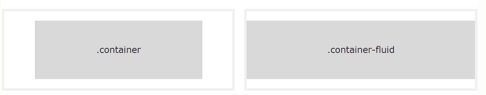
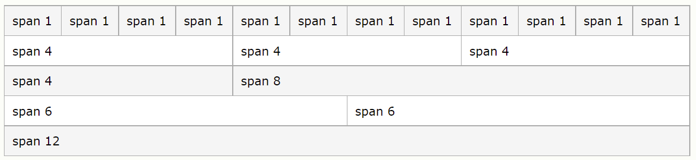
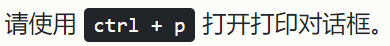

# Bootstrap

```html
<!-- 最新编译并压缩的 CSS -->
<link href="https://www.w3school.com.cn/lib/bs/bootstrap.css" rel="stylesheet">

<!-- 最新编译的 JavaScript -->
<script src="https://www.w3school.com.cn/lib/bs/bootstrap.js"></script>
```


# 1. Bootstrap 5meta

```html
/*
viewport：窗口
width=device-width：根据手机的尺寸来自适应显示页面
initial-scale=1：初始化缩放比例，默认是1.0
*/
<meta name="viewport" content="width=device-width, initial-scale=1">
```


# 2. Bootstrap 5 容器

- .container 类提供了响应式的固定宽度容器
- .container-fluid 类提供了全宽容器，跨越视口的整个宽度




# 3. Bootstrap 5网格类

Bootstrap 5 网格系统有六个类：

- .col- (超小型设备 - 屏幕宽度小于 576px)
- .col-sm- (小型设备 - 屏幕宽度等于或大于 576px)
- .col-md- (中型设备 - 屏幕宽度等于或大于 768 像素)
- .col-lg- (大型设备 - 屏幕宽度等于或大于 992 像素)
- .col-xl- (xlarge 设备 - 屏幕宽度等于或大于 1200px)
- .col-xxl- (xxlarge 设备 - 屏幕宽度等于或大于 1400px)

您可以组合上述类，以创建更动态和灵活的布局。

**提示：**每个类都是按比例放大的，所以如果你想为 sm 和 md 设置相同的宽度，你只需要指定 sm。

```html
<!-- 控制列宽，以及它们在不同设备上的显示方式 -->
<div class="row">
  <div class="col-*-*"></div>
  <div class="col-*-*"></div>
</div>
<div class="row">
  <div class="col-*-*"></div>
  <div class="col-*-*"></div>
  <div class="col-*-*"></div>
</div>

<!-- 或者让 Bootstrap 自动处理布局 -->
<div class="row">
  <div class="col"></div>
  <div class="col"></div>
  <div class="col"></div>
</div>
```




# 4. Bootstrap 5 文字/排版

### 4.1 h1~h6 标题

.h1~.h6标题大小

Bootstrap 5 把 HTML 标题（<h1> 到 <h6>）的样式设置为有更粗的 font-weight 以及响应式的 font-size。

可以在其他元素上使用 .h1 到 .h6 类，使它们表现为标题：

```html
<p class="h1">h1 Bootstrap heading</p>
<p class="h2">h2 Bootstrap heading</p>
<p class="h3">h3 Bootstrap heading</p>
<p class="h4">h4 Bootstrap heading</p>
<p class="h5">h5 Bootstrap heading</p>
<p class="h6">h6 Bootstrap heading</p>
```


### 4.2 display 标题

display 标题用于比普通标题更突出（更大的 font-size 和更细的 font-weight），有六个类可供选择：.display-1 到 .display-6

```html
<h1>Display 标题</h1>
<p>Display 标题用于比普通标题更突出（更大的 font-size 和更细的 font-weight）：</p>
<h1 class="display-1">Display 1</h1>
<h1 class="display-2">Display 2</h1>
<h1 class="display-3">Display 3</h1>
<h1 class="display-4">Display 4</h1>
```


### 4.3 small

在 Bootstrap 5 中，HTML <small> 元素（和 .small 类）用于在任何标题中创建较小的辅助文本

```html
<div class="small">陈小胖</div>
```


### 4.4 mark

Bootstrap 5 将使用黄色背景颜色和一些内边距来设置 <mark> 和 .mark 的样式

```html
<div class="mark">陈小胖</div>
```


### 4.5 abbr

Bootstrap 5 将 HTML <abbr> 元素的样式设置为底部带有虚线边框，悬停时带有问号的光标


### 4.6 blockquote

当引用其他来源的内容块时，请将 .blockquote 类添加到 <blockquote>。当命名来源时，例如“来自世界自然基金会的网站”，请使用 .blockquote-footer 类


### 4.7 kbd




### 4.8 更多排版类

下面的 Bootstrap 5 类可以进一步添加到 HTML 元素的样式中：

| 类                    | 描述                                                         |
| --------------------- | ------------------------------------------------------------ |
| .lead                 | 突出段落。                                                   |
| .text-left            | 规定左对齐文本。                                             |
| .text-break           | 防止长文本破坏布局。                                         |
| .text-center          | 规定居中对齐的文本。                                         |
| .text-decoration-none | 删除链接中的下划线。                                         |
| .text-end             | 规定右对齐文本。                                             |
| .text-nowrap          | 规定文本不换行。                                             |
| .text-lowercase       | 规定小写文本。                                               |
| .text-uppercase       | 规定大写文本。                                               |
| .text-capitalize      | 规定大写文本。                                               |
| .initialism           | 以稍小的字体显示 <abbr> 元素内的文本。                       |
| .list-unstyled        | 删除列表项的默认 list-style 和左外边距（适用于 <ul> 和 <ol>）。 此类仅适用于直接子列表项。 如需从任何嵌套列表中删除默认列表样式，也请将此类应用于嵌套列表。 |
| .list-inline          | 将所有列表项放在一行上。 请与每个 <li> 元素上的 .list-inline-item 一起使用。 |


# 5. Bootstrap 5 颜色

### 5.1 文本颜色

Bootstrap 5 有一些上下文类，可用于提供“由颜色表达的某种意义”。

针对文本颜色的类是：

```html
- .text-muted
- .text-primary
- .text-success
- .text-info
- .text-warning
- .text-danger
- .text-secondary
- .text-white
- .text-dark
- .text-body（默认的 body 颜色/通常为黑色）
- .text-light
```


### 5.2 背景颜色

针对背景颜色的类是：

```html
- .bg-primary
- .bg-success
- .bg-info
- .bg-warning
- .bg-danger
- .bg-secondary
- .bg-dark
- .bg-light
```


# 6. Bootstrap 5 表格

### 6.1 基础表格

一个基本的 Bootstrap 5 表格有一点内边距，以及水平分隔线。

.table 类为表格添加了基本样式：

<iframe scrolling="no" src="https://www.w3school.com.cn/demo/bs/bs_table_basic.html" style="margin: 15px 0px 0px; padding: 0px; border: none; width: 810px; height: 200px; overflow: hidden;"></iframe>

 


### 6.2 条纹行

.table-striped 类将斑马条纹添加到表中：

<iframe scrolling="no" src="https://www.w3school.com.cn/demo/bs/bs_table_striped.html" style="margin: 15px 0px 0px; padding: 0px; border: none; width: 810px; height: 200px; overflow: hidden;"></iframe>

 

### 6.3 带边框的表格

.table-bordered 类为表格和单元格的所有边添加边框：

<iframe scrolling="no" src="https://www.w3school.com.cn/demo/bs/bs_table_bordered.html" style="margin: 15px 0px 0px; padding: 0px; border: none; width: 810px; height: 200px; overflow: hidden;"></iframe>

 

### 6.4 有悬停效果的行

.table-hover 类在表格行上添加悬停效果（灰色背景色）：

<iframe scrolling="no" src="https://www.w3school.com.cn/demo/bs/bs_table_hover.html" style="margin: 15px 0px 0px; padding: 0px; border: none; width: 810px; height: 200px; overflow: hidden;"></iframe>

 

### 6.5 黑色/深色表格

.table-dark 类为表格添加黑色背景：

<iframe scrolling="no" src="https://www.w3school.com.cn/demo/bs/bs_table_dark.html" style="margin: 15px 0px 0px; padding: 0px; border: none; width: 810px; height: 200px; overflow: hidden;"></iframe>


### 6.6 深色条纹表格

结合 .table-dark 和 .table-striped 来创建深色的条纹表格：

<iframe scrolling="no" src="https://www.w3school.com.cn/demo/bs/bs_table_dark_striped.html" style="margin: 15px 0px 0px; padding: 0px; border: none; width: 810px; height: 200px; overflow: hidden;"></iframe>

 

### 6.7 可悬停的深色表格

.table-hover 类在表格行上添加悬停效果（灰色背景色）：

<iframe scrolling="no" src="https://www.w3school.com.cn/demo/bs/bs_table_dark_hover.html" style="margin: 15px 0px 0px; padding: 0px; border: none; width: 810px; height: 200px; overflow: hidden;"></iframe>

 

### 6.8 无边框表格

.table-borderless 类从表格中删除边框：

<iframe scrolling="no" src="https://www.w3school.com.cn/demo/bs/bs_table_borderless.html" style="margin: 15px 0px 0px; padding: 0px; border: none; width: 810px; height: 200px; overflow: hidden;"></iframe>

 

### 6.9 上下文类

上下文类可用于为整个表格 (<table>)、表格行 (<tr>) 或表格单元格 (<td>) 着色。

<iframe scrolling="no" src="https://www.w3school.com.cn/demo/bs/bs_table_contextual.html" style="margin: 15px 0px 0px; padding: 0px; border: none; width: 810px; height: 500px; overflow: hidden;"></iframe>

 

### 6.10 可用的上下文类

| 类               | 描述                                       |
| ---------------- | ------------------------------------------ |
| .table-primary   | 蓝色：表示重要动作。                       |
| .table-success   | 绿色：表示成功或积极的动作。               |
| .table-danger    | 红色：表示危险或潜在的负面行为。           |
| .table-info      | 浅蓝色：表示中性的信息更改或操作。         |
| .table-warning   | 橙色：表示可能需要注意的警告。             |
| .table-active    | 灰色：将悬停颜色应用于表格行或表格单元格。 |
| .table-secondary | 灰色：表示不太重要的动作。                 |
| .table-light     | 浅灰色表格或表格行背景。                   |
| .table-dark      | 深灰色表格或表格行背景。                   |


### 6.11 表头颜色

您还可以使用任何上下文类只向表格标题添加背景颜色：

<iframe scrolling="no" src="https://www.w3school.com.cn/demo/bs/bs_table_head.html" style="margin: 15px 0px 0px; padding: 0px; border: none; width: 810px; height: 380px; overflow: hidden;"></iframe>

 

### 6.12 小型表格

.table-sm 类通过将单元格填充减半来使表格变小：

<iframe scrolling="no" src="https://www.w3school.com.cn/demo/bs/bs_table_sm.html" style="margin: 15px 0px 0px; padding: 0px; border: none; width: 810px; height: 170px; overflow: hidden;"></iframe>

 

### 6.13 响应式表格

.table-responsive 类在需要时向表格添加滚动条（当它在水平方向上太大时）：

```
<div class="table-responsive">
  <table class="table">
    ...
  </table>
</div>
```

<iframe src="https://www.w3school.com.cn/demo/bs/bs_table_responsive.html" style="margin: 15px 0px 0px; padding: 0px; border: none; width: 810px; height: 150px; overflow: hidden;"></iframe>

 

您还可以决定表格何时应该获得滚动条，具体取决于屏幕宽度：

| 类                    | 屏幕宽度 |
| --------------------- | -------- |
| .table-responsive-sm  | < 576px  |
| .table-responsive-md  | < 768px  |
| .table-responsive-lg  | < 992px  |
| .table-responsive-xl  | < 1200px |
| .table-responsive-xxl | < 1400px |

```
<div class="table-responsive-sm">
  <table class="table">
    ...
  </table>
</div>
```


# 7. Bootstrap 5 图像

```html
.rounded --圆角
.rounded-circle --圆形
.img-thumbnail --缩略图 将图像塑造为缩略图（带边框）
.float-start --对齐图像 将图像向左浮动，或使用 .float-end 向右浮动
.mx-auto (margin:auto) 和 .d-block (display:block) --居中图像
.img-fluid 类为图像应用 max-width: 100%; 和 height: auto; --响应式图像
```


# 8. Bootstrap 5 警告

### 8.1 警告

Bootstrap 5 提供了一种创建预定义警告消息的简单方法：

<iframe scrolling="no" src="https://www.w3school.com.cn/demo/bs/bs_alerts.html" style="margin: 15px 0px 0px; padding: 0px; border: none; width: 810px; height: 600px; overflow: hidden;"></iframe>

警告框是使用 .alert 类创建的，后跟上下文类之一：

- .alert-success
- .alert-info
- .alert-warning
- .alert-danger
- .alert-primary
- .alert-secondary
- .alert-light
- .alert-dark

```html
<div class="alert alert-success">
    <strong>成功！</strong>此警报框表示成功或积极的动作。
</div>
```


### 8.2 警告链接

将 .alert-link 类添加到警告框内的任何链接，可创建“匹配的彩色链接”：

<iframe scrolling="no" src="https://www.w3school.com.cn/demo/bs/bs_alerts_link.html" style="margin: 15px 0px 0px; padding: 0px; border: none; width: 810px; height: 600px; overflow: hidden;"></iframe>

```html
<div class="alert alert-success">
    <strong>成功！</strong>您应该<a href="#" class="alert-link">阅读这条消息</a>。
</div>
```


### 8.3 关闭警告

<iframe scrolling="no" src="https://www.w3school.com.cn/demo/bs/bs_alerts_dismissible.html" style="margin: 15px 0px 0px; padding: 0px; border: none; color: rgb(0, 0, 0); font-family: &quot;SF Pro SC&quot;, &quot;SF Pro Text&quot;, &quot;SF Pro Icons&quot;, &quot;PingFang SC&quot;, Verdana, Arial, 微软雅黑, 宋体; font-size: 14px; font-style: normal; font-variant-ligatures: normal; font-variant-caps: normal; font-weight: 400; letter-spacing: normal; orphans: 2; text-align: left; text-indent: 0px; text-transform: none; white-space: normal; widows: 2; word-spacing: 0px; -webkit-text-stroke-width: 0px; background-color: rgb(253, 252, 248); text-decoration-thickness: initial; text-decoration-style: initial; text-decoration-color: initial; width: 810px; height: 80px; overflow: hidden;"></iframe>

如需关闭警告消息，请将 .alert-dismissible 类添加到警告容器。然后将 class="btn-close" 和 data-bs-dismiss="alert" 添加到链接或按钮元素（当您单击它时，警告框将消失）。

```html
<div class="alert alert-success alert-dismissible">
    <button type="button" class="btn-close" data-bs-dismiss="alert"></button>
    <strong>成功！</strong>此警报框表示成功或积极的动作。
</div>
```


### 8.4 警告框动画

.fade 和 .show 类在关闭警告消息时添加淡入淡出效果：

```html
<div class="alert alert-danger alert-dismissible fade show">
```


# 9. Bootstrap 5 按钮

### 9.1 按钮样式

Bootstrap 5 提供了不同样式的按钮：

<iframe scrolling="no" src="https://www.w3school.com.cn/demo/bs/bs_button_styles.html" style="margin: 15px 0px 0px; padding: 0px; border: none; color: rgb(0, 0, 0); font-family: &quot;SF Pro SC&quot;, &quot;SF Pro Text&quot;, &quot;SF Pro Icons&quot;, &quot;PingFang SC&quot;, Verdana, Arial, 微软雅黑, 宋体; font-size: 14px; font-style: normal; font-variant-ligatures: normal; font-variant-caps: normal; font-weight: 400; letter-spacing: normal; orphans: 2; text-align: left; text-indent: 0px; text-transform: none; white-space: normal; widows: 2; word-spacing: 0px; -webkit-text-stroke-width: 0px; background-color: rgb(253, 252, 248); text-decoration-thickness: initial; text-decoration-style: initial; text-decoration-color: initial; width: 810px; height: 60px; overflow: hidden;"></iframe>

```html
<button type="button" class="btn">基础</button>
<button type="button" class="btn btn-primary">主要</button>
<button type="button" class="btn btn-secondary">次要</button>
<button type="button" class="btn btn-success">成功</button>
<button type="button" class="btn btn-info">信息</button>
<button type="button" class="btn btn-warning">警告</button>
<button type="button" class="btn btn-danger">危险</button>
<button type="button" class="btn btn-dark">深色</button>
<button type="button" class="btn btn-light">浅色</button>
<button type="button" class="btn btn-link">链接</button>
```


### 9.2 按钮轮廓

Bootstrap 5 还提供了八个轮廓/边框按钮。

将鼠标移到它们上方，可看到额外的“悬停”效果：

<iframe scrolling="no" src="https://www.w3school.com.cn/demo/bs/bs_button_outline.html" style="margin: 15px 0px 0px; padding: 0px; border: none; color: rgb(0, 0, 0); font-family: &quot;SF Pro SC&quot;, &quot;SF Pro Text&quot;, &quot;SF Pro Icons&quot;, &quot;PingFang SC&quot;, Verdana, Arial, 微软雅黑, 宋体; font-size: 14px; font-style: normal; font-variant-ligatures: normal; font-variant-caps: normal; font-weight: 400; letter-spacing: normal; orphans: 2; text-align: left; text-indent: 0px; text-transform: none; white-space: normal; widows: 2; word-spacing: 0px; -webkit-text-stroke-width: 0px; background-color: rgb(253, 252, 248); text-decoration-thickness: initial; text-decoration-style: initial; text-decoration-color: initial; width: 810px; height: 60px; overflow: hidden;"></iframe>

```html
<button type="button" class="btn btn-outline-primary">主要</button>
<button type="button" class="btn btn-outline-secondary">次要</button>
<button type="button" class="btn btn-outline-success">成功</button>
<button type="button" class="btn btn-outline-info">信息</button>
<button type="button" class="btn btn-outline-warning">警告</button>
<button type="button" class="btn btn-outline-danger">危险</button>
<button type="button" class="btn btn-outline-dark">深色</button>
<button type="button" class="btn btn-outline-light text-dark">浅色</button>
```


### 9.3 按钮尺寸

对大按钮使用 .btn-lg 类，对小按钮使用 .btn-sm 类

<iframe scrolling="no" src="https://www.w3school.com.cn/demo/bs/bs_button_sizes.html" style="margin: 15px 0px 0px; padding: 0px; border: none; color: rgb(0, 0, 0); font-family: &quot;SF Pro SC&quot;, &quot;SF Pro Text&quot;, &quot;SF Pro Icons&quot;, &quot;PingFang SC&quot;, Verdana, Arial, 微软雅黑, 宋体; font-size: 14px; font-style: normal; font-variant-ligatures: normal; font-variant-caps: normal; font-weight: 400; letter-spacing: normal; orphans: 2; text-align: left; text-indent: 0px; text-transform: none; white-space: normal; widows: 2; word-spacing: 0px; -webkit-text-stroke-width: 0px; background-color: rgb(253, 252, 248); text-decoration-thickness: initial; text-decoration-style: initial; text-decoration-color: initial; width: 810px; height: 70px; overflow: hidden;"></iframe>


### 9.4 块级按钮

如需创建跨越父元素整个宽度的块级按钮，请在父元素上使用 .d-grid "helper" 类：

<iframe scrolling="no" src="https://www.w3school.com.cn/demo/bs/bs_button_block_1.html" style="margin: 15px 0px 0px; padding: 0px; border: none; color: rgb(0, 0, 0); font-family: &quot;SF Pro SC&quot;, &quot;SF Pro Text&quot;, &quot;SF Pro Icons&quot;, &quot;PingFang SC&quot;, Verdana, Arial, 微软雅黑, 宋体; font-size: 14px; font-style: normal; font-variant-ligatures: normal; font-variant-caps: normal; font-weight: 400; letter-spacing: normal; orphans: 2; text-align: left; text-indent: 0px; text-transform: none; white-space: normal; widows: 2; word-spacing: 0px; -webkit-text-stroke-width: 0px; background-color: rgb(253, 252, 248); text-decoration-thickness: initial; text-decoration-style: initial; text-decoration-color: initial; width: 810px; height: 60px; overflow: hidden;"></iframe>


### 9.5 按钮之间的间距

.gap-* 类控制它们之间的间距


### 9.6 活动/禁用按钮

按钮可以设置为活动（显示为被按下）或禁用（不可点击）状态：

<iframe scrolling="no" src="https://www.w3school.com.cn/demo/bs/bs_button_active.html" style="margin: 15px 0px 0px; padding: 0px; border: none; width: 810px; height: 60px; overflow: hidden;"></iframe>

类 .active 使按钮显示为被按下的状态，而 disabled 属性使按钮不可点击。请注意，<a> 元素不支持 disabled 属性，因此必须使用 .disabled 类使其在视觉上显示为禁用。

```html
<button type="button" class="btn btn-primary active">Active Primary</button>
<button type="button" class="btn btn-primary" disabled>Disabled Primary</button>
<a href="#" class="btn btn-primary disabled">Disabled Link</a>
```


### 9.7 加载器按钮

<iframe scrolling="no" src="https://www.w3school.com.cn/demo/bs/bs_spinners_buttons.html" style="margin: 15px 0px 0px; padding: 0px; border: none; width: 810px; height: 60px; overflow: hidden;"></iframe>

```html
<button class="btn btn-primary">
  <span class="spinner-border spinner-border-sm"></span>
</button>

<button class="btn btn-primary">
  <span class="spinner-border spinner-border-sm"></span>
  Loading..
</button>

<button class="btn btn-primary" disabled>
  <span class="spinner-border spinner-border-sm"></span>
  Loading..
</button>

<button class="btn btn-primary" disabled>
  <span class="spinner-grow spinner-grow-sm"></span>
  Loading..
</button>
```


# 10. Bootstrap 5 按钮组

### 10.1 按钮组

Bootstrap 5 允许您在按钮组中将一系列按钮组合在一起（在一行上）：

<iframe scrolling="no" src="https://www.w3school.com.cn/demo/bs/bs_button_group.html" style="margin: 15px 0px 0px; padding: 0px; border: none; width: 810px; height: 60px; overflow: hidden;"></iframe>

请使用带有 .btn-group 类的 <div> 元素来创建按钮组：

```html
<div class="btn-group">
  <button type="button" class="btn btn-primary">华为</button>
  <button type="button" class="btn btn-primary">大疆</button>
  <button type="button" class="btn btn-primary">小米</button>
</div>
```

**提示：**请不要将按钮大小应用于组中的每个按钮，而是将类 .btn-group-lg 用于大按钮组或将 .btn-group-sm 用于小按钮组：

<iframe scrolling="no" src="https://www.w3school.com.cn/demo/bs/bs_button_group_size.html" style="margin: 15px 0px 0px; padding: 0px; border: none; width: 810px; height: 320px; overflow: hidden;"></iframe>

```html
<div class="btn-group btn-group-lg">
  <button type="button" class="btn btn-primary">华为</button>
  <button type="button" class="btn btn-primary">大疆</button>
  <button type="button" class="btn btn-primary">小米</button>
</div>
```


### 10.2 垂直按钮组

Bootstrap 5 还支持垂直按钮组：

<iframe scrolling="no" src="https://www.w3school.com.cn/demo/bs/bs_button_group_v.html" style="margin: 15px 0px 0px; padding: 0px; border: none; width: 810px; height: 130px; overflow: hidden;"></iframe>

请使用类 .btn-group-vertical 创建垂直按钮组：

```html
<div class="btn-group-vertical">
  <button type="button" class="btn btn-primary">华为</button>
  <button type="button" class="btn btn-primary">大疆</button>
  <button type="button" class="btn btn-primary">小米</button>
</div>
```


### 10.3 并排按钮组

默认情况下，按钮组是 "inline" 的，存在多个按钮组时会并排显示：

<iframe scrolling="no" src="https://www.w3school.com.cn/demo/bs/bs_button_group_inline.html" style="margin: 15px 0px 0px; padding: 0px; border: none; width: 810px; height: 60px; overflow: hidden;"></iframe>

```html
<div class="btn-group">
  <button type="button" class="btn btn-primary">华为</button>
  <button type="button" class="btn btn-primary">大疆</button>
  <button type="button" class="btn btn-primary">小米</button>
</div>

<div class="btn-group">
  <button type="button" class="btn btn-primary">吉利</button>
  <button type="button" class="btn btn-primary">长城</button>
  <button type="button" class="btn btn-primary">红旗</button>
</div>
```


### 10.4 嵌套按钮组和下拉菜单

嵌套按钮组，可创建下拉菜单（您将在后面的章节中学习有关下拉菜单的更多内容）：

<iframe scrolling="no" src="https://www.w3school.com.cn/demo/bs/bs_button_group_dropdown.html" style="margin: 15px 0px 0px; padding: 0px; border: none; width: 810px; height: 140px; overflow: hidden;"></iframe>

```html
<div class="btn-group">
  <button type="button" class="btn btn-primary">华为</button>
  <button type="button" class="btn btn-primary">大疆</button>
  <div class="btn-group">
    <button type="button" class="btn btn-primary dropdown-toggle" data-toggle="dropdown">小米</button>
    <div class="dropdown-menu">
      <a class="dropdown-item" href="#">手机</a>
      <a class="dropdown-item" href="#">平板电脑</a>
    </div>
  </div>
</div>
```


# 11. Bootstrap 5 徽章

### 11.1 徽章

徽章（Badges）用于向内容添加附加信息：

<iframe scrolling="no" src="https://www.w3school.com.cn/demo/bs/bs_badges_1.html" style="margin: 15px 0px 0px; padding: 0px; border: none; width: 810px; height: 260px; overflow: hidden;"></iframe>

在 <span> 元素中使用 .badge 类和上下文类（如 .bg-secondary）来创建矩形徽章。请注意，徽章会缩放以匹配父元素的大小（如果有）：

```html
<h1>Example heading <span class="badge bg-secondary">New</span></h1>
<h2>Example heading <span class="badge bg-secondary">New</span></h2>
<h3>Example heading <span class="badge bg-secondary">New</span></h3>
<h4>Example heading <span class="badge bg-secondary">New</span></h4>
<h5>Example heading <span class="badge bg-secondary">New</span></h5>
<h6>Example heading <span class="badge bg-secondary">New</span></h6>
```


### 11.2 上下文徽章

<iframe scrolling="no" src="https://www.w3school.com.cn/demo/bs/bs_badges_2.html" style="margin: 15px 0px 0px; padding: 0px; border: none; width: 810px; height: 60px; overflow: hidden;"></iframe>

请使用任意上下文类 (.bg-*) 来更改徽章的颜色：

```html
<span class="badge bg-primary">主要</span>
<span class="badge bg-secondary">次要</span>
<span class="badge bg-success">成功</span>
<span class="badge bg-danger">危险</span>
<span class="badge bg-warning">警告</span>v
<span class="badge bg-info">信息</span>
<span class="badge bg-light">浅色</span>
<span class="badge bg-dark">深色</span>
```


### 11.3 胶囊徽章

<iframe scrolling="no" src="https://www.w3school.com.cn/demo/bs/bs_badges_pills.html" style="margin: 15px 0px 0px; padding: 0px; border: none; width: 810px; height: 60px; overflow: hidden;"></iframe>

使用 .rounded-pill 类使徽章更圆润：

```html
<span class="badge rounded-pill bg-primary">主要</span>
<span class="badge rounded-pill bg-secondary">次要</span>
<span class="badge rounded-pill bg-success">成功</span>
<span class="badge rounded-pill bg-danger">危险</span>
<span class="badge rounded-pill bg-warning">警告</span>
<span class="badge rounded-pill bg-info">信息</span>
<span class="badge rounded-pill bg-light">浅色</span>
<span class="badge rounded-pill bg-dark">深色</span>
```


### 11.4 元素内的徽章

在按钮内使用徽章的例子：

<iframe scrolling="no" src="https://www.w3school.com.cn/demo/bs/bs_badges_button.html" style="margin: 15px 0px 0px; padding: 0px; border: none; width: 810px; height: 60px; overflow: hidden;"></iframe>

```html
<button type="button" class="btn btn-primary">
  消息 <span class="badge bg-danger">4</span>
</button>
```


# 12. Bootstrap 5 进度条

### 12.1 基础进度条

进度条可用于显示用户在某个进程中的进度。

<iframe scrolling="no" src="https://www.w3school.com.cn/demo/bs/bs_progressbar_1.html" style="margin: 15px 0px 0px; padding: 0px; border: none; width: 810px; height: 50px; overflow: hidden;"></iframe>

如需创建默认进度条，请将 .progress 类添加到容器元素并将 .progress-bar 类添加到其子元素。请使用 CSS width 属性设置进度条的宽度：

```html
<div class="progress">
  <div class="progress-bar" style="width:70%"></div>
</div>
```


### 12.2 进度条高度

<iframe scrolling="no" src="https://www.w3school.com.cn/demo/bs/bs_progressbar_2.html" style="margin: 15px 0px 0px; padding: 0px; border: none; width: 810px; height: 140px; overflow: hidden;"></iframe>

进度条的高度默认为 1rem（通常为 16px）。请使用 CSS height 属性来更改它。

**提示：**请注意，您必须为进度容器和进度条设置相同的高度：

```html
<div class="progress" style="height:20px">
  <div class="progress-bar" style="width:40%;height:20px"></div>
</div>
```


### 12.3 进度条标签

在进度条内添加文本，以显示可见的百分比：

<iframe scrolling="no" src="https://www.w3school.com.cn/demo/bs/bs_progressbar_3.html" style="margin: 15px 0px 0px; padding: 0px; border: none; width: 810px; height: 50px; overflow: hidden;"></iframe>

```html
<div class="progress">
  <div class="progress-bar" style="width:70%">70%</div>
</div>
```


### 12.4 彩色进度条

<iframe scrolling="no" src="https://www.w3school.com.cn/demo/bs/bs_progressbar_4.html" style="margin: 15px 0px 0px; padding: 0px; border: none; width: 810px; height: 370px; overflow: hidden;"></iframe>

默认情况下，进度条为蓝色（主要）。使用任何上下文背景类来更改其颜色：

```html
<!-- Blue -->
<div class="progress">
    <div class="progress-bar" style="width:10%"></div>
</div>

<!-- Green -->
<div class="progress">
    <div class="progress-bar bg-success" style="width:20%"></div>
</div>

<!-- Turquoise -->
<div class="progress">
    <div class="progress-bar bg-info" style="width:30%"></div>
</div>

<!-- Orange -->
<div class="progress">
    <div class="progress-bar bg-warning" style="width:40%"></div>
</div>

<!-- Red -->
<div class="progress">
    <div class="progress-bar bg-danger" style="width:50%"></div>
</div>

<!-- White -->
<div class="progress border">
    <div class="progress-bar bg-white" style="width:60%"></div>
</div>

<!-- Grey -->
<div class="progress">
    <div class="progress-bar bg-secondary" style="width:70%"></div>
</div>

<!-- Light Grey -->
<div class="progress border">
    <div class="progress-bar bg-light" style="width:80%"></div>
</div>

<!-- Dark Grey -->
<div class="progress">
    <div class="progress-bar bg-dark" style="width:90%"></div>
</div>
```


### 12.5 条纹进度条

<iframe scrolling="no" src="https://www.w3school.com.cn/demo/bs/bs_progressbar_5.html" style="margin: 15px 0px 0px; padding: 0px; border: none; width: 810px; height: 200px; overflow: hidden;"></iframe>

请使用 .progress-bar-striped 类向进度条添加条纹：

```html
<div class="progress">
    <div class="progress-bar progress-bar-striped" style="width:40%"></div>
</div>
```


### 12.6 进度条动画

<iframe scrolling="no" src="https://www.w3school.com.cn/demo/bs/bs_progressbar_6.html" style="margin: 15px 0px 0px; padding: 0px; border: none; width: 810px; height: 50px; overflow: hidden;"></iframe>

请添加 .progress-bar-animated 类来制作进度条动画：

```html
<div class="progress-bar progress-bar-striped progress-bar-animated" style="width:40%"></div>
```


### 12.7 多个进度条

进度条也可以堆叠：

<iframe scrolling="no" src="https://www.w3school.com.cn/demo/bs/bs_progressbar_7.html" style="margin: 15px 0px 0px; padding: 0px; border: none; width: 810px; height: 50px; overflow: hidden;"></iframe>

```html
<div class="progress">
    <div class="progress-bar bg-success" style="width:40%">
        Free Space
    </div>
    <div class="progress-bar bg-warning" style="width:10%">
        Warning
    </div>
    <div class="progress-bar bg-danger" style="width:20%">
        Danger
    </div>
</div>
```


# 13. Bootstrap 5 加载器

### 13.1 加载器

使用 .spinner-border 类：

<iframe scrolling="no" src="https://www.w3school.com.cn/demo/bs/bs_spinners.html" style="margin: 15px 0px 0px; padding: 0px; border: none; width: 810px; height: 50px; overflow: hidden;"></iframe>

```html
<div class="spinner-border"></div>
```


### 13.2 彩色加载器

请使用任意文本颜色 utilites 为 spinner 添加颜色：

<iframe scrolling="no" src="https://www.w3school.com.cn/demo/bs/bs_spinners_colors.html" style="margin: 15px 0px 0px; padding: 0px; border: none; width: 810px; height: 50px; overflow: hidden;"></iframe>

```html
<div class="spinner-border text-muted"></div>
<div class="spinner-border text-primary"></div>
<div class="spinner-border text-success"></div>
<div class="spinner-border text-info"></div>
<div class="spinner-border text-warning"></div>
<div class="spinner-border text-danger"></div>
<div class="spinner-border text-secondary"></div>
<div class="spinner-border text-dark"></div>
<div class="spinner-border text-light"></div>
```


### 13.3 增长的加载器

如果您希望 spinner/加载器增长而不是“旋转”，请使用 .spinner-grow 类：

<iframe scrolling="no" src="https://www.w3school.com.cn/demo/bs/bs_spinners_grow.html" style="margin: 15px 0px 0px; padding: 0px; border: none; width: 810px; height: 50px; overflow: hidden;"></iframe>

```html
<div class="spinner-grow text-muted"></div>
<div class="spinner-grow text-primary"></div>
<div class="spinner-grow text-success"></div>
<div class="spinner-grow text-info"></div>
<div class="spinner-grow text-warning"></div>
<div class="spinner-grow text-danger"></div>
<div class="spinner-grow text-secondary"></div>
<div class="spinner-grow text-dark"></div>
<div class="spinner-grow text-light"></div>
```


### 13.4 加载器大小

请使用 .spinner-border-sm 或 .spinner-grow-sm 创建较小的加载器：

<iframe scrolling="no" src="https://www.w3school.com.cn/demo/bs/bs_spinners_size.html" style="margin: 15px 0px 0px; padding: 0px; border: none; width: 810px; height: 40px; overflow: hidden;"></iframe>

```html
<div class="spinner-border spinner-border-sm"></div>
<div class="spinner-grow spinner-grow-sm"></div>
```


### 13.5 加载器按钮

您还可以向按钮添加加载器，无论是否带有文本：

<iframe scrolling="no" src="https://www.w3school.com.cn/demo/bs/bs_spinners_buttons.html" style="margin: 15px 0px 0px; padding: 0px; border: none; width: 810px; height: 60px; overflow: hidden;"></iframe>

```html
<button class="btn btn-primary">
    <span class="spinner-border spinner-border-sm"></span>
</button>

<button class="btn btn-primary">
    <span class="spinner-border spinner-border-sm"></span>
    Loading..
</button>

<button class="btn btn-primary" disabled>
    <span class="spinner-border spinner-border-sm"></span>
    Loading..
</button>

<button class="btn btn-primary" disabled>
    <span class="spinner-grow spinner-grow-sm"></span>
    Loading..
</button>
```


# 14. Bootstrap 5 分页

### 14.1 基础的分页

如果您的网站有很多页面，您可能希望为每个页面添加某种分页。

<iframe scrolling="no" src="https://www.w3school.com.cn/demo/bs/bs_pagination.html" style="margin: 15px 0px 0px; padding: 0px; border: none; width: 810px; height: 60px; overflow: hidden;"></iframe>

如需创建基本分页，请将 .pagination 类添加到 <ul> 元素。然后将 .page-item 添加到每个 <li> 元素，并将 .page-link 类添加到 <li> 中的每个链接：

```html
<ul class="pagination">
    <li class="page-item"><a class="page-link" href="#">上一页</a></li>
    <li class="page-item"><a class="page-link" href="#">1</a></li>
    <li class="page-item"><a class="page-link" href="#">2</a></li>
    <li class="page-item"><a class="page-link" href="#">3</a></li>
    <li class="page-item"><a class="page-link" href="#">下一页</a></li>
</ul>
```


### 14.2 活动状态

.active 类用于“突出显示”当前页面：

<iframe scrolling="no" src="https://www.w3school.com.cn/demo/bs/bs_pagination_active.html" style="margin: 15px 0px 0px; padding: 0px; border: none; width: 810px; height: 60px; overflow: hidden;"></iframe>

```html
<ul class="pagination">
    <li class="page-item"><a class="page-link" href="#">上一页</a></li>
    <li class="page-item"><a class="page-link" href="#">1</a></li>
    <li class="page-item active"><a class="page-link" href="#">2</a></li>
    <li class="page-item"><a class="page-link" href="#">3</a></li>
    <li class="page-item"><a class="page-link" href="#">下一页</a></li>
</ul>
```


### 14.3 禁用状态

.disabled 类用于不可点击的链接：

<iframe scrolling="no" src="https://www.w3school.com.cn/demo/bs/bs_pagination_disabled.html" style="margin: 15px 0px 0px; padding: 0px; border: none; width: 810px; height: 60px; overflow: hidden;"></iframe>


```html
<ul class="pagination">
    <li class="page-item disabled"><a class="page-link" href="#">上一页</a></li>
    <li class="page-item"><a class="page-link" href="#">1</a></li>
    <li class="page-item"><a class="page-link" href="#">2</a></li>
    <li class="page-item"><a class="page-link" href="#">3</a></li>
    <li class="page-item"><a class="page-link" href="#">下一页</a></li>
</ul>
```


### 14.4 分页大小

分页块也可以被调整为更大或更小的尺寸：

<iframe scrolling="no" src="https://www.w3school.com.cn/demo/bs/bs_pagination_sizing.html" style="margin: 15px 0px 0px; padding: 0px; border: none; width: 810px; height: 300px; overflow: hidden;"></iframe>

请为较大的块添加类 .pagination-lg 或为较小的块添加 .pagination-sm 类：

```html
<ul class="pagination pagination-lg">
    <li class="page-item"><a class="page-link" href="#">上一页</a></li>
    <li class="page-item"><a class="page-link" href="#">1</a></li>
    <li class="page-item"><a class="page-link" href="#">2</a></li>
    <li class="page-item"><a class="page-link" href="#">3</a></li>
    <li class="page-item"><a class="page-link" href="#">下一页</a></li>
</ul>

<ul class="pagination pagination-sm">
    <li class="page-item"><a class="page-link" href="#">上一页</a></li>
    <li class="page-item"><a class="page-link" href="#">1</a></li>
    <li class="page-item"><a class="page-link" href="#">2</a></li>
    <li class="page-item"><a class="page-link" href="#">3</a></li>
    <li class="page-item"><a class="page-link" href="#">下一页</a></li>
</ul>
```


### 14.5 分页对齐

请使用 utility 类来更改分页的对齐方式：

<iframe scrolling="no" src="https://www.w3school.com.cn/demo/bs/bs_pagination_alignment.html" style="margin: 15px 0px 0px; padding: 0px; border: none; width: 810px; height: 170px; overflow: hidden;"></iframe>

```html
<!-- Default (left-aligned) -->
<ul class="pagination" style="margin:20px 0">
    <li class="page-item">...</li>
</ul>

<!-- Center-aligned -->
<ul class="pagination justify-content-center" style="margin:20px 0">
    <li class="page-item">...</li>
</ul>

<!-- Right-aligned -->
<ul class="pagination justify-content-end" style="margin:20px 0">
    <li class="page-item">...</li>
</ul>
```


### 14.6 面包屑（Breadcrumbs）

分页的另一种形式是面包屑：

<iframe scrolling="no" src="https://www.w3school.com.cn/demo/bs/bs_breadcrumbs.html" style="margin: 15px 0px 0px; padding: 0px; border: none; width: 810px; height: 60px; overflow: hidden;"></iframe>

.breadcrumb 和 .breadcrumb-item 类规定当前页面在导航层次结构中的位置：

```html
<ul class="breadcrumb">
    <li class="breadcrumb-item"><a href="#">照片</a></li>
    <li class="breadcrumb-item"><a href="#">2019年秋季</a></li>
    <li class="breadcrumb-item"><a href="#">中国</a></li>
    <li class="breadcrumb-item active">北京</li>
</ul>
```


# 15. Bootstrap 5 列表组

### 15.1 基础的列表组

最基本的列表组是包含列表项的无序列表：

<iframe scrolling="no" src="https://www.w3school.com.cn/demo/bs/bs_list_group.html" style="margin: 15px 0px 0px; padding: 0px; border: none; width: 810px; height: 160px; overflow: hidden;"></iframe>

如需创建基础列表组，请使用类为 .list-group 的 <ul> 元素和类为 .list-group-item 的 <li> 元素：

```html
<ul class="list-group">
    <li class="list-group-item">第一项</li>
    <li class="list-group-item">第二项</li>
    <li class="list-group-item">第三项</li>
</ul>
```


### 15.2 活动状态

<iframe scrolling="no" src="https://www.w3school.com.cn/demo/bs/bs_list_group_active.html" style="margin: 15px 0px 0px; padding: 0px; border: none; width: 810px; height: 160px; overflow: hidden;"></iframe>

请使用 .active 类突出显示当前项目：

```html
<ul class="list-group">
    <li class="list-group-item active">活动项目</li>
    <li class="list-group-item">第二项</li>
    <li class="list-group-item">第三项</li>
</ul>
```


### 15.3 包含链接项的列表组

<iframe scrolling="no" src="https://www.w3school.com.cn/demo/bs/bs_list_group_link.html" style="margin: 15px 0px 0px; padding: 0px; border: none; width: 810px; height: 160px; overflow: hidden;"></iframe>

如需创建带有链接项目的列表组，请使用 <div> 代替 <ul>，用 <a> 代替 <li>。可选地，如果您想要悬停时的灰色背景色，请添加 .list-group-item-action 类：

```html
<div class="list-group">
    <a href="#" class="list-group-item list-group-item-action">第一项</a>
    <a href="#" class="list-group-item list-group-item-action">第二项</a>
    <a href="#" class="list-group-item list-group-item-action">第三项</a>
</div>
```


### 15.4 禁用项目

.disabled 类为禁用的项目添加了较浅的文本颜色。当在链接上使用时，将去除悬停效果：

<iframe scrolling="no" src="https://www.w3school.com.cn/demo/bs/bs_list_group_disabled.html" style="margin: 15px 0px 0px; padding: 0px; border: none; width: 810px; height: 160px; overflow: hidden;"></iframe>

```html
<div class="list-group">
    <a href="#" class="list-group-item disabled">被禁用的项目</a>
    <a href="#" class="list-group-item disabled">被禁用的项目</a>
    <a href="#" class="list-group-item">第三项</a>
</div>
```


### 15.5 删除边框

使用 .list-group-flush 类删除边框和圆角：

<iframe scrolling="no" src="https://www.w3school.com.cn/demo/bs/bs_list_group_flush.html" style="margin: 15px 0px 0px; padding: 0px; border: none; width: 810px; height: 180px; overflow: hidden;"></iframe>

```html
<ul class="list-group list-group-flush">
    <li class="list-group-item">第一项</li>
    <li class="list-group-item">第二项</li>
    <li class="list-group-item">第三项</li>
    <li class="list-group-item">第四项</li>
</ul>
```


### 15.6 带编号的列表组

使用 .list-group-numbered 类创建前面带有数字的列表项：

<iframe scrolling="no" src="https://www.w3school.com.cn/demo/bs/bs_list_group_numbered.html" style="margin: 15px 0px 0px; padding: 0px; border: none; width: 810px; height: 160px; overflow: hidden;"></iframe>

```html
<ol class="list-group list-group-numbered">
    <li class="list-group-item">第一项</li>
    <li class="list-group-item">第二项</li>
    <li class="list-group-item">第三项</li>
</ol>
```


### 15.7 水平列表组

如果您希望列表项水平显示而不是垂直显示（并排而不是堆叠），请将 .list-group-horizontal 类添加到 .list-group：

<iframe scrolling="no" src="https://www.w3school.com.cn/demo/bs/bs_list_group_horizontal.html" style="margin: 15px 0px 0px; padding: 0px; border: none; width: 810px; height: 60px; overflow: hidden;"></iframe>

```html
<ul class="list-group list-group-horizontal">
    <li class="list-group-item">第一项</li>
    <li class="list-group-item">第二项</li>
    <li class="list-group-item">第三项</li>
    <li class="list-group-item">第四项</li>
</ul>
```


### 15.8 上下文类

上下文类可用于为列表项添加颜色：

<iframe scrolling="no" src="https://www.w3school.com.cn/demo/bs/bs_list_group_context.html" style="margin: 15px 0px 0px; padding: 0px; border: none; width: 810px; height: 360px; overflow: hidden;"></iframe>

为列表项着色的类是：

- .list-group-item-success
- .list-group-item-secondary
- .list-group-item-info
- .list-group-item-warning
- .list-group-item-danger
- .list-group-item-primary
- .list-group-item-dark
- .list-group-item-light

```html
<ul class="list-group">
    <li class="list-group-item list-group-item-success">Success item</li>
    <li class="list-group-item list-group-item-secondary">Secondary item</li>
    <li class="list-group-item list-group-item-info">Info item</li>
    <li class="list-group-item list-group-item-warning">Warning item</li>
    <li class="list-group-item list-group-item-danger">Danger item</li>
    <li class="list-group-item list-group-item-primary">Primary item</li>
    <li class="list-group-item list-group-item-dark">Dark item</li>
    <li class="list-group-item list-group-item-light">Light item</li>
</ul>
```


### 15.9 带有上下文类的链接项目

<iframe scrolling="no" src="https://www.w3school.com.cn/demo/bs/bs_list_group_context_links.html" style="margin: 15px 0px 0px; padding: 0px; border: none; width: 810px; height: 400px; overflow: hidden;"></iframe>

```html
<div class="list-group">
    <a href="#" class="list-group-item list-group-item-action">Action item</a>
    <a href="#" class="list-group-item list-group-item-action list-group-item-success">Success item</a>
    <a href="#" class="list-group-item list-group-item-action list-group-item-secondary">Secondary item</a>
    <a href="#" class="list-group-item list-group-item-action list-group-item-info">Info item</a>
    <a href="#" class="list-group-item list-group-item-action list-group-item-warning">Warning item</a>
    <a href="#" class="list-group-item list-group-item-action list-group-item-danger">Danger item</a>
    <a href="#" class="list-group-item list-group-item-action list-group-item-primary">Primary item</a>
    <a href="#" class="list-group-item list-group-item-action list-group-item-dark">Dark item</a>
    <a href="#" class="list-group-item list-group-item-action list-group-item-light">Light item</a>
</div>
```


### 15.10 带徽章的列表组

将 .badge 类与 utility/helper 类结合起来，可在列表组中添加徽章：

<iframe scrolling="no" src="https://www.w3school.com.cn/demo/bs/bs_list_group_badge.html" style="margin: 15px 0px 0px; padding: 0px; border: none; width: 810px; height: 150px; overflow: hidden;"></iframe>

```html
<ul class="list-group">
    <li class="list-group-item d-flex justify-content-between align-items-center">
        收件箱
        <span class="badge bg-primary rounded-pill">12</span>
    </li>
    <li class="list-group-item d-flex justify-content-between align-items-center">
        广告邮件
        <span class="badge bg-primary rounded-pill">50</span>
    </li>
    <li class="list-group-item d-flex justify-content-between align-items-center">
        垃圾箱
        <span class="badge bg-primary rounded-pill">99</span>
    </li>
</ul>
```


# 16. Bootstrap 5 卡片

### 16.1 卡片

Bootstrap 5 中的卡片是带边框的框，其内容周围有一些内边距。它包括页眉、页脚、内容、颜色等选项。

<iframe scrolling="no" src="https://www.w3school.com.cn/demo/bs/card.html" style="margin: 15px 0px 0px; padding: 0px; border: none; width: 810px; height: 530px; overflow: hidden;"></iframe>


### 16.2 基础的卡片

一张基础卡片是用 .card 类创建的，卡片中的内容有一个 .card-body 类：

<iframe scrolling="no" src="https://www.w3school.com.cn/demo/bs/bs_card.html" style="margin: 15px 0px 0px; padding: 0px; border: none; width: 810px; height: 80px; overflow: hidden;"></iframe>

```html
<div class="card">
    <div class="card-body">基础的卡片</div>
</div>
```


### 16.3 页眉和页脚

<iframe scrolling="no" src="https://www.w3school.com.cn/demo/bs/bs_card_header.html" style="margin: 15px 0px 0px; padding: 0px; border: none; width: 810px; height: 160px; overflow: hidden;"></iframe>

.card-header 类为卡片添加标题，.card-footer 类为卡片添加页脚：

```html
<div class="card">
    <div class="card-header">页眉</div>
    <div class="card-body">内容</div>
    <div class="card-footer">页脚</div>
</div>
```


### 16.4 上下文卡片

如需为卡片添加背景颜色，请使用上下文类：

- .bg-primary
- .bg-success
- .bg-info
- .bg-warning
- .bg-danger
- .bg-secondary
- .bg-dark
- .bg-light

<iframe scrolling="no" src="https://www.w3school.com.cn/demo/bs/bs_card_contextual.html" style="margin: 15px 0px 0px; padding: 0px; border: none; width: 810px; height: 750px; overflow: hidden;"></iframe>

 

### 16.5 标题、文本和链接

<iframe scrolling="no" src="https://www.w3school.com.cn/demo/bs/bs_card_title.html" style="margin: 15px 0px 0px; padding: 0px; border: none; width: 810px; height: 160px; overflow: hidden;"></iframe>

请使用 .card-title 将卡片标题添加到任意标题元素。如果 <p> 元素是 .card-body 中的最后一个子元素（或唯一一个子元素），则 .card-text 类用于移除 <p> 元素的底部边距。.card-link 类为任意链接添加蓝色和悬停效果。

```html
<div class="card">
    <div class="card-body">
        <h4 class="card-title">卡片标题</h4>
        <p class="card-text">一些实例文本。一些实例文本。</p>
        <a href="#" class="card-link">卡片链接</a>
        <a href="#" class="card-link">另一个链接</a>
    </div>
</div>
```


### 16.6 卡片图像

<iframe scrolling="no" src="https://www.w3school.com.cn/demo/bs/bs_card_image.html" style="margin: 15px 0px 0px; padding: 0px; border: none; width: 810px; height: 500px; overflow: hidden;"></iframe>

将 .card-img-top 或 .card-img-bottom 添加到 ，可将图像放置在卡片的顶部或底部。

请注意，我们在 .card-body 之外添加了图像以跨越整个宽度：

```html
<div class="card" style="width:400px">
    
    <div class="card-body">
        <h4 class="card-title">Bill Gates</h4>
        <p class="card-text">Bill Gates 是一位程序员和工程师。一些示例文本。一些示例文本。</p>
        <a href="#" class="btn btn-primary">查看个人资料</a>
    </div>
</div>
```


### 16.7 卡片图像叠加

<iframe scrolling="no" src="https://www.w3school.com.cn/demo/bs/bs_card_image_overlay.html" style="margin: 15px 0px 0px; padding: 0px; border: none; width: 810px; height: 350px; overflow: hidden;"></iframe>

将图像转换为卡片背景并使用 .card-img-overlay 在图像顶部添加文本：

```html
<div class="card" style="width:500px">
  
  <div class="card-img-overlay">
    <h4 class="card-title">Bill Gates</h4>
    <p class="card-text">一些示例文本。一些示例文本。</p>
    <a href="#" class="btn btn-primary">查看个人资料</a>
  </div>
</div>
```


# 17. Bootstrap 5 下拉列表

### 17.1 基础的下拉列表

下拉菜单是一种可切换菜单，允许用户从预定义列表中选择值：

<iframe scrolling="no" src="https://www.w3school.com.cn/demo/bs/bs_dropdown-menu.html" style="margin: 15px 0px 0px; padding: 0px; border: none; width: 810px; height: 180px; overflow: visible;"></iframe>

```html
<div class="dropdown">
    <button type="button" class="btn btn-primary dropdown-toggle" data-bs-toggle="dropdown">
        下拉按钮
    </button>
    <ul class="dropdown-menu">
        <li><a class="dropdown-item" href="#">链接 1</a></li>
        <li><a class="dropdown-item" href="#">链接 2</a></li>
        <li><a class="dropdown-item" href="#">链接 3</a></li>
    </ul>
</div>
```

**例子解释**

.dropdown 类指示下拉菜单。

如需打开下拉菜单，请使用设置了 .dropdown-toggle 类和 data-toggle="dropdown" 属性的按钮或链接。

将 .dropdown-menu 类添加到 <div> 元素，可实际构建下拉菜单。然后将 .dropdown-item 类添加到下拉菜单中的每个元素（链接或按钮）。


### 17.2 下拉列表分隔线

<iframe scrolling="no" src="https://www.w3school.com.cn/demo/bs/bs_dropdown-divider.html" style="margin: 15px 0px 0px; padding: 0px; border: none; width: 810px; height: 230px; overflow: visible;"></iframe>

.dropdown-divider 类用于通过水平细边框分隔下拉菜单中的链接：

```html
<li><hr class="dropdown-divider"></hr></li>
```


### 17.3 下拉列表标题

<iframe scrolling="no" src="https://www.w3school.com.cn/demo/bs/bs_dropdown-header.html" style="margin: 15px 0px 0px; padding: 0px; border: none; width: 810px; height: 270px; overflow: hidden;"></iframe>

.dropdown-header 类用于在下拉菜单中添加标题：

```html
<li><h5 class="dropdown-header">Dropdown header 1</h5></li>
```


### 17.4 禁用的和活动的项目

<iframe scrolling="no" src="https://www.w3school.com.cn/demo/bs/bs_dropdown-active.html" style="margin: 15px 0px 0px; padding: 0px; border: none; width: 810px; height: 180px; overflow: hidden;"></iframe>

请使用 .active 类突出显示特定的下拉项（添加蓝色背景色）。

如需禁用下拉列表中的某个项目，请使用 .disabled 类（在悬停时获得浅灰色文本颜色和 "no-parking-sign" 图标）。

```html
<li><a class="dropdown-item" href="#">普通的</a></li>
<li><a class="dropdown-item active" href="#">活动的</a></li>
<li><a class="dropdown-item disabled" href="#">禁用的</a></li>
```


### 17.5 下拉列表位置

<iframe scrolling="no" src="https://www.w3school.com.cn/demo/bs/bs_dropdown-right.html" style="margin: 15px 0px 0px; padding: 0px; border: none; width: 810px; height: 120px; overflow: hidden;"></iframe>

 

<iframe scrolling="no" src="https://www.w3school.com.cn/demo/bs/bs_dropdown-left.html" style="margin: 15px 0px 0px; padding: 0px; border: none; width: 810px; height: 120px; overflow: hidden;"></iframe>

您还可以通过将 .dropend 或 .dropstart 类添加到下拉元素，来创建 "dropend" 或 "dropstart" 菜单。请注意，插入符号/箭头是自动添加的：

##### 17.5.1 Dropright

```html
<div class="dropdown dropend">
```


##### 17.5.2 Dropleft

```html
<div class="dropdown dropstart">
```


### 17.6 下拉列表右对齐

<iframe scrolling="no" src="https://www.w3school.com.cn/demo/bs/bs_dropdown-menu-right.html" style="margin: 15px 0px 0px; padding: 0px; border: none; width: 810px; height: 180px; overflow: hidden;"></iframe>

如需右对齐下拉菜单，请将 .dropdown-menu-end 类添加到带有 .dropdown-menu 的元素：

```html
<div class="dropdown-menu dropdown-menu-end">
```


### 17.7 上拉列表

<iframe scrolling="no" src="https://www.w3school.com.cn/demo/bs/bs_dropdown-menu-dropup.html" style="margin: 15px 0px 0px; padding: 0px; border: none; width: 810px; height: 80px; overflow: hidden;"></iframe>

如果您希望下拉菜单向上展开而不是向下展开，请将 class="dropdown" 的 <div> 元素更改为 "dropup"：

```html
<div class="dropup">
```


### 17.8 下拉文本

<iframe scrolling="no" src="https://www.w3school.com.cn/demo/bs/bs_dropdown-text.html" style="margin: 15px 0px 0px; padding: 0px; border: none; width: 810px; height: 250px; overflow: hidden;"></iframe>

.dropdown-item-text 类用于为下拉项添加纯文本，或用于为链接添加默认链接样式。

```html
<ul class="dropdown-menu">
  <li><a class="dropdown-item" href="#">链接 1</a></li>
  <li><a class="dropdown-item" href="#">链接 2</a></li>
  <li><a class="dropdown-item" href="#">链接 3</a></li>
  <li><a class="dropdown-item-text" href="#">文本链接</a></li>
  <li><span class="dropdown-item-text">纯文本</span></li>
</ul>
```


### 17.9 组合按钮和下拉列表

<iframe scrolling="no" src="https://www.w3school.com.cn/demo/bs/bs_button_group_dropdown.html" style="margin: 15px 0px 0px; padding: 0px; border: none; width: 810px; height: 150px; overflow: hidden;"></iframe>

```html
<div class="btn-group">
  <button type="button" class="btn btn-primary">华为</button>
  <button type="button" class="btn btn-primary">大疆</button>
  <div class="btn-group">
    <button type="button" class="btn btn-primary dropdown-toggle" data-bs-toggle="dropdown">小米</button>
    <ul class="dropdown-menu">
      <li><a class="dropdown-item" href="#">手机</a></li>
      <li><a class="dropdown-item" href="#">平板电脑</a></li>
    </ul>
  </div>
</div>
```


### 17.10 垂直组合按钮和下拉列表

<iframe scrolling="no" src="https://www.w3school.com.cn/demo/bs/bs_button_group_v_dropdown.html" style="margin: 15px 0px 0px; padding: 0px; border: none; width: 810px; height: 130px; overflow: hidden;"></iframe>

```html
<div class="btn-group-vertical">
  <button type="button" class="btn btn-primary">华为</button>
  <button type="button" class="btn btn-primary">大疆</button>
  <div class="btn-group">
    <button type="button" class="btn btn-primary dropdown-toggle" data-bs-toggle="dropdown">小米</button>
    <ul class="dropdown-menu">
      <li><a class="dropdown-item" href="#">手机</a></li>
      <li><a class="dropdown-item" href="#">平板电脑</a></li>
    </ul>
  </div>
</div>
```


# 18. Bootstrap 5 折叠

### 18.1 基础的折叠

当您想要隐藏和显示大量内容时，可折叠组件非常有用：

<iframe scrolling="no" src="https://www.w3school.com.cn/demo/bs/bs_collapsible_1.html" style="margin: 15px 0px 0px; padding: 0px; border: none; width: 810px; height: 120px; overflow: visible;"></iframe>

```html
<button data-bs-toggle="collapse" data-bs-target="#demo">春日</button>

<div id="demo" class="collapse">
    <p>胜日寻芳泗水滨，无边光景一时新。</p>
    <p>等闲识得东风面，万紫千红总是春。</p>
</div>
```

**例子解释**

.collapse 类指示可折叠元素（在我们的例子中为 <div>）；通过单击按钮，可显示或隐藏的内容。

如需控制（显示/隐藏）可折叠内容，请将 data-bs-toggle="collapse" 属性添加到 <a> 或 <button> 元素。然后添加 data-bs-target="#*id*" 属性来连接按钮和可折叠内容（<div id="demo">）。

**注释：**对于 <a> 元素，您可以使用 href 属性代替 data-bs-target 属性：

```html
<a href="#demo" data-bs-toggle="collapse">春日</a>

<div id="demo" class="collapse">
  <p>胜日寻芳泗水滨，无边光景一时新。</p>
  <p>等闲识得东风面，万紫千红总是春。</p>
</div>
```


默认情况下，可折叠内容是隐藏的。但是，您可以添加 .show 类来默认显示内容：

```html
<div id="demo" class="collapse show">
    <p>胜日寻芳泗水滨，无边光景一时新。</p>
    <p>等闲识得东风面，万紫千红总是春。</p>
</div>
```


### 18.2 Accordion（手风琴）

<iframe scrolling="no" src="https://www.w3school.com.cn/demo/bs/bs_collapsible_accordion.html" style="margin: 15px 0px 0px; padding: 0px; border: none; width: 810px; height: 350px; overflow: visible;"></iframe>

下例通过对 card 组件进行扩展，显示一个简单的手风琴。

**注释：**使用 data-bs-parent 属性确保当显示可折叠项目之一时，会关闭指定父项下的所有可折叠元素。

```html
<div id="accordion">

    <div class="card">
        <div class="card-header">
            <a class="btn" data-bs-toggle="collapse" href="#collapseOne">
                可折叠组项目 #1
            </a>
        </div>
        <div id="collapseOne" class="collapse show" data-bs-parent="#accordion">
            <div class="card-body">
                <h3>春日</h3>
                <p>胜日寻芳泗水滨，无边光景一时新。</p>
                <p>等闲识得东风面，万紫千红总是春。</p>
            </div>
        </div>
    </div>

    <div class="card">
        <div class="card-header">
            <a class="collapsed btn" data-bs-toggle="collapse" href="#collapseTwo">
                可折叠组项目 #2
            </a>
        </div>
        <div id="collapseTwo" class="collapse" data-bs-parent="#accordion">
            <div class="card-body">
                <h3>初夏绝句</h3>
                <p>纷纷红紫已成尘，布谷声中夏令新。</p>
                <p>夹路桑麻行不尽，始知身是太平人。</p>
            </div>
        </div>
    </div>

    <div class="card">
        <div class="card-header">
            <a class="collapsed btn" data-bs-toggle="collapse" href="#collapseThree">
                可折叠组项目 #3
            </a>
        </div>
        <div id="collapseThree" class="collapse" data-bs-parent="#accordion">
            <div class="card-body">
                <h3>山行</h3>
                <p>远上寒山石径斜，白云生处有人家。</p>
                <p>停车坐爱枫林晚，霜叶红于二月花。</p>
            </div>
        </div>
    </div>

</div>
```


# 19. Bootstrap 5 导航

### 19.1 导航菜单

<iframe scrolling="no" src="https://www.w3school.com.cn/demo/bs/bs_nav.html" style="margin: 15px 0px 0px; padding: 0px; border: none; width: 810px; height: 60px; overflow: visible;"></iframe>

如果要创建简单的水平菜单，请将 .nav 类添加到 <ul> 元素，然后为每个 <li> 元素添加 .nav-item 并将 .nav-link 类添加到它们的链接：

```html
<ul class="nav">
    <li class="nav-item">
        <a class="nav-link" href="#">链接</a>
    </li>
    <li class="nav-item">
        <a class="nav-link" href="#">链接</a>
    </li>
    <li class="nav-item">
        <a class="nav-link" href="#">链接</a>
    </li>
    <li class="nav-item">
        <a class="nav-link disabled" href="#">禁用</a>
    </li>
</ul>
```


### 19.2 对齐导航栏

<iframe scrolling="no" src="https://www.w3school.com.cn/demo/bs/bs_nav_align.html" style="margin: 15px 0px 0px; padding: 0px; border: none; width: 810px; height: 150px; overflow: visible;"></iframe>

添加 .justify-content-center 类使导航居中，添加 .justify-content-end 类使导航右对齐。

```html
<!-- 居中的导航 -->
<ul class="nav justify-content-center">

<!-- 右对齐的导航 -->
<ul class="nav justify-content-end">
```


### 19.3 垂直导航栏

<iframe scrolling="no" src="https://www.w3school.com.cn/demo/bs/bs_nav_vertical.html" style="margin: 15px 0px 0px; padding: 0px; border: none; width: 810px; height: 180px; overflow: visible;"></iframe>

添加 .flex-column 类可创建垂直导航：

```html
<ul class="nav flex-column">
```


### 19.4 选项卡

<iframe scrolling="no" src="https://www.w3school.com.cn/demo/bs/bs_nav_tabs.html" style="margin: 15px 0px 0px; padding: 0px; border: none; width: 810px; height: 60px; overflow: visible;"></iframe>

请使用 .nav-tabs 类将导航菜单转换为导航选项卡。并将 .active 类添加到活动/当前链接。如果您希望选项卡可切换，请参阅本页的最后一个例子。

```html
<ul class="nav nav-tabs">
  <li class="nav-item">
    <a class="nav-link active" href="#">活动</a>
  </li>
  <li class="nav-item">
    <a class="nav-link" href="#">链接</a>
  </li>
  <li class="nav-item">
    <a class="nav-link" href="#">链接</a>
  </li>
  <li class="nav-item">
    <a class="nav-link disabled" href="#">禁用</a>
  </li>
</ul>
```


### 19.5 胶囊

<iframe scrolling="no" src="https://www.w3school.com.cn/demo/bs/bs_nav_pills.html" style="margin: 15px 0px 0px; padding: 0px; border: none; width: 810px; height: 60px; overflow: visible;"></iframe>

使用 .nav-pills 类可将导航菜单设置为导航胶囊。如果您希望胶囊可切换，请参阅本页的最后一个例子。

```html
<ul class="nav nav-pills">
    <li class="nav-item">
        <a class="nav-link active" href="#">活动</a>
    </li>
    <li class="nav-item">
        <a class="nav-link" href="#">链接</a>
    </li>
    <li class="nav-item">
        <a class="nav-link" href="#">链接</a>
    </li>
    <li class="nav-item">
        <a class="nav-link disabled" href="#">禁用</a>
    </li>
</ul>
```


### 19.6 等宽的选项卡/胶囊导航

请使用 .nav-justified 类（等宽）对齐标签/胶囊：

<iframe scrolling="no" src="https://www.w3school.com.cn/demo/bs/bs_nav_justified.html" style="margin: 15px 0px 0px; padding: 0px; border: none; width: 810px; height: 130px; overflow: visible;"></iframe>

```html
<ul class="nav nav-pills nav-justified">..</ul>
<ul class="nav nav-tabs nav-justified">..</ul>
```


### 19.7 胶囊下拉菜单

<iframe scrolling="no" src="https://www.w3school.com.cn/demo/bs/bs_nav_pills_dropdown.html" style="margin: 15px 0px 0px; padding: 0px; border: none; width: 810px; height: 60px; overflow: visible;"></iframe>

```html
<ul class="nav nav-pills">
  <li class="nav-item">
    <a class="nav-link active" href="#">活动</a>
  </li>
  <li class="nav-item dropdown">
    <a class="nav-link dropdown-toggle" data-bs-toggle="dropdown" href="#">Dropdown</a>
    <ul class="dropdown-menu">
      <li><a class="dropdown-item" href="#">链接 1</a></li>
      <li><a class="dropdown-item" href="#">链接 2</a></li>
      <li><a class="dropdown-item" href="#">链接 3</a></li>
    </ul>
  </li>
  <li class="nav-item">
    <a class="nav-link" href="#">链接</a>
  </li>
  <li class="nav-item">
    <a class="nav-link disabled" href="#">禁用</a>
  </li>
</ul>
```


### 19.8 选项卡下拉菜单

<iframe scrolling="no" src="https://www.w3school.com.cn/demo/bs/bs_nav_tabs_dropdown.html" style="margin: 15px 0px 0px; padding: 0px; border: none; width: 810px; height: 60px; overflow: visible;"></iframe>

```html
<ul class="nav nav-tabs">
  <li class="nav-item">
    <a class="nav-link active" href="#">活动</a>
  </li>
  <li class="nav-item dropdown">
    <a class="nav-link dropdown-toggle" data-bs-toggle="dropdown" href="#">Dropdown</a>
    <ul class="dropdown-menu">
      <li><a class="dropdown-item" href="#">链接 1</a></li>
      <li><a class="dropdown-item" href="#">链接 2</a></li>
      <li><a class="dropdown-item" href="#">链接 3</a></li>
    </ul>
  </li>
  <li class="nav-item">
    <a class="nav-link" href="#">链接</a>
  </li>
  <li class="nav-item">
    <a class="nav-link disabled" href="#">禁用</a>
  </li>
</ul>
```


### 19.9 可切换的 / 动态选项卡

<iframe scrolling="no" src="https://www.w3school.com.cn/demo/bs/bs_nav_tabs_toggleable.html" style="margin: 15px 0px 0px; padding: 0px; border: none; width: 810px; height: 200px; overflow: visible;"></iframe>

如需使选项卡可切换，请将 data-toggle="tab" 属性添加到每个链接。然后为每个选项卡添加有唯一 ID 的 .tab-pane 类，并将它们包装在带有 .tab-content 类的 <div> 元素中。

如果您希望选项卡在单击时能够淡入淡出，请将 .fade 类添加到 .tab-pane：

```html
<!-- Nav tabs -->
<ul class="nav nav-tabs">
  <li class="nav-item">
    <a class="nav-link active" data-bs-toggle="tab" href="#home">Home</a>
  </li>
  <li class="nav-item">
    <a class="nav-link" data-bs-toggle="tab" href="#menu1">Menu 1</a>
  </li>
  <li class="nav-item">
    <a class="nav-link" data-bs-toggle="tab" href="#menu2">Menu 2</a>
  </li>
</ul>

<!-- Tab panes -->
<div class="tab-content">
  <div class="tab-pane container active" id="home">...</div>
  <div class="tab-pane container fade" id="menu1">...</div>
  <div class="tab-pane container fade" id="menu2">...</div>
</div>
```


### 19.10 可切换的 / 动态胶囊导航

<iframe scrolling="no" src="https://www.w3school.com.cn/demo/bs/bs_nav_pills_toggleable.html" style="margin: 15px 0px 0px; padding: 0px; border: none; width: 810px; height: 200px; overflow: visible;"></iframe>

相同的代码适用于导航；仅将 data-toggle 属性更改为 data-toggle="pill" 即可：

```html
<!--导航胶囊 -->
<ul class="nav nav-pills">
  <li class="nav-item">
    <a class="nav-link active" data-bs-toggle="pill" href="#home">春日</a>
  </li>
  <li class="nav-item">
    <a class="nav-link" data-bs-toggle="pill" href="#menu1">初夏</a>
  </li>
  <li class="nav-item">
    <a class="nav-link" data-bs-toggle="pill" href="#menu2">山行</a>
  </li>
</ul>

<!-- 选项卡窗格 -->
<div class="tab-content">
  <div class="tab-pane container active" id="home">...</div>
  <div class="tab-pane container fade" id="menu1">...</div>
  <div class="tab-pane container fade" id="menu2">...</div>
</div>
```


# 20. Bootstrap 5 导航栏

### 20.1 导航栏

导航栏是位于页面顶部的导航页眉：

<iframe scrolling="no" src="https://www.w3school.com.cn/demo/bs/navbar.html" style="margin: 15px 0px 0px; padding: 0px; border: none; width: 810px; height: 60px; overflow: visible;"></iframe>

### 20.2 基础的导航栏

通过使用 Bootstrap，导航栏可以扩展或折叠，具体取决于屏幕大小。

请使用 .navbar 类创建标准导航栏，然后是响应式折叠类：.navbar-expand-xxl|xl|lg|md|sm（在特大、超大、大、中型设备上水平排列，或小屏幕上垂直堆叠导航栏）。

如需在导航栏中添加链接，请使用 class="navbar-nav" 的 <ul> 元素（或 <div>）。然后添加带有 .nav-item 类的 <li> 元素，后跟带有 .nav-link 类的 <a> 元素：

<iframe scrolling="no" src="https://www.w3school.com.cn/demo/bs/bs_navbar.html" style="margin: 15px 0px 0px; padding: 0px; border: none; width: 810px; height: 60px; overflow: visible;"></iframe>

```html
<!-- 灰色的水平导航栏在小型屏幕上变为垂直 -->
<nav class="navbar navbar-expand-sm bg-light">

  <div class="container-fluid">
    <!-- 链接 -->
    <ul class="navbar-nav">
      <li class="nav-item">
        <a class="nav-link" href="#">链接 1</a>
      </li>
      <li class="nav-item">
        <a class="nav-link" href="#">链接 2</a>
      </li>
      <li class="nav-item">
        <a class="nav-link" href="#">链接 3</a>
      </li>
    </ul>
  </div>

</nav>
```


### 20.3 垂直导航栏

删除 .navbar-expand-* 类可创建始终垂直的导航栏：

<iframe scrolling="no" src="https://www.w3school.com.cn/demo/bs/bs_navbar_vertical.html" style="margin: 15px 0px 0px; padding: 0px; border: none; width: 810px; height: 140px; overflow: visible;"></iframe>

```html
<!-- 灰色的垂直导航栏 -->
<nav class="navbar bg-light">
  ...
</nav>
```


### 20.4 居中的导航栏

添加 .justify-content-center 类可将导航栏居中：

<iframe scrolling="no" src="https://www.w3school.com.cn/demo/bs/bs_navbar_centered.html" style="margin: 15px 0px 0px; padding: 0px; border: none; width: 810px; height: 60px; overflow: visible;"></iframe>

```html
<nav class="navbar navbar-expand-sm bg-light justify-content-center">
  ...
</nav>
```


### 20.5 彩色导航栏

<iframe scrolling="no" src="https://www.w3school.com.cn/demo/bs/bs_navbar_color.html" style="margin: 15px 0px 0px; padding: 0px; border: none; width: 810px; height: 460px; overflow: visible;"></iframe>

请使用任何 .bg-color 类来更改导航栏的背景颜色：

- .bg-primary
- .bg-success
- .bg-info
- .bg-warning
- .bg-danger
- .bg-secondary
- .bg-dark
- .bg-light

**提示：**请使用 .navbar-dark 类为导航栏中的所有链接添加白色文本颜色，或使用 .navbar-light 类添加黑色文本颜色。

```html
<!-- 灰色背景，白色文本 -->
<nav class="navbar navbar-expand-sm bg-light navbar-light">
  <div class="container-fluid">
    <ul class="navbar-nav">
      <li class="nav-item">
        <a class="nav-link active" href="#">活动</a>
      </li>
     <li class="nav-item">
        <a class="nav-link" href="#">链接</a>
      </li>
      <li class="nav-item">
        <a class="nav-link" href="#">链接</a>
      </li>
      <li class="nav-item">
        <a class="nav-link disabled" href="#">禁用</a>
      </li>
    </ul>
  </div>
</nav>

<!-- 黑色背景，白色文本 -->
<nav class="navbar navbar-expand-sm bg-dark navbar-dark">...</nav>

<!-- 蓝色背景，白色文本 -->
<nav class="navbar navbar-expand-sm bg-primary navbar-dark">...</nav>
```

*活动/禁用状态：*将 .active 类添加到 <a> 元素可突出显示当前链接，或添加 .disabled 类来指示链接不可点击。


### 20.6 品牌 / 标志

.navbar-brand 类用于突出显示页面的品牌/标志/项目名称：

<iframe scrolling="no" src="https://www.w3school.com.cn/demo/bs/bs_navbar_brand_1.html" style="margin: 15px 0px 0px; padding: 0px; border: none; width: 810px; height: 60px; overflow: visible;"></iframe>

```html
<nav class="navbar navbar-expand-sm bg-dark navbar-dark">
  <div class="container-fluid">
    <a class="navbar-brand" href="#">Logo</a>
  </div>
</nav>
```


如果将 .navbar-brand 类与图像一起使用时，Bootstrap 5 将自动设置图像样式，在垂直方向适应导航栏。

<iframe scrolling="no" src="https://www.w3school.com.cn/demo/bs/bs_navbar_brand_2.html" style="margin: 15px 0px 0px; padding: 0px; border: none; width: 810px; height: 60px; overflow: visible;"></iframe>

```html
<nav class="navbar navbar-expand-sm bg-dark navbar-dark">
  <div class="container-fluid">
    <a class="navbar-brand" href="#">
       
    </a>
  </div>
</nav>
```


### 20.7 导航栏文本

<iframe scrolling="no" src="https://www.w3school.com.cn/demo/bs/bs_navbar_text.html" style="margin: 15px 0px 0px; padding: 0px; border: none; width: 810px; height: 60px; overflow: visible;"></iframe>

请使用 .navbar-text 类垂直对齐导航栏中非链接的任何元素（确保正确的内边距和文本颜色）。

```html
<nav class="navbar navbar-expand-sm bg-dark navbar-dark">
  <div class="container-fluid">
    <span class="navbar-text">导航栏文本</span>
  </div>
</nav>
```


<iframe scrolling="no" src="https://www.w3school.com.cn/demo/bs/bs_navbar_collapse.html" style="margin: 15px 0px 0px; padding: 0px; border: none; width: 810px; height: 60px; overflow: visible;"></iframe>

很多时候，尤其是在小屏幕上，您希望隐藏导航链接并用一个按钮替代它们，并在单击该按钮时显示它们。

如需创建可折叠导航栏，请使用已设置 class="navbar-toggler"、data-bs-toggle="collapse" 和 data-bs-target="#thetarget" 的按钮。然后将导航栏内容（链接等）包裹在 class="collapse navbar-collapse" 的 <div> 元素中，后跟与按钮的 data-bs-target 匹配的 id："*thetarget*"。

```html
<nav class="navbar navbar-expand-sm bg-dark navbar-dark">
  <div class="container-fluid">
    <a class="navbar-brand" href="#">Logo</a>
    <button class="navbar-toggler" type="button" data-bs-toggle="collapse" data-bs-target="#collapsibleNavbar">
      <span class="navbar-toggler-icon"></span>
    </button>
    <div class="collapse navbar-collapse" id="collapsibleNavbar">
      <ul class="navbar-nav">
        <li class="nav-item">
          <a class="nav-link" href="#">链接</a>
        </li>
        <li class="nav-item">
          <a class="nav-link" href="#">链接</a>
        </li>
        <li class="nav-item">
          <a class="nav-link" href="#">链接</a>
        </li>
      </ul>
    </div>
  </div>
</nav>
```

**提示：**您还可以删除 .navbar-expand-md 类以始终隐藏导航栏链接并显示切换按钮。


### 20.8 下拉菜单导航栏

<iframe scrolling="no" src="https://www.w3school.com.cn/demo/bs/bs_navbar_dropdown.html" style="margin: 15px 0px 0px; padding: 0px; border: none; width: 810px; height: 170px; overflow: visible;"></iframe>

导航栏可容纳下拉菜单：

```html
<li class="nav-item dropdown">
  <a class="nav-link dropdown-toggle" href="#" role="button" data-bs-toggle="dropdown">下拉菜单</a>
  <ul class="dropdown-menu">
    <li><a class="dropdown-item" href="#">链接</a></li>
    <li><a class="dropdown-item" href="#">另一个链接</a></li>
    <li><a class="dropdown-item" href="#">第三个链接</a></li>
  </ul>
</li>
```


### 20.9 导航栏菜单和按钮

<iframe scrolling="no" src="https://www.w3school.com.cn/demo/bs/bs_navbar_form.html" style="margin: 15px 0px 0px; padding: 0px; border: none; width: 810px; height: 60px; overflow: visible;"></iframe>

您还可以在导航栏中包含表单：

```html
<nav class="navbar navbar-expand-sm navbar-dark bg-dark">
  <div class="container-fluid">
    <a class="navbar-brand" href="javascript:void(0)">Logo</a>
    <button class="navbar-toggler" type="button" data-bs-toggle="collapse" data-bs-target="#mynavbar">
      <span class="navbar-toggler-icon"></span>
    </button>
    <div class="collapse navbar-collapse" id="mynavbar">
      <ul class="navbar-nav me-auto">
        <li class="nav-item">
          <a class="nav-link" href="javascript:void(0)">链接</a>
        </li>
        <li class="nav-item">
          <a class="nav-link" href="javascript:void(0)">链接</a>
        </li>
        <li class="nav-item">
          <a class="nav-link" href="javascript:void(0)">链接</a>
        </li>
      </ul>
      <form class="d-flex">
        <input class="form-control me-2" type="text" placeholder="Search">
        <button class="btn btn-primary" type="button">Search</button>
      </form>
    </div>
  </div>
</nav>
```


### 20.10 位置固定的导航栏

<iframe src="https://www.w3school.com.cn/demo/bs/bs_navbar_fixed.html" style="margin: 15px 0px 0px; padding: 0px; border: none; width: 810px; height: 260px; overflow: visible;"></iframe>

导航栏也可以固定在页面的顶部或底部。

固定导航栏会在独立于页面滚动的固定位置（顶部或底部）保持可见。

.fixed-top 类使导航栏固定在页面的*顶部*：

```html
<nav class="navbar navbar-expand-sm bg-dark navbar-dark fixed-top">
  ...
</nav>
```


请使用 .fixed-bottom 类把导航栏停留在页面底部：

<iframe src="https://www.w3school.com.cn/demo/bs/bs_navbar_fixed_bottom.html" style="margin: 15px 0px 0px; padding: 0px; border: none; width: 810px; height: 260px; overflow: visible;"></iframe>

```html
<nav class="navbar navbar-expand-sm bg-dark navbar-dark fixed-bottom">
  ...
</nav>
```


请使用 .sticky-top 类使导航栏在滚动经过它时固定/停留在页面的*顶部*。

**注释：**此类在 IE11 及更早版本中不起作用（将其视为 position:relative）。

<iframe src="https://www.w3school.com.cn/demo/bs/bs_navbar_fixed_sticky.html" style="margin: 15px 0px 0px; padding: 0px; border: none; width: 810px; height: 260px; overflow: visible;"></iframe>

```html
<nav class="navbar navbar-expand-sm bg-dark navbar-dark sticky-top">
  ...
</nav>
```


# 21. Bootstrap 5 轮播

### 21.1 旋转木马 / 幻灯片

旋转木马（轮播）是用于循环浏览元素的幻灯片：

<iframe scrolling="no" src="https://www.w3school.com.cn/demo/bs/bs_carousel_1.html" style="margin: 15px 0px 0px; padding: 0px; border: none; width: 810px; height: 550px; overflow: hidden;"></iframe>


### 21.2 如何创建旋转木马

下例显示了如何创建带有指示器和控件的基本轮播：

```html
<!-- 轮播 -->
<div id="demo" class="carousel slide" data-bs-ride="carousel">

    <!-- 指标/点 -->
    <div class="carousel-indicators">
        <button type="button" data-bs-target="#demo" data-bs-slide-to="0" class="active"></button>
        <button type="button" data-bs-target="#demo" data-bs-slide-to="1"></button>
        <button type="button" data-bs-target="#demo" data-bs-slide-to="2"></button>
    </div>

    <!-- 幻灯片/轮播 -->
    <div class="carousel-inner">
        <div class="carousel-item active">
            
        </div>
        <div class="carousel-item">
            
        </div>
        <div class="carousel-item">
            
        </div>
    </div>

    <!-- 左右控件/图标 -->
    <button class="carousel-control-prev" type="button" data-bs-target="#demo" data-bs-slide="prev">
        <span class="carousel-control-prev-icon"></span>
    </button>
    <button class="carousel-control-next" type="button" data-bs-target="#demo" data-bs-slide="next">
        <span class="carousel-control-next-icon"></span>
    </button>
</div>
```

##### 21.2.1 例子解释

对上例中每个类的作用的描述：

| 类                          | 描述                                                         |
| --------------------------- | ------------------------------------------------------------ |
| .carousel                   | 创建轮播。                                                   |
| .carousel-indicators        | 为轮播添加指示器。它们是每张幻灯片底部的小点。 表示轮播中有多少张幻灯片，以及用户当前正在查看哪张幻灯片。 |
| .carousel-inner             | 将幻灯片添加到轮播。                                         |
| .carousel-item              | 规定每张幻灯片的内容。                                       |
| .carousel-control-prev      | 向轮播添加一个向左（上一个）按钮，允许用户在幻灯片之间回退。 |
| .carousel-control-next      | 向轮播添加一个向右（下一个）按钮，允许用户在幻灯片之间前进。 |
| .carousel-control-prev-icon | 与 .carousel-control-prev 一起使用，创建“上一个”按钮。       |
| .carousel-control-next-icon | 与 .carousel-control-next 一起使用，创建“下一个”按钮。       |
| .slide                      | 从一个项目滑到下一个项目时添加 CSS 过渡和动画效果。 如果您不想要这种效果，请删除此类。 |


### 21.3 为幻灯片添加标题

<iframe scrolling="no" src="https://www.w3school.com.cn/demo/bs/bs_carousel_2.html" style="margin: 15px 0px 0px; padding: 0px; border: none; width: 810px; height: 550px; overflow: hidden;"></iframe>

请在每个 <div class="carousel-item"> 内的 <div class="carousel-caption"> 中添加元素，为每张幻灯片创建标题：

```html
<div class="carousel-item">
    
    <div class="carousel-caption">
        <h3>Beijing</h3>
        <p>Thank you, Beijing!</p>
    </div>
</div>
```


# 22. Bootstrap 5 模态

### 22.1 模态

Modal 组件是一种对话框/弹出窗口，显示在当前页面的上部：

### 22.2 如何创建模态

下例展示如何创建基本模态：

```html
<!-- 打开模态的按钮 -->
<button type="button" class="btn btn-primary" data-bs-toggle="modal" data-bs-target="#myModal">
  Open modal
</button>

<!-- 模态 -->
<div class="modal" id="myModal">
  <div class="modal-dialog">
    <div class="modal-content">

      <!-- 模态标题 -->
      <div class="modal-header">
        <h4 class="modal-title">Modal Heading</h4>
        <button type="button" class="btn-close" data-bs-dismiss="modal"></button>
      </div>

      <!-- 模态主体 -->
      <div class="modal-body">
        模态主体 ..
      </div>

      <!-- 模态页脚 -->
      <div class="modal-footer">
        <button type="button" class="btn btn-danger" data-bs-dismiss="modal">关闭</button>
      </div>

    </div>
  </div>
</div>
```


### 22.3 添加动画

请使用 .fade 类在打开和关闭模态时添加淡入淡出效果：

```html
<!-- Fading modal -->
<div class="modal fade"></div>

<!-- Modal without animation -->
<div class="modal"></div>
```


### 22.4 模态尺寸

通过为小模态添加 .modal-sm 类（max-width 300px）、为大型模态添加 .modal-lg 类（max-width 800px）或为超大模态添加 .modal-xl 来更改模态的大小（max-width 1140 像素）。默认为 500 像素最大宽度。

请将 .modal-dialog 类与尺寸类一同添加到 <div> 元素：

##### 22.4.1 Small Modal

```html
<div class="modal-dialog modal-sm">
```


##### 22.4.2 Large Modal

```html
<div class="modal-dialog modal-lg">
```


##### 22.4.3 Extra Large Modal

```html
<div class="modal-dialog modal-xl">
```

默认情况下，模态的大小为 "medium"（500px max-width）。


### 22.5 全屏模态

如果您希望模态跨越页面的整个宽度和高度，请使用 .modal-fullscreen 类：

```html
<div class="modal-dialog modal-fullscreen">
```


### 22.6 响应式全屏模态

您还可以使用 .modal-fullscreen-*-* 类控制模态何时应全屏显示：

| 类                         | 描述            |
| -------------------------- | --------------- |
| .modal-fullscreen-sm-down  | 576px 以下全屏  |
| .modal-fullscreen-md-down  | 768px 以下全屏  |
| .modal-fullscreen-lg-down  | 992px 以下全屏  |
| .modal-fullscreen-xl-down  | 1200px 以下全屏 |
| .modal-fullscreen-xxl-down | 1400px 以下全屏 |


### 22.7 居中的模态

通过使用 .modal-dialog-centric 类，在页面内垂直和水平居中模态：

```html
<div class="modal-dialog modal-dialog-centered">
```


### 22.8 滚动模态

当模态中有很多内容时，会向页面添加一个滚动条。请看下面的例子来理解：

```html
<div class="modal-dialog">`
```

但是，通过将 .modal-dialog-scrollable 添加到 .modal-dialog 可以只在模态内滚动，而不是页面本身：

```html
<div class="modal-dialog modal-dialog-scrollable">
```


# 23. Bootstrap 5 工具提示

### 23.1 工具提示

工具提示组件是一种小的弹出框，当用户将鼠标指针移动到元素上时会出现：

<iframe scrolling="no" src="https://www.w3school.com.cn/demo/bs/bs_tooltip.html" style="margin: 15px 0px 0px; padding: 0px; border: none; width: 810px; height: 100px; overflow: hidden;"></iframe>


### 23.2 如何创建工具提示

如需创建工具提示，请将 data-bs-toggle="tooltip" 属性添加到元素。

请使用 title 属性指定在工具提示内显示的文本：

```html
<button type="button" class="btn btn-primary" data-bs-toggle="tooltip" title="太棒了！">请悬停在我上面！</button>
```

**注释：**工具提示必须用 JavaScript 初始化才能工作。

以下代码将启用文档中的所有工具提示：

```html
<script>
    var tooltipTriggerList = [].slice.call(document.querySelectorAll('[data-bs-toggle="tooltip"]'))
    var tooltipList = tooltipTriggerList.map(function (tooltipTriggerEl) {
        return new bootstrap.Tooltip(tooltipTriggerEl)
    })
</script>
```


### 23.3 定位工具提示

默认情况下，工具提示将出现在元素的顶部。

请使用 data-bs-placement 属性设置工具提示在元素的顶部、底部、左侧或右侧的位置：

```html
<a href="#" data-bs-toggle="tooltip" data-bs-placement="top" title="太棒了！">Hover</a>
<a href="#" data-bs-toggle="tooltip" data-bs-placement="bottom" title="太棒了！">Hover</a>
<a href="#" data-bs-toggle="tooltip" data-bs-placement="left" title="太棒了！">Hover</a>
<a href="#" data-bs-toggle="tooltip" data-bs-placement="right" title="太棒了！">Hover</a>
```


# 24. Bootstrap 5 弹出框

### 24.1 弹出框

弹出框（Popover）组件类似于工具提示；它是一种弹出框，当用户点击元素时出现。不同之处在于弹出框可以包含更多内容。

<iframe scrolling="no" src="https://www.w3school.com.cn/demo/bs/bs_popover.html" style="margin: 15px 0px 0px; padding: 0px; border: none; width: 810px; height: 100px; overflow: hidden;"></iframe>


### 24.2 如何创建弹出框

如需创建弹出框，请将 data-bs-toggle="popover" 属性添加到元素。

请使用 title 属性规定弹出框的标题文本，并使用 data-bs-content 属性规定在弹出框正文中显示的文本：

```html
<button type="button" class="btn btn-primary" data-bs-toggle="popover" title="弹出框标题" data-bs-content="弹出框内的一些内容">Toggle popover</button>
```

**注意：**弹出框必须用 JavaScript 初始化才能工作。

以下代码将启用文档中的所有弹出框：

```html
<script>
    var popoverTriggerList = [].slice.call(document.querySelectorAll('[data-bs-toggle="popover"]'))
    var popoverList = popoverTriggerList.map(function (popoverTriggerEl) {
        return new bootstrap.Popover(popoverTriggerEl)
    })
</script>
```


### 24.3 定位弹出框

默认情况下，弹出框会出现在元素的右侧。

请使用 data-bs-placement 属性设置弹出框在元素顶部、底部、左侧或右侧的位置：

```html
<a href="#" title="Header" data-bs-toggle="popover" data-bs-placement="top" data-content="Content">Top</a>
<a href="#" title="Header" data-bs-toggle="popover" data-bs-placement="bottom" data-content="Content">Bottom</a>
<a href="#" title="Header" data-bs-toggle="popover" data-bs-placement="left" data-content="Content">Left</a>
<a href="#" title="Header" data-bs-toggle="popover" data-bs-placement="right" data-content="Content">Right</a>
```

**注意：**如果没有足够的空间，placement 属性将不会按您的预期工作。例如：如果您在页面顶部（无预留空间）使用 top placement 属性，它将改为在元素下方或右侧（任何有空间的地方）显示弹出框。


### 24.4 关闭弹出框

默认情况下，再次单击元素时会关闭弹出窗口。但是，您可以使用 data-bs-trigger="focus" 属性，设置该属性可在元素外部单击时关闭弹出窗口：

```html
<a href="#" title="Dismissible popover" data-bs-toggle="popover" data-bs-trigger="focus" data-bs-content="单击文档中的任意位置可关闭此弹出窗口">点击我</a>
```


### 24.5 悬停弹出框

**提示：**如果您希望在将鼠标指针移动到元素上时显示弹出框，请使用值为 "hover" 的 data-bs-trigger 属性：

```html
<a href="#" title="Header" data-bs-toggle="popover" data-bs-trigger="hover" data-bs-content="弹出框文本">请在我上方悬停</a>
```


# 25. Bootstrap 5 Toast

### 25.1 Toast（吐司）

Toast 组件类似警告框，当发生某些事情时（例如当用户单击按钮、提交表单等）时，它只会显示几秒钟。

<iframe scrolling="no" src="https://www.w3school.com.cn/demo/bs/bs_toast_close.html" style="margin: 15px 0px 0px; padding: 0px; border: none; width: 810px; height: 150px; overflow: hidden;"></iframe>


### 25.2 如何创建 Toast

如需创建 Toast，请使用 .toast 类，并在其中添加 .toast-header 和 .toast-body。

**注意：**默认情况下，toast 是隐藏的。如果要显示它，请使用 .show 类。如果要关闭它，请使用 <button> 元素并添加 data-bs-dismiss="toast"：

```html
<div class="toast show">
    <div class="toast-header">
        Toast 标题
        <button type="button" class="btn-close" data-bs-dismiss="toast"></button>
    </div>
    <div class="toast-body">
        toast 主体内的文本。
    </div>
</div>
```


### 25.3 打开 Toast

如需通过单击按钮显示 Toast，您必须使用 JavaScript 对其进行初始化：请选取指定的元素并调用 toast() 方法。

当您单击按钮时，以下代码将显示文档中的所有 toast：

```html
<script>
    document.getElementById("toastbtn").onclick = function() {
        var toastElList = [].slice.call(document.querySelectorAll('.toast'))
        var toastList = toastElList.map(function(toastEl) {
            return new bootstrap.Toast(toastEl)
        })
        toastList.forEach(toast => toast.show())
    }
</script>
```


# 26. Bootstrap 5 Scrollspy

Scrollspy 用于根据*滚动*位置自动更新导航列表中的链接。

<iframe scrolling="no" src="https://www.w3school.com.cn/demo/bs/bs_scrollspy.html" style="margin: 15px 0px 0px; padding: 0px; border: none; width: 810px; height: 500px; overflow: hidden;"></iframe>


### 26.1 如何创建 Scrollspy

下例展示如何创建 Scrollspy：

```html
<!-- 可滚动区域 -->
<body data-bs-spy="scroll" data-bs-target=".navbar" data-bs-offset="50">

    <!-- 导航栏 - <a> 元素用于跳转到可滚动区域中的某个部分 -->
    <nav class="navbar navbar-expand-sm bg-dark navbar-dark fixed-top">
        ...
        <ul class="navbar-nav">
            <li><a href="#section1">Section 1</a></li>
            ...
            </nav>

        <!-- Section 1 -->
        <div id="section1">
            <h1>Section 1</h1>
            <p>请尝试滚动此页面并在滚动时查看导航栏！</p>
        </div>
        ...

        </body>
```

例子解释

将 data-bs-spy="scroll" 添加到用作可滚动区域的元素（通常是 <body> 元素）。

然后添加 data-bs-target 属性，其值为 id 或导航栏的类名（.navbar）。这是为了确保导航栏与可滚动区域相连。

请注意，可滚动元素必须与导航栏列表项内的链接 ID 匹配（<div id="section1"> 匹配 <a href="#section1">）。

可选的 data-bs-offset 属性规定在计算滚动位置时从顶部偏移的像素数。当导航栏中的链接在跳转到可滚动元素时，如果您感觉过早更改了活动状态时，这很有用。默认值为 10 像素。

*需要相对定位*：带有 data-bs-spy="scroll" 的元素需要 CSS *position* 属性的值设置为 "relative" 才能正常工作。


# 27. Bootstrap 5 Offcanvas

### 27.1 Offcanvas（帆布）

Offcanvas 类似于模态（默认隐藏并在激活时显示），不同之处在于它通常用作侧边栏导航菜单。


### 27.2 如何创建 Offcanvas 侧边栏

下例展示如何创建 offcanvas 侧边栏：

```html
<!-- Offcanvas Sidebar -->
<div class="offcanvas offcanvas-start" id="demo">
    <div class="offcanvas-header">
        <h1 class="offcanvas-title">标题</h1>
        <button type="button" class="btn-close text-reset" data-bs-dismiss="offcanvas"></button>
    </div>
    <div class="offcanvas-body">
        <p>一些文本。一些文本。一些文本。</p>
        <p>一些文本。一些文本。一些文本。</p>
        <button class="btn btn-secondary" type="button">按钮</button>
    </div>
</div>

<!-- Button to open the offcanvas sidebar -->
<button class="btn btn-primary" type="button" data-bs-toggle="offcanvas" data-bs-target="#demo">
    打开 Offcanvas 侧栏
</button>
```

例子解释

.offcanvas 类创建 offcanvas 侧边栏。

.offcanvas-start 类定位 offcanvas，并将其宽度设置为 400px。有关更多的定位类，请参见下面的实例。

.offcanvas-title 类确保了适当的外边距和行高。

然后，将您的内容添加到 .offcanvas-body 类中。

如需打开 offcanvas 侧边栏，您必须使用 <button> 或 <a> 元素指向 .offcanvas 容器的 id（在我们的例子中为 #demo）。

如需使用 <a> 元素打开 offcanvas 侧边栏，您可以使用 href 属性而不是 data-bs-target 属性指向 #demo。


### 27.3 Offcanvas 定位

请使用 .offcanvas-start|end|top|bottom 将 offcanvas 定位到左侧、右侧、顶部或底部：

##### 27.3.1 右侧实例

```
<div class="offcanvas offcanvas-end" id="demo">
```


##### 27.3.2 顶部实例

```
<div class="offcanvas offcanvas-top" id="demo">
```


##### 27.3.3 底部实例

```
<div class="offcanvas offcanvas-bottom" id="demo">
```


# 28. Bootstrap 5 实用工具

### 28.1 Utilities / Helper 类

Bootstrap 5 有很多 utility/helper 类，可以在不使用任何 CSS 代码的情况下快速设置元素样式。


### 28.2 边框

使用边框类为元素添加或删除边框：

<iframe scrolling="no" src="https://www.w3school.com.cn/demo/bs/bs_utility_borders.html" style="margin: 15px 0px 0px; padding: 0px; border: none; width: 810px; height: 200px; overflow: hidden;"></iframe>

```html
<span class="border"></span>
<span class="border border-0"></span>
<span class="border border-top-0"></span>
<span class="border border-right-0"></span>
<span class="border border-bottom-0"></span>
<span class="border border-left-0"></span>
<br>

<span class="border-top"></span>
<span class="border-end"></span>
<span class="border-bottom"></span>
<span class="border-start"></span>
```


### 28.3 边框宽度

使用 .border-1 到 .border-5 来改变边框的宽度：

<iframe scrolling="no" src="https://www.w3school.com.cn/demo/bs/bs_utility_borders_width.html" style="margin: 15px 0px 0px; padding: 0px; border: none; width: 810px; height: 110px; overflow: hidden;"></iframe>

```html
<span class="border border-1"></span>
<span class="border border-2"></span>
<span class="border border-3"></span>
<span class="border border-4"></span>
<span class="border border-5"></span>
```


### 28.4 边框颜色

使用任意上下文边框颜色类向边框添加颜色：

<iframe scrolling="no" src="https://www.w3school.com.cn/demo/bs/bs_utility_borders_colors.html" style="margin: 15px 0px 0px; padding: 0px; border: none; width: 810px; height: 110px; overflow: hidden;"></iframe>

```html
<span class="border border-primary"></span>
<span class="border border-secondary"></span>
<span class="border border-success"></span>
<span class="border border-danger"></span>
<span class="border border-warning"></span>
<span class="border border-info"></span>
<span class="border border-light"></span>
<span class="border border-dark"></span>
<span class="border border-white"></span>
```


### 28.5 边框圆角

使用 rounded 类为元素添加圆角：

<iframe scrolling="no" src="https://www.w3school.com.cn/demo/bs/bs_utility_borders_rounded.html" style="margin: 15px 0px 0px; padding: 0px; border: none; width: 810px; height: 200px; overflow: hidden;"></iframe>

```html
<span class="rounded"></span>
<span class="rounded-top"></span>
<span class="rounded-end"></span>
<span class="rounded-bottom"></span>
<span class="rounded-start"></span>
<span class="rounded-circle"></span>
<span class="rounded-pill" style="width:130px"></span>
<span class="rounded-0"></span>
<span class="rounded-1"></span>
<span class="rounded-2"></span>
<span class="rounded-3"></span>
```


### 28.6 浮动和清除浮动

使用 .float-end 类向右浮动元素，或使用 .float-start 向左浮动，并使用 .clearfix 类清除浮动：

<iframe scrolling="no" src="https://www.w3school.com.cn/demo/bs/bs_utility_float.html" style="margin: 15px 0px 0px; padding: 0px; border: none; width: 810px; height: 80px; overflow: hidden;"></iframe>

```html
<div class="clearfix">
  <span class="float-start">向左浮动</span>
  <span class="float-end">向右浮动</span>
</div>
```


### 28.7 响应式浮动

根据屏幕宽度向左或向右浮动元素，使用响应式浮动类 (.float-*-left|right)，其中 * 是：

- sm (> = 576px)
- md (> = 768px)
- lg (> = 992px)
- xl (> = 1200px)
- xxl (> = 1400px)

<iframe scrolling="no" src="https://www.w3school.com.cn/demo/bs/bs_utility_float_responsive.html" style="margin: 15px 0px 0px; padding: 0px; border: none; width: 810px; height: 250px; overflow: hidden;"></iframe>

```html
<div class="float-sm-end">在小型屏幕或更宽的屏幕上向右浮动</div><br>
<div class="float-md-end">在中型屏幕或更宽的屏幕上向右浮动</div><br>
<div class="float-lg-end">在大型屏幕或更宽的屏幕上向右浮动</div><br>
<div class="float-xl-end">在超大型屏幕或更宽的屏幕上向右浮动</div><br>
<div class="float-xxl-end">在特大型屏幕或更宽的屏幕上向右浮动</div><br>
<div class="float-none">不进行浮动</div>
```


### 28.8 居中对齐

使用 .mx-auto 类居中元素（添加 margin-left 和 margin-right: auto）：

<iframe scrolling="no" src="https://www.w3school.com.cn/demo/bs/bs_utility_center.html" style="margin: 15px 0px 0px; padding: 0px; border: none; width: 810px; height: 60px; overflow: hidden;"></iframe>

```html
<div class="mx-auto bg-warning" style="width:150px">居中</div>
```


### 28.9 宽度

使用 w-* 类（.w-25、.w-50、.w-75、.w-100、.mw-auto、.mw-100）设置元素的宽度：

<iframe scrolling="no" src="https://www.w3school.com.cn/demo/bs/bs_utility_width.html" style="margin: 15px 0px 0px; padding: 0px; border: none; width: 810px; height: 180px; overflow: hidden;"></iframe>

```html
<div class="w-25 bg-warning">宽度 25%</div>
<div class="w-50 bg-warning">宽度 50%</div>
<div class="w-75 bg-warning">宽度 75%</div>
<div class="w-100 bg-warning">宽度 100%</div>
<div class="w-auto bg-warning">自动宽度</div>
<div class="mw-100 bg-warning">最大宽度 100%</div>
```


### 28.10 高度

使用 h-* 类（.h-25、.h-50、.h-75、.h-100、.mh-auto、.mh-100）设置元素的高度：

<iframe scrolling="no" src="https://www.w3school.com.cn/demo/bs/bs_utility_height.html" style="margin: 15px 0px 0px; padding: 0px; border: none; width: 810px; height: 230px; overflow: hidden;"></iframe>

```html
<div style="height:200px;background-color:#ddd">
  <div class="h-25 bg-warning">高度 25%</div>
  <div class="h-50 bg-warning">高度 50%</div>
  <div class="h-75 bg-warning">高度 75%</div>
  <div class="h-100 bg-warning">高度 100%</div>
  <div class="h-auto bg-warning">自动高度</div>
  <div class="mh-100 bg-warning" style="height:500px">最大高度 100%</div>
</div>
```


### 28.11 间距

Bootstrap 5 拥有广泛的响应式 margin 和 padding 实用程序类。它们适用于所有断点：

- xs (<= 576px)
- sm (> = 576px)
- md (> = 768px)
- lg (> = 992px)
- xl (> = 1200px)
- xxl (> = 1400px)

这些类的使用格式为：{*property*}{*sides*}-{*size*} 用于 xs，以及 {*property*}{*sides*}-{*breakpoint*}-{*size*} 用于 sm、md、lg、xl 和 xxl。

*property* 是以下之一：

- m - 设置 margin
- p - 设置 padding

*sides* 是以下之一：

- t - 设置 margin-top 或 padding-top
- b - 设置 margin-bottom 或 padding-bottom
- s - 设置 margin-left 或 padding-left
- e - 设置 margin-right 或 padding-right
- x - 同时设置 padding-left 和 padding-right 或 margin-left 和 margin-right
- y - 同时设置 padding-top 和 padding-bottom 或 margin-top 和 margin-bottom
- blank - 在元素的所有四个边设置 margin 或 padding

*size* 是以下之一：

- 0 - 把 margin 或 padding 设置为 0
- 1 - 把 margin 或 padding 设置为 .25rem
- 2 - 把 margin 或 padding 设置为 .5rem
- 3 - 把 margin 或 padding 设置为 1rem
- 4 - 把 margin 或 padding 设置为 1.5rem
- 5 - 把 margin 或 padding 设置为 3rem
- auto - 把 margin 设置为 auto

<iframe scrolling="no" src="https://www.w3school.com.cn/demo/bs/bs_utility_spacing.html" style="margin: 15px 0px 0px; padding: 0px; border: none; width: 810px; height: 320px; overflow: hidden;"></iframe>

```html
<div class="pt-4 bg-warning">我只有上内边距 (1.5rem)</div>
<div class="p-5 bg-success">我在所有边都有内边距 (3rem)</div>
<div class="m-5 pb-5 bg-info">我在所有边都有外边距 (3rem) 和下内边距 (3rem)</div>
```


### 28.12 更多间距实例

| .m-# / m-*-#   | 所有边的外边距         |
| -------------- | ---------------------- |
| .mt-# / mt-*-# | 上外边距               |
| .mb-# / mb-*-# | 下外边距               |
| .ms-# / ms-*-# | 左外边距               |
| .me-# / me-*-# | 右外边距               |
| .mx-# / mx-*-# | 左和右内边距           |
| .my-# / my-*-# | 上和下外边距           |
| .p-# / p-*-#   | 所有边的内边距（填充） |
| .pt-# / pt-*-# | 上内边距               |
| .pb-# / pb-*-# | 下内边距               |
| .ps-# / ps-*-# | 左内边距               |
| .pe-# / pe-*-# | 右内边距               |
| .py-# / py-*-# | 上和下内边距           |
| .px-# / px-*-# | 左和右内边距           |


### 28.13 阴影

请使用 shadow- 类为元素添加阴影：

<iframe scrolling="no" src="https://www.w3school.com.cn/demo/bs/bs_utility_shadow.html" style="margin: 15px 0px 0px; padding: 0px; border: none; width: 810px; height: 430px; overflow: hidden;"></iframe>

```html
<div class="shadow-none p-4 mb-4 bg-light">没有阴影</div>
<div class="shadow-sm p-4 mb-4 bg-white">小型阴影</div>
<div class="shadow p-4 mb-4 bg-white">默认阴影</div>
<div class="shadow-lg p-4 mb-4 bg-white">大型阴影</div>
```


### 28.14 垂直对齐

请使用 align- 类更改元素的对齐方式（仅适用于 inline、 inline-block、inline-table 和表格单元格元素）：

<iframe scrolling="no" src="https://www.w3school.com.cn/demo/bs/bs_utility_align.html" style="margin: 15px 0px 0px; padding: 0px; border: none; width: 810px; height: 60px; overflow: hidden;"></iframe>

```html
<span class="align-baseline">baseline</span>
<span class="align-top">top</span>
<span class="align-middle">middle</span>
<span class="align-bottom">bottom</span>
<span class="align-text-top">text-top</span>
<span class="align-text-bottom">text-bottom</span>
```


### 28.15 纵横比

根据父级的宽度创建响应式视频或幻灯片。

将 .ratio 类与您选择的纵横比 .aspect-ratio-* 添加到父元素，并在其中添加嵌入（视频或 iframe）：

```html
<!-- Aspect ratio 1:1 -->
<div class="ratio ratio-1x1">
  <iframe src="shanghai.mp4"></iframe>
</div>

<!-- Aspect ratio 4:3 -->
<div class="ratio ratio-4x3">
  <iframe src="shanghai.mp4"></iframe>
</div>

<!-- Aspect ratio 16:9 -->
<div class="ratio ratio-16x9">
  <iframe src="shanghai.mp4"></iframe>
</div>

<!-- Aspect ratio 21:9 -->
<div class="ratio ratio-21x9">
  <iframe src="shanghai.mp4"></iframe>
</div>
```


### 28.16 可见性

使用 .visible 或 .invisible 类可控制元素的可见性：

**注释：**这些类不会更改 CSS display 值。它们只添加 visibility:visible 或 visibility:hidden。

<iframe scrolling="no" src="https://www.w3school.com.cn/demo/bs/bs_utility_visibility.html" style="margin: 15px 0px 0px; padding: 0px; border: none; width: 810px; height: 80px; overflow: hidden;"></iframe>

```html
<div class="visible">我是可见的。</div>
<div class="invisible">我是不可见的。</div>
```


### 28.17 关闭图标

使用 .btn-close 类可设置关闭图标的样式。通常用于警告框和模态。

<iframe scrolling="no" src="https://www.w3school.com.cn/demo/bs/bs_utility_close.html" style="margin: 15px 0px 0px; padding: 0px; border: none; width: 810px; height: 60px; overflow: hidden;"></iframe>

```html
<button type="button" class="btn-close"></button>
```


### 28.18 屏幕阅读器

使用 .visually-hidden 类可在所有设备上隐藏元素，屏幕阅读器除外：

```html
<span class="visually-hidden">I will be hidden on all screens except for screen readers.</span>
```


### 28.19 颜色

如“颜色”一章所述，下面列出了所有文本和背景颜色类的列表：

针对文本颜色的类是：

- .text-muted
- .text-primary
- .text-success
- .text-info
- .text-warning
- .text-danger
- .text-secondary
- .text-white
- .text-dark
- .text-body（默认 body 颜色/通常为黑色）
- .text-light

<iframe scrolling="no" src="https://www.w3school.com.cn/demo/bs/bs_txt_colors.html" style="margin: 15px 0px 0px; padding: 0px; border: none; width: 810px; height: 400px; overflow: hidden;"></iframe>

 

上下文文本类也可用于链接：

<iframe scrolling="no" src="https://www.w3school.com.cn/demo/bs/bs_txt_colors_links.html" style="margin: 15px 0px 0px; padding: 0px; border: none; width: 810px; height: 60px; overflow: hidden;"></iframe>

您还可以使用 .text-black-50 或 .text-white-50 类为黑色或白色文本添加 50% 的不透明度：

<iframe scrolling="no" src="https://www.w3school.com.cn/demo/bs/bs_txt_colors_opacity.html" style="margin: 15px 0px 0px; padding: 0px; border: none; width: 810px; height: 100px; overflow: hidden;"></iframe>

 

### 28.20 背景色

针对背景颜色的类是：

- .bg-primary
- .bg-success
- .bg-info
- .bg-warning
- .bg-danger
- .bg-secondary
- .bg-dark
- .bg-light

请注意，背景颜色不会设置文本颜色，因此在某些情况下，您需要将它们与 .text-* 类一起使用。

<iframe scrolling="no" src="https://www.w3school.com.cn/demo/bs/bs_txt_bgcolors.html" style="margin: 15px 0px 0px; padding: 0px; border: none; width: 810px; height: 350px; overflow: hidden;"></iframe>


# 29. Bootstrap 5 Flex

### 29.1 弹性框

Bootstrap 3 和 Bootstrap 4 & 5 的最大区别在于 Bootstrap 5 现在使用 flexbox 而不是浮动来处理布局。

弹性的框布局模块，可以更轻松地设计弹性响应式布局结构，而无需使用浮动或定位。

如果您不熟悉 flex，可以在我们的 [CSS Flexbox 教程](https://www.w3school.com.cn/css/css3_flexbox.asp) 中学习。

**注释：**IE9 及更早版本不支持 Flexbox。

**注释：**如果您需要 IE8-9 支持，请使用 Bootstrap 3。它是最稳定的 Bootstrap 版本，团队仍然支持它进行关键错误修复和文档更改。但是不会向其中添加任何新功能。

如需创建 flexbox 容器并将直接子项转换为 flex 项，请使用 d-flex 类：

<iframe scrolling="no" src="https://www.w3school.com.cn/demo/bs/bs_flex.html" style="margin: 15px 0px 0px; padding: 0px; border: none; width: 810px; height: 100px; overflow: hidden;"></iframe>

```html
<div class="d-flex p-3 bg-secondary text-white">
  <div class="p-2 bg-info">弹性项目 1</div>
  <div class="p-2 bg-warning">弹性项目 2</div>
  <div class="p-2 bg-primary">弹性项目 3</div>
</div>
```

如需创建行内 flexbox 容器，请使用 d-inline-flex 类：

<iframe scrolling="no" src="https://www.w3school.com.cn/demo/bs/bs_flex-inline.html" style="margin: 15px 0px 0px; padding: 0px; border: none; width: 810px; height: 100px; overflow: hidden;"></iframe>

```html
<div class="d-inline-flex p-3 bg-secondary text-white">
  <div class="p-2 bg-info">弹性项目 1</div>
  <div class="p-2 bg-warning">弹性项目 2</div>
  <div class="p-2 bg-primary">弹性项目 3</div>
</div>
```


### 29.2 水平方向

请使用 .flex-row 水平（并排）显示弹性项目。这是默认设置。

**提示：**使用 .flex-row-reverse 可水平方向右对齐：

<iframe scrolling="no" src="https://www.w3school.com.cn/demo/bs/bs_flex-direction.html" style="margin: 15px 0px 0px; padding: 0px; border: none; width: 810px; height: 130px; overflow: hidden;"></iframe>

```html
<div class="d-flex flex-row bg-secondary">
  <div class="p-2 bg-info">弹性项目 1</div>
  <div class="p-2 bg-warning">弹性项目 2</div>
  <div class="p-2 bg-primary">弹性项目 3</div>
</div>

<div class="d-flex flex-row-reverse bg-secondary">
  <div class="p-2 bg-info">弹性项目 1</div>
  <div class="p-2 bg-warning">弹性项目 2</div>
  <div class="p-2 bg-primary">弹性项目 3</div>
</div>
```


### 29.3 垂直方向

请使用 .flex-column 垂直显示 flex 项目（彼此堆叠），或使用 .flex-column-reverse 反转垂直方向：

<iframe scrolling="no" src="https://www.w3school.com.cn/demo/bs/bs_flex-direction-col.html" style="margin: 15px 0px 0px; padding: 0px; border: none; width: 810px; height: 300px; overflow: hidden;"></iframe>

```html
<div class="d-flex flex-column">
  <div class="p-2 bg-info">弹性项目 1</div>
  <div class="p-2 bg-warning">弹性项目 2</div>
  <div class="p-2 bg-primary">弹性项目 3</div>
</div>

<div class="d-flex flex-column-reverse">
  <div class="p-2 bg-info">弹性项目 1</div>
  <div class="p-2 bg-warning">弹性项目 2</div>
  <div class="p-2 bg-primary">弹性项目 3</div>
</div>
```


### 29.4 对齐内容

使用 .justify-content-* 类可改变弹性项目的对齐方式。有效的类是：：

- start（默认）
- end
- center
- between
- around

<iframe scrolling="no" src="https://www.w3school.com.cn/demo/bs/bs_flex-justify.html" style="margin: 15px 0px 0px; padding: 0px; border: none; width: 810px; height: 300px; overflow: hidden;"></iframe>

```html
<div class="d-flex justify-content-start">...</div>
<div class="d-flex justify-content-end">...</div>
<div class="d-flex justify-content-center">...</div>
<div class="d-flex justify-content-between">...</div>
<div class="d-flex justify-content-around">...</div>
```


### 29.5 等宽

在 flex 项目上使用 .flex-fill 可强制它们等宽：

<iframe scrolling="no" src="https://www.w3school.com.cn/demo/bs/bs_flex-fill.html" style="margin: 15px 0px 0px; padding: 0px; border: none; width: 810px; height: 70px; overflow: hidden;"></iframe>

```html
<div class="d-flex">
  <div class="p-2 bg-info flex-fill">弹性项目 1</div>
  <div class="p-2 bg-warning flex-fill">弹性项目 2</div>
  <div class="p-2 bg-primary flex-fill">弹性项目 3</div>
</div>
```


### 29.6 伸展

在 flex 项目上使用 .flex-grow-1 可占用多余的空间。在下面的例子中，前两个 flex 项目占用了必要的空间，而最后一个项目占用了剩余的可用空间：

<iframe scrolling="no" src="https://www.w3school.com.cn/demo/bs/bs_flex-grow.html" style="margin: 15px 0px 0px; padding: 0px; border: none; width: 810px; height: 70px; overflow: hidden;"></iframe>

```html
<div class="d-flex">
  <div class="p-2 bg-info">弹性项目 1</div>
  <div class="p-2 bg-warning">弹性项目 2</div>
  <div class="p-2 bg-primary flex-grow-1">弹性项目 3</div>
</div>
```

**提示：**在 flex 项目上使用 .flex-shrink-1 可使其在必要时收缩。


### 29.7 顺序

使用 .order 类可更改特定 flex 项的视觉顺序。有效的类从 0 到 5，其中最低的数字具有最高的优先级（order-1 显示在 order-2 之前，以此类推）：

<iframe scrolling="no" src="https://www.w3school.com.cn/demo/bs/bs_flex-order.html" style="margin: 15px 0px 0px; padding: 0px; border: none; width: 810px; height: 70px; overflow: hidden;"></iframe>

```html
<div class="d-flex bg-secondary">
  <div class="p-2 bg-info order-3">弹性项目 1</div>
  <div class="p-2 bg-warning order-2">弹性项目 2</div>
  <div class="p-2 bg-primary order-1">弹性项目 3</div>
</div>
```


### 29.8 自动外边距

使用 .ms-auto（将项目向右推）或使用 .me-auto（将项目向左推）可轻松地为弹性项目添加自动边距：

<iframe scrolling="no" src="https://www.w3school.com.cn/demo/bs/bs_flex-auto-margins.html" style="margin: 15px 0px 0px; padding: 0px; border: none; width: 810px; height: 130px; overflow: hidden;"></iframe>

```html
<div class="d-flex bg-secondary">
  <div class="p-2 ms-auto bg-info">弹性项目 1</div>
  <div class="p-2 bg-warning">弹性项目 2</div>
  <div class="p-2 bg-primary">弹性项目 3</div>
</div>

<div class="d-flex bg-secondary">
  <div class="p-2 bg-info">弹性项目 1</div>
  <div class="p-2 bg-warning">弹性项目 2</div>
  <div class="p-2 me-auto bg-primary">弹性项目 3</div>
</div>
```


### 29.10 换行

通过 .flex-nowrap（默认）、.flex-wrap 或 .flex-wrap-reverse，可控制 flex 项目如何包装在 flex 容器中。

<iframe src="https://www.w3school.com.cn/demo/bs/bs_flex-wrap.html" style="margin: 15px 0px 0px; padding: 0px; border: none; width: 810px; height: 260px; overflow: hidden;"></iframe>

```html
<div class="d-flex flex-wrap">..</div>

<div class="d-flex flex-wrap-reverse">..</div>

<div class="d-flex flex-nowrap">..</div>
```


### 29.11 对齐内容

请使用 .align-content-* 类控制弹性项目的垂直对齐方式。有效的类是：

- .align-content-start（默认）
- .align-content-end
- .align-content-center
- .align-content-between
- .align-content-around
- .align-content-stretch

**注释：**这些类对单行弹性项没有影响。

请单击下面的按钮，通过更改实例框中弹性项的垂直对齐方式来查看五个类的区别：

<iframe scrolling="no" src="https://www.w3school.com.cn/demo/bs/bs_flex-align-content.html" style="margin: 15px 0px 0px; padding: 0px; border: none; width: 810px; height: 440px; overflow: hidden;"></iframe>

```html
<div class="d-flex flex-wrap align-content-start">..</div>

<div class="d-flex flex-wrap align-content-end">..</div>

<div class="d-flex flex-wrap align-content-center">..</div>

<div class="d-flex flex-wrap align-content-around">..</div>

<div class="d-flex flex-wrap align-content-stretch">..</div>
```


### 29.12 对齐项目

请使用 .align-items-* 类控制*单行*弹性项目的垂直对齐方式。有效的类是：

- .align-items-start
- .align-items-end
- .align-items-center
- .align-items-baseline
- .align-items-stretch（默认）

请单击下面的按钮查看五个类之间的区别：

<iframe scrolling="no" src="https://www.w3school.com.cn/demo/bs/bs_flex-align-items.html" style="margin: 15px 0px 0px; padding: 0px; border: none; width: 810px; height: 300px; overflow: hidden;"></iframe>

```html
<div class="d-flex align-items-start">..</div>

<div class="d-flex align-items-end">..</div>

<div class="d-flex align-items-center">..</div>

<div class="d-flex align-items-baseline">..</div>

<div class="d-flex align-items-stretch">..</div>
```


### 29.13 自我对齐

请使用 .align-self-* 类控制*指定弹性项目*的垂直对齐方式。有效的类是：

- .align-self-start
- .align-self-end
- .align-self-center
- .align-self-baseline
- .align-self-stretch（默认）

单击下面的按钮查看五个类之间的区别：

<iframe scrolling="no" src="https://www.w3school.com.cn/demo/bs/bs_flex-align-self.html" style="margin: 15px 0px 0px; padding: 0px; border: none; width: 810px; height: 250px; overflow: hidden;"></iframe>

```html
<div class="d-flex bg-light" style="height:150px">
  <div class="p-2 border">Flex item 1</div>
  <div class="p-2 border align-self-start">Flex item 2</div>
  <div class="p-2 border">Flex item 3</div>
</div>
```


### 29.14 响应式 Flex 类

所有弹性类都带有额外的响应类，这使得在特定屏幕尺寸上设置特定 flex 类变得容易。

\* 符号可以替换为 sm、md、lg、xl 或 xxl，分别代表小、中、大、超大和特大屏幕。

搜索特定的弹性类 ..

| 类                         | 描述                                             |
| -------------------------- | ------------------------------------------------ |
| 弹性容器                   |                                                  |
| .d-*-flex                  | 为不同的屏幕创建 flexbox 容器。                  |
| .d-*-inline-flex           | 为不同的屏幕创建行内的 flexbox 容器。            |
| 方向                       |                                                  |
| .flex-*-row                | 在不同屏幕上水平显示弹性项目。                   |
| .flex-*-row-reverse        | 在不同的屏幕上水平和右对齐显示弹性项目。         |
| .flex-*-column             | 在不同屏幕上垂直显示弹性项目。                   |
| .flex-*-column-reverse     | 在不同的屏幕屏幕上以相反的顺序垂直显示弹性项目。 |
| 齐行的内容                 |                                                  |
| .justify-content-*-start   | 在不同屏幕上从开头（左对齐）显示弹性项目。       |
| .justify-content-*-end     | 在不同屏幕的末尾（右对齐）显示弹性项目。         |
| .justify-content-*-center  | 在不同屏幕的弹性容器中心显示弹性项目。           |
| .justify-content-*-between | 在不同屏幕上的均等显示弹性项目。                 |
| .justify-content-*-around  | 在不同屏幕上“围绕”显示弹性项目。                 |
| Fill / 等宽                |                                                  |
| .flex-*-fill               | 强制弹性项目在不同屏幕上的宽度相等。             |
| 扩展                       |                                                  |
| .flex-*-grow-0             | 不要让项目在不同的屏幕上扩展。                   |
| .flex-*-grow-1             | 使项目在不同的屏幕上扩展。                       |
| 收缩                       |                                                  |
| .flex-*-shrink-0           | 不要让项目在不同屏幕上收缩。                     |
| .flex-*-shrink-1           | 使项目在不同屏幕上收缩。                         |
| 顺序                       |                                                  |
| .order-*-0-12              | 在小屏幕从 0 到 12 更改顺序。                    |
| 换行                       |                                                  |
| .flex-*-nowrap             | 不要在不同的屏幕上对项目换行。                   |
| .flex-*-wrap               | 在不同的屏幕上对项目换行。                       |
| .flex-*-wrap-reverse       | 反转不同屏幕上对项目的换行。                     |
| 对齐内容                   |                                                  |
| .align-content-*-start     | 在不同屏幕上从开头对齐项目。                     |
| .align-content-*-end       | 在不同屏幕的末尾对齐项目。                       |
| .align-content-*-center    | 在不同屏幕的中心对齐项目。                       |
| .align-content-*-around    | 在不同屏幕的周围对齐项目。                       |
| .align-content-*-stretch   | 在不同的屏幕上拉伸项目。                         |
| 对齐项目                   |                                                  |
| .align-items-*-start       | 在不同屏幕上从开头对齐单行项目。                 |
| .align-items-*-end         | 在不同屏幕的末尾对齐单行项目。                   |
| .align-items-*-center      | 在不同屏幕的中心对齐单行项目。                   |
| .align-items-*-baseline    | 在不同屏幕的基线上对齐单行项目。                 |
| .align-items-*-stretch     | 在不同屏幕上拉伸单行项目。                       |
| 对齐自身                   |                                                  |
| .align-self-*-start        | 在不同屏幕上从开头对齐弹性项目。                 |
| .align-self-*-end          | 在不同屏幕的末尾对齐弹性项目。                   |
| .align-self-*-center       | 在不同屏幕的中心对齐弹性项目。                   |
| .align-self-*-baseline     | 在不同屏幕的基线上对齐弹性项目。                 |
| .align-self-*-stretch      | 在不同屏幕上拉伸弹性项目。                       |


# 30.Bootstrap 5 表单

### 30.1 堆叠表单

所有设置了 .form-control 类的 <input> 和 <textarea> 元素都可获得正确的表单样式：

<iframe scrolling="no" src="https://www.w3school.com.cn/demo/bs/bs_form.html" style="margin: 15px 0px 0px; padding: 0px; border: none; width: 810px; height: 300px; overflow: hidden;"></iframe>

```html
<form action="/action_page.php">
    <div class="mb-3 mt-3">
        <label for="email" class="form-label">电子邮件：</label>
        <input type="email" class="form-control" id="email" placeholder="请输入电子邮件地址" name="email">
    </div>
    <div class="mb-3">
        <label for="pwd" class="form-label">密码：</label>
        <input type="password" class="form-control" id="pwd" placeholder="请输入密码" name="pswd">
    </div>
    <div class="form-check mb-3">
        <label class="form-check-label">
            <input class="form-check-input" type="checkbox" name="remember"> 记住我
        </label>
    </div>
    <button type="submit" class="btn btn-primary">提交</button>
</form>
```

另外请您注意，我们为每个 label 元素添加了 .form-label 类以确保正确的填充。

复选框有不同的标记。它们被设置了 .form-check 类的容器元素包围。label 设置 .form-check-label 类，而复选框和单选按钮使用 .form-check-input。


### 30.2 Textarea

<iframe scrolling="no" src="https://www.w3school.com.cn/demo/bs/bs_form_textarea.html" style="margin: 15px 0px 0px; padding: 0px; border: none; width: 810px; height: 280px; overflow: hidden;"></iframe>

```html
<label for="comment">评论：</label>
<textarea class="form-control" rows="5" id="comment" name="text"></textarea>
```


### 30.3 表单行 / 网格（行内表单）

<iframe scrolling="no" src="https://www.w3school.com.cn/demo/bs/bs_form_grid.html" style="margin: 15px 0px 0px; padding: 0px; border: none; width: 810px; height: 120px; overflow: hidden;"></iframe>

如果您希望表单元素并排显示，请使用 .row 和 .col：

```html
<form>
  <div class="row">
    <div class="col">
      <input type="text" class="form-control" placeholder="请输入电子邮件地址" name="email">
    </div>
    <div class="col">
      <input type="password" class="form-control" placeholder="请输入密码" name="pswd">
    </div>
  </div>
</form>
```


### 30.4 表单控件尺寸

<iframe scrolling="no" src="https://www.w3school.com.cn/demo/bs/bs_form_size.html" style="margin: 15px 0px 0px; padding: 0px; border: none; width: 810px; height: 220px; overflow: hidden;"></iframe>

您可用 .form-control-lg 或 .form-control-sm 更改 .form-control 输入控件的大小：

```html
<input type="text" class="form-control form-control-lg" placeholder="大型输入控件">
<input type="text" class="form-control" placeholder="普通输入控件">
<input type="text" class="form-control form-control-sm" placeholder="小型输入控件">
```


### 30.5 禁用和只读

<iframe scrolling="no" src="https://www.w3school.com.cn/demo/bs/bs_form_disabled.html" style="margin: 15px 0px 0px; padding: 0px; border: none; width: 810px; height: 150px; overflow: hidden;"></iframe>

请使用 disabled 和/或 readonly 属性禁用输入字段：

```html
<input type="text" class="form-control" placeholder="普通输入控件">
<input type="text" class="form-control" placeholder="被禁用的输入控件" disabled>
<input type="text" class="form-control" placeholder="只读的输入控件" readonly>
```


### 30.6 纯文本输入

请使用 .form-control-plaintext 类来设置没有边框的输入字段的样式，但保留适当的外边距和内边距：

```html
<input type="text" class="form-control-plaintext" placeholder="纯文本输入">
<input type="text" class="form-control" placeholder="普通输入控件">
```


### 30.7 拾色器

<iframe scrolling="no" src="https://www.w3school.com.cn/demo/bs/bs_form_color.html" style="margin: 15px 0px 0px; padding: 0px; border: none; width: 810px; height: 40px; overflow: hidden;"></iframe>

如需正确设置 type="color" 的输入样式，请使用 .form-control-color 类：

```html
<input type="color" class="form-control form-control-color" value="#CCCCCC">
```


# 31. Bootstrap 5 选择菜单

### 31.1 选择菜单

选择菜单（选择一项）：

<iframe scrolling="no" src="https://www.w3school.com.cn/demo/bs/bs_form_select.html" style="margin: 15px 0px 0px; padding: 0px; border: none; width: 810px; height: 50px; overflow: hidden;"></iframe>

多选菜单（按住 ctrl 或 shift（或用鼠标拖动）可选择多个）：

<iframe scrolling="no" src="https://www.w3school.com.cn/demo/bs/bs_form_select_multi.html" style="margin: 15px 0px 0px; padding: 0px; border: none; width: 810px; height: 110px; overflow: hidden;"></iframe>

如果您希望允许用户从多个选项中进行选择，请使用选择菜单。

如需在 Bootstrap 5 中设置选择菜单的样式，请将 .form-select 类添加到 <select> 元素：

```html
<select class="form-select">
  <option>1</option>
  <option>2</option>
  <option>3</option>
  <option>4</option>
</select>
```


### 31.2 选择菜单的大小

<iframe scrolling="no" src="https://www.w3school.com.cn/demo/bs/bs_form_select_size.html" style="margin: 15px 0px 0px; padding: 0px; border: none; width: 810px; height: 170px; overflow: hidden;"></iframe>

请使用 .form-select-lg 或 .form-select-sm 类来改变选择菜单的大小：

```html
<select class="form-select form-select-lg">
<select class="form-select">
<select class="form-select form-select-sm">
```


### 31.3 禁用选择菜单

<iframe scrolling="no" src="https://www.w3school.com.cn/demo/bs/bs_form_select_disabled.html" style="margin: 15px 0px 0px; padding: 0px; border: none; width: 810px; height: 40px; overflow: hidden;"></iframe>

请使用 disabled 属性禁用选择菜单：

```html
<select class="form-select" disabled>
  <option>1</option>
  <option>2</option>
  <option>3</option>
  <option>4</option>
</select>
```


### 31.4 数据列表

Bootstrap 还可设置数据列表的样式，它是 <input> 元素的预定义选项列表：

请从列表中选择您的浏览器：

<iframe scrolling="no" src="https://www.w3school.com.cn/demo/bs/bs_form_select_datalist.html" style="margin: 15px 0px 0px; padding: 0px; border: none; width: 810px; height: 40px; overflow: hidden;"></iframe>

```html
<label for="browser" class="form-label">请从列表中选择您的浏览器：</label>
<input class="form-control" list="browsers" name="browser" id="browser">
<datalist id="browsers">
  <option value="Edge">
  <option value="Firefox">
  <option value="Chrome">
  <option value="Opera">
  <option value="Safari">
</datalist>
```


# 32. Bootstrap 5 复选框和单选按钮

### 32.1 复选框

如果您希望用户从预设选项列表中选择任意数量的选项，则请使用复选框。

<iframe scrolling="no" src="https://www.w3school.com.cn/demo/bs/bs_form_checkbox.html" style="margin: 15px 0px 0px; padding: 0px; border: none; width: 810px; height: 110px; overflow: hidden;"></iframe>

```html
<div class="form-check">
  <input class="form-check-input" type="checkbox" id="check1" name="option1" value="something" checked>
  <label class="form-check-label">选项 1</label>
</div>
```

例子解释

如需设置复选框样式，请使用 class="form-check" 的包装元素，来确保标签和复选框有适当的外边距。

然后，将 .form-check-label 类添加到标签元素，并将 .form-check-input 添加到 .form-check 容器内，以正确设置复选框的样式。

如果您希望默认选中复选框，请使用 checked 属性。


### 32.2 单选按钮

如果您想限制用户只能从预设选项列表中选择其中之一，则使用单选按钮。

<iframe scrolling="no" src="https://www.w3school.com.cn/demo/bs/bs_form_radio.html" style="margin: 15px 0px 0px; padding: 0px; border: none; width: 810px; height: 80px; overflow: hidden;"></iframe>

```html
<div class="form-check">
  <input type="radio" class="form-check-input" id="radio1" name="optradio" value="option1" checked>选项 1
  <label class="form-check-label" for="radio1"></label>
</div>
<div class="form-check">
  <input type="radio" class="form-check-input" id="radio2" name="optradio" value="option2">选项 2
  <label class="form-check-label" for="radio2"></label>
</div>
<div class="form-check">
  <input type="radio" class="form-check-input" disabled>选项 3
  <label class="form-check-label"></label>
</div>
```


### 32.3 拨动开关

如果您希望将复选框设置为切换开关的样式，请将 .form-switch 类与 .form-check 容器一起使用：

<iframe scrolling="no" src="https://www.w3school.com.cn/demo/bs/bs_form_toggle_switch.html" style="margin: 15px 0px 0px; padding: 0px; border: none; width: 810px; height: 30px; overflow: hidden;"></iframe>

```html
<div class="form-check form-switch">
  <input class="form-check-input" type="checkbox" id="mySwitch" name="darkmode" value="yes" checked>
  <label class="form-check-label" for="mySwitch">深色模式</label>
</div>
```


# 33. Bootstrap 5 范围

### 33.1 自定义范围

如需设置范围菜单的样式，请将 .form-range 类添加到 type="range" 的 input 元素：

自定义范围：

<iframe scrolling="no" src="https://www.w3school.com.cn/demo/bs/bs_form_range.html" style="margin: 15px 0px 0px; padding: 0px; border: none; width: 810px; height: 30px; overflow: hidden;"></iframe>

 

<iframe scrolling="no" src="https://www.w3school.com.cn/demo/bs/bs_form_range_default.html" style="margin: 15px 0px 0px; padding: 0px; border: none; width: 810px; height: 30px; overflow: hidden;"></iframe>

```html
<label for="customRange" class="form-label">自定义范围</label>
<input type="range" class="form-range" id="customRange">
```


### 33.2 步进

默认情况下，范围数值之间的间隔为 1。您可以使用 step 属性更改它：

<iframe scrolling="no" src="https://www.w3school.com.cn/demo/bs/bs_form_range_step.html" style="margin: 15px 0px 0px; padding: 0px; border: none; width: 810px; height: 30px; overflow: hidden;"></iframe>

```html
<input type="range" class="form-range" step="10">
```


### 33.3 最小值和最大值

默认情况下，最小值为 0，最大值为 100。您可以使用 min 和/或 max 属性更改它：

<iframe scrolling="no" src="https://www.w3school.com.cn/demo/bs/bs_form_range_minmax.html" style="margin: 15px 0px 0px; padding: 0px; border: none; width: 810px; height: 30px; overflow: hidden;"></iframe>

```html
<input type="range" class="form-range" min="0" max="4">
```


# 34. Bootstrap 5 输入组

### 34.1 输入组

.input-group 类是一种容器，通过在输入字段的前面或后面添加图标、文本或按钮作为“帮助文本”来增强输入。

如需设置指定帮助文本的样式，请使用 .input-group-text 类：

<iframe scrolling="no" src="https://www.w3school.com.cn/demo/bs/bs_form_input_group.html" style="margin: 15px 0px 0px; padding: 0px; border: none; width: 810px; height: 100px; overflow: hidden;"></iframe>

```html
<form>
  <div class="input-group">
    <span class="input-group-text">@</span>
    <input type="text" class="form-control" placeholder="用户名">
  </div>

  <div class="input-group">
    <input type="text" class="form-control" placeholder="您的电邮">
    <span class="input-group-text">@example.com</span>
  </div>
</form>
```


### 34.2 输入组大小

请将 .input-group-sm 类用于小型输入组，将 .input-group-lg 用于大型输入组：

<iframe scrolling="no" src="https://www.w3school.com.cn/demo/bs/bs_form_input_group_size.html" style="margin: 15px 0px 0px; padding: 0px; border: none; width: 810px; height: 150px; overflow: hidden;"></iframe>

```html
<div class="input-group mb-3 input-group-sm">
   <span class="input-group-text">小型</span>
  <input type="text" class="form-control">
</div>

<div class="input-group mb-3">
  <span class="input-group-text">默认</span>
  <input type="text" class="form-control">>
</div>

<div class="input-group mb-3 input-group-lg">
  <span class="input-group-text">大型</span>
  <input type="text" class="form-control">
</div>
```


### 34.3 多个输入和助手

添加多个输入控件或插件：

<iframe scrolling="no" src="https://www.w3school.com.cn/demo/bs/bs_form_input_group_multiple.html" style="margin: 15px 0px 0px; padding: 0px; border: none; width: 810px; height: 100px; overflow: hidden;"></iframe>

```html
<!-- 多个输入控件 -->
<div class="input-group mb-3">
  <span class="input-group-text">人名</span>
  <input type="text" class="form-control" placeholder="姓">
  <input type="text" class="form-control" placeholder="名">
</div>

<!-- 多个插件/帮助文本 -->
<div class="input-group mb-3">
  <span class="input-group-text">一</span>
  <span class="input-group-text">二</span>
  <span class="input-group-text">三</span>
  <input type="text" class="form-control">
</div>
```


### 34.4 带复选框和单选框的输入组

您还可以使用复选框或单选按钮代替文本：

<iframe scrolling="no" src="https://www.w3school.com.cn/demo/bs/bs_form_input_group_check.html" style="margin: 15px 0px 0px; padding: 0px; border: none; width: 810px; height: 100px; overflow: hidden;"></iframe>

```html
<div class="input-group mb-3">
  <div class="input-group-text">
    <input type="checkbox">
  </div>
  <input type="text" class="form-control" placeholder="一些文本">
</div>

<div class="input-group mb-3">
  <div class="input-group-text">
    <input type="radio">
  </div>
  <input type="text" class="form-control" placeholder="一些文本">
</div>
```


### 34.5 输入组按钮

<iframe scrolling="no" src="https://www.w3school.com.cn/demo/bs/bs_form_input_group_btn.html" style="margin: 15px 0px 0px; padding: 0px; border: none; width: 810px; height: 170px; overflow: hidden;"></iframe>

```html
<div class="input-group mb-3">
  <button class="btn btn-outline-primary" type="button">基础按钮</button>
  <input type="text" class="form-control" placeholder="一些文本">
</div>

<div class="input-group mb-3">
  <input type="text" class="form-control" placeholder="搜索">
  <button class="btn btn-success" type="submit">Go</button>
</div>

<div class="input-group mb-3">
  <input type="text" class="form-control" placeholder="一些文本">
  <button class="btn btn-primary" type="button">OK</button>
  <button class="btn btn-danger" type="button">Cancel</button>
</div>
```


### 34.6 带下拉按钮的输入组

在输入组中添加下拉按钮。请注意，您不需要像往常一样的 .dropdown 包装容器。

<iframe scrolling="no" src="https://www.w3school.com.cn/demo/bs/bs_form_input_group_dropdown.html" style="margin: 15px 0px 0px; padding: 0px; border: none; width: 810px; height: 170px; overflow: hidden;"></iframe>

```html
<div class="input-group mt-3 mb-3">
  <button type="button" class="btn btn-primary dropdown-toggle" data-bs-toggle="dropdown">
    下拉按钮
  </button>
  <ul class="dropdown-menu">
    <li><a class="dropdown-item" href="#">链接 1</a></li>
    <li><a class="dropdown-item" href="#">链接 2</a></li>
    <li><a class="dropdown-item" href="#">链接 3</a></li>
  </ul>
  <input type="text" class="form-control" placeholder="用户名">
</div>
```


# 35..Bootstrap 5 表单浮动标签

### 35.1 浮动标签/动画标签

默认情况下，使用标签（label）时，它们通常出现在输入字段的顶部：

<iframe scrolling="no" src="https://www.w3school.com.cn/demo/bs/bs_form_floating_labels_default.html" style="margin: 15px 0px 0px; padding: 0px; border: none; width: 810px; height: 120px; overflow: hidden;"></iframe>

通过使用浮动标签，您可以在输入字段内插入标签，并在单击输入字段时使它们浮动/动画化：

<iframe scrolling="no" src="https://www.w3school.com.cn/demo/bs/bs_form_floating_labels.html" style="margin: 15px 0px 0px; padding: 0px; border: none; width: 810px; height: 190px; overflow: hidden;"></iframe>

```html
<div class="form-floating mb-3 mt-3">
  <input type="text" class="form-control" id="email" placeholder="请输入电邮地址" name="email">
  <label for="email">电邮</label>
</div>

<div class="form-floating mt-3 mb-3">
  <input type="text" class="form-control" id="pwd" placeholder="请输入密码" name="pswd">
  <label for="pwd">密码</label>
</div>
```


### 35.2 关于浮动标签的注意事项

<label> 元素必须在 <input> 元素之后，并且每个 <input> 元素都需要 placeholder 属性（即使未显示）。


### 35.3 Textarea

也适用于文本域：

<iframe scrolling="no" src="https://www.w3school.com.cn/demo/bs/bs_form_floating_labels_textarea.html" style="margin: 15px 0px 0px; padding: 0px; border: none; width: 810px; height: 120px; overflow: hidden;"></iframe>

```html
<div class="form-floating">
  <textarea class="form-control" id="comment" name="text" placeholder="Comment goes here"></textarea>
  <label for="comment">评论</label>
</div>
```


### 35.4 选择菜单

您还可以在选择菜单上使用“浮动标签”。但是，它们不会浮动/动画化。标签将始终出现在左上角的选择菜单内：

<iframe scrolling="no" src="https://www.w3school.com.cn/demo/bs/bs_form_floating_labels_select.html" style="margin: 15px 0px 0px; padding: 0px; border: none; width: 810px; height: 70px; overflow: hidden;"></iframe>

```html
<div class="form-floating">
  <select class="form-select" id="sel1" name="sellist">
    <option>1</option>
    <option>2</option>
    <option>3</option>
    <option>4</option>
  </select>
  <label for="sel1" class="form-label">选择列表（选择一项）：</label>
</div>
```


# 36. Bootstrap 5 表单验证

### 36.1 表单验证

<iframe scrolling="no" src="https://www.w3school.com.cn/demo/bs/bs_form_validation.html" style="margin: 15px 0px 0px; padding: 0px; border: none; width: 810px; height: 330px; overflow: hidden;"></iframe>

您可以使用不同的验证类向用户提供有价值的反馈。请将 .was-validated 或 .needs-validation 添加到 <form> 元素，具体取决于您是要在提交表单之前还是之后提供验证反馈。输入字段将会有绿色（有效）或红色（无效）边框，以指示表单中缺少的内容。您还可以添加 .valid-feedback 或 .invalid-feedback 消息，以明确告知用户缺失了什么，或者在提交表单之前需要完成什么。

在这个例子中，我们在提交表单之前使用 .was-validated 来指示缺少什么：

```html
<form action="/action_page.php" class="was-validated">
    <div class="mb-3 mt-3">
        <label for="uname" class="form-label">用户名：</label>
        <input type="text" class="form-control" id="uname" placeholder="请输入用户名" name="uname" required>
        <div class="valid-feedback">有效的。</div>
        <div class="invalid-feedback">请填写此字段。</div>
    </div>
    <div class="mb-3">
        <label for="pwd" class="form-label">密码：</label>
        <input type="password" class="form-control" id="pwd" placeholder="请输入密码" name="pswd" required>
        <div class="valid-feedback">有效的。</div>
        <div class="invalid-feedback">请填写此字段。</div>
    </div>
    <div class="form-check mb-3">
        <input class="form-check-input" type="checkbox" id="myCheck" name="remember" required>
        <label class="form-check-label" for="myCheck">我同意这些条款。</label>
        <div class="valid-feedback">有效的。</div>
        <div class="invalid-feedback">选中此复选框以继续。</div>
    </div>
    <button type="submit" class="btn btn-primary">提交</button>
</form>
```


