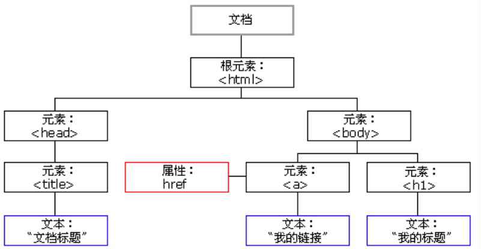

# ------ javascript 教程 ------

# 1. JavaScript 简介

JavaScript 是属于 HTML 和 Web 的编程语言。

编程令计算机完成您需要它们做的工作。

### 1.1 什么是javascript?

JavaScript（简称“JS”） 是一种具有函数优先的轻量级，解释型或即时编译型的[编程语言](https://baike.baidu.com/item/编程语言/9845131)。虽然它是作为开发[Web](https://baike.baidu.com/item/Web/150564)页面的[脚本语言](https://baike.baidu.com/item/脚本语言/1379708)而出名，但是它也被用到了很多非[浏览器](https://baike.baidu.com/item/浏览器/213911)环境中，JavaScript 基于原型编程、多范式的动态脚本语言，并且支持[面向对象](https://baike.baidu.com/item/面向对象/2262089)、命令式、声明式、[函数](https://baike.baidu.com/item/函数/301912)式编程范式。

JavaScript在1995年由[Netscape](https://baike.baidu.com/item/Netscape/2778944)公司的Brendan Eich，在网景导航者浏览器上首次设计实现而成。因为Netscape与[Sun](https://baike.baidu.com/item/Sun/69463)合作，Netscape管理层希望它外观看起来像Java，因此取名为JavaScript。但实际上它的语法风格与Self及[Scheme](https://baike.baidu.com/item/Scheme/8379129)较为接近。 [2] 

JavaScript的标准是[ECMAScript ](https://baike.baidu.com/item/ECMAScript /1889420)。截至 2012 年，所有浏览器都完整的支持ECMAScript 5.1，旧版本的浏览器至少支持ECMAScript 3 标准。2015年6月17日，ECMA国际组织发布了ECMAScript的第六版，该版本正式名称为 ECMAScript 2015，但通常被称为ECMAScript 6 或者ES2015。


### 1.2 什么是ECMAScript?

**ECMAScript**是一种由[Ecma国际](https://baike.baidu.com/item/Ecma国际)（前身为[欧洲计算机制造商协会](https://baike.baidu.com/item/欧洲计算机制造商协会/2052072)，European Computer Manufacturers Association）通过ECMA-262标准化的脚本[程序设计语言](https://baike.baidu.com/item/程序设计语言)。这种语言在[万维网](https://baike.baidu.com/item/万维网)上应用广泛，它往往被称为[JavaScript](https://baike.baidu.com/item/JavaScript)或[JScript](https://baike.baidu.com/item/JScript)，所以它可以理解为是JavaScript的一个标准,但实际上后两者是ECMA-262标准的实现和扩展。


### 1.3 为何学习 JavaScript？

JavaScript 是 web 开发者必学的三种语言之一：

- *HTML* 定义网页的内容
- *CSS* 规定网页的布局
- *JavaScript* 对网页行为进行编程


# 2. JavaScript 使用

### 2.1 script标签

在 HTML 中，JavaScript 代码必须位于 <script> 与 </script> 标签之间。

```html
<script>
    document.getElementById("demo").innerHTML = "我的第一段 JavaScript";
</script>
```

**注释：**旧的 JavaScript 例子也许会使用 **type** 属性：<script type="text/javascript">。

**注释：**type 属性不是必需的。JavaScript 是 HTML 中的默认脚本语言。


### 2.1 JavaScript 函数和事件

JavaScript *函数*是一种 JavaScript 代码块，它可以在调用时被执行。


### 2.2 head标签中的 JavaScript

JavaScript 函数被放置于 HTML 页面的 <head> 部分。

```html
<!DOCTYPE html>
<html>
    <head>
        <script>
            function myFunction() {
                document.getElementById("demo").innerHTML = "段落被更改。";
            }
        </script>
    </head>

    <body>

        <h1>一张网页</h1>
        <p id="demo">一个段落</p>
        <button type="button" onclick="myFunction()">试一试</button>

    </body>
</html>
```


### 2.3 body中的 JavaScript

JavaScript 函数被放置于 HTML 页面的 <body> 部分。

```html
<!DOCTYPE html>
<html>
    <body> 

        <h1>A Web Page</h1>
        <p id="demo">一个段落</p>
        <button type="button" onclick="myFunction()">试一试</button>

        <script>
            function myFunction() {
                document.getElementById("demo").innerHTML = "段落被更改。";
            }
        </script>

    </body>
</html>
```

**提示：**把脚本置于 <body> 元素的底部，可改善显示速度，因为脚本编译会拖慢显示。


### 2.4 外部脚本

脚本可放置与外部文件中：

外部文件：myScript.js

```js
function myFunction() {
    document.getElementById("demo").innerHTML = "段落被更改。";
}
```

外部脚本很实用，如果相同的脚本被用于许多不同的网页。

JavaScript 文件的文件扩展名是 *.js*。

如需使用外部脚本，可以在 <script> 标签的 src (source) 属性中设置脚本的名称：

```html
<script src="myScript.js"></script>
```

可以在 <head> 或 <body> 中放置外部脚本引用。

该脚本的表现与它被置于 <script> 标签中是一样的。

**注释：**外部脚本不能包含 **<script>** 标签。


### 2.5 外部 JavaScript 的优势

在外部文件中放置脚本有如下优势：

- 分离了 HTML 和代码
- 使 HTML 和 JavaScript 更易于阅读和维护
- 已缓存的 JavaScript 文件可加速页面加载

如需向一张页面添加多个脚本文件 - 可以使用多个 script 标签：

```html
<script src="myScript1.js"></script>
<script src="myScript2.js"></script>
```


### 2.6 外部引用

通过完整的 URL 或相对于当前网页的路径引用外部脚本：

使用完整的 URL 来链接至脚本：

```html
<script src="https://www.w3school.com.cn/js/myScript1.js"></script>
```

使用了位于当前网站上指定文件夹中的脚本：

```html
<script src="/js/myScript1.js"></script>
```

链接了与当前页面相同文件夹的脚本：

```js
<script src="myScript1.js"></script>
```


# 3. JavaScript 输出

**JavaScript 不提供任何内建的打印或显示函数。**

### 3.1 JavaScript 显示方案

JavaScript 能够以不同方式“显示”数据：

- 使用 window.alert() 写入警告框
- 使用 document.write() 写入 HTML 输出
- 使用 innerHTML 写入 HTML 元素
- 使用 console.log() 写入浏览器控制台


### 3.2 使用 innerHTML

如需访问 HTML 元素，JavaScript 可使用 document.getElementById(id) 方法。

id 属性定义 HTML 元素。innerHTML 属性定义 HTML 内容：

```html
<!DOCTYPE html>
<html>
    <body>

        <h1>我的第一张网页</h1>
        <p>我的第一个段落</p>
        <p id="demo"></p>

        <script>
            document.getElementById("demo").innerHTML = 5 + 6;
        </script>

    </body>
</html> 
```

**提示：**更改 HTML 元素的 innerHTML 属性是在 HTML 中显示数据的常用方法。


### 3.3 使用 document.write()

出于测试目的，使用 document.write() 比较方便：

```html
<!DOCTYPE html>
<html>
    <body>

        <h1>我的第一张网页</h1>
        <p>我的第一个段落</p>
        <script>
            document.write(5 + 6);
        </script>

    </body>
</html> 
```

**注意：**在 HTML 文档完全加载后使用 **document.write()** 将*删除所有已有的 HTML* ：

```html
<!DOCTYPE html>
<html>
    <body>

        <h1>我的第一张网页</h1>
        <p>我的第一个段落</p>
        <button onclick="document.write(5 + 6)">试一试</button>

    </body>
</html>
```

**提示：**document.write() 方法仅用于测试。


### 3.4 使用 window.alert()

使用警告框来显示数据：

```html
<!DOCTYPE html>
<html>
    <body>

        <h1>我的第一张网页</h1>
        <p>我的第一个段落</p>
        <script>
            window.alert(5 + 6);
        </script>

    </body>
</html> 
```


### 3.5 使用 console.log()

在浏览器中，可使用 console.log() 方法来显示数据。

```html
<!DOCTYPE html>
<html>
    <body>

        <h1>我的第一张网页</h1>
        <p>我的第一个段落</p>
        <script>
            console.log(5 + 6);
        </script>

    </body>
</html>
```


# 4. JavaScript 语句

**在 HTML 中，JavaScript 语句是由 web 浏览器“执行”的“指令”。**

```js
var x, y, z;	// 语句 1
x = 22;		// 语句 2
y = 11;		// 语句 3
z = x + y;	// 语句 4
```


### 4.1 JavaScript 程序

*计算机程序*是由计算机“执行”的一系列“指令”。

在编程语言中，这些编程*指令*被称为语句。

*JavaScript 程序*就是一系列的编程*语句*。

**注释：**在 HTML 中，JavaScript 程序由 web 浏览器执行。


### 4.2 JavaScript 语句

JavaScript 语句由以下构成：

值、运算符、表达式、关键词和注释。

这条语句告诉浏览器在 id="demo" 的 HTML 元素中输出 "Hello Kitty."：

```js
document.getElementById("demo").innerHTML = "Hello Kitty.";
```

大多数 JavaScript 程序都包含许多 JavaScript 语句。

这些语句会按照它们被编写的顺序逐一执行。

**注释：**JavaScript 程序（以及 JavaScript 语句）常被称为 JavaScript 代码。


### 4.3 分号 

分号分隔 JavaScript 语句。

请在每条可执行的语句之后添加分号：

```js
a = 5;
b = 6;
c = a + b;
```

如果有分号分隔，允许在同一行写多条语句：

```js
a = 5; b = 6; c = a + b;
```

您可能在网上看到不带分号的例子。

**提示：**以分号结束语句不是必需的，但我们仍然强烈建议您这么做。


### 4.4 JavaScript 空白字符

JavaScript 会忽略多个空格。您可以向脚本添加空格，以增强可读性。

下面这两行是相等的：

```js
var person = "Bill";
var person="Bill"; 
```

在运算符旁边（ = + - * / ）添加空格是个好习惯：

```js
var x = y + z;
```


### 4.5 JavaScript 行长度和折行

为了达到最佳的可读性，程序员们常常喜欢把代码行控制在 80 个字符以内。

如果 JavaScript 语句太长，对其进行折行的最佳位置是某个运算符：

```js
document.getElementById("demo").innerHTML =
 "Hello Kitty.";
```


### 4.6 JavaScript 代码块

JavaScript 语句可以用花括号（{...}）组合在代码块中。

代码块的作用是定义一同执行的语句。

```js
function myFunction() {
    document.getElementById("demo").innerHTML = "Hello Kitty.";
    document.getElementById("myDIV").innerHTML = "How are you?";
}
```


### 4.7 JavaScript 关键词

JavaScript 语句常常通过某个关键词来标识需要执行的 JavaScript 动作。

下面的表格列出了一部分将在教程中学到的关键词：

| 关键词        | 描述                                              |
| :------------ | :------------------------------------------------ |
| break         | 终止 switch 或循环。                              |
| continue      | 跳出循环并在顶端开始。                            |
| debugger      | 停止执行 JavaScript，并调用调试函数（如果可用）。 |
| do ... while  | 执行语句块，并在条件为真时重复代码块。            |
| for           | 标记需被执行的语句块，只要条件为真。              |
| function      | 声明函数。                                        |
| if ... else   | 标记需被执行的语句块，根据某个条件。              |
| return        | 退出函数。                                        |
| switch        | 标记需被执行的语句块，根据不同的情况。            |
| try ... catch | 对语句块实现错误处理。                            |
| var           | 声明变量。                                        |

**注释：**JavaScript 关键词指的是保留的单词。保留词无法用作变量名。


# 5. JavaScript 语法

**JavaScript \*语法\*是一套规则，它定义了 JavaScript 的语言结构。**

```js
var x, y;	// 如何声明变量
x = 7; y = 8;	// 如何赋值
z = x + y;	// 如何计算值
```


### 5.1 JavaScript 值

JavaScript 语句定义两种类型的值：混合值和变量值。

混合值被称为*字面量（literal）*。变量值被称为*变量*。


### 5.2 JavaScript 字面量

书写混合值最重要的规则是：

写*数值*有无小数点均可：

```js
15.90

10011
```

*字符串*是文本，由双引号或单引号包围：

```js
"Bill Gates"

'Bill Gates' 
```


### 5.3 JavaScript 变量

在编程语言中，*变量*用于*存储*数据值。

JavaScript 使用 var 关键词来*声明*变量。

= 号用于为变量*赋值*。

在本例中，x 被定义为变量。然后，x 被赋的值是 7：

```js
var x;

x = 7;
```


### 5.4 JavaScript 运算符

JavaScript 使用*算数运算符*（+ - * /）来*计算值*：

```js
(7 + 8) * 10
```

JavaScript 使用*赋值运算符*（=）向变量*赋值*：

```js
var x, y;
var x = 7;
var y = 8;
```


### 5.5 JavaScript 表达式

表达式是值、变量和运算符的组合，计算结果是值。

```js
6 * 10
```

表达式也可包含变量值：

```js
x * 10
```

值可以是多种类型，比如数值和字符串。

例如，"Bill" + " " + "Gates"，计算为 "Bill Gates"：

```js
"Bill" + " " + "Gates"
```


### 5.6 JavaScript 关键词

JavaScript *关键词*用于标识被执行的动作（简单来讲就是告诉浏览器这个是干啥用的）。

var 关键词告知浏览器创建新的变量：

```js
var x = 7 + 8;
var y = x * 10; 
```


### 5.7 JavaScript 注释

并非所有 JavaScript 语句都被“执行”。

双斜杠 // 或 /* 与 **/* 之间的代码被视为*注释*。

注释会被忽略，不会被执行：

```js
var x = 7;   // 会执行

// var x = 8;   不会执行
```


### 5.8 JavaScript 标识符

标识符是名称。

在 JavaScript 中，标识符用于命名变量（以及关键词、函数和标签）。

在大多数编程语言中，合法名称的规则大多相同。

在 JavaScript 中，首字符必须是字母、下划线（-）或美元符号（$）。

连串的字符可以是字母、数字、下划线或美元符号。

**提示：**数值不可以作为首字符。这样，JavaScript 就能轻松区分标识符和数值。


### 5.9 JavaScript 对大小写敏感

所有 JavaScript 标识符*对大小写敏感*。

变量 lastName 和 lastname，是两个不同的变量。

```js
lastName = "Gates";
lastname = "Jobs"; 
```

JavaScript 不会把 *VAR* 或 *Var* 译作关键词 *var*。


### 5.10 JavaScript 与驼峰式大小写

历史上，程序员曾使用三种把多个单词连接为一个变量名的方法：

##### 5.10.1 连字符

```js
first-name, last-name, master-card, inter-city.
```

**注释：**JavaScript 中不能使用连字符。它是为减法预留的。

##### 5.10.2 下划线

```js
first_name, last_name, master_card, inter_city.
```

##### 5.10.3 驼峰式大小写（Camel Case）

```js
FirstName, LastName, MasterCard, InterCity.
```


JavaScript 程序员倾向于使用以小写字母开头的驼峰大小写：

```js
firstName, lastName, masterCard, interCity
```


# 6. JavaScript Let 变量

### 6.1 ECMAScript 2015

ES2015 引入了两个重要的 JavaScript 新关键词：let 和 const。

这两个关键字在 JavaScript 中提供了块作用域（*Block Scope*）变量（和常量）。

在 ES2015 之前，JavaScript 只有两种类型的作用域：*全局作用域*和*函数作用域*。


### 6.2 全局作用域

*全局*（在函数之外）声明的变量拥有*全局作用域*。

```js
var carName = "porsche";

// 此处的代码可以使用 carName

function myFunction() {
  // 此处的代码也可以使用 carName
}
```

*全局*变量可以在 JavaScript 程序中的任何位置访问。


### 6.3 函数作用域

*局部*（函数内）声明的变量拥有*函数作用域*。

```js
// 此处的代码不可以使用 carName

function myFunction() {
  var carName = "porsche";
  // code here CAN use carName
}

// 此处的代码不可以使用 carName
```

*局部*变量只能在它们被声明的函数内访问。


### 6.4 JavaScript 块作用域

通过 var 关键词声明的变量没有块*作用域*。

在块 *{}* 内声明的变量可以从块之外进行访问。

```js
{ 
  var x = 10; 
}
// 此处可以使用 x
```

在 ES2015 之前，JavaScript 是没有块作用域的。

可以使用 let 关键词声明拥有块作用域的变量。

在块 *{}* 内声明的变量无法从块外访问：

```js
{ 
  let x = 10;
}
// 此处不可以使用 x
```


### 6.5 重新声明变量

使用 var 关键字重新声明变量会带来问题。

在块中重新声明变量也将重新声明块外的变量：

```js
var x = 10;
// 此处 x 为 10
{ 
  var x = 6;
  // 此处 x 为 6
}
// 此处 x 为 6
```

使用 let 关键字重新声明变量可以解决这个问题。

在块中重新声明变量不会重新声明块外的变量：

```js
var x = 10;
// 此处 x 为 10
{ 
  let x = 6;
  // 此处 x 为 6
}
// 此处 x 为 10
```


### 6.6 浏览器支持

Internet Explorer 11 或更早的版本不完全支持 let 关键词。

下表定义了第一个完全支持 let 关键词的浏览器版本：

|              |              |              |              |              |
| ------------ | ------------ | ------------ | ------------ | ------------ |
| Chrome 49    | IE / Edge 12 | Firefox 44   | Safari 11    | Opera 36     |
| 2016 年 3 月 | 2015 年 7 月 | 2015 年 1 月 | 2017 年 9 月 | 2016 年 3 月 |


### 6.7 循环作用域

##### 6.7.1 在循环中使用 var

```js
var i = 7;
for (var i = 0; i < 10; i++) {
  // 一些语句
}
// 此处，i 为 10
```


##### 6.7.2 在循环中使用 let

```js
let i = 7;
for (let i = 0; i < 10; i++) {
  // 一些语句
}
// 此处 i 为 7
```

在第一个例子中，在循环中使用的变量使用 var 重新声明了循环之外的变量。

在第二个例子中，在循环中使用的变量使用 let 并没有重新声明循环外的变量。

如果在循环中用 let 声明了变量 i，那么只有在循环内，变量 i 才是可见的。


### 6.8 函数作用域

在函数内声明变量时，使用 var 和 let 很相似。

它们都有*函数作用域*：

```js
function myFunction() {
  var carName = "porsche";   // 函数作用域
}
function myFunction() {
  let carName = "porsche";   // 函数作用域
}
```


### 6.9 全局作用域

如果在块外声明声明，那么 var 和 let 也很相似。

它们都拥有*全局作用域*：

```js
var x = 10;       // 全局作用域
let y = 6;       // 全局作用域
```


### 6.10 HTML 中的全局变量

使用 JavaScript 的情况下，全局作用域是 JavaScript 环境。

在 HTML 中，全局作用域是 window 对象。

通过 var 关键词定义的全局变量属于 window 对象：

```js
var carName = "porsche";
// 此处的代码可使用 window.carName	值：porsche
```

通过 let 关键词定义的全局变量不属于 window 对象：

```js
let carName = "porsche";
// 此处的代码不可使用 window.carName		值：undefined	
```


### 6.11 重新声明

允许在程序的任何位置使用 var 重新声明 JavaScript 变量：

```js
var x = 10;

// 现在，x 为 10
 
var x = 6;

// 现在，x 为 6
```

在相同的作用域，或在相同的块中，通过 let 重新声明一个 var 变量是不允许的：

```js
var x = 10;       // 允许
let x = 6;       // 不允许

{
  var x = 10;   // 允许
  let x = 6;   // 不允许
}
```

在相同的作用域，或在相同的块中，通过 let 重新声明一个 let 变量是不允许的：

```js
let x = 10;       // 允许
let x = 6;       // 不允许

{
  let x = 10;   // 允许
  let x = 6;   // 不允许
}
```

在相同的作用域，或在相同的块中，通过 var 重新声明一个 let 变量是不允许的：

```js
let x = 10;       // 允许
var x = 6;       // 不允许

{
  let x = 10;   // 允许
  var x = 6;   // 不允许
}
```

在不同的作用域或块中，通过 let 重新声明变量是允许的：

```js
let x = 6;       // 允许
document.write(x)	//6
{
    let x = 7;   // 允许
    document.write(x)	//7
}

{
    let x = 8;   // 允许
    document.write(x)	//8
}
document.write(x)	//6
```


### 6.12 提升

通过 var 声明的变量会*提升*到顶端。如果您不了解什么是提升（Hoisting），请学习我们的提升这一章。

您可以在声明变量之前就使用它：

```js
document.write(carName);	//undefined
var carName;
```

通过 let 定义的变量不会被提升到顶端。

在声明 let 变量之前就使用它会导致 ReferenceError。

变量从块的开头一直处于“暂时死区”，直到声明为止：

```js
document.write(carName);	//报错
let carName;
```


# 7. JavaScript Const 常量

### 7.1 ECMAScript 2015

ES2015 引入了两个重要的 JavaScript 新关键词：let 和 const。

通过 const 定义的变量与 let 变量类似，但不能重新赋值：

```js
const PI = 3.141592653589793;
PI = 3.14;      // 会出错
PI = PI + 10;   // 也会出错
```


### 7.2 块作用域

在*块作用域*内使用 const 声明的变量与 let 变量相似。

在本例中，x 在块中声明，不同于在块之外声明的 x：

```js
var x = 10;
// 此处，x 为 10
{ 
  const x = 6;
  // 此处，x 为 6
}
// 此处，x 为 10
```


### 7.3 在声明时赋值

JavaScript const 变量必须在声明时赋值：

##### 7.3.1 不正确

```js
const PI;
PI = 3.14159265359;
```

##### 7.3.2 正确

```
const PI = 3.14159265359;
```


### 7.4 不是真正的常数

关键字 const 有一定的误导性。

它没有定义常量值。它定义了对值的常量引用。

因此，我们不能更改常量原始值，但我们可以更改常量对象的属性。

##### 7.4.1 原始值

如果我们将一个原始值赋给常量，我们就不能改变原始值：

```js
const PI = 3.141592653589793;
PI = 3.14;      // 会出错
PI = PI + 10;   // 也会出错
```


### 7.5 常量对象可以更改

您可以更改常量对象的属性：

```js
// 您可以创建 const 对象：
const car = {type:"porsche", model:"911", color:"Black"};

// 您可以更改属性：
car.color = "White";

// 您可以添加属性：
car.owner = "Bill";
```

但是无法重新为常量对象赋值：

```js
const car = {type:"porsche", model:"911", color:"Black"};
car = {type:"Volvo", model:"XC60", color:"White"};    // error
```


### 7.6 常量数组可以更改

可以更改常量数组的元素：

```js
// 您可以创建常量数组：
const cars = ["Audi", "BMW", "porsche"];

// 您可以更改元素：
cars[0] = "Honda";

// 您可以添加元素：
cars.push("Volvo");
```

但是您无法重新为常量数组赋值：

```js
const cars = ["Audi", "BMW", "porsche"];
cars = ["Honda", "Toyota", "Volvo"];    // error
```


### 7.7 浏览器支持

Internet Explorer 10 或更早版本不支持 const 关键词。

下表定义了第一个完全支持 const 关键词的浏览器版本：

|              |               |              |              |              |
| ------------ | ------------- | ------------ | ------------ | ------------ |
| Chrome 49    | IE / Edge 11  | Firefox 36   | Safari 10    | Opera 36     |
| 2016 年 3 月 | 2013 年 10 月 | 2015 年 2 月 | 2016 年 9 月 | 2016 年 3 月 |


### 7.8 重新声明

在程序中的任何位置都允许重新声明 JavaScript var 变量：

```js
var x = 2;    //  允许
var x = 3;    //  允许
x = 4;        //  允许
```

在同一作用域或块中，不允许将已有的 var 或 let 变量重新声明或重新赋值给 const：

```js
var x = 2;         // 允许
const x = 2;       // 不允许
{
  let x = 2;     // 允许
  const x = 2;   // 不允许
}
```

在同一作用域或块中，为已有的 const 变量重新声明声明或赋值是不允许的：

```js
const x = 2;       // 允许
const x = 3;       // 不允许
x = 3;             // 不允许
var x = 3;         // 不允许
let x = 3;         // 不允许

{
  const x = 2;   // 允许
  const x = 3;   // 不允许
  x = 3;         // 不允许
  var x = 3;     // 不允许
  let x = 3;     // 不允许
}
```

在另外的作用域或块中重新声明 const 是允许的：

```
const x = 2;       // 允许

{
  const x = 3;   // 允许
}

{
  const x = 4;   // 允许
}
```


### 7.9 提升

可以在声明 var 变量之前就使用它

```js
document.write(carName);    // undefined
var carName;
```

通过 const 定义的变量不会被提升到顶端。

const 变量不能在声明之前使用

```js
document.write(carName);    //报错
const carName = "Volvo";
```


# 8. JavaScript 运算符

### 8.1 JavaScript 运算符

向变量赋值，并把它们相加：

```js
var x = 7;		// 向 x 赋值 5
var y = 8;		// 向 y 赋值 2
var z = x + y;		// 向 z (x + y) 赋值 7
```


### 8.2 JavaScript 算数运算符

算数运算符用于对数字执行算数运算：

| 运算符 | 描述         |
| :----- | :----------- |
| +      | 加法         |
| -      | 减法         |
| *      | 乘法         |
| /      | 除法         |
| %      | 取模（余数） |
| ++     | 递加         |
| --     | 递减         |


### 8.3 JavaScript 赋值运算符

赋值运算符向 JavaScript 变量赋值。

| 运算符 | 例子   | 等同于    |
| :----- | :----- | :-------- |
| =      | x = y  | x = y     |
| +=     | x += y | x = x + y |
| -=     | x -= y | x = x - y |
| *=     | x *= y | x = x * y |
| /=     | x /= y | x = x / y |
| %=     | x %= y | x = x % y |


### 8.4 JavaScript 字符串运算符

\+ 运算符也可用于对字符串进行相加（concatenate，级联）。

```js
txt1 = "Bill";
txt2 = "Gates";
txt3 = txt1 + " " + txt2;	// Bill Gates
```

**提示：**在用于字符串时，+ 运算符被称为级联运算符。


### 8.5 字符串和数字的相加

相加两个数字，将返回和，但对一个数字和一个字符串相加将返回一个字符串：

```js
x = 7 + 8;	// 15
y = "7" + 8;	// 78 
z = "Hello" + 7;	// Hello7
```

**提示：**如果您对数字和字符串相加，结果将是字符串！


### 8.6 JavaScript 比较运算符

| 运算符 | 描述                               |
| :----- | :--------------------------------- |
| ==     | 等于（比较值）                     |
| ===    | 等值等型（比较地址值）             |
| !=     | 不相等（比较值）                   |
| !==    | 不等值或不等型比较地址值）         |
| >      | 大于                               |
| <      | 小于                               |
| >=     | 大于或等于                         |
| <=     | 小于或等于                         |
| ?      | 三元运算符（表达式？true : false） |


### 8.7 JavaScript 逻辑运算符

| 运算符 | 描述   |
| :----- | :----- |
| &&     | 逻辑与 |
| \|\|   | 逻辑或 |
| !      | 逻辑非 |


### 8.8 JavaScript 类型运算符

| 运算符     | 描述                                                         |
| :--------- | :----------------------------------------------------------- |
| typeof     | 返回变量的类型。（typeof 类型）                              |
| instanceof | 返回 true，如果对象是对象类型的 。（我们自己写的类型 instanceof 目标类型） |


### 8.9 JavaScript 位运算符

位运算符处理 32 位数。

该运算中的任何数值运算数都会被转换为 32 位的数。结果会被转换回 JavaScript 数。

| 运算符 | 描述         | 例子    | 等同于       | 结果 | 十进制 |
| :----- | :----------- | :------ | :----------- | :--- | :----- |
| &      | 与           | 5 & 1   | 0101 & 0001  | 0001 | 1      |
| \|     | 或           | 5 \| 1  | 0101 \| 0001 | 0101 | 5      |
| ~      | 非           | ~ 5     | ~0101        | 1010 | 10     |
| ^      | 异或         | 5 ^ 1   | 0101 ^ 0001  | 0100 | 4      |
| <<     | 零填充左位移 | 5 << 1  | 0101 << 1    | 1010 | 10     |
| >>     | 有符号右位移 | 5 >> 1  | 0101 >> 1    | 0010 | 2      |
| >>>    | 零填充右位移 | 5 >>> 1 | 0101 >>> 1   | 0010 | 2      |

上例使用 4 位无符号的例子。但是 JavaScript 使用 32 位有符号数。

因此，在 JavaScript 中，~ 5 不会返回 10，而是返回 -6。

~00000000000000000000000000000101 将返回 11111111111111111111111111111010。


### 8.10 JavaScript 运算符优先级值

| 值     | 运算符         | 描述             |                      |
| :----- | :------------- | :--------------- | :------------------- |
| 20     | ( )            | 表达式分组       | (3 + 4)              |
|        |                |                  |                      |
| 19     | .              | 成员             | person.name          |
| 19     | []             | 成员             | person["name"]       |
| 19     | ()             | 函数调用         | myFunction()         |
| 19     | new            | 创建             | new Date()           |
|        |                |                  |                      |
| 17     | ++             | 后缀递增         | i++                  |
| 17     | --             | 后缀递减         | i--                  |
|        |                |                  |                      |
| 16     | ++             | 前缀递增         | ++i                  |
| 16     | --             | 前缀递减         | --i                  |
| 16     | !              | 逻辑否           | !(x==y)              |
| 16     | typeof         | 类型             | typeof x             |
|        |                |                  |                      |
| **15** | ******         | **求幂 (ES7)**   | **10 ** 2**          |
|        |                |                  |                      |
| 14     | *              | 乘               | 10 * 5               |
| 14     | /              | 除               | 10 / 5               |
| 14     | %              | 模数除法         | 10 % 5               |
|        |                |                  |                      |
| 13     | +              | 加               | 10 + 5               |
| 13     | -              | 减               | 10 - 5               |
|        |                |                  |                      |
| 12     | <<             | 左位移           | x << 2               |
| 12     | >>             | 右位移           | x >> 2               |
| 12     | >>>            | 右位移（无符号） | x >>> 2              |
|        |                |                  |                      |
| 11     | <              | 小于             | x < y                |
| 11     | <=             | 小于或等于       | x <= y               |
| 11     | >              | 大于             | x > y                |
| 11     | >=             | 大于或等于       | x >= y               |
| **11** | **in**         | **对象中的属性** | **"PI" in Math**     |
| **11** | **instanceof** | **对象的 **      | **instanceof Array** |
|        |                |                  |                      |
| 10     | ==             | 相等             | x == y               |
| 10     | ===            | 严格相等         | x === y              |
| 10     | !=             | 不相等           | x != y               |
| 10     | !==            | 严格不相等       | x !== y              |
|        |                |                  |                      |
| 9      | &              | 按位与           | x & y                |
| 8      | ^              | 按位 XOR         | x ^ y                |
| 7      | \|             | 按位或           | x \| y               |
| 6      | &&             | 逻辑与           | x && y               |
| 5      | \|\|           | 逻辑否           | x \|\| y             |
| 4      | ? :            | 条件             | ? "Yes" : "No"       |
|        |                |                  |                      |
| 3      | =              | 赋值             | x = y                |
| 3      | +=             | 赋值             | x += y               |
| 3      | -=             | 赋值             | x -= y               |
| 3      | *=             | 赋值             | x *= y               |
| 3      | %=             | 赋值             | x %= y               |
| 3      | <<=            | 赋值             | x <<= y              |
| 3      | >>=            | 赋值             | x >>= y              |
| 3      | >>>=           | 赋值             | x >>>= y             |
| 3      | &=             | 赋值             | x &= y               |
| 3      | ^=             | 赋值             | x ^= y               |
| 3      | \|=            | 赋值             | x \|= y              |
|        |                |                  |                      |
| **2**  | **yield**      | **暂停函数**     | **yield x**          |
| 1      | ,              | 逗号             | 7 , 8                |

**注意：**加粗字体指示实验性或建议性的技术（ECMASScript 2016 或 ES7）

**提示：**括号中的表达式会在值在表达式的其余部分中被使用之前进行完全计算。


# 9. JavaScript 数据类型

**字符串值，数值，布尔值，undefined ，null , 数组 ，对象。**

### 9.1 JavaScript 数据类型

JavaScript 变量能够保存多种*数据类型*：数值、字符串值、数组、对象等等：

```js
var length = 7;                             // 数字
var lastName = "Gates";                      // 字符串
var cars = ["Porsche", "Volvo", "BMW"];         // 数组
var x = {firstName:"Bill", lastName:"Gates"};    // 对象
```


### 9.2 数据类型的概念

在编程过程中，数据类型是重要的概念。

为了能够操作变量，了解数据类型是很重要的。

如果没有数据类型，计算机就无法安全地解决这道题：

```js
var x = 911 + "Porsche";
```

```js
var x = "911" + "Porsche";
```


JavaScript 从左向右计算表达式。不同的次序会产生不同的结果：

```js
var x = 911 + 7 + "Porsche";	//918Porsche
```

```js
var x = "Porsche" + 911 + 7;	//Porsche9117
```

在第一个例子中，JavaScript 把 911 和 7 视作数值，直到遇见 "Porsche"。

在第二个例子中，由于第一个操作数是字符串，因此所有操作数都被视为字符串。


### 9.3 JavaScript 拥有动态类型

JavaScript 拥有动态类型。这意味着相同变量可用作不同类型：

```js
var x;               // 现在 x 是 undefined
var x = 7;           // 现在 x 是数值
var x = "Bill";      // 现在 x 是字符串值
```


### 9.4 JavaScript 字符串值

字符串（或文本字符串）是一串字符（比如 "Bill Gates"）。

字符串被引号包围。可使用单引号或双引号：

```js
var carName = "Porsche 911";   // 使用双引号
var carName = 'Porsche 911';   // 使用单引号
```

可以在字符串内使用引号，只要这些引号与包围字符串的引号不匹配：

```js
var answer = "It's alright";             // 双引号内的单引号
var answer = "He is called 'Bill'";    // 双引号内的单引号
var answer = 'He is called "Bill"';    // 单引号内的双引号
```


### 9.5 JavaScript 数值

JavaScript 只有一种数值类型。

写数值时用不用小数点均可：

```js
var x1 = 34.00;     // 带小数点
var x2 = 34;        // 不带小数点
```

超大或超小的数值可以用科学计数法来写：

```js
var y = 123e5;      // 12300000
var z = 123e-5;     // 0.00123
```


### 9.6 JavaScript 布尔值

布尔值只有两个值：true 或 false。

```js
var x = true;
var y = false;
```

布尔值经常用在条件测试中。


### 9.7 JavaScript 数组

JavaScript 数组用方括号[]书写。

数组的项目由逗号分隔。

下面的代码声明（创建）了名为 cars 的数组，包含三个项目（汽车品牌）：

```js
var cars = ["Porsche", "Volvo", "BMW"];
```

数组索引基于零，这意味着第一个项目是 [0]，第二个项目是 [1]，以此类推。


### 9.8 JavaScript 对象

JavaScript 对象用花括号{}来书写。

对象属性是 *name*:*value* 对，由逗号分隔。

```js
var person = {firstName:"Bill", lastName:"Gates", age:62, eyeColor:"blue"};
```


### 9.9 typeof 运算符

可使用 JavaScript 的 typeof 来确定 JavaScript 变量的类型：

typeof 运算符返回变量或表达式的类型：

```js
typeof ""                  // 返回 "string"
typeof "Bill"              // 返回 "string"
typeof "Bill Gates"          // 返回 "string"

typeof 0                   // 返回 "number"
typeof 314                 // 返回 "number"
typeof 3.14                // 返回 "number"
typeof (7)                 // 返回 "number"
typeof (7 + 8)             // 返回 "number"
```

typeof 运算符对数组返回 "object"，因为在 JavaScript 中数组属于对象。


### 9.10 Undefined

在 JavaScript 中，没有值的变量，其值是 undefined。typeof 也返回 undefined。

```js
var person;                  // 值是 undefined，类型是 undefined。
```

任何变量均可通过设置值为 undefined 进行清空。其类型也将是 undefined。

```js
person = undefined;          // 值是 undefined，类型是 undefined。
```


### 9.11 空值

空值与 undefined 不是一回事。

空的字符串变量既有值也有类型。

```js
var car = "";                // 值是 ""，类型是 "string"
```


### 9.12 Null

在 JavaScript 中，null 是 "nothing"。它被看做不存在的事物。

不幸的是，在 JavaScript 中，null 的数据类型是对象。

您可以把 null 在 JavaScript 中是对象理解为一个 bug。它本应是 null。

您可以通过设置值为 null 清空对象：

```js
var person = null;           // 值是 null，但是类型仍然是对象
```

您也可以通过设置值为 undefined 清空对象：

```js
var person = undefined;           // 值是 undefined，类型是 undefined。
```


### 9.13 Undefined 与 Null 的区别

Undefined 与 null 的值相等，但类型不相等：

```js
typeof undefined              // undefined
typeof null                   // object
null === undefined            // false
null == undefined             // true
```


### 9.14 原始数据

原始数据值是一种没有额外属性和方法的单一简单数据值。

typeof 运算符可返回以下原始类型之一：

- string
- number
- boolean
- undefined

```js
typeof "Bill"              // 返回 "string"
typeof 3.14                // 返回 "number"
typeof true                // 返回 "boolean"
typeof false               // 返回 "boolean"
typeof x                   // 返回 "undefined" (假如 x 没有值)
```


### 9.15 复杂数据

typeof 运算符可返回以下两种类型之一：

- function
- object

typeof 运算符把对象、数组或 null 返回 object。

typeof 运算符不会把函数返回 object。

```js
typeof {name:'Bill', age:62} // 返回 "object"
typeof [1,2,3,4]             // 返回 "object" (并非 "array"，参见下面的注释)
typeof null                  // 返回 "object"
typeof function myFunc(){}   // 返回 "function"
```

typeof 运算符把数组返回为 "object"，因为在 JavaScript 中数组即对象。


### 9.16 undefined 与 null 的区别

undefined 和 null 值相等但类型不同：

```js
typeof undefined           // undefined
typeof null                // object

null === undefined         // false
null == undefined          // tru
```


# 10. JavaScript 函数

**JavaScript 函数是被设计为执行特定任务的代码块。**

**JavaScript 函数会在某代码调用它时被执行。**

```js
function myFunction(p1, p2) {
    return p1 * p2;              // 该函数返回 p1 和 p2 的乘积
}
```


### 10.1 JavaScript 函数语法

JavaScript 函数通过 function 关键词进行定义，其后是*函数名*和括号 ()。

函数名可包含字母、数字、下划线和美元符号（规则与变量名相同）。

圆括号可包括由逗号分隔的参数：

```js
(参数 1, 参数 2, ...)
```

由函数执行的代码被放置在花括号中：*{}*

```js
function name(参数 1, 参数 2, 参数 3) {
    要执行的代码
}
```

在函数中，参数是局部变量。


### 10.2函数调用

函数中的代码将在其他代码调用该函数时执行：

- 当事件发生时（当用户点击按钮时）
- 当 JavaScript 代码调用时
- 自动的（自调用）


### 10.3 函数返回

当 JavaScript 到达 return 语句，函数将停止执行。

如果函数被某条语句调用，JavaScript 将在调用语句之后“返回”执行代码。

函数通常会计算出*返回值*。这个返回值会返回给调用者：

计算两个数的乘积，并返回结果：

```js
var x = myFunction(7, 8);        // 调用函数，返回值被赋值给 x // 56

function myFunction(a, b) {
    return a * b;                // 函数返回 a 和 b 的乘积
}
```


### 10.4 为何使用函数？

能够对代码进行复用：只要定义一次代码，就可以多次使用它。

能够多次向同一函数传递不同的参数，以产生不同的结果。

把华氏度转换为摄氏度：

```js
function toCelsius(fahrenheit) {
    return (5/9) * (fahrenheit-32);
}

document.getElementById("demo").innerHTML = toCelsius(77);
```


### 10.5 () 运算符调用函数

使用上面的例子，toCelsius 引用的是函数对象，而 toCelsius() 引用的是函数结果。

访问没有 () 的函数将返回函数定义：

```js
function toCelsius(fahrenheit) {
    return (5/9) * (fahrenheit-32);
}

document.getElementById("demo").innerHTML = toCelsius;
//function toCelsius(fahrenheit) { return (5/9) * (fahrenheit-32); }
```


### 10.6 用作变量值的函数

函数的使用方法与变量一致，在所有类型的公式、赋值和计算中。

使用变量来存储函数的值：

```js
var x = toCelsius(77);
var text = "The temperature is " + x + " Celsius";
```

能够把函数当做变量值直接使用：

```js
var text = "The temperature is " + toCelsius(77) + " Celsius";
```


### 10.7 局部变量

在 JavaScript 函数中声明的变量，会成为函数的*局部变量*。

局部变量只能在函数内访问。

```js
// 此处的代码不能使用 carName

function myFunction() {
    var carName = "Volvo";
    // code here CAN use carName
}

// 此处的代码可以使用 carName
```

由于局部变量只能被其函数识别，因此可以在不同函数中使用相同名称的变量。

局部变量在函数开始时创建，在函数完成时被删除。


# 11. JavaScript 对象

### 11.1 真实生活中的对象、属性和方法

在真实生活中，汽车是一个*对象*。

汽车有诸如车重和颜色等*属性*，也有诸如启动和停止的*方法*：

| 对象 | 属性                                                         | 方法                                        |
| :--- | :----------------------------------------------------------- | :------------------------------------------ |
|      | car.name = porschecar.model = 911car.length = 4499mmcar.color = white | car.start()car.drive()car.brake()car.stop() |

所有汽车都拥有同样的*属性*，但属性值因车而异。

所有汽车都拥有相同的*方法*，但是方法会在不同时间被执行。

对象就是可以拥有属性和方法的一个集合。


### 11.2 JavaScript 对象

之前已经学到，JavaScript 变量是数据值的容器。

这段代码把一个*单一值*（porsche）赋给名为 car 的*变量*：

```js
var car = "porsche";
```

对象也是变量。但是对象包含很多值。

这段代码把*多个值*（porsche, 911, white）赋给名为 car 的*变量*：

```js
var car = {type:"porsche", model:"911", color:"white"};
```

值以*名称:值*对的方式来书写（名称和值由冒号分隔）。

JavaScript 对象是*被命名值*的容器。


### 11.3 对象属性

（JavaScript 对象中的）名称:值对被称为*属性*。

```js
var person = {firstName:"Bill", lastName:"Gates", age:62, eyeColor:"blue"};
```

| 属性      | 属性值 |
| :-------- | :----- |
| firstName | Bill   |
| lastName  | Gates  |
| age       | 62     |
| eyeColor  | blue   |


### 11.4 对象方法

对象也可以有*方法*。

方法是在对象上执行的*动作*。

方法以*函数定义*被存储在属性中。

| 属性      | 属性值                                                    |
| :-------- | :-------------------------------------------------------- |
| firstName | Bill                                                      |
| lastName  | Gates                                                     |
| age       | 62                                                        |
| eyeColor  | blue                                                      |
| fullName  | function() {return this.firstName + " " + this.lastName;} |

方法是作为属性来存储的函数。

```js
var person = {
    firstName: "Bill",
    lastName : "Gates",
    id       : 678,
    fullName : function() {
        //this在这就相当于是person
        return this.firstName + " " + this.lastName;
    }
};
document.write(person.fullName())//Bill Gates
```


### 11.5 this 关键词

在函数定义中，this 引用该函数的“拥有者”。

在上面的例子中，this 指的是“拥有” fullName 函数的 *person 对象*。

换言之，this.firstName 的意思是 *this 对象*的 firstName 属性。


### 11.6 对象定义

我们定义（创建）了一个 JavaScript 对象：

```js
var person = {firstName:"Bill", lastName:"Gates", age:62, eyeColor:"blue"};
```

空格和折行都是允许的。对象定义可横跨多行：

```js
var person = {
    firstName:"Bill",
    lastName:"Gates",
    age:50,
    eyeColor:"blue"
};
```


### 11.7 访问对象属性

能够以两种方式访问属性：

```
person.lastName;
```

```
person["lastName"];
```


### 11.8 访问对象方法

能够通过如下语法访问对象方法：

```
person.fullName();
```

如果您*不使用 ()* 访问 fullName 方法，则将返回*函数定义*：

```
person.fullName;
```

方法实际上是以属性值的形式存储的函数定义。


### 11.9 请不要把字符串、数值和布尔值声明为对象！

如果通过关键词 "new" 来声明 JavaScript 变量，则该变量会被创建为对象：

```js
var x = new String();        // 把 x 声明为 String 对象
var y = new Number();        // 把 y 声明为 Number 对象
var z = new Boolean();       //	把 z 声明为 Boolean 对象
```

请避免字符串、数值或逻辑对象。他们会增加代码的复杂性并降低执行速度。


### 11.10 函数字符串化

JSON.stringify 不会对函数进行字符串化：

```js
const person = {
    name: "Bill",
    age: function () {return 19;}
};

let myString = JSON.stringify(person);
document.getElementById("demo").innerHTML = myString;
```

如果在字符串化之前将函数转换为字符串，这可以是“固定的”。

```js
const person = {
    name: "Bill",
    age: function () {return 19;}
};
// 将函数转换成字符串
person.age = person.age.toString();

let myString = JSON.stringify(person);
document.getElementById("demo").innerHTML = myString;
```


### 11.11 JavaScript 函数还是 Getter？

下面两个例子的区别在哪里？

**例子 1**

```js
var person = {
  firstName: "Bill",
  lastName : "Gates",
  fullName : function() {
    return this.firstName + " " + this.lastName;
  }
};

// 使用方法来显示来自对象的数据：
document.getElementById("demo").innerHTML = person.fullName();
```

**例子 2**

```js
var person = {
  firstName: "Bill",
  lastName : "Gates",
  get fullName() {
    return this.firstName + " " + this.lastName;
  }
};

// 使用 getter 来显示来自对象的数据：
document.getElementById("demo").innerHTML = person.fullName;
```

例子 1 以函数形式访问 fullName：person.fullName()。

例子 2 以属性形式访问 fullName：person.fullName。

第二个例子提供了更简洁的语法。


### 11.12 数据质量

使用 getter 和 setter 时，JavaScript 可以确保更好的数据质量。


### 11.13 为什么使用 Getter 和 Setter？

- 它提供了更简洁的语法
- 它允许属性和方法的语法相同
- 它可以确保更好的数据质量
- 有利于后台工作


### 11.14 原型继承

所有 JavaScript 对象都从原型继承属性和方法。

日期对象继承自 Date.prototype。数组对象继承自 Array.prototype。Person 对象继承自 Person.prototype。

Object.prototype 位于原型继承链的顶端：

日期对象、数组对象和 Person 对象都继承自 Object.prototype。


##### 11.14.1 向对象添加属性和方法

有时，希望向所有给定类型的已有对象添加新属性（或方法）。

有时，希望向对象构造器添加新属性（或方法）。


##### 11.14.2 使用 prototype 属性

JavaScript prototype 属性允许您为对象构造器添加新属性：

```js
function Person(first, last, age, eyecolor) {
    this.firstName = first;
    this.lastName = last;
    this.age = age;
    this.eyeColor = eyecolor;
}
Person.prototype.nationality = "English";
```

JavaScript prototype 属性也允许您为对象构造器添加新方法：

```js
function Person(first, last, age, eyecolor) {
    this.firstName = first;
    this.lastName = last;
    this.age = age;
    this.eyeColor = eyecolor;
}
Person.prototype.name = function() {
    return this.firstName + " " + this.lastName;
};
```


### 11.15 JavaScript ES5 对象方法

ECMAScript 5 (2009) 向 JavaScript 添加了许多新的对象方法。

##### 11.15.1 管理对象

```js
// 以现有对象为原型创建对象,返回空对象，原本对象中的属性和值添加到了原型对象中
Object.create(对象名)

// 添加或更改对象属性
Object.defineProperty(object, property, {value : value})

// 添加或更改对象属性
Object.defineProperties(object, {
    属性名：{
    value:值
	}
})

// 访问属性
Object.getOwnPropertyDescriptor(object, property)
//返回{value: 值, writable: false/true, enumerable: false/true, configurable: false/true}

// 以数组返回所有属性
Object.getOwnPropertyNames(object)

// 访问原型
Object.getPrototypeOf(object)

// 以数组返回可枚举属性
Object.keys(object)
```


##### 11.15.2 保护对象

```js
// 防止向对象添加属性
Object.preventExtensions(object)

// 如果属性可以添加到对象，则返回 true
Object.isExtensible(object)

// 防止更改对象属性（不是值）
Object.seal(object)

// 如果对象被密封，则返回 true
Object.isSealed(object)

// 防止对对象进行任何更改
Object.freeze(object)

// 如果对象被冻结，则返回 true
Object.isFrozen(object)
```


##### 11.15.3 更改属性值

**语法**

```js
Object.defineProperty(object, property, {value : value})
```

此例更改属性值：

```js
const person = {
  firstName: "Bill",
  lastName : "Gates",
  language : "EN"
};

// 修改属性
Object.defineProperty(person, "language", {value : "NO"});
```


##### 11.15.4 更改元数据

ES5 允许更改以下属性元数据：

```js
writable : true      // 属性值可更改
enumerable : true    // 属性可枚举
configurable : true  // 属性可重新配置
writable : false     // 属性值不可更改
enumerable : false   // 属性不可枚举
configurable : false // 属性不可重新配置
```

ES5 允许更改 getter 和 setter：

```js
// 定义 getter
get: function() { return language }
// 定义 setter
set: function(value) { language = value }
```

此例设置 language 为只读：

```js
Object.defineProperty(person, "language", {writable:false});
```

这个例子使 language 不可枚举：

```js
Object.defineProperty(person, "language", {enumerable:false});
```


##### 11.15.5 列出所有属性

这个例子列出了一个对象的所有属性：

```js
const person = {
  firstName: "Bill",
  lastName : "Gates",
  language : "EN"
};

Object.defineProperty(person, "language", {enumerable:false});
Object.getOwnPropertyNames(person);  // 返回数组的数组
```


### 11.16 JavaScript Map 对象

Map 对象存有键值对，其中的键可以是任何数据类型。

Map 对象记得键的原始插入顺序。

Map 对象具有表示映射大小的属性。

##### 11.16.1 基本的 Map() 方法

| Method    | Description                    |
| :-------- | :----------------------------- |
| new Map() | 创建新的 Map 对象。            |
| set()     | 为 Map 对象中的键设置值。      |
| get()     | 获取 Map 对象中键的值。        |
| entries() | 返回 Map 对象中键/值对的数组。 |
| keys()    | 返回 Map 对象中键的数组。      |
| values()  | 返回 Map 对象中值的数组。      |


##### 11.16.2 Map() 属性

| Property | Description               |
| -------- | ------------------------- |
| size     | 获取 Map 对象中某键的值。 |


##### 11.16.3 创建 Map 对象

能够使用对象作为键是 Map 的一个重要特性。

```js
// 创建对象
const apples = {name: 'Apples'};
const bananas = {name: 'Bananas'};
const oranges = {name: 'Oranges'};

// 创建新的 Map
const fruits = new Map();

// Add new Elements to the Map
fruits.set(apples, 500);
fruits.set(bananas, 300);
fruits.set(oranges, 200);
```

您可以将 Array 传递给 new Map() 构造函数：

```js
// 返回
const apples = {name: 'Apples'};
const bananas = {name: 'Bananas'};
const oranges = {name: 'Oranges'};

// 创建新的 Map
const fruits = new Map([;
  [apples, 500],
  [bananas, 300],
  [oranges, 200]
]);
```


##### 11.16.4 获取键的值

get() 方法获取 Map 中键的值：

```js
fruits.get(apples);    // 返回 500
```

Remember: The key is an object (apples), not a string ("apples"):

```js
fruits.get("apples");  // 返回 undefined
```


##### 11.16.5 其他 Map() 方法

| 方法      | 描述                      |
| :-------- | :------------------------ |
| clear()   | 删除 Map 中的所有元素。   |
| delete()  | 删除由键指定的元素。      |
| has()     | 如果键存在，则返回 true。 |
| forEach() | 为每个键/值对调用回调。   |


##### 11.16.6 Map() 属性

| 属性 | 描述                |
| :--- | :------------------ |
| size | 获取 Map 中键的值。 |


##### 11.16.7 JavaScript 对象 vs Map

JavaScript 对象和 Map 之间的差异：

|        | 对象                         | Map                      |
| :----- | :--------------------------- | :----------------------- |
| Size   | 对象没有 size 属性           | Maps 有 size 属性        |
| 键类型 | 对象键必须是字符串（或符号） | Map 键可以是任何数据类型 |
| 键顺序 | 对象键没有很好地排序         | Map 键按插入排序         |
| 默认   | 对象有默认键                 | Map 没有默认键           |


### 12. JavaScript Set 对象

Set 是唯一值的集合。

每个值在 Set 中只能出现一次。

一个 Set 可以容纳任何数据类型的任何值。

##### 12.1 如何创建 Set

创建一个 Set 并添加现有变量：

```js
// 创建新的变量
const a = "a";
const b = "b";
const c = "c";

// 创建 Set
const letters = new Set();

// Add the values to the Set
letters.add(a);
letters.add(b);
letters.add(c);
```

创建 Set 并添加文字值：

```js
// 创建 Set
const letters = new Set();

// 向 Set 添加一些值
letters.add("a");
letters.add("b");
letters.add("c");
```

将 Array 传递给 new Set() 构造函数：

```js
// 创建新的 Set
const letters = new Set(["a","b","c"]);
```

对于 Set，typeof 返回对象：

```js
typeof letters;      // 返回 object。
```

对于 Set，instanceof Set 返回 true：

```js
letters instanceof Set;  // 返回 true
```


##### 12.2 向 Set 添加元素

```js
letters.add("d");
letters.add("e");
```

如果您添加相等的元素，则只会保存第一个元素：

```js
letters.add("a");
letters.add("b");
letters.add("c");
letters.add("c");
letters.add("c");
letters.add("c");
letters.add("c");
letters.add("c");
```


##### 12.3 Set 对象的方法和属性

| new Set() | 创建新的 Set 对象。       |
| --------- | ------------------------- |
| add()     | 向 Set 添加新元素。       |
| clear()   | 从 Set 中删除所有元素。   |
| delete()  | 删除由其值指定的元素。    |
| entries() | 返回 Set 对象中值的数组。 |
| has()     | 如果值存在则返回 true。   |
| forEach() | 为每个元素调用回调。      |
| keys()    | 返回 Set 对象中值的数组。 |
| values()  | 与 keys() 相同。          |
| size      | 返回元素计数。            |


# 12. JavaScript 事件

**HTML 事件是发生在 HTML 元素上的“事情”。**

**当在 HTML 页面中使用 JavaScript 时，JavaScript 能够“应对”这些事件。**

### 12.1 HTML 事件

HTML 事件可以是浏览器或用户做的某些事情。

下面是 HTML 事件的一些例子：

- HTML 网页完成加载
- HTML 输入字段被修改
- HTML 按钮被点击

通常，当事件发生时，用户会希望做某件事。

JavaScript 允许在事件被侦测到时执行代码。

*通过 JavaScript 代码*，HTML 允许向 HTML 元素添加事件处理程序。

使用单引号：

```js
<element event='一些 JavaScript'>
```

使用双引号：

```js
<element event="一些 JavaScript">
```

在下面的例子中，onclick 属性（以及代码）被添加到 <button> 元素：

```js
<button onclick='document.getElementById("demo").innerHTML=Date()'>现在的时间是？</button>
```

在上面的例子中，JavaScript 代码改变了 id="demo" 的元素的内容。

在接下来的例子中，代码（使用 this.innerHTML）改变了其自身元素的内容：

```js
<button onclick="this.innerHTML=Date()">现在的时间是？</button>
```

JavaScript 代码通常有很多行。事件属性调用函数更为常见：

```js
<button onclick="displayDate()">现在的时间是？</button>
```


### 12.2 常见的 HTML 事件

下面是一些常见的 HTML 事件：

| 事件        | 描述                         |
| :---------- | :--------------------------- |
| onchange    | HTML 元素已被改变            |
| onclick     | 用户点击了 HTML 元素         |
| onmouseover | 用户把鼠标移动到 HTML 元素上 |
| onmouseout  | 用户把鼠标移开 HTML 元素     |
| onkeydown   | 用户按下键盘按键             |
| onload      | 浏览器已经完成页面加载       |


### 12.3 JavaScript 能够做什么？

事件处理程序可用于处理、验证用户输入、用户动作和浏览器动作：

- 每当页面加载时应该做的事情
- 当页面被关闭时应该做的事情
- 当用户点击按钮时应该被执行的动作
- 当用户输入数据时应该被验证的内容
- 等等

让 JavaScript 处理事件的不同方法有很多：

- HTML 事件属性可执行 JavaScript 代码
- HTML 事件属性能够调用 JavaScript 函数
- 能够向 HTML 元素分配自己的事件处理函数
- 能够阻止事件被发送或被处理
- 等等


# 13. JavaScript 字符串

**JavaScript 字符串用于存储和操作文本。**

### 13.1 JavaScript 字符串

JavaScript 字符串是引号中的零个或多个字符。

```js
var x = "Bill Gates"
```

能够使用单引号或双引号：

```js
var carname = "Porsche 911";
var carname = 'Porsche 911';
```

可以在字符串中使用引号，只要不匹配围绕字符串的引号即可：

```js
var answer = "It's good to see you again!";
var answer = "He is called 'Bill'";
var answer = 'He is called "Bill"';
```


### 13.2 字符串长度 length 

内建属性 length 可返回字符串的*长度*：

```js
var txt = "ABCDEFGHIJKLMNOPQRSTUVWXYZ";
var sln = txt.length;
```


### 13.3 转义字符

由于字符串必须由引号包围，JavaScript 会误解这段字符串：

```js
var y = "中国是瓷器的故乡，因此 china 与"China（中国）"同名。"
```

该字符串将被切为 "中国是瓷器的故乡，因此 china 与"。

避免此问题的解决方法是，使用 *\ 转义字符*。

反斜杠转义字符把特殊字符转换为字符串字符：

| 代码 | 结果 | 描述   |
| :--- | :--- | :----- |
| \\'  | '    | 单引号 |
| \\"  | "    | 双引号 |
| \\\  | \    | 反斜杠 |

转义字符（\）也可用于在字符串中插入其他特殊字符。

其他六个 JavaScript 中有效的转义序列：

| 代码 | 结果       |
| :--- | :--------- |
| \b   | 退格键     |
| \f   | 换页       |
| \n   | 新行       |
| \r   | 回车       |
| \t   | 水平制表符 |
| \v   | 垂直制表符 |

这六个转义字符最初设计用于控制打字机、电传打字机和传真机。它们在 HTML 中没有任何意义。


### 13.4 长代码行换行

为了最佳可读性， 程序员们通常会避免每行代码超过 80 个字符串。

如果某条 JavaScript 语句不适合一整行，那么最佳换行位置是某个运算符之后：

```js
document.getElementById("demo").innerHTML =
"Hello Kitty.";
```

您也可以*在字符串中*换行，通过一个反斜杠即可：

```js
document.getElementById("demo").innerHTML = "Hello \
Kitty!";
```

\ 方法并不是 ECMAScript (JavaScript) 标准。

某些浏览器也不允许 \ 字符之后的空格。

对长字符串换行的最安全做法（但是有点慢）是使用字符串加法：

```js
document.getElementById("demo").innerHTML = "Hello" + 
"Kitty!";
```

不能通过反斜杠对代码行进行换行：

```js
document.getElementById("demo").innerHTML = \ 
"Hello Kitty!";
```


### 13.5 字符串可以是对象

通常，JavaScript 字符串是原始值，通过字面方式创建：

```js
var firstName = "Bill"
```

但是字符串也可通过关键词 new 定义为对象：

```js
var firstName = new String("Bill")
```

```js
var x = "Bill";
var y = new String("Bill");

// typeof x 将返回 string
// typeof y 将返回 object
```

请不要把字符串创建为对象。它会拖慢执行速度。

new 关键字使代码复杂化。也可能产生一些意想不到的结果：

当使用 == 相等运算符时，相等字符串是相等的：

```js
var x = "Bill";             
var y = new String("Bill");

// (x == y) 为 true，因为 x 和 y 的值相等
```

当使用 === 运算符时，相等字符串是不相等的，因为 === 运算符需要类型和值同时相等。

```js
var x = "Bill";             
var y = new String("Bill");

// (x === y) 为 false，因为 x 和 y 的类型不同（字符串与对象）
```

甚至更糟。对象无法比较：

```js
var x = new String("Bill");             
var y = new String("Bill");

// (x == y) 为 false，因为 x 和 y 是不同的对象
```

```js
var x = new String("Bill");             
var y = new String("Bill");

// (x === y) 为 false，因为 x 和 y 是不同的对象
```

请注意 (x==y) 与 (x===y) 的区别。

**JavaScript 对象无法进行对比，比较两个 JavaScript 将始终返回 false。**


# 14. JavaScript 字符串方法

**字符串方法帮助您处理字符串。**

### 14.1 字符串方法和属性

原始值，比如“Bill Gates”，无法拥有属性和方法（因为它们不是对象）。

但是通过 JavaScript，**方法和属性也可用于原始值，因为在执行方法和属性时 JavaScript 将原始值视为对象。**


### 14.2 字符串长度

length 属性返回字符串的长度：

```js
var txt = "ABCDEFGHIJKLMNOPQRSTUVWXYZ";
var sln = txt.length;
```


### 14.3 查找字符串中的字符串 indexOf()

indexOf() 方法返回字符串中指定文本*首次*出现的索引（位置）：

```js
var str = "The full name of China is the People's Republic of China.";
var pos = str.indexOf("China");// 17
```

JavaScript 从零计算位置。

0 是字符串中的第一个位置，1 是第二个，2 是第三个 ...

lastIndexOf() 方法返回指定文本在字符串中*最后*一次出现的索引：

```js
var str = "The full name of China is the People's Republic of China.";
var pos = str.lastIndexOf("China");// 17
```

如果未找到文本， indexOf() 和 lastIndexOf() 均返回 -1。

```js
var str = "The full name of China is the People's Republic of China.";
var pos = str.indexOf("USA");// -1
```

两种方法都接受作为 **检索起始位置** 的第二个参数。

```js
var str = "The full name of China is the People's Republic of China.";
var pos = str.indexOf("China", 18);
```

lastIndexOf() 方法向后进行检索（从尾到头），这意味着：假如第二个参数是 50，则从位置 50 开始检索，直到字符串的起点。

```js
var str = "The full name of China is the People's Republic of China.";
//起始位置是50，从尾部找到头部，找到了，索引从头开始数
var pos = str.lastIndexOf("China", 50);// 17
```


### 14.4 检索字符串中的字符串 search() 

search() 方法搜索特定值的字符串，并返回匹配的位置：

```js
var str = "The full name of China is the People's Republic of China.";
var pos = str.search("locate");// -1
```

**您注意到了吗？**

两种方法，indexOf() 与 search()，是*相等的*。

这两种方法是不相等的。区别在于：

- search() 方法无法设置第二个开始位置参数。
- indexOf() 方法无法设置更强大的搜索值（正则表达式）。


### 14.5 提取部分字符串

有三种提取部分字符串的方法：

- slice(*start*, *end*)
- substring(*start*, *end*)
- substr(*start*, *length*)


##### 14.6.1 slice() 方法

slice() 提取字符串的某个部分并在新字符串中返回被提取的部分。

该方法设置两个参数：起始索引（包含开始位置），终止索引（不包含结束位置）。

这个例子裁剪字符串中位置 7 到位置 13 的片段：

```js
var str = "Apple, Banana, Mango";
var res = str.slice(7,13);// Banana
```

如果某个参数为负，则从字符串的结尾开始计数。

这个例子裁剪字符串中位置 -12 到位置 -6 的片段：

```js
var str = "Apple, Banana, Mango";
//负数的起始位置是第二个参数，结束位置是第一个参数
var res = str.slice(-13,-7);// Banana
```

如果省略第二个参数，则该方法将裁剪字符串的剩余部分：

```js
var res = str.slice(7);// Banana, Mango
```

或者从结尾计数：

```js
//负数只有一个参数时，代表的是结束位置，起始位置是0
var res = str.slice(-13);// Banana, Mango
```

**提示：**负值位置不适用 Internet Explorer 8 及其更早版本。


##### 14.6.2 substring() 方法

substring() 类似于 slice()。

不同之处在于 substring() **无法接受负的索引**。

```js
var str = "Apple, Banana, Mango";
Bananavar res = str.substring(7,13);// 
```

如果省略第二个参数，则该 substring() 将裁剪字符串的剩余部分。


##### 14.6.3 substr() 方法

substr() 类似于 slice()。

不同之处在于第二个参数规定被提取部分的*长度*。

```js
var str = "Apple, Banana, Mango";
var res = str.substr(7,6);// Banana
```

如果省略第二个参数，则该 substr() 将裁剪字符串的剩余部分。

```js
var str = "Apple, Banana, Mango";
var res = str.substr(7);// Banana, Mango
```

如果首个参数为负，则从字符串的结尾计算位置。

```js
var str = "Apple, Banana, Mango";
var res = str.substr(-5);// Mango
```

第二个参数不能为负，因为它定义的是长度。


### 14.9 替换字符串内容 replace() 

replace() 方法用另一个值替换在字符串中指定的值：

```js
str = "Please visit Microsoft!";
var n = str.replace("Microsoft", "W3School");
```

replace() 方法不会改变调用它的字符串。它返回的是新字符串。

默认地，replace() *只替换首个匹配*：

```js
str = "Please visit Microsoft and Microsoft!";
var n = str.replace("Microsoft", "W3School");
```

默认地，replace() 对大小写敏感。因此不对匹配 MICROSOFT：

```js
str = "Please visit Microsoft!";
var n = str.replace("MICROSOFT", "W3School");
```

如需执行大小写不敏感的替换，请使用正则表达式 /i（大小写不敏感）：

```js
str = "Please visit Microsoft!";
var n = str.replace(/MICROSOFT/i, "W3School"); // Please visit W3School!
```

**注意：正则表达式不带引号。**

如需替换所有匹配，请使用正则表达式的 g 标志（用于全局搜索）：

```js
str = "Please visit Microsoft and Microsoft!";
var n = str.replace(/Microsoft/g, "W3School");// Please visit Microsoft and Microsoft!
```


### 14.10 转换大小写 toUpperCase() 

通过 toUpperCase() 把字符串转换为大写：

```js
var text1 = "Hello World!";       // 字符串
var text2 = text1.toUpperCase();  // text2 是被转换为大写的 text1	HELLO WORLD!
```

通过 toLowerCase() 把字符串转换为小写：

```js
var text1 = "Hello World!";       // 字符串
var text2 = text1.toLowerCase();  // text2 是被转换为小写的 text1	hello world!
```


### 14.11 concat() 方法

concat() 连接两个或多个字符串：

```js
var text1 = "Hello";
var text2 = "World";
text3 = text1.concat(" ",text2);
```

concat() 方法可用于代替加运算符。下面两行是等效的：

```js
var text = "Hello" + " " + "World!";
var text = "Hello".concat(" ","World!");
```

所有字符串方法都会返回新字符串。它们不会修改原始字符串。

正式地说：字符串是不可变的：字符串不能更改，只能替换。


### 14.12 String.trim()

trim() 方法删除字符串两端的空白符：

```js
var str = "       Hello World!        ";
alert(str.trim());
```

**警告：**Internet Explorer 8 或更低版本不支持 **trim()** 方法。

如需支持 IE 8，您可搭配正则表达式使用 replace() 方法代替：

```js
var str = "       Hello World!        ";
alert(str.replace(/^[\s\uFEFF\xA0]+|[\s\uFEFF\xA0]+$/g, ''));
```

还可以使用上面的 replace 方案把 trim 函数添加到 JavaScript String.prototype：

```js
if (!String.prototype.trim) {
  String.prototype.trim = function () {
    return this.replace(/^[\s\uFEFF\xA0]+|[\s\uFEFF\xA0]+$/g, '');
};
var str = "       Hello World!        ";
alert(str.trim());
```


### 14.13 提取字符串字符

这是两个提取字符串字符的*安全*方法：

- charAt(*position*)
- charCodeAt(*position*)


##### 14.13.1 charAt() 方法

charAt() 方法返回字符串中指定下标（位置）的字符串：

```js
var str = "HELLO WORLD";
str.charAt(0);            // 返回 H
```


##### 14.13.2 charCodeAt() 方法

charCodeAt() 方法返回字符串中指定索引的字符 unicode 编码：

```js
var str = "HELLO WORLD";

str.charCodeAt(0);         // 返回 72
```


### 14.16 属性访问（Property Access）

ECMAScript 5 (2009) 允许对字符串的属性访问 [ ]：

```js
var str = "HELLO WORLD";
str[0];                   // 返回 H
```

使用属性访问有点不太靠谱：

- 不适用 Internet Explorer 7 或更早的版本
- 它让字符串看起来像是数组（其实并不是）
- 如果找不到字符，[ ] 返回 undefined，而 charAt() 返回空字符串。
- 它是只读的。str[0] = "A" 不会产生错误（但也不会工作！）

```js
var str = "HELLO WORLD";
str[0] = "A";             // 不产生错误，但不会工作
str[0];                   // 返回 H
```

**提示：**如果您希望按照数组的方式处理字符串，可以先把它转换为数组。


### 14.17 把字符串转换为数组

可以通过 split() 将字符串转换为数组：

```js
var txt = "a,b,c,d,e";   // 字符串
txt.split(",");          // 用逗号分隔	//a,b,c,d,e
```

如果省略分隔符，被返回的数组将包含 index [0] 中的整个字符串。

如果分隔符是 ""，被返回的数组将是间隔单个字符的数组：

```js
var txt = "Hello";       // 字符串
txt.split("");           // 分隔为字符	H,e,l,l,o
txt.split();		// Hello
```


# 15. JavaScript 字符串搜索

用于搜索字符串的 JavaScript 方法：

- String.indexOf()
- String.lastIndexOf()
- String.startsWith()
- String.endsWith()

### 15.1 String.indexOf()

indexOf() 方法返回指定文本在字符串中*第一次*出现（的位置）的索引：

```js
let str = "Please locate where 'locate' occurs!";
str.indexOf("locate")    // 返回 7
```

JavaScript 从零开始计算位置。

0 是字符串中的第一个位置，1 是第二个，2 是第三个 ......


### 15.2 String.lastIndexOf()

lastIndexOf() 方法返回指定文本在字符串中最后一次出现的索引：

```js
let str = "Please locate where 'locate' occurs!";
str.lastIndexOf("locate")    // 返回 21
```

如果未找到文本，indexOf() 和 lastIndexOf() 都返回 -1：

```js
let str = "Please locate where 'locate' occurs!";
str.lastIndexOf("John")    // 返回 -1
```

这两种方法都接受第二个参数作为搜索的开始位置：

```js
let str = "Please locate where 'locate' occurs!";
str.indexOf("locate", 15)    // 返回 21
```

lastIndexOf() 方法向后搜索（从末尾到开头），意思是：如果第二个参数是 15，则从位置 15 开始搜索，一直搜索到字符串的开头。

```js
let str = "Please locate where 'locate' occurs!";
str.lastIndexOf("locate", 15)    // 返回 7
```


### 15.3 String.search()

search() 方法在字符串中搜索指定值并返回匹配的位置：

```js
let str = "Please locate where 'locate' occurs!";
str.search("locate")     // 返回 7
```

**您注意到了吗？**

indexOf() 和 search() 这两个方法，相等吗？

它们接受相同的参数，并返回相同的值？

这两种方法并不相等。差别如下：

- search() 方法不能接受第二个起始位置参数。
- indexOf() 方法不能采用强大的搜索值（正则表达式）。


### 15.4 String.match()

match() 方法根据正则表达式在字符串中搜索匹配项，并将匹配项作为 Array 对象返回。

在字符串中索 "ain"：

```js
let text = "The rain in SPAIN stays mainly in the plain";
text.match(/ain/g)    // 返回数组 [ain,ain,ain]
```

如果正则表达式不包含 g 修饰符（执行全局搜索），match() 方法将只返回字符串中的第一个匹配项。

**语法**

```
string.match(regexp)
```

| *regexp* | 必需。需要搜索的值，为正则表达式。                           |
| -------- | ------------------------------------------------------------ |
| 返回：   | 数组，包含匹配项，每个匹配项对应一个项目，若未找到匹配项，则为 null。 |

对 "ain" 执行不区分大小写的全局搜索：

```js
let text = "The rain in SPAIN stays mainly in the plain";
text.match(/ain/gi)   // 返回数组 [ain,AIN,ain,ain]
```


### 15.5 String.includes()

如果字符串包含指定值，includes() 方法返回 true。

```js
let text = "Hello world, welcome to the universe.";
text.includes("world")    // 返回 true
```

##### 15.5.1 浏览器支持

Internet Explorer 不支持 String.includes()。

|    Chrome    |      IE      |   Firefox    |    Safari     |    Opera     |
| :----------: | :----------: | :----------: | :-----------: | :----------: |
|  Chrome 41   |   Edge 12    |  Firefox 40  |   Safari 9    |   Opera 28   |
| 2015 年 3 月 | 2015 年 7 月 | 2015 年 8 月 | 2015 年 10 月 | 2015 年 3 月 |

**语法**

```js
string.includes(searchvalue, start)
```

| *searchvalue* | 必需。需要搜索的字符串。                        |
| ------------- | ----------------------------------------------- |
| *start*       | 可选。默认为 0. 开始搜索的位置。                |
| 返回：        | 如果字符串包含该值则返回 true，否则返回 false。 |
| JS 版本：     | ES6 (2015)                                      |

检查字符串是否包含 "world"，从位置 12 开始搜索：

```js
let text = "Hello world, welcome to the universe.";
text.includes("world", 12)    // 返回 false
```


### 15.6 String.startsWith()

如果字符串以指定值开头，则 startsWith() 方法返回 true，否则返回 false：

```js
let text = "Hello world, welcome to the universe.";

text.startsWith("Hello")   // 返回 true
```

**语法**

```js
string.startsWith(searchvalue, start)
```

**参数值**

| 参数          | 描述                             |
| :------------ | :------------------------------- |
| *searchvalue* | 必需。需要搜索的值。             |
| *start*       | 可选。默认为 0。开始搜索的位置。 |

```js
let text = "Hello world, welcome to the universe.";

text.startsWith("world")    // 返回 false
let text = "Hello world, welcome to the universe.";

text.startsWith("world", 5)    // 返回 false
let text = "Hello world, welcome to the universe.";

text.startsWith("world", 6)    // 返回 true
```

**注释：**startsWith() 方法区分大小写。

Internet Explorer 不支持 startsWith() 方法。

##### 15.6.1 浏览器支持

第一个完全支持的浏览器版本是：

|    Chrome    |      IE      |   Firefox    |    Safari     |    Opera     |
| :----------: | :----------: | :----------: | :-----------: | :----------: |
|  Chrome 41   |   Edge 12    |  Firefox 17  |   Safari 9    |   Opera 28   |
| 2015 年 3 月 | 2015 年 7 月 | 2015 年 8 月 | 2015 年 10 月 | 2015 年 3 月 |


### 15.7 String.endsWith()

如果字符串以指定值结尾，则 endsWith() 方法返回 true，否则返回 false：

检查字符串是否以 "Doe" 结尾：

```js
var text = "John Doe";
text.endsWith("Doe")    // 返回 true
```

**语法**

```
string.endswith(searchvalue, length)
```

**参数值**

| 参数          | 描述                 |
| :------------ | :------------------- |
| *searchvalue* | 必需。需要搜索的值。 |
| *length*      | 可选。要搜索的长度。 |

检索以 "world" 结尾的字符串的前 11 个字符：

```js
let text = "Hello world, welcome to the universe.";
text.endsWith("world", 11)    // 返回 true
```

**注释：**endsWith() 方法区分大小写。

Internet Explorer 不支持 endsWith() 方法。

##### 15.7.1 浏览器支持

第一个完全支持该方法的浏览器版本是：

|    Chrome    |      IE      |   Firefox    |    Safari    |    Opera     |
| :----------: | :----------: | :----------: | :----------: | :----------: |
|  Chrome 51   |   Edge 15    |  Firefox 54  |  Safari 10   |   Opera 38   |
| 2016 年 5 月 | 2017 年 4 月 | 2017 年 6 月 | 2016 年 9 月 | 2016 年 6 月 |


# 16. JavaScript 字符串模板

### 16.1 同义词：

- Template Literals
- Template Strings
- String Templates
- Back-Tics 语法


### 16.2 Back-Tics 语法

*模板字面量*使用反引号 (``) 而不是引号 ("") 来定义字符串：

```js
let text = `Hello World!`;
```


### 16.3 字符串内的引号

通过使用*模板字面量*，您可以在字符串中同时使用单引号和双引号：

```js
let text = `He's often called "Johnny"`;
```


### 16.4 多行字符串

*模板字面量*允许多行字符串：

```js
let text =
`The quick
brown fox
jumps over
the lazy dog`;
```


### 16.5 插值

*模板字面量*提供了一种将变量和表达式插入字符串的简单方法。

该方法称为字符串插值（string interpolation）。

**语法**

```js
${...}
```


### 16.6 变量替换

*模板字面量*允许字符串中的变量：

```js
let firstName = "John";
let lastName = "Doe";

let text = `Welcome ${firstName}, ${lastName}!`;
```

用真实值自动替换变量称为*字符串插值*。


### 16.7 表达式替换

*模板字面量*允许字符串中的表达式：

```js
let price = 10;
let VAT = 0.25;

let total = `Total: ${(price * (1 + VAT)).toFixed(2)}`;
```

用真实值自动替换表达式称为字符串插值。


### 16.8 HTML 模板

```js
let header = "Templates Literals";
let tags = ["template literals", "javascript", "es6"];

let html = `<h2>${header}</h2><ul>`;
for (const x of tags) {
  html += `<li>${x}</li>`;
}

html += `</ul>`;

document.write(html)
结果：
Templates Literals
-emplate literals
-javascript
-es6
```


### 16.9 浏览器支持

Internet Explorer 不支持*模板字面量*。

第一个完全支持模板字面量的浏览器版本是：

|    Chrome    |      IE       |    Firefox    |    Safari    |    Opera     |
| :----------: | :-----------: | :-----------: | :----------: | :----------: |
|  Chrome 41   |    Edge 13    |  Firefox 34   |  Safari 10   |   Opera 29   |
| 2015 年 3 月 | 2015 年 11 月 | 2014 年 12 月 | 2016 年 9 月 | 2015 年 4 月 |


# 17. JavaScript 数值

### 17.1 十六进制

JavaScript 会把前缀为 0x 的数值常量解释为十六进制。

```js
var x = 0xFF;             // x 将是 255。
```

绝不要用前导零写数字（比如 07）。

一些 JavaScript 版本会把带有前导零的数解释为八进制。

默认地，Javascript 把数显示为十进制小数。

但是可以使用 toString() 方法把数输出为十六进制、八进制或二进制。

```js
var myNumber = 128;
myNumber.toString(16);     // 返回 80
myNumber.toString(8);      // 返回 200
myNumber.toString(2);      // 返回 10000000
```


# 18. JavaScript 数字方法

**Number 方法帮助您处理数值。**

### 18.1 Number 方法和属性

原始值（比如 3.14 或 2016），无法拥有属性和方法（因为它们不是对象）。

但是通过 JavaScript，方法和属性也可用于原始值，因为 JavaScript 在执行方法和属性时将原始值视作对象。


### 18.2 toString() 方法

toString() 以字符串返回数值。

所有数字方法可用于任意类型的数字（字面量、变量或表达式）：

```js
var x = 123;
x.toString();            // 从变量 x 返回 123
(123).toString();        // 从文本 123 返回 123
(100 + 23).toString();   // 从表达式 100 + 23 返回 123
```


### 18.3 toExponential() 方法

toExponential() 返回字符串值，它包含已被四舍五入并使用指数计数法的数字。

参数定义小数点后的字符数：

```js
var x = 9.656;
x.toExponential(2);     // 返回 9.66e+0
x.toExponential(4);     // 返回 9.6560e+0
x.toExponential(6);     // 返回 9.656000e+0
```

该参数是可选的。如果您没有设置它，JavaScript 不会对数字进行舍入。


### 18.4 toFixed() 方法

toFixed() 返回字符串值，它包含了指定位数小数的数字：

```js
var x = 9.656;
x.toFixed(0);           // 返回 10
x.toFixed(2);           // 返回 9.66
x.toFixed(4);           // 返回 9.6560
x.toFixed(6);           // 返回 9.656000
```

toFixed(2) 非常适合处理金钱。


### 18.5 toPrecision() 方法

toPrecision() 返回字符串值，它包含了指定长度的数字：

```js
var x = 9.656;
x.toPrecision();        // 返回 9.656
x.toPrecision(2);       // 返回 9.7
x.toPrecision(4);       // 返回 9.656
x.toPrecision(6);       // 返回 9.65600
```


### 18.6 valueOf() 方法

valueOf() 以数值返回数值：

```js
var x = 123;
x.valueOf();            // 从变量 x 返回 123
(123).valueOf();        // 从文本 123 返回 123
(100 + 23).valueOf();   // 从表达式 100 + 23 返回 123
```

在 JavaScript 中，数字可以是原始值（typeof = number）或对象（typeof = object）。

在 JavaScript 内部使用 valueOf() 方法可将 Number 对象转换为原始值。

没有理由在代码中使用它。

所有 JavaScript 数据类型都有 valueOf() 和 toString() 方法。


### 18.7 把变量转换为数值

这三种 JavaScript 方法可用于将变量转换为数字：

- Number() 方法
- parseInt() 方法
- parseFloat() 方法

这些方法并非*数字*方法，而是*全局* JavaScript 方法。


### 18.8 全局方法

JavaScript 全局方法可用于所有 JavaScript 数据类型。

这些是在处理数字时最相关的方法：

| 方法         | 描述                         |
| :----------- | :--------------------------- |
| Number()     | 返回数字，由其参数转换而来。 |
| parseFloat() | 解析其参数并返回浮点数。     |
| parseInt()   | 解析其参数并返回整数。       |


### 18.9 Number() 方法

Number() 可用于把 JavaScript 变量转换为数值：

```js
x = true;
Number(x);        // 返回 1
x = false;     
Number(x);        // 返回 0
x = new Date();
Number(x);        // 返回 1404568027739
x = "10"
Number(x);        // 返回 10
x = "10 20"
Number(x);        // 返回 NaN
```

如果无法转换数字，则返回 NaN。


### 18.10 用于日期的 Number() 方法

Number() 还可以把日期转换为数字：

```js
Number(new Date("2019-04-15"));    // 返回 1506729600000
```

上面的 Number() 方法返回 1970 年 1 月 1 日至今的毫秒数。


### 18.11 parseInt() 方法

parseInt() 解析一段字符串并返回数值。允许空格。只返回首个数字：

```js
parseInt("10");         // 返回 10
parseInt("10.33");      // 返回 10
parseInt("10 20 30");   // 返回 10
parseInt("10 years");   // 返回 10
parseInt("years 10");   // 返回 NaN
```

如果无法转换为数值，则返回 NaN (Not a Number)。


### 18.12 parseFloat() 方法

parseFloat() 解析一段字符串并返回数值。允许空格。只返回首个数字：

```js
parseFloat("10");        // 返回 10
parseFloat("10.33");     // 返回 10.33
parseFloat("10 20 30");  // 返回 10
parseFloat("10 years");  // 返回 10
parseFloat("years 10");  // 返回 NaN
```

如果无法转换为数值，则返回 NaN (Not a Number)。


### 18.13 数值属性

| 属性              | 描述                             |
| :---------------- | :------------------------------- |
| MAX_VALUE         | 返回 JavaScript 中可能的最大数。 |
| MIN_VALUE         | 返回 JavaScript 中可能的最小数。 |
| NEGATIVE_INFINITY | 表示负的无穷大（溢出返回）。     |
| NaN               | 表示非数字值（"Not-a-Number"）。 |
| POSITIVE_INFINITY | 表示无穷大（溢出返回）。         |


##### 18.13.1 MIN_VALUE

MAX_VALUE 返回 JavaScript 中可能的最大数字。

```js
var x = Number.MAX_VALUE;// 5e-324
```


##### 18.13.2 MAX_VALUE

MIN_VALUE 返回 JavaScript 中可能的最小数字。

```js
var x = Number.MIN_VALUE;// 1.7976931348623157e+308
```


##### 18.13.3 POSITIVE_INFINITY

```js
var x = Number.POSITIVE_INFINITY;// Infinity
```

溢出时返回 POSITIVE_INFINITY：

```js
var x = 1 / 0;// Infinity
```


##### 18.13.4 NEGATIVE_INFINITY

```js
var x = Number.NEGATIVE_INFINITY;// -Infinity
```

溢出时返回 NEGATIVE_INFINITY：

```js
var x = -1 / 0;// -Infinity
```


##### 18.13.5 NaN - 非数字

```js
var x = Number.NaN;// undefined
```

NaN 属于 JavaScript 保留字，指示数字并非合法的数字。

尝试使用非数字字符串进行算术运算将导致 NaN（非数字）：

```js
var x = 100 / "Apple";  // x 将是 NaN (Not a Number)
```


##### 18.13.6 数字属性不可用于变量

数字属性属于名为 number 的 JavaScript 数字对象包装器。

这些属性只能作为 Number.MAX_VALUE 访问。

使用 myNumber.MAX_VALUE，其中 myNumber 是变量、表达式或值，将返回 undefined：

```js
var x = 6;
var y = x.MAX_VALUE;    // y 成为 undefined
```


# 19. JavaScript 数组

```js
push() --向数组的最后添加元素
pop() --删除数组的最后一个元素
shift() --删除数组的最前面一个元素
unshift() --向数组的最前面添加元素
toString() --把数组转化为字符串
join() --把数组转化为字符串，参数是指定的分隔符
length --长度
splice(起始位置，删除元素个数，.....) --删除元素，第三个起后面的参数是在删除元素的位置上追加想要添加的新元素
concat() --连接数组
slice(起始位置1，起始位置2) --截取起始位置1的终点和起始位置2终点之间的元素，但不包含起始位置2的元素
sort() --排列（以字母顺序对数组进行排序），但是要对数字进行排列的话，需要给一个函数，例如
var points = [40, 100, 1, 5, 25, 10];
points.sort(function(a, b){return a - b}); //两个值进行比较，结果是正的，则调换位置，否则不调换位置
reverse() --方法反转数组中的元素
Math.max(数组) --从数组中选出最大值
Math.min(数组) --从数组中选出最小值
```

**JavaScript 数组用于在单一变量中存储多个值。**

```js
var cars = ["Saab", "Volvo", "BMW"];
```


### 19.1 什么是数组？

数组是一种特殊的变量，它能够一次存放一个以上的值。

如果您有一个项目清单（例如，汽车品牌列表），在单个变量中存储汽车品牌应该是这样的：

```js
var car1 = "Saab";
var car2 = "Volvo";
var car3 = "BMW"; 
```

不过，假如您希望遍历所有汽车并找到一个特定的值？假如不是三个汽车品牌而是三百个呢？

解决方法就是数组！

数组可以用一个单一的名称存放很多值，并且还可以通过引用索引号来访问这些值。


### 19.2 以随机顺序排序数组

```js
var points = [40, 100, 1, 5, 25, 10];
points.sort(function(a, b){return 0.5 - Math.random()}); 
```


### 19.3 数组遍历

##### 19.3.1 Array.forEach()

forEach() 方法为每个数组元素调用一次函数（回调函数）。

```js
var txt = "";
var numbers = [45, 4, 9, 16, 25];
numbers.forEach(function myFunction(value, index, array) {
    console.log(value);
});
```

**注释：**该函数接受 3 个参数：

- 项目值
- 项目索引
- 数组本身


##### 19.3.2 Array.map()

map() 方法通过对每个数组元素执行函数来创建新数组。

map() 方法不会对没有值的数组元素执行函数。

map() 方法不会更改原始数组。

这个例子将每个数组值乘以2：

```js
var numbers1 = [45, 4, 9, 16, 25];
var numbers2 = numbers1.map(myFunction);

function myFunction(value, index, array) {
    return value * 2;
}
```

请注意，该函数有 3 个参数：

- 项目值
- 项目索引
- 数组本身


### 19.7 数组是对象

数组是一种特殊类型的对象。在 JavaScript 中对数组使用 typeof 运算符会返回 "object"。

但是，JavaScript 数组最好以数组来描述。

数组使用*数字*来访问其“元素”。在本例中，person[0] 返回 Bill：

**数组**

```js
var person = ["Bill", "Gates", 62];
```

对象使用*名称*来访问其“成员”。在本例中，person.firstName 返回 Bill：

**对象**

```js
var person = {firstName:"John", lastName:"Doe", age:46};
```


### 19.8 数组元素可以是对象

JavaScript 变量可以是对象。数组是特殊类型的对象。

正因如此，您可以在相同数组中存放不同类型的变量。

您可以在数组保存对象。您可以在数组中保存函数。你甚至可以在数组中保存数组：

```js
myArray[0] = Date.now;
myArray[1] = myFunction;
myArray[2] = myCars;
```


### 19.15 关联数组

很多编程元素支持命名索引的数组。

具有命名索引的数组被称为关联数组（或散列）。

JavaScript *不支持*命名索引的数组。

在 JavaScript 中，数组只能使用*数字索引*。

```js
var person = [];
person[0] = "Bill";
person[1] = "Gates";
person[2] = 62;
var x = person.length;          // person.length 返回 3
var y = person[0];              // person[0] 返回 "Bill"
```

**警告！**

假如您使用命名索引，JavaScript 会把数组重定义为标准对象。

之后，所有数组的方法和属性将产生非正确结果。

```js
var person = [];
person["firstName"] = "Bill";
person["lastName"] = "Gates";
person["age"] = 62;
var x = person.length;         // person.length 将返回 0
var y = person[0];              // person[0] 将返回 undefined
```


### 19.16 数组和对象的区别

在 JavaScript 中，*数组*使用*数字索引*。

在 JavaScript 中，*对象*使用*命名索引*。

数组是特殊类型的对象，具有数字索引。


### 19.17 何时使用数组，何时使用对象？

- JavaScript 不支持关联数组
- 如果希望元素名为*字符串（文本）*则应该使用*对象*。
- 如果希望元素名为*数字*则应该使用*数组*。


### 19.19 如何识别数组

常见的问题是：我如何知晓某个变量是否是数组？

问题在于 JavaScript 运算符 typeof 返回 "object"：

```js
var fruits = ["Banana", "Orange", "Apple", "Mango"];

typeof fruits;             // 返回 object
```

typeof 运算符返回 "object"，因为 JavaScript 数组属于对象。

##### 19.19.1 解决方案 1：

为了解决这个问题，ECMAScript 5 定义了新方法 Array.isArray()：

```js
Array.isArray(fruits);     // 返回 true
```

此方案的问题在于 ECMAScript 5 *不支持老的浏览器*。


##### 19.19.2 解决方案 2：

创建您自己的 isArray() 函数以解决此问题：

```js
function isArray(x) {
    return x.constructor.toString().indexOf("Array") > -1;
}
```

假如参数为数组，则上面的函数始终返回 true。

或者更准确的解释是：假如对象原型包含单词 "Array" 则返回 true。


##### 19.19.3 解决方案 3：

假如对象由给定的构造器创建，则 *instanceof* 运算符返回 true：

```js
var fruits = ["Banana", "Orange", "Apple", "Mango"];
 
fruits instanceof Array     // 返回 true
```


# 20. javascript 日期

Fri Apr 01 2022 23:01:09 GMT+0800 (中国标准时间)

星期/月份/日/年份/小时/分钟/秒

```js
// 7个数字分别指定年、月、日、小时、分钟、秒和毫秒（按此顺序）：
var d = new Date(2018);
/*
一个参数：表示毫秒
两个参数：表示年，月
.
.
.
*/

toUTCString() 方法将日期转换为 UTC 字符串（一种日期显示标准）。 // Fri, 01 Apr 2022 15:03:03 GMT
toDateString() 方法将日期转换为更易读的格式 // Fri Apr 01 2022
```


### 20.1 JavaScript 日期格式

有四种 JavaScript 日期输入格式：

| 类型     | 实例                                                         |
| :------- | :----------------------------------------------------------- |
| ISO 日期 | "2018-02-19" （国际标准） 语法：YYYY-MM-DDTHH:MM:SS，T是分隔符 |
| 短日期   | "02/19/2018" 或者 "2018/02/19" 语法：MM/DD/YYYY              |
| 长日期   | "Feb 19 2018" 或者 "19 Feb 2019" 语法：MMM DD YYYY，月和日的位置可以换 |
| 完整日期 | "Monday February 25 2015"                                    |

ISO 格式遵守 JavaScript 中的严格标准。

其他格式不太明确，可能是浏览器特定的。


### 20.2 JavaScript 日期获取方法

**日期方法允许您获取并设置日期值（年、月、日、时、分、秒、毫秒）**

**日期获取方法**

获取方法用于获取日期的某个部分（来自日期对象的信息）。下面是最常用的方法（以字母顺序排序）：

| 方法                 | 描述                                          |
| :------------------- | :-------------------------------------------- |
| getDate()            | 以数值返回天（1-31）                          |
| getDay()             | 以数值获取周名（0-6）                         |
| getFullYear()        | 获取四位的年（yyyy）                          |
| getHours()           | 获取小时（0-23）                              |
| getMilliseconds()    | 获取毫秒（0-999）                             |
| getMinutes()         | 获取分（0-59）                                |
| getMonth()           | 获取月（0-11）                                |
| getSeconds()         | 获取秒（0-59）                                |
| getTime()            | 获取时间（从 1970 年 1 月 1 日至今）          |
| toLocaleTimeString() | 将时间转换成本地时间的字符串,比如（20:16:30） |

**getTime() 方法**

getTime() 方法返回自 1970 年 1 月 1 日以来的毫秒数：

```js
var d = new Date();
document.getElementById("demo").innerHTML = d.getTime(); // 返回毫秒数
```


### 20.3 UTC 日期方法

UTC：通用时间

UTC 日期方法用于处理 UTC 日期（**通用**时区日期，Univeral Time Zone dates）：

| 方法                 | 描述                                    |
| :------------------- | :-------------------------------------- |
| getUTCDate()         | 等于 getDate()，但返回 UTC 日期         |
| getUTCDay()          | 等于 getDay()，但返回 UTC 日            |
| getUTCFullYear()     | 等于 getFullYear()，但返回 UTC 年       |
| getUTCHours()        | 等于 getHours()，但返回 UTC 小时        |
| getUTCMilliseconds() | 等于 getMilliseconds()，但返回 UTC 毫秒 |
| getUTCMinutes()      | 等于 getMinutes()，但返回 UTC 分        |
| getUTCMonth()        | 等于 getMonth()，但返回 UTC 月          |
| getUTCSeconds()      | 等于 getSeconds()，但返回 UTC 秒        |


### 20.4 JavaScript 日期设置方法

**使用“设置日期”方法可以设置日期对象的日期值（年、月、日、小时、分钟、秒、毫秒）。**

**日期设置方法**

设置方法用于设置日期的某个部分。下面是最常用的方法（按照字母顺序排序）：

| 方法              | 描述                                         |
| :---------------- | :------------------------------------------- |
| setDate()         | 以数值（1-31）设置日                         |
| setFullYear()     | 设置年（可选月和日）                         |
| setHours()        | 设置小时（0-23）                             |
| setMilliseconds() | 设置毫秒（0-999）                            |
| setMinutes()      | 设置分（0-59）                               |
| setMonth()        | 设置月（0-11）                               |
| setSeconds()      | 设置秒（0-59）                               |
| setTime()         | 设置时间（从 1970 年 1 月 1 日至今的毫秒数） |


# 21. JavaScript Math 对象方法

| 方法             | 描述                                                     |
| :--------------- | :------------------------------------------------------- |
| abs(x)           | 返回 x 的绝对值                                          |
| acos(x)          | 返回 x 的反余弦值，以弧度计                              |
| asin(x)          | 返回 x 的反正弦值，以弧度计                              |
| atan(x)          | 以介于 -PI/2 与 PI/2 弧度之间的数值来返回 x 的反正切值。 |
| atan2(y,x)       | 返回从 x 轴到点 (x,y) 的角度                             |
| ceil(x)          | 对 x 进行上舍入（不管小数点后面的数有多大，进1）         |
| cos(x)           | 返回 x 的余弦                                            |
| exp(x)           | 返回 Ex 的值                                             |
| floor(x)         | 对 x 进行下舍入（小数点后面的数全部舍去，不进1）         |
| log(x)           | 返回 x 的自然对数（底为e）                               |
| max(x,y,z,...,n) | 返回最高值                                               |
| min(x,y,z,...,n) | 返回最低值                                               |
| pow(x,y)         | 返回 x 的 y 次幂                                         |
| random()         | 返回 0 ~ 1 之间的随机数                                  |
| round(x)         | 把 x 四舍五入为最接近的整数                              |
| sin(x)           | 返回 x（x 以角度计）的正弦                               |
| sqrt(x)          | 返回 x 的平方根                                          |
| tan(x)           | 返回角的正切                                             |


# 22. JavaScript Boolean

### 22.1 所有具有“真实”值的即为 True

```js
100		3.14	-15		"Hello"		"false"		7 + 1 + 3.14	5 < 6 
```


### 22.2 所有不具有“真实”值的即为 False

```
0	-0	""	undefined	null	NaN		false
```


# 23. JavaScript 不同类型的循环

JavaScript 支持不同类型的循环：

- for - 多次遍历代码块
- for/in - 遍历对象属性
- while - 当指定条件为 true 时循环一段代码块
- do/while - 当指定条件为 true 时循环一段代码块


### 23.1 For/In 循环

JavaScript for/in 语句遍历对象的属性：

```js
//for/in遍历对象，其实遍历的是对象的属性
var person = {fname:"Bill", lname:"Gates", age:62}; 

var text = "";
var x;
for (x in person) {	//x:fname,lname,Gates
    text += person[x];
}
```

JavaScript for/in 语句遍历数组的索引（索引很重要的话，建议不要用for/in遍历数组）：

```js
//for/in遍历数组，其实遍历的是数组的索引
var arr = ["Bill", "Gates",18]; 

var text = "";
var x;
for (x in person) {	//x:0,1,2
    text += person[x];
}
```


### 23.2 for/of 循环

##### 23.2.1 遍历数组

```js
// for/of 直接遍历出元素，没有索引这回事
const cars = ["BMW", "Volvo", "Mini"];

for (let x of cars) {
  document.write(x+"-->") //BMW-->Volvo-->Mini-->
}
```


##### 23.2.2 遍历字符串

```js
// for/of 直接遍历出元素，没有索引这回事
const cars = "hello"

for (let x of cars) {
  document.write(x+"-->") // h-->e-->l-->l-->o-->
}
```


### 23.3 Do/While 循环

do/while 循环是 while 循环的变体。在检查条件是否为真之前，这种循环会执行一次代码块，然后只要条件为真就会重复循环。

下面的例子使用了 do/while 循环。该循环会执行至少一次，即使条件为 false，因为代码块会在条件测试之前执行：

```js
do {
    text += "The number is " + i;// 执行的代码，一定会执行一次
    i++;
 }
while (i < 10); // 条件
```


# 24. break和continue

**break 语句“跳出”循环。**

**continue 语句“跳过”循环中的一个迭代。**


# 25. JavaScript typeof

在 JavaScript 中有 5 种不同的可以包含值的数据类型：

```
- string
- number
- boolean
- object
- function
```

有 6 种类型的对象：

```
- Object
- Date
- Array
- String
- Number
- Boolean
```

以及 2 种不能包含值的数据类型：

```
- null
- undefined
```


# 26. JavaScript 类型转换

JavaScript 变量能够被转换为新变量以及另一种数据类型：

- 通过使用 JavaScript 函数
- 通过 JavaScript 本身*自动*转换

### 26.1 把数值转换为字符串

全局方法 String() 能够把数字转换为字符串。

它可用于任意类型的数字、文字、变量或表达式：

```js
String(x)         // 从数值变量 x 返回字符串
String(123)       // 从数值文本 123 返回字符串
String(100 + 23)  // 从表达式中的数值返回字符串
```

```js
x.toString()
(123).toString()
(100 + 23).toString()
```


### 26.2 把布尔转换为字符串

全局方法 String() 能够将布尔转换为字符串。

```js
String(false)        // 返回 "false"
String(true)         // 返回 "true"
```

```js
false.toString()     // 返回 "false"
true.toString()      // 返回 "true"
```


### 26.3 把日期转换为字符串

全局方法 String() 可将日期转换为字符串。

```js
String(Date())      // 返回 "Sat Apr 02 2022 15:42:47 GMT+0800 (中国标准时间)"
```

```js
Date().toString()   // 返回 "Sat Apr 02 2022 15:42:47 GMT+0800 (中国标准时间)"
```


### 26.4 把字符串转换为数值

全局方法 Number() 可把字符串转换为数字。

包含数字的字符串（比如 "3.14"）转换为数字（比如 3.14）。

空的字符串转换为 0。

其他字符串将转换为 NaN（Not a number，不是数字）。

```js
Number("3.14")    // 返回 3.14
Number(" ")       // 返回 0
Number("")        // 返回 0
Number("99 88")   // 返回 NaN
```


### 26.5 把布尔转换数值

全局方法 Number() 也可把布尔转换为数字。

```js
Number(false)     // 返回 0
Number(true)      // 返回 1
```


### 26.6 把日期转换为数字

全局方法 Number() 可用于把日期转换为数字。

```js
d = new Date();
Number(d)          // 返回 1648885367516
```

日期方法 getTime() 同理。

```js
d = new Date();
d.getTime() // 获取毫秒数       // 返回 1648885367517
```


### 26.7 自动类型转换

如果 JavaScript 尝试操作一种“错误”的数据类型，它会试图将该值转换为“正确”的类型。

结果并不总是你所期望的：

```js
5 + null    // 返回 5         因为 null 被转换为 0
"5" + null  // 返回 "5null"   因为 null 被转换为  "null"
"5" + 2     // 返回 52        因为 2 被转换为 "2"
"5" - 2     // 返回 3         因为 "5" 被转换为 5
"5" * "2"   // 返回 10        因为 "5" 和 "2" 被转换为 5 和 2
```


### 26.8 JavaScript 类型转换表

下表中列出了将不同 JavaScript 值转换为数字、字符串和布尔的结果：

| 原始值           | 转换为数字 | 转换为字符串      | 转换为逻辑 |
| :--------------- | :--------- | :---------------- | :--------- |
| false            | 0          | "false"           | false      |
| true             | 1          | "true"            | true       |
| 0                | 0          | "0"               | false      |
| 1                | 1          | "1"               | true       |
| "0"              | 0          | "0"               | **true**   |
| "000"            | 0          | "000"             | **true**   |
| "1"              | 1          | "1"               | true       |
| NaN              | NaN        | "NaN"             | false      |
| Infinity         | Infinity   | "Infinity"        | true       |
| -Infinity        | -Infinity  | "-Infinity"       | true       |
| ""               | **0**      | ""                | **false**  |
| "20"             | 20         | "20"              | true       |
| "twenty"         | NaN        | "twenty"          | true       |
| [ ]              | **0**      | ""                | true       |
| [20]             | **20**     | "20"              | true       |
| [10,20]          | NaN        | "10,20"           | true       |
| ["twenty"]       | NaN        | "twenty"          | true       |
| ["ten","twenty"] | NaN        | "ten,twenty"      | true       |
| function(){}     | NaN        | "function(){}"    | true       |
| { }              | NaN        | "[object Object]" | true       |
| null             | **0**      | "null"            | false      |
| undefined        | NaN        | "undefined"       | false      |

引号中的值指示字符串值。

加粗的值指示了（某些）程序员也许不希望的值。


# 27. javascript toString

```js
//toString()无参数就会转换为字符串，有参数时，是转换为对应的进制，比如以下
var x = 255
//将10进制转换为16进制
document.write(x.toString(16))
```


# 28. javascript 正则表达式

### 28.1 使用 RegExp 对象

在 JavaScript 中，RegExp 对象是带有预定义属性和方法的正则表达式对象。

```js
var patt = //
```


### 28.2 使用 test()

test() 是一个正则表达式方法。

它通过模式来搜索字符串，然后根据结果返回 true 或 false。

```js
var patt = /e/;
patt.test("The best things in life are free!"); // true
/e/.test("The best things in life are free!"); // true
```


### 28.3 使用 exec()

exec() 方法是一个正则表达式方法。

它通过指定的模式（pattern）搜索字符串，并返回已找到的文本。

如果未找到匹配，则返回 null。

```js
var patt = /e/;
patt.exec("The best things in life are free!"); // e
/e/.exec("The best things in life are free!"); // e
```


### 28.4 使用 compile()

compile() 方法用于在脚本执行过程中编译正则表达式。

compile() 方法也可用于改变和重新编译正则表达式。

简单讲就是可以改变正则表达式，重新赋值

```js
<script type="text/javascript">

    var str="Every man in the world! Every woman on earth!";

patt=/man/g;
str2=str.replace(patt,"person");
document.write(str2+"<br />");

patt=/(wo)?man/g;
patt.compile(patt);
str2=str.replace(patt,"person");
document.write(str2);

</script>

结果
Every person in the world! Every woperson on earth!
Every person in the world! Every person on earth!
```


### 28.5 修饰符

| 修饰符                                                    | 描述                                                     |
| :-------------------------------------------------------- | :------------------------------------------------------- |
| [i](https://www.w3school.com.cn/jsref/jsref_regexp_i.asp) | 执行对大小写不敏感的匹配。                               |
| [g](https://www.w3school.com.cn/jsref/jsref_regexp_g.asp) | 执行全局匹配（查找所有匹配而非在找到第一个匹配后停止）。 |
| m                                                         | 执行多行匹配。                                           |


### 28.6 方括号

方括号用于查找某个范围内的字符：

| 表达式                                                       | 描述                               |
| :----------------------------------------------------------- | :--------------------------------- |
| [[abc\]](https://www.w3school.com.cn/jsref/jsref_regexp_charset.asp) | 查找方括号之间的任何字符。         |
| [[^abc\]](https://www.w3school.com.cn/jsref/jsref_regexp_charset_not.asp) | 查找任何不在方括号之间的字符。     |
| [0-9]                                                        | 查找任何从 0 至 9 的数字。         |
| [a-z]                                                        | 查找任何从小写 a 到小写 z 的字符。 |
| [A-Z]                                                        | 查找任何从大写 A 到大写 Z 的字符。 |
| [A-z]                                                        | 查找任何从大写 A 到小写 z 的字符。 |
| [adgk]                                                       | 查找给定集合内的任何字符。         |
| [^adgk]                                                      | 查找给定集合外的任何字符。         |
| (red\|blue\|green)                                           | 查找任何指定的选项。               |


### 28.7 元字符

元字符（Metacharacter）是拥有特殊含义的字符：

| 元字符                                                       | 描述                                        |
| :----------------------------------------------------------- | :------------------------------------------ |
| [.](https://www.w3school.com.cn/jsref/jsref_regexp_dot.asp)  | 查找单个字符，除了换行和行结束符。          |
| [\w](https://www.w3school.com.cn/jsref/jsref_regexp_wordchar.asp) | 查找单词字符。                              |
| [\W](https://www.w3school.com.cn/jsref/jsref_regexp_wordchar_non.asp) | 查找非单词字符。                            |
| [\d](https://www.w3school.com.cn/jsref/jsref_regexp_digit.asp) | 查找数字。                                  |
| [\D](https://www.w3school.com.cn/jsref/jsref_regexp_digit_non.asp) | 查找非数字字符。                            |
| [\s](https://www.w3school.com.cn/jsref/jsref_regexp_whitespace.asp) | 查找空白字符。                              |
| [\S](https://www.w3school.com.cn/jsref/jsref_regexp_whitespace_non.asp) | 查找非空白字符。                            |
| [\b](https://www.w3school.com.cn/jsref/jsref_regexp_begin.asp) | 匹配单词边界。                              |
| [\B](https://www.w3school.com.cn/jsref/jsref_regexp_begin_not.asp) | 匹配非单词边界。                            |
| \0                                                           | 查找 NUL 字符。                             |
| [\n](https://www.w3school.com.cn/jsref/jsref_regexp_newline.asp) | 查找换行符。                                |
| \f                                                           | 查找换页符。                                |
| \r                                                           | 查找回车符。                                |
| \t                                                           | 查找制表符。                                |
| \v                                                           | 查找垂直制表符。                            |
| [\xxx](https://www.w3school.com.cn/jsref/jsref_regexp_octal.asp) | 查找以八进制数 xxx 规定的字符。             |
| [\xdd](https://www.w3school.com.cn/jsref/jsref_regexp_hex.asp) | 查找以十六进制数 dd 规定的字符。            |
| [\uxxxx](https://www.w3school.com.cn/jsref/jsref_regexp_unicode_hex.asp) | 查找以十六进制数 xxxx 规定的 Unicode 字符。 |


### 28.8 量词

| 量词                                                         | 描述                                        |
| :----------------------------------------------------------- | :------------------------------------------ |
| [n+](https://www.w3school.com.cn/jsref/jsref_regexp_onemore.asp) | 匹配任何包含至少一个 n 的字符串。           |
| [n*](https://www.w3school.com.cn/jsref/jsref_regexp_zeromore.asp) | 匹配任何包含零个或多个 n 的字符串。         |
| [n?](https://www.w3school.com.cn/jsref/jsref_regexp_zeroone.asp) | 匹配任何包含零个或一个 n 的字符串。         |
| [n{X}](https://www.w3school.com.cn/jsref/jsref_regexp_nx.asp) | 匹配包含 X 个 n 的序列的字符串。            |
| [n{X,Y}](https://www.w3school.com.cn/jsref/jsref_regexp_nxy.asp) | 匹配包含 X 至 Y 个 n 的序列的字符串。       |
| [n{X,}](https://www.w3school.com.cn/jsref/jsref_regexp_nxcomma.asp) | 匹配包含至少 X 个 n 的序列的字符串。        |
| [n$](https://www.w3school.com.cn/jsref/jsref_regexp_ndollar.asp) | 匹配任何结尾为 n 的字符串。                 |
| [^n](https://www.w3school.com.cn/jsref/jsref_regexp_ncaret.asp) | 匹配任何开头为 n 的字符串。                 |
| [?=n](https://www.w3school.com.cn/jsref/jsref_regexp_nfollow.asp) | 匹配任何其后紧接指定字符串 n 的字符串。     |
| [?!n](https://www.w3school.com.cn/jsref/jsref_regexp_nfollow_not.asp) | 匹配任何其后没有紧接指定字符串 n 的字符串。 |


### 28.9 RegExp 对象属性

| 属性                                                         | 描述                                     | FF   | IE   |
| :----------------------------------------------------------- | :--------------------------------------- | :--- | :--- |
| [global](https://www.w3school.com.cn/jsref/jsref_regexp_global.asp) | RegExp 对象是否具有标志 g。              | 1    | 4    |
| [ignoreCase](https://www.w3school.com.cn/jsref/jsref_regexp_ignorecase.asp) | RegExp 对象是否具有标志 i。              | 1    | 4    |
| [lastIndex](https://www.w3school.com.cn/jsref/jsref_lastindex_regexp.asp) | 一个整数，标示开始下一次匹配的字符位置。 | 1    | 4    |
| [multiline](https://www.w3school.com.cn/jsref/jsref_multiline_regexp.asp) | RegExp 对象是否具有标志 m。              | 1    | 4    |
| [source](https://www.w3school.com.cn/jsref/jsref_source_regexp.asp) | 正则表达式的源文本。                     | 1    | 4    |


### 28.10 RegExp 对象方法

| 方法                                                         | 描述                                               | FF   | IE   |
| :----------------------------------------------------------- | :------------------------------------------------- | :--- | :--- |
| [compile](https://www.w3school.com.cn/jsref/jsref_regexp_compile.asp) | 编译正则表达式。                                   | 1    | 4    |
| [exec](https://www.w3school.com.cn/jsref/jsref_exec_regexp.asp) | 检索字符串中指定的值。返回找到的值，并确定其位置。 | 1    | 4    |
| [test](https://www.w3school.com.cn/jsref/jsref_test_regexp.asp) | 检索字符串中指定的值。返回 true 或 false。         | 1    | 4    |


### 28.11 支持正则表达式的 String 对象的方法

| 方法                                                         | 描述                             | FF   | IE   |
| :----------------------------------------------------------- | :------------------------------- | :--- | :--- |
| [search](https://www.w3school.com.cn/jsref/jsref_search.asp) | 检索与正则表达式相匹配的值。     | 1    | 4    |
| [match](https://www.w3school.com.cn/jsref/jsref_match.asp)   | 找到一个或多个正则表达式的匹配。 | 1    | 4    |
| [replace](https://www.w3school.com.cn/jsref/jsref_replace.asp) | 替换与正则表达式匹配的子串。     | 1    | 4    |
| [split](https://www.w3school.com.cn/jsref/jsref_split.asp)   | 把字符串分割为字符串数组。       | 1    | 4    |


# 29. JavaScript 错误

**try** 语句使您能够测试代码块中的错误。

**catch** 语句允许您处理错误。

**throw** 语句允许您创建自定义错误。

**finally** 使您能够执行代码，在 try 和 catch 之后，无论结果如何。


### 29.1 JavaScript try 和 catch

try 语句允许您定义一个代码块，以便在执行时检测错误。

catch 语句允许你定义一个要执行的代码块，如果 try 代码块中发生错误。

JavaScript 语句 try 和 catch 成对出现：

```js
try {
    供测试的代码块
}
catch(err) {
    处理错误的代码块
} 
```


### 29.2 JavaScript 抛出错误

当发生错误时，JavaScript 通常会停止并产生错误消息。

技术术语是这样描述的：*JavaScript 将抛出异常（抛出错误）*。

JavaScript 实际上会创建带有两个属性的 *Error 对象*：name 和 message。

name：显示错误专有词

message：显示错误信息


### 29.3 throw 语句

throw 语句允许您创建自定义错误。

从技术上讲您能够*抛出异常（抛出错误）*。

异常可以是 JavaScript 字符串、数字、布尔或对象：

```js
throw "Too big";    // 抛出文本
throw 500;          //抛出数字
```

如果把 throw 与 try 和 catch 一同使用，就可以控制程序流并生成自定义错误消息。


### 29.4 finally 语句

finally 语句允许您在 try 和 catch 之后执行代码，无论结果：

```js
try {
    // 供测试的代码块
}
catch(err) {
    // 处理错误的代码块
} 
finally {
    // 无论结果如何都执行的代码块
}
```


### 29.5 例子

```js
function myFunction() {
    var message, x;
    message = document.getElementById("message");
    message.innerHTML = "";
    x = document.getElementById("demo").value;
    try { 
        if(x == "") throw "是空的";
        // isNaN()判断一个值是否是数字，是数字则返回false,否则返回true
        if(isNaN(x)) throw "不是数字";
        x = Number(x);
        if(x >  10) throw "太大";
        if(x <  5) throw "太小";
    }
    catch(err) {
        message.innerHTML = "错误：" + err + ".";
    }
    finally {
        document.getElementById("demo").value = "";
    }
}
```


### 29.6 Error 对象

JavaScript 拥有当错误发生时提供错误信息的内置 error 对象。

error 对象提供两个有用的属性：name 和 message。


### 29.7 Error 对象属性

| 属性    | 描述                             |
| :------ | :------------------------------- |
| name    | 设置或返回错误名                 |
| message | 设置或返回错误消息（一条字符串） |


### 29.8 Error Name Values

error 的 name 属性可返回六个不同的值：

| 错误名         | 描述                          |
| :------------- | :---------------------------- |
| EvalError      | 已在 eval() 函数中发生的错误  |
| RangeError     | 已发生超出数字范围的错误      |
| ReferenceError | 已发生非法引用                |
| SyntaxError    | 已发生语法错误                |
| TypeError      | 已发生类型错误                |
| URIError       | 在 encodeURI() 中已发生的错误 |


# 30. JavaScript 作用域

**作用域指的是您有权访问的变量集合。**

### 30.1 JavaScript 函数作用域

在 JavaScript 中有两种作用域类型：

- 局部作用域
- 全局作用域

JavaScript 拥有函数作用域：每个函数创建一个新的作用域。

作用域决定了这些变量的可访问性（可见性）。

函数内部定义的变量从函数外部是不可访问的（不可见的）。


### 30.2 自动全局(不建议使用)

如果您为尚未声明的变量赋值，此变量会自动成为*全局*变量。

这段代码将声明一个全局变量 carName，即使在函数内进行了赋值。

```js
myFunction();


// 此处的代码能够使用 carName 变量

function myFunction() {
    carName = "porsche";
}
```


### 30.3 JavaScript 变量的有效期

JavaScript 变量的有效期始于其被创建时。

局部变量会在函数完成时被删除。

全局变量会在您关闭页面是被删除。


# 31. JavaScript Hoisting

**提升（Hoisting）是 JavaScript 将声明移至顶部的默认行为。**

### 31.1 在顶部声明您的变量！

Hoisting（对很多开发者来说）是 JavaScript 的一种未知的或被忽视的行为。

如果开发者不理解 hoisting，程序也许会包含 bug（错误）。

为了避免 bug，请始终在每个作用域的开头声明所有变量。

由于这就是 JavaScript 解释代码的方式，请保持这个好习惯。

严格模式中的 JavaScript 不允许在未被声明的情况下使用变量。

**下面两个例子的结果都是一样的**

```js
var x = 5; // 初始化 x
var y;     // 声明 y
 
elem = document.getElementById("demo"); // 查找元素
elem.innerHTML = x + " " + y;           // 显示 x 和 y
 
y = 7;    // 把 7 赋值给 y
---------------------------------------
var x = 5; // 初始化 x

elem = document.getElementById("demo"); // 查找元素
elem.innerHTML = x + " " + y;           // 显示 x 和 y
 
var y = 7; // 初始化 y 
```


### 31.2 let 和 const 关键字

用 let 或 const 声明的变量和常量不会被提升！


# 32. JavaScript 严格模式

**"use strict"; 定义 JavaScript 代码应该以“严格模式”执行。**

### 32.1 "use strict" 指令

"use strict" 是 JavaScript 1.8.5 中的新指令（ECMAScript version 5）。

它不算一条语句，而是一段文字表达式，更早版本的 JavaScript 会忽略它。

"use strict"; 的作用是指示 JavaScript 代码应该以“严格模式”执行。

在严格模式中，您无法，例如，使用未声明的变量。

以下版本的浏览器支持严格模式：

- 版本 10 以后的 IE
- 版本 4 以后的 Firefox
- 版本 13 以后的 Chrome
- 版本 5.1 以后的 Safari
- 版本 12 以后的 Opera


### 32.2 声明严格模式

通过在脚本或函数的开头添加 "use strict"; 来声明严格模式。

在脚本开头进行声明，拥有全局作用域（脚本中的所有代码均以严格模式来执行）：

```js
"use strict";
x = 3.14;       // 这会引发错误，因为 x 尚未声明
--------------------------------------------------
myFunction();
function myFunction() {
     y = 3.14;   // 这会引发错误，因为 y 尚未声明
}
--------------------------------------------------
x = 3.14;       // 这不会引发错误
myFunction();
function  myFunction() {
	"use strict";
	 y = 3.14;   // 这会引发错误
}
```


### 32.3 为什么使用严格模式？

严格模式使我们更容易编写“安全的” JavaScript。

严格模式把之前可接受的“坏语法”转变为真实的错误。

举例来说，在普通的 JavaScript 中，错打变量名会创建新的全局变量。在严格模式中，此举将抛出错误，这样就不可能意外创建全局变量。

在普通 JavaScript 中，如果向不可写属性赋值，开发者不会得到任何错误反馈。

在严格模式中，向不可写的、只能读取的、不存在的属性赋值，或者向不存在的变量或对象赋值，将抛出错误。


### 32.4 对未来的保障

严格模式中不允许使用为未来预留的关键词。它们是：

```js
- implements
- interface
- let
- package
- private
- protected
- public
- static
- yield

"use strict";
var public = 1500;      // 这将引发错误
```

**警告**

"use strict" 指令只能在脚本或函数的*开头*被识别。


# 33. JavaScript this 关键词

### 33.1 this 是什么？

JavaScript this 关键词指的是它所属的对象。

它拥有不同的值，具体取决于它的使用位置：

- 在方法中，this 指的是所有者对象。
- 单独的情况下，this 指的是全局对象。
- 在函数中，this 指的是全局对象。
- 在函数中，严格模式下，this 是 undefined。
- 在事件中，this 指的是接收事件的元素。

像 call() 和 apply() 这样的方法可以将 this 引用到任何对象。

### 33.2 this在方法中

在方法中，this 指的是所有者对象。

```js
var person = {
    firstName: "Bill",
    lastName : "Gates",
    id       : 678,
    fullName : function() {
        // this.firsttName == person.firstName
        // this就是该方法的拥有者（person）
        return this.firstName + " " + this.lastName;
    }
};
```


### 33.2 this单独的情况下

单独的情况下，this 指的是全局对象。

```js
var x = this // 正常情况下 this == window,在严格模式下，this == window
```


### 33.3 this在函数中

在函数中，this 指的是全局对象。

在 JavaScript 函数中，函数的拥有者默认绑定 this。

因此，在函数中，this 指的是全局对象 [object Window]。

```js
function myFunction() {
  return this;// 默认 this == window
}
```

在函数中，严格模式下，this 是 undefined。

```js
"use strict"
function myFunction() {
  return this;// 在严格模式下 this == undefined
}
```


### 33.4 this在事件中

在事件中，this 指的是接收事件的元素。

在 HTML 事件处理程序中，this 指的是接收此事件的 HTML 元素：

```html
<!-- this == button -->
<button onclick="this.style.display='none'">
  点击来删除我！
</button>
```


# 34. JavaScript 箭头函数

之前的函数写法：

```js
hello = function() {
    return "Hello World!";
}
```

ES6的写法：

```js
hello = () => {
  return "Hello World!";
}

// 如果代码块中只有一条语句的话，可以省略{}
hello = () => return "Hello World!";

// 如果只有一个参数的话，可以省略()
hello = val => {
  return "Hello World!";
}
```


### 34.1 this 怎么办？

与常规函数相比，箭头函数对 this 的处理也**有所不同**。

简而言之，使用箭头函数没有对 this 的绑定。

在常规函数中，关键字 this 表示调用该函数的对象，可以是窗口、文档、按钮或其他任何东西。

对于箭头函数，this 关键字**始终表示定义箭头函数的对象**（window）。


下面两个例子都调用了两次方法，第一次是在页面加载时，第二次是在用户单击按钮时。

第一个例子使用常规函数，第二个例子使用箭头函数。

结果显示第一个例子返回两个不同的对象（window 和 button），第二个例子返回两次 window 对象，因为 window 对象是函数的“所有者”。

##### 34.1.1 第一个例子

对于常规函数，this 表示调用该函数的对象：

```js
// 常规函数：
hello = function() {
    document.getElementById("demo").innerHTML += this;
}

// window 对象调用该函数：
window.addEventListener("load", hello);// this == window

// button 对象调用该函数：
document.getElementById("btn").addEventListener("click", hello);// this == button
```


##### 34.1.2 第二个例子

用了箭头函数，则 this 表示函数的拥有者：

```js
// 箭头函数：
hello = () => {
    document.getElementById("demo").innerHTML += this;// this == window
}

// window 对象调用该函数：
window.addEventListener("load", hello);// this == window

// button 对象调用该函数：
document.getElementById("btn").addEventListener("click", hello);// this == window
```

注意：使用函数时请记住这些差异。有时，常规函数的行为正是您想要的，如果不是，请使用箭头函数。


# 35. JavaScript 类

ECMAScript 2015，也称 ES6，引入了 JavaScript 类。

JavaScript 类是 JavaScript 对象的模板。

### 35.1 JavaScript 类

**语法**

请使用关键字 class 创建类。

请始终添加名为 constructor() 的方法：

```js
class ClassName {
  	constructor() { ... }
}
```

```js
class Car {
    constructor(name, year) {
        this.name = name;
        this.year = year;
    }
}
```

上面的例子创建了一个名为 "Car" 的类。

该类有两个初始属性："name" 和 "year"。

JavaScript 类*不是*对象。它只是 JavaScript 对象的*模板*。


### 35.2 使用类

如果您有一个类，那么您可以使用该类来创建对象：

```js
let c1 = new Car("ccy",22)
document.write(c1.name +" "+ c1.year)// ccy 22
```

上面的例子使用 *Car 类*创建了两个 *Car 对象*。

在创建新对象时会自动调用 constructor 方法。


### 35.3 Constructor 方法

构造方法是一种特殊的方法：

- 它必须拥有确切名称的“构造函数”
- 创建新对象时自动执行
- 用于初始化对象属性
- 如果未定义构造函数方法，JavaScript 会添加空的构造函数方法。


### 35.4 Class 方法

类方法的创建

**语法**

与对象方法相同。

请使用关键字 class 创建类。

请始终添加 constructor() 方法。

然后添加任意数量的方法。

```js
class ClassName {
  constructor() { ... }
  // 添加方法
  method_1() { ... }
  method_2() { ... }
  method_3() { ... }
}
```

创建名为 "age" 的类方法，它返回车龄：

```js
class Car {
    constructor(name, year) {
        this.name = name;
        this.year = year;
    }
    age() {
        let date = new Date();
        return date.getFullYear() - this.year;
    }
}

let myCar = new Car("Ford", 2014);
document.getElementById("demo").innerHTML = "My car is " + myCar.age() + " years old.";
```

您可以向类方法发送参数：

```js
class Car {
    constructor(name, year) {
        this.name = name;
        this.year = year;
    }
    age(x) {
        return x - this.year;
    }
}

let date = new Date();
let year = date.getFullYear();

let myCar = new Car("Ford", 2014);
document.getElementById("demo").innerHTML = "My car is " + myCar.age(year) + " years old.";
```


### 35.5 JavaScript 类继承

如需创建类继承，请使用 **extends** 关键字。

使用类继承创建的类继承了另一个类的所有方法：

创建一个名为 "Model" 的类，它将继承 "Car" 类的方法：

```js
class Car {
  constructor(brand) {
    this.carname = brand;
  }
  present() {
    return 'I have a ' + this.carname;
  }
}

class Model extends Car {
  constructor(brand, mod) {
    super(brand);
    this.model = mod;
  }
  show() {
    return this.present() + ', it is a ' + this.model;
  }
}

let myCar = new Model("Ford", "Mustang");
document.getElementById("demo").innerHTML = myCar.show();
```

super() 方法引用父类。

通过在 constructor 方法中调用 super() 方法，我们调用了父级的 constructor 方法，获得了父级的属性和方法的访问权限。

继承对于代码可重用性很有用：在创建新类时重用现有类的属性和方法。


### 35.6 Hoisting

与函数和其他 JavaScript 声明不同，类声明不会被提升。

这意味着您必须先声明类，然后才能使用它：

```js
//您还不能使用该类。
//myCar = new Car("Ford")
//This would raise an error.

class Car {
    constructor(brand) {
        this.carname = brand;
    }
}

//现在您可以使用该类：
let myCar = new Car("Ford")
```

**注释：**对于其他声明，如函数，在声明之前尝试使用它时不会出错，因为 JavaScript 声明的默认行为是提升（将声明移到顶部）。


### 35.7 JavaScript Static 方法

**static 类方法是在类本身上定义的。**

**您不能在对象上调用 static 方法，只能在对象类上调用。**

```js
class Car {
    constructor(name) {
        this.name = name;
    }
    // 使用了static关键字修饰，调用时是通过类名调用的，不能通过实例对象来调用
    static hello() {
        return "Hello!!";
    }
}

let myCar = new Car("Ford");

// 您可以在 Car 类上调用 'hello()' ：
document.getElementById("demo").innerHTML = Car.hello();

// 但不能在 Car 对象上调用：
// document.getElementById("demo").innerHTML = myCar.hello();
// 此举将引发错误。
```


# 36. JavaScript JSON

**JSON 是存储和传输数据的格式。**

**JSON 经常在数据从服务器发送到网页时使用。**

### 36.1 什么是 JSON？

- JSON 指的是 **J**ava**S**cript **O**bject **N**otation
- JSON 是轻量级的数据交换格式
- JSON 独立于语言 *****
- JSON 是“自描述的”且易于理解

\* JSON 的语法是来自 JavaScript 对象符号的语法，但 JSON 格式是纯文本。读取和生成 JSON 数据的代码可以在任何编程语言编写的。


### 36.2 JSON格式评估为 JavaScript 对象

JSON 格式在语法上与创建 JavaScript 对象的代码相同。

由于这种相似性，JavaScript 程序可以很容易地将 JSON 数据转换成**本地的 JavaScript 对象**。


### 36.3 JSON 语法规则

- 数据是名称/值对
- 数据由逗号分隔
- 花括号保存对象
- 方括号保存数组

```json
// 花括号保存对象
{
    // 方括号保存数组
"employees":[
    // 数据是名称/值对,数据由逗号分隔
    {"firstName":"Bill", "lastName":"Gates"}, 
    {"firstName":"Steve", "lastName":"Jobs"},
    {"firstName":"Alan", "lastName":"Turing"}
]
}
```


### 36.4 JSON.parse()

JavaScript 的内建函数 JSON.parse() 将字符串转换为 JavaScript 对象


### 36.5 JSON.stringify()

JavaScript 的内建函数 JSON.parse() 将 JavaScript 对象转换为字符串


# 37. JavaScript 调试

**每当您写一些新的计算机代码时，错误总会发生。**

### 37.1  关键词

*debugger* 关键词会停止 JavaScript 的执行，并调用（如果有）调试函数（F12）。

这与在调试器中设置断点的功能是一样的。

如果调试器不可用，debugger 语句没有效果。

如果调试器已打开，此代码会在执行第三行之前停止运行。

```js
var x = 15 * 5;
// 写了debugger后要开启控制台（F12）,debuggerc
debugger;
document.getElementbyId("demo").innerHTML = x; 
```


# 38. JavaScript 性能

**如何加速您的 JavaScript 代码。**

### 38.1 减少循环中的活动

编程经常会用到循环。

循环每迭代一次，循环中的每条语句，包括 for 语句，都会被执行。

能够放在循环之外的语句或赋值会使循环运行得更快。

差的代码：

```js
var i;
for (i = 0; i < arr.length; i++) {
```

更好的代码：

```js
var i;
var l = arr.length;
for (i = 0; i < l; i++) {
```

循环每次迭代时，坏代码就会访问数组的 length 属性。

好代码在循环之外访问 length 属性，使循环更快。


### 38.2 减少 DOM 访问

与其他 JavaScript 相比，访问 HTML DOM 非常缓慢。

假如您期望访问某个 DOM 元素若干次，那么只访问一次，并把它作为本地变量来使用：

```js
var obj;
obj = document.getElementById("demo");
obj.innerHTML = "Hello"; 
```


### 38.3 缩减 DOM 规模

请尽量保持 HTML DOM 中较少的元素数量。

这么做总是会提高页面加载，并加快渲染（页面显示），尤其是在较小的设备上。

每一次试图搜索 DOM（比如 getElementsByTagName）都将受益于一个较小的 DOM。


### 38.4 避免不必要的变量

请不要创建不打算存储值的新变量。

通常您可以替换代码：

```js
var fullName = firstName + " " + lastName;
document.getElementById("demo").innerHTML = fullName; 
```

用这段代码：

```js
document.getElementById("demo").innerHTML = firstName + " " + lastName
```


### 38.5 延迟 JavaScript 加载

请把脚本放在页面底部，使浏览器首先加载页面。

脚本在下载时，浏览器不会启动任何其他的下载。此外所有解析和渲染活动都可能会被阻塞。

HTTP 规范定义浏览器不应该并行下载超过两种要素。

一个选项是在 script 标签中使用 defer="true"。defer 属性规定了脚本应该在页面完成解析后执行，但它只适用于外部脚本。

如果可能，您可以在页面完成加载后，通过代码向页面添加脚本：

```js
<script>
window.onload = downScripts;

function downScripts() {
    var element = document.createElement("script");
    element.src = "myScript.js";
    document.body.appendChild(element);
}
</script>
```


### 38.6 避免使用 with

请避免使用 with 关键词。它对速度有负面影响。它也将混淆 JavaScript 作用域。

严格模式中*不允许* with 关键词。

with关键字的作用在于改变[作用域](https://so.csdn.net/so/search?q=作用域&spm=1001.2101.3001.7020)，然后最关键的一点是不推荐使用with关键字。


##### 38.6.1 with的基本用法

with 语句的原本用意是为逐级的对象访问提供命名空间式的速写方式. 也就是在指定的代码区域, 直接通过节点名称调用对象。

with 通常被当做重复引用同一个对象中的多个属性的快捷方式，可以不需要重复引用对象本身。

比如，目前现在有一个这样的对象：

```js
var obj = {
	a: 1,
	b: 2,
	c: 3
};
```

如果想要改变 obj 中每一项的值，一般写法可能会是这样：

// 重复写了3次的“obj”

```js
obj.a = 2;
obj.b = 3;
obj.c = 4;
```

而用了 with 的写法，会有一个简单的快捷方式

```js
with (obj) {
	a = 3;
	b = 4;
	c = 5;
}
```


##### 38.6.2 导致数据泄漏（弊端）

我们来看下面的这部分代码

```js
function foo(obj) {
	with (obj) {
		a = 2;
	}
}

var o1 = {
	a: 3
};

var o2 = {
	b: 3
}

foo(o1);
console.log(o1.a);	//2

foo(o2);
console.log(o2.a);	//underfined
console.log(a);		//2，a被泄漏到全局作用域上
```

首先，我们来分析上面的代码。例子中创建了 o1 和 o2 两个对象。其中一个有 a 属性，另外一个没有。foo(obj) 函数接受一个 obj 的形参，该参数是一个对象引用，并对该对象引用执行了 with(obj) {...}。在 with 块内部，对 a 有一个词法引用，实际上是一个 LHS引用，将 2 赋值给了它。

当我们将 o1 传递进去，a = 2 赋值操作找到了 o1.a 并将 2 赋值给它。而当 o2 传递进去，o2 并没有 a 的属性，因此不会创建这个属性，o2.a 保持 undefined。

但为什么对 o2的操作会导致数据的泄漏呢？

这里需要回到对 LHS查询 的机制问题（详情可移步 JavaScript中的LHS和RHS查询）。

当我们传递 o2 给 with 时，with 所声明的作用域是 o2, 从这个作用域开始对 a 进行 LHS查询。o2 的作用域、foo(…) 的作用域和全局作用域中都没有找到标识符 a，因此在非严格模式下，会自动在全局作用域创建一个全局变量），在严格模式下，会抛出ReferenceError 异常。


##### 38.6.3 弊端

另一个不推荐 with 的原因是。在严格模式下，with 被完全禁止，间接或非安全地使用 eval(…) 也被禁止了。


##### 38.6.4 性能下降（弊端）

with 会在运行时修改或创建新的作用域，以此来欺骗其他在书写时定义的词法作用域。with 可以使代码更具有扩展性，虽然有着上面的数据泄漏的可能，但只要稍加注意就可以避免，难道不是可以创造出很好地功能吗？

答案是否定的，具体原因我们先来看下面的这部分代码。

下面代码可以直接复制出去运行

```js
<script>
    function func() {
    console.time("func");
    var obj = {
        a: [1, 2, 3]
    };
    for(var i = 0; i < 100000; i++)
    {
        var v = obj.a[0];
    }
    console.timeEnd("func");
}
func();// func: 1.6201171875 ms


function funcWith() {
    console.time("funcWith");
    var obj = {
        a: [1, 2, 3]
    };
    with(obj) {
        for(var i = 0; i < 100000; i++) {
            var v = a[0];
        }
    }
    console.timeEnd("funcWith");
}

funcWith();// funcWith: 35.89208984375 ms
</script>
```

func运行了**1.62ms**

funcWith运行了**35.89ms**


# 39. JavaScript 保留词

### 39.1 JavaScript 保留词

在 JavaScript 中，您不能把这些保留词作为变量、标记或函数名来使用：

| abstract | arguments  | await*       | boolean   |
| -------- | ---------- | ------------ | --------- |
| break    | byte       | case         | catch     |
| char     | class*     | const        | continue  |
| debugger | default    | delete       | do        |
| double   | else       | enum*        | eval      |
| export*  | extends*   | false        | final     |
| finally  | float      | for          | function  |
| goto     | if         | implements   | import*   |
| in       | instanceof | int          | interface |
| let*     | long       | native       | new       |
| null     | package    | private      | protected |
| public   | return     | short        | static    |
| super*   | switch     | synchronized | this      |
| throw    | throws     | transient    | true      |
| try      | typeof     | var          | void      |
| volatile | while      | with         | yield     |

用星号标记的关键词是 ECMAScript 5 和 6 中的新词。


### 39.2 被删除的保留词

以下保留词已被从 ECMAScript 5/6 标准中删除：

| abstract     | boolean | byte      | char     |
| ------------ | ------- | --------- | -------- |
| double       | final   | float     | goto     |
| int          | long    | native    | short    |
| synchronized | throws  | transient | volatile |

请不要将这些保留词用作变量。并非所有浏览器都完全支持 ECMAScript 5/6。


### 39.3 JavaScript 对象、属性和方法

您还应该避免使用 JavaScript 内建对象的名称、属性和方法：

| Array          | Date     | eval      | function  |
| -------------- | -------- | --------- | --------- |
| hasOwnProperty | Infinity | isFinite  | isNaN     |
| isPrototypeOf  | length   | Math      | NaN       |
| name           | Number   | Object    | prototype |
| String         | toString | undefined | valueOf   |


### 39.4 Java 保留词

JavaScript 常与 Java 一起使用。您应该避免把某些 Java 对象和属性用作 JavaScript 标识符：

| getClass   | java        | JavaArray | javaClass |
| ---------- | ----------- | --------- | --------- |
| JavaObject | JavaPackage |           |           |


### 39.5 其他保留词

JavaScript 能够在很多应用程序中被用作编程语言。

您还应该避免使用 HTML 和 Window 对象和属性的名称：

| alert       | all                | anchor             | anchors           |
| ----------- | ------------------ | ------------------ | ----------------- |
| area        | assign             | blur               | button            |
| checkbox    | clearInterval      | clearTimeout       | clientInformation |
| close       | closed             | confirm            | constructor       |
| crypto      | decodeURI          | decodeURIComponent | defaultStatus     |
| document    | element            | elements           | embed             |
| embeds      | encodeURI          | encodeURIComponent | escape            |
| event       | fileUpload         | focus              | form              |
| forms       | frame              | innerHeight        | innerWidth        |
| layer       | layers             | link               | location          |
| mimeTypes   | navigate           | navigator          | frames            |
| frameRate   | hidden             | history            | image             |
| images      | offscreenBuffering | open               | opener            |
| option      | outerHeight        | outerWidth         | packages          |
| pageXOffset | pageYOffset        | parent             | parseFloat        |
| parseInt    | password           | pkcs11             | plugin            |
| prompt      | propertyIsEnum     | radio              | reset             |
| screenX     | screenY            | scroll             | secure            |
| select      | self               | setInterval        | setTimeout        |
| status      | submit             | taint              | text              |
| textarea    | top                | unescape           | untaint           |
| window      |                    |                    |                   |


### 39.6 HTML 事件处理程序

此外您应该避免使用所有 HTML 事件处理程序的名称。

| onblur    | onclick    | onerror     | onfocus     |
| --------- | ---------- | ----------- | ----------- |
| onkeydown | onkeypress | onkeyup     | onmouseover |
| onload    | onmouseup  | onmousedown | onsubmit    |


# 40. ECMAScript 5 特性

这些是 2009 年发布的新特性：

- "use strict" 指令
- String.trim()
- Array.isArray()
- Array.forEach()
- Array.map()
- Array.filter()
- Array.reduce()
- Array.reduceRight()
- Array.every()
- Array.some()
- Array.indexOf()
- Array.lastIndexOf()
- JSON.parse()
- JSON.stringify()
- Date.now()
- 属性 Getter 和 Setter
- 新的对象属性和方法


### 40.1 属性 Getter 和 Setter

ES5 允许您使用类似于获取或设置属性的语法来定义对象方法。

```js
var person = {
    firstName: "Bill",
    lastName : "Gates",
    language : "NO",
    get lang() {
        return this.language;
    },
    set lang(value) {
        this.language = value;
    }
};

// 使用 setter 设置对象属性：
person.lang = "en";

// 使用 getter 显示来自对象的数据：
document.getElementById("demo").innerHTML = person.lang;
```


### 40.2 新的对象属性和方法

Object.defineProperty() 是 ES5 中的新对象方法。

它允许您定义对象属性和/或更改属性的值和/或元数据。

```js
// 创建对象：
var person = {
    firstName: "Bill",
    lastName : "Gates",
    language : "NO", 
};

// 更改属性：
Object.defineProperty(person, "language", {
    value: "EN",
    writable : true,
    enumerable : true,
    configurable : true
});

// 枚举属性
var txt = "";
for (var x in person) {
    txt += person[x] + "<br>";
}
document.getElementById("demo").innerHTML = txt;// Bill,Gates,EN

----------------------------------------------------------------------------

// 创建对象：
var person = {
    firstName: "Bill",
    lastName : "Gates",
    language : "NO"
};

// 更改属性：
Object.defineProperty(person, "language", {
    get : function() { return language },
    set : function(value) { language = value.toUpperCase()}
});

// 更改语言
person.language = "en";

// 显示语言
document.getElementById("demo").innerHTML = person.language;// en
```


### 40.3 ES5 新的对象方法

ECMAScript 5 为 JavaScript 添加了许多新的对象方法：

```js
// 添加或更改对象属性
Object.defineProperty(object, property, descriptor)

// 添加或更改多个对象属性
Object.defineProperties(object, descriptors)

// 访问属性
Object.getOwnPropertyDescriptor(object, property)

// 将所有属性作为数组返回
Object.getOwnPropertyNames(object)

// 将可枚举属性作为数组返回
Object.keys(object)

// 访问原型
Object.getPrototypeOf(object)

// 防止向对象添加属性
Object.preventExtensions(object)

// 如果可以将属性添加到对象，则返回 true
Object.isExtensible(object)

// 防止更改对象属性（而不是值）
Object.seal(object)

// 如果对象被密封，则返回 true
Object.isSealed(object)

// 防止对对象进行任何更改
Object.freeze(object)

// 如果对象被冻结，则返回 true
Object.isFrozen(object)
```


# 41. JavaScript ES6

### 41.1 ECMAScript 6 是什么？

ECMAScript 6 也称为 ES6 和 ECMAScript 2015。

一些人把它称作 JavaScript 6。

本章介绍 ES6 中的一些新特性。

- JavaScript let
- JavaScript const
- 幂 (**)
- 默认参数值
- Array.find()
- Array.findIndex()


### 41.2 指数运算符

取幂运算符（**）将第一个操作数提升到第二个操作数的幂。

```js
var x = 5;
var z = x ** 2;          // 结果是 25
```

x ** y 的结果与 Math.pow(x,y) 相同：

```js
var x = 5;
var z = Math.pow(x,2);   // 结果是 25
```


### 41.3 默认参数值

ES6 允许函数参数具有默认值。

```js
function myFunction(x, y = 10) {
  // y is 10 if not passed or undefined
  return x + y;
}
myFunction(5); // 将返回 15
```


### 41.4 Array.find()

find() 方法返回通过测试函数的第一个数组元素的值。

此例查找（返回）第一个大于 18 的元素（的值）：

```js
var numbers = [4, 9, 16, 30, 29];
var first = numbers.find(myFunction);

function myFunction(value, index, array) {
  return value > 18; // 30
}
```

请注意此函数接受 3 个参数：

- 项目值
- 项目索引
- 数组本身


### 41.5 Array.findIndex()

findIndex() 方法返回通过测试函数的第一个数组元素的索引。

此例确定大于 18 的第一个元素的索引：

```js
var numbers = [4, 9, 16, 30, 29];
var first = numbers.findIndex(myFunction);

function myFunction(value, index, array) {
  return value > 18;// 3
}
```

请注意此函数接受 3 个参数：

- 项目值
- 项目索引
- 数组本身


### 41.6 新的数字属性

ES6 将以下属性添加到 Number 对象：

- EPSILON
- MIN_SAFE_INTEGER
- MAX_SAFE_INTEGER

```js
var x = Number.EPSILON;// 2.220446049250313e-16
```

```js
var x = Number.MIN_SAFE_INTEGER;// -9007199254740991
```

```js
var x = Number.MAX_SAFE_INTEGER;// 9007199254740991
```


### 41.7 新的数字方法

ES6 为 Number 对象添加了 2 个新方法：

- Number.isInteger()
- Number.isSafeInteger()


##### 41.7.1 Number.isInteger() 方法

如果参数是整数，则 Number.isInteger() 方法返回 true。

```js
Number.isInteger(10);        // 返回 true
Number.isInteger(10.5);      // 返回 false
```


##### 41.7.2 Number.isSafeInteger() 方法

安全整数是可以精确表示为双精度数的整数。

如果参数是安全整数，则 Number.isSafeInteger() 方法返回 true。

```js
Number.isSafeInteger(10);    // 返回 true
Number.isSafeInteger(12345678901234567890);  // 返回 false
```


### 41.8 新的全局方法

ES6 还增加了 2 个新的全局数字方法：

- isFinite()
- isNaN()

##### 41.8.1 isFinite() 方法

如果参数为 Infinity 或 NaN，则全局 isFinite() 方法返回 false。

否则返回 true：

```js
isFinite(10/0);       // 返回 false
isFinite(10/1);       // 返回 true
```


##### 41.8.2 isNaN() 方法

如果参数是 NaN，则全局 isNaN() 方法返回 true。否则返回 false：

```js
isNaN("Hello");       // 返回 true
```


### 41.9 箭头函数（Arrow Function）

箭头函数允许使用简短的语法来编写函数表达式。

您不需要 function 关键字、return 关键字以及*花括号*。

```js
// ES5
var x = function(x, y) {
   return x * y;
}

// ES6
const x = (x, y) => x * y;
```

箭头功能没有自己的 this。它们不适合定义***对象方法***。

箭头功能未被提升。它们必须在使用***前***进行定义。

使用 const 比使用 var 更安全，因为函数表达式始终是常量值。

如果函数是单个语句，则只能省略 return 关键字和花括号。因此，保留它们可能是一个好习惯：

```js
const x = (x, y) => { return x * y };
```


# 42. JavaScript ES7

### 42.1 ECMAScript 2016 中的新特性

本章介绍 ECMAScript 2016 的新特性：

- JavaScript 求幂 (**)
- JavaScript 求幂赋值 (**=)
- JavaScript Array.includes


### 42.2 求幂赋值

幂赋值运算符 (**=) 将变量的值提高到右操作数的幂。

```js
let x = 5;
x **= 2; // 结果是 25
```


### 42.3 JavaScript Array.includes()

ECMAScript 2016 将 Array.prototype.includes 引入数组。这允许我们检查元素是否存在于数组中：

```js
const fruits = ["Banana", "Orange", "Apple", "Mango"];

fruits.includes("Mango"); // 为 true
```


# 43. JavaScript ES8

### 43.1 ECMAScript 2017 中的新特性

本章介绍 ECMAScript 2017 的新特性：

- JavaScript 字符串填充
- JavaScript Object.entries
- JavaScript Object.values
- JavaScript 异步函数
- JavaScript 共享内存


### 43.2 JavaScript 字符串填充

ECMAScript 2017 添加了两个 String 方法：padStart 和 padEnd，以支持在字符串的开头和结尾进行填充。

```js
let str = "5";
str = str.padStart(4,0);
// 结果是： 0005

let str = "5";
str = str.padEnd(4,0);
// 结果是： 5000
```


### 43.3 JavaScript 对象条目

ECMAScript 2017 向对象添加了新的 Object.entries 方法。

Object.entries() 方法返回对象中键/值对的数组：

```js
const person = {
  firstName : "Bill",
  lastName : "Gates",
  age : 50,
  eyeColor : "blue"
};
document.getElementById("demo").innerHTML = Object.entries(person);//返回属性和值的数组
```

Object.entries() 使循环中使用对象变简单了：

```js
const fruits = {Bananas:300, Oranges:200, Apples:500};

let text = "";
for (let [fruit, value] of Object.entries(fruits)) {
text += fruit + ": " + value + "
";
}
/*
Bananas: 300
Oranges: 200
Apples: 500
*/
```


### 43.4 JavaScript 对象值

Object.values 类似 Object.entries，但返回对象值的单维数组：

```js
const person = {
  firstName : "Bill",
  lastName : "Gates",
  age : 50,
  eyeColor : "blue"
};
document.getElementById("demo").innerHTML = Object.values(person);// Bill,Gates,19,blue
```


### 43.5 JavaScript Async 函数

**等待超时**

```js
async function myDisplay() {
  let myPromise = new Promise(function(myResolve, myReject) {
    setTimeout(function() { myResolve("I love You !!"); }, 3000);
  });
  document.getElementById("demo").innerHTML = await myPromise;
}

myDisplay();
```


# 44. JavaScript ES9

### 44.1 ECMAScript 2018 中的新特性

本章介绍 ECMAScript 2018 的新特性：

- 异步迭代
- Promise Finally
- 对象 Rest 属性
- 新的 RegExp 特性


### 44.2 JavaScript 异步迭代

ECMAScript 2018 添加了异步迭代器和可迭代对象。

通过异步迭代，我们可以在 for/of 循环中使用 await 关键字。

```js
const Time = (time)=> {
    return new Promise((resolve,reject)=>{
        setTimeout(()=>{
            resolve(time)
        },time)
    })
}
async function text(){
    let arr = [Time(2000),Time(1000),Time(3000)]
    for await (let i of arr){ // for of同步的
        console.log(i) // 2000 1000 3000
    }
}
text()
```


### 44.3 JavaScript Promise.finally

ECMAScript 2018 使用 Promise.finally 完成了 Promise 对象的完整实现：

```js
let myPromise = new Promise((resolve,reject) => {
    resolve("sussess")
    reject("error")
});
// 成功时返回的数据
myPromise.then(res => console.log("res",res));// res:sussess
// 失败时返回的数据
myPromise.catch(err => console.log("err",err));
// 无论成功还是失败一定会执行
myPromise.finally(res => console.log("finally一定会执行"));// finally一定会执行 
```


### 44.4 avaScript 对象 Rest 属性

ECMAScript 2018 添加了 Rest 属性。

这允许我们破坏一个对象并将剩余物收集到一个新对象上：

```js
let { x, y, ...a } = { x: 1, y: 2, a: 3, b: 4 };
console.log(x) // 1
console.log(y) // 2
// ...a 将剩余对象的属性全部都赋值给a
console.log(a) // { a: 3, b: 4 }

------------------------------------------------------------

let { ...a } = { x: 1, y: 2, a: 3, b: 4 };
// 将一个对象赋值给另一个对象
console.log(a) // { x: 1, y: 2, a: 3, b: 4 }
```


# 45. 新的 Edge

新的 Microsoft Edge 基于 ***Chromium***，带有 ***Blink*** 和 ***V8*** 引擎。

它于 2020 年 1 月发布，适用于 Windows 7、8 和 10。

也可以为 macOS、iOS 和 Android 下载它。

新 Edge 遵循*现代生命周期策略*（大约每六周更新一次）。


Chromium和Chrome的区别：

1、Chromium是谷歌的开源项目，开发者们可以共同去改进它，然后谷歌会收集改进后的Chromium并发布改进后安装包。Chrome不是开源项目，谷歌会把Chromium的东西更新到Chrome中。你也可以这么理解Chromium是体验版，Chrome是正式版；

2、Chromium不用安装，下载下来的是压缩包，解压后直接就可以使用。Chrome需要安装；

3、Chromium功能比Chrome多，因为新功能都是先在Chromium中使用，等完善后才添加到Chrome中。相对的Chrome就要比Chromium稳定很多不容易出错；

4、Chromium不开放自动更新功能，所以用户需手动下载更新，而Chrome则可自动连上Google的服务器更新，但新版的推出很慢。

V8是一个由美国Google开发的开源JavaScript引擎，用于Google Chrome中。V8在运行之前将JavaScript编译成了机器码，而非字节码或是解释执行它，以此提升性能。更进一步，使用了如内联缓存（inline caching）等方法来提高性能。


# 46. JavaScript 函数

**JavaScript 函数是通过 function 关键词定义的。**

**您可以使用函数声明或函数表达式。**

### 46.1 函数声明

```js
function myFunction(a, b) {
     return a * b;
}
```


### 46.2 函数表达式

JavaScript 函数也可以使用*表达式*来定义。

函数表达式可以在变量中存储：

```js
var x = function (a, b) {return a * b};
```

在变量中保存函数表达式之后，此变量可用作函数：

```js
var x = function (a, b) {return a * b};
var z = x(4, 3);
```


### 46.3 自调用函数

函数表达式可以作为“自调用”。

自调用表达式是自动被调用（开始）的，在不进行调用的情况下。

函数表达式会自动执行，假如表达式后面跟着 ()。

您无法对函数声明进行自调用。

您需要在函数周围添加括号，以指示它是一个函数表达式：

```js
(function () {
    var x = "Hello!!";      //我会调用我自己
})();
```


### 46.4 函数提升

Hoisting 是 JavaScript 将*声明*移动到当前作用域顶端的默认行为。

Hoisting 应用于变量声明和函数声明。

正因如此，JavaScript 函数能够在声明之前被调用：

```js
myFunction(5);

function myFunction(y) {
    return y * y;
}
```

注意：使用函数表达式定义的函数不会被提升。


### 46.5 箭头函数

箭头函数允许使用简短的语法来编写函数表达式。

不需要 function 关键字、return 关键字和花括号。

```js
// ES5
var x = function(x, y) {
    return x * y;
}

// ES6
const x = (x, y) => x * y;
```

箭头函数没有自己的 this。它们不适合定义对象方法。

箭头函数未被提升。它们必须在使用前进行定义。

使用 const 比使用 var 更安全，因为函数表达式始终是常量值。

如果函数是单个语句，则只能省略 return 关键字和大括号。因此，保留它们可能是一个好习惯：

```js
const x = (x, y) => { return x * y };
```


### 46.6 JavaScript 函数参数

**JavaScript 函数不会对参数值进行任何检查。**


##### 46.6.1 参数默认

如果调用参数时*省略了参数*（少于被声明的数量），则丢失的值被设置为：***undefined***。

有时这是可以接受的，但是有时最好给参数指定默认值：

```js
function myFunction(x, y) {
    if (y === undefined) {
        y = 0;
    } 
}
```

如果函数调用的*参数太多*（超过声明），则可以使用 *arguments 对象*来达到这些参数。


##### 46.6.2 arguments 对象

预定的形参少于实参的话，可以使用arguments对象

JavaScript 函数有一个名为 arguments 对象的内置对象。

arguments 对象包含函数调用时使用的参数数组。

这样，您就可以简单地使用函数来查找（例如）数字列表中的最高值：

```js
x = findMax(1, 123, 500, 115, 44, 88);

function findMax() {
    var i;
    var max = -Infinity;
    for (i = 0; i < arguments.length; i++) {
        if (arguments[i] > max) {
            max = arguments[i];
        }
    }
    return max;// 500
}
---------------------------------------------------------------
// arguments 能接受函数传递过来的所有参数，返回的是一个数组
function fun(){
	console.log(arguments)// [1, 2, callee: ƒ, Symbol(Symbol.iterator): ƒ]
}
fun(1,2)
```


### 46.7 JavaScript 函数调用

**JavaScript 函数内部的代码会在“某物”调用它时执行。**


##### 47.1 以函数形式调用函数

```js
function myFunction(a, b) {
    return a * b;
}
myFunction(10, 2);           // 将返回 20
```

以上函数不属于任何对象。但是在 JavaScript 中，始终存在一种默认的全局对象。

在 HTML 中，默认全局对象是 HTML 页面本身，所有上面的函数“属于”HTML 页面。

在浏览器中，这个页面对象就是浏览器窗口。上面的函数自动成为一个窗口函数。

myFunction() 和 window.myFunction() 是同一个函数：

```js
function myFunction(a, b) {
    return a * b;
}
window.myFunction(10, 2);    // 也会返回 20
```

这是调用函数的常见方法，但并不是一个好习惯。

全局变量、方法或函数很容易在全局对象中产生命名冲突和漏洞。


##### 47.2 作为方法来调用函数

在 JavaScript 中，您可以把函数定义为对象方法。

下面的例子创建了一个对象（myObject），带有两个属性（firstName 和 lastName），以及一个方法（fullName）：

```js
var myObject = {
    firstName:"Bill",
    lastName: "Gates",
    fullName: function () {
        return this.firstName + " " + this.lastName;
    }
}
myObject.fullName();         // 将返回 "Bill Gates"
```

fullName 方法是一个函数。该函数属于对象。myObject 是函数的拥有者。

被称为 this 的事物，是“拥有”这段 JavaScript 代码的对象。在此例中，this 的值是 myObject。

测试一下！修改这个 fullName 方法来返回 this 的值：

```js
var myObject = {
    firstName:"John",
    lastName: "Doe",
    fullName: function () {
        return this;
    }
}
myObject.fullName();          // 将返回 [object Object]（拥有者对象）
```

以对象方法来调用函数，会导致 this 的值成为对象本身。


### 46.8 JavaScript 函数 Call

**根据不同的对象可以使用另外对象中的方法**


##### 46.8.1 JavaScript call() 方法

call() 方法是预定义的 JavaScript 方法。

它可以用来调用所有者对象作为参数的方法。

通过 call()，您能够使用属于另一个对象的方法。

本例调用 person 的 fullName 方法，并用于 person1：

```js
var person = {
    fullName: function() {
        return this.firstName + " " + this.lastName;
    }
}
var person1 = {
    firstName:"Bill",
    lastName: "Gates",
}
var person2 = {
    firstName:"Steve",
    lastName: "Jobs",
}
//person1对象使用了person对象中方法fullName,fullName方法中的this指的是person1
person.fullName.call(person1);  // 将返回 "Bill Gates"
```

本例调用 person 的 fullName 方法，并用于 person2：

```js
var person = {
    fullName: function() {
        return this.firstName + " " + this.lastName;
    }
}
var person1 = {
    firstName:"John",
    lastName: "Doe",
}
var person2 = {
    firstName:"Mary",
    lastName: "Doe",
}
person.fullName.call(person2);  // 将返回 "Steve Jobs"
```


##### 46.8.2 带参数的 call() 方法

call() 方法可接受参数：

```js
var person = {
  fullName: function(city, country) {
    return this.firstName + " " + this.lastName + "," + city + "," + country;
  }
}
var person1 = {
  firstName:"Bill",
  lastName: "Gates"
}
person.fullName.call(person1, "Seattle", "USA");// Bill Gates,Seattle,USA
```


### 46.9 JavaScript 函数 Apply

**根据不同的对象可以使用另外对象中的方法**


##### 46.9.1 JavaScript apply() 方法

apply() 方法与 call() 方法非常相似：

在本例中，person 的 fullName 方法被*应用*到 person1：

```js
var person = {
    fullName: function() {
        return this.firstName + " " + this.lastName;
    }
}
var person1 = {
    firstName: "Bill",
    lastName: "Gates",
}
//person1对象使用了person对象中方法fullName,fullName方法中的this指的是person1
person.fullName.apply(person1);  // 将返回 "Bill Gates"
```


##### 46.9.2 call() 和 apply() 之间的区别

不同之处是：

call() 方法分别接受**参数**。

apply() 方法接受**数组形式**的参数。

如果要使用数组而不是参数列表，则 apply() 方法非常方便。


##### 46.9.3 带参数的 apply() 方法

apply() 方法接受数组中的参数：

```js
var person = {
  fullName: function(city, country) {
    // this === apply的第一个参数，是什么就返回什么
    return this.firstName + " " + this.lastName + "," + city + "," + country;
  }
}
var person1 = {
  firstName:"John",
  lastName: "Doe"
}
person.fullName.apply(person1, ["Oslo", "Norway"]);// John Doe,Oslo,Norway
----------------------------------------------------------------------------------
var person = {
  fullName: function(city, country) {
    // this === apply的第一个参数，是什么就返回什么
    return city + "," + country + "," + this
  }
}
var person1 = {
  firstName:"John",
  lastName: "Doe"
}
person.fullName.apply("hello", ["Oslo", "Norway"]);// Oslo,Norway,hello
```


##### 46.9.4 JavaScript 严格模式

在 JavaScript 严格模式下，如果 apply() 方法的第一个参数不是对象，则它将成为被调用函数的所有者（对象）。在“非严格”模式下，它成为全局对象。


### 46.10 JavaScript 闭包

**闭包指的是嵌套函数中使用了父函数作用域中的变量**

**JavaScript 变量属于本地或全局作用域。**

**全局变量能够通过闭包实现局部（私有）。**


##### 46.10.1 变量的生命周期

全局变量活得和您的应用程序（窗口、网页）一样久。

局部变量活得不长。它们在函数调用时创建，在函数完成后被删除。


##### 46.10.2 JavaScript 闭包

记得自调用函数吗？这种函数会做什么呢？

```js
var add = (function () {
    var counter = 0;
    return function () {return counter += 1;}
})();

add();
add();
add();

// 计数器目前是 3 
-----------------------------------------------------
function fun(){
	var count = 0
	function increace(){
		console.log(count)
	}
	increace()
}
fun()// 0
```

**例子解释**

变量 add 的赋值是自调用函数的返回值。

这个自调用函数只运行一次。它设置计数器为零（0），并返回函数表达式。

这样 add 成为了函数。最“精彩的”部分是它能够访问父作用域中的计数器。

这被称为 JavaScript *闭包*。它使函数拥有“*私有*”变量成为可能。

计数器被这个匿名函数的作用域保护，并且只能使用 add 函数来修改。

闭包指的是有权访问父作用域的函数，即使在父函数关闭之后。


# 47. Javascript Async

### 47.1 JavaScript 回调

**回调是作为参数传递给另一个函数的函数。**

使用回调，您可以通过回调调用计算器函数（myCalculator），并在计算完成后让计算器函数运行回调：

```js
function myDisplayer(some) {
    document.getElementById("demo").innerHTML = some;
}

function myCalculator(num1, num2, myCallback) {
    let sum = num1 + num2;
    myCallback(sum);
}

myCalculator(5, 5, myDisplayer);
```

在上面的例子中， myDisplayer 是函数的名称。

它作为参数传递给 myCalculator()。

当您将函数作为参数传递时，请记住不要使用括号。

正确：myCalculator(5, 5, myDisplayer);

错误：myCalculator(5, 5, myDisplayer());


### 47.2 JavaScript 异步

**与其他函数并行运行的函数称为异步（asynchronous）**

简单理解就是不是同一时间运行的函数，比如等待超时，间隔运行...


##### 47.2.1 等待超时

在使用 JavaScript 函数 setTimeout() 时，可以指定超时时执行的回调函数：

```js
setTimeout(myFunction, 3000);

function myFunction() {
  document.getElementById("demo").innerHTML = "I love You !!";
}
```

在上面的示例中，myFunction 被用作回调。

函数（函数名）作为参数传递给 setTimeout()。

3000 是超时前的毫秒数，所以 3 秒后会调用 myFunction()。

当您将函数作为参数传递时，请记住不要使用括号。

正确：setTimeout(myFunction, 3000);

错误：setTimeout(myFunction(), 3000);


##### 47.2.2 等待间隔

在使用 JavaScript 函数 setInterval() 时，可以指定每个间隔执行的回调函数：

```js
setInterval(myFunction, 1000);

function myFunction() {
    let d = new Date();
    document.getElementById("demo").innerHTML=
        d.getHours() + ":" +
        d.getMinutes() + ":" +
        d.getSeconds();
}
```

在上面的例子中，myFunction 用作回调。

函数（函数名）作为参数传递给 setInterval()。

1000 是间隔之间的毫秒数，因此 myFunction() 将每秒调用一次。


### 47.3 JavaScript Promise

##### 47.3.1 JavaScript Promise 对象

JavaScript Promise 对象包含生产代码和对消费代码的调用：

**Promise 语法**

```js
let myPromise = new Promise(function(myResolve, myReject) {
    // "Producing Code"（可能需要一些时间）

    myResolve(); // 成功时
    myReject();  // 出错时
});

// "Consuming Code" （必须等待一个兑现的承诺）
myPromise
    .then( res => { /* 成功时的代码 */ })
    .cath( err => { /* 出错时的代码 */ })
    .finily( res => { /* 一定会执行的代码 */ })
```

当执行代码获得结果时，它应该调用两个回调之一：

| 结果 | 调用                    |
| :--- | :---------------------- |
| 成功 | myResolve(result value) |
| 出错 | myReject(error object)  |


##### 47.3.2 如何使用 Promise

以下是使用 Promise 的方法：

```js
myPromise.then(
    function(value) { /* code if successful */ },
    function(error) { /* code if some error */ }
);
```

Promise.then() 有两个参数，一个是成功时的回调，另一个是失败时的回调。

两者都是可选的，因此您可以为成功或失败添加回调。

```js
function myDisplayer(some) {
    document.getElementById("demo").innerHTML = some;
}

let myPromise = new Promise(function(myResolve, myReject) {
    let x = 0;

    // 生成代码（这可能需要一些时间）

    if (x == 0) {
        myResolve("OK");
    } else {
        myReject("Error");
    }
});

myPromise.then(
    function(value) {myDisplayer(value);},// OK
    function(error) {myDisplayer(error);}
);
```


##### 47.3.3 JavaScript Promise 实例

为了演示 Promise 的使用，我们将使用上一章中的回调实例：

- 等待超时
- 等待文件

###### 47.3.3.1 等待超时

> 使用回调的例子

```js
setTimeout(function() { myFunction("I love You !!!"); }, 3000);

function myFunction(value) {
    document.getElementById("demo").innerHTML = value;
}
```

> 使用 Promise 的例子

```js
let myPromise = new Promise(function(myResolve, myReject) {
    setTimeout(function() { myResolve("I love You !!"); }, 3000);
});

myPromise.then(function(value) {
    document.getElementById("demo").innerHTML = value;
});
```


###### 47.3.3.2 等待文件

> 使用回调的例子

```js
function getFile(myCallback) {
    let req = new XMLHttpRequest();
    req.open('GET', "mycar.html");
    req.onload = function() {
        if (req.status == 200) {
            myCallback(req.responseText);
        } else {
            myCallback("Error: " + req.status);
        }
    }
    req.send();
}

getFile(myDisplayer);
```

> 使用 Promise 的例子

```js
let myPromise = new Promise(function(myResolve, myReject) {
    let req = new XMLHttpRequest();
    req.open('GET', "mycar.htm");
    req.onload = function() {
        if (req.status == 200) {
            myResolve(req.response);
        } else {
            myReject("File not Found");
        }
    };
    req.send();
});

myPromise.then(
    function(value) {myDisplayer(value);},
    function(error) {myDisplayer(error);}
);
```


### 47.4 JavaScript async

*async* 使函数返回 Promise

*await* 使函数等待 Promise

##### 47.4.1 Async 语法

函数前的关键字 async 使函数返回 promise：

```js
async function myFunction() {
    return "Hello";
}
```

等同于：

```js
async function myFunction() {
    return Promise.resolve("Hello");
}
```

以下是使用 Promise 的方法：

```js
myFunction().then(
    function(value) { /* 成功时的代码 */ },
    function(error) { /* 出错时的代码 */ }
);
```


### 47.5 Await 语法

函数前的关键字 await 使函数等待 promise：

```js
let value = await promise;// 直接返回成功或失败的内容，不需要通过.then/.cath/.finily
```

await 关键字只能在 async 函数中使用。

##### 47.5.1 等待超时

```js
async function myDisplay() {
    let myPromise = new Promise(function(myResolve, myReject) {
        setTimeout(function() { myResolve("I love You !!"); }, 3000);
    });
    //以下的两条语句执行的结果都是一样的
    document.write(await myPromise + "</br>")// I love You !!
    myPromise.then( res => document.write(res))// I love You !!
}

myDisplay();
```


##### 47.5.2 等待文件

```js
async function getFile() {
    let myPromise = new Promise(function(myResolve, myReject) {
        let req = new XMLHttpRequest();
        req.open('GET', "mycar.html");
        req.onload = function() {
            if (req.status == 200) {myResolve(req.response);}
            else {myResolve("File not Found");}
        };
        req.send();
    });
    document.getElementById("demo").innerHTML = await myPromise;
}

getFile();
```


# 48. JavaScript HTML DOM

### 48.1 HTML DOM（文档对象模型）

当网页被加载时，浏览器会创建页面的文档对象模型（*D*ocument *O*bject *M*odel）。

*HTML DOM* 模型被结构化为*对象树*




通过这个对象模型，JavaScript 获得创建动态 HTML 的所有力量：

- JavaScript 能改变页面中的所有 HTML 元素
- JavaScript 能改变页面中的所有 HTML 属性
- JavaScript 能改变页面中的所有 CSS 样式
- JavaScript 能删除已有的 HTML 元素和属性
- JavaScript 能添加新的 HTML 元素和属性
- JavaScript 能对页面中所有已有的 HTML 事件作出反应
- JavaScript 能在页面中创建新的 HTML 事件


### 48.2 什么是 DOM？

**DOM 是一项 W3C (World Wide Web Consortium) 标准。**

DOM 定义了访问文档的标准：

“W3C 文档对象模型（DOM）是中立于平台和语言的接口，它允许程序和脚本动态地访问、更新文档的内容、结构和样式。”

W3C DOM 标准被分为 3 个不同的部分：

- Core DOM - 所有文档类型的标准模型
- XML DOM - XML 文档的标准模型
- HTML DOM - HTML 文档的标准模型


### 48.3 什么是W3C?

万维网联盟（World Wide Web,外语缩写：W3C）标准不是某一个标准，而是一系列标准的集合。网页主要由三部分组成：结构（Structure）、表现（Presentation）和行为（Behavior）。

简单的来说，就是一个国际性的中立组织，专门负责统一web相关的各项标准。

对应的标准也分三方面：结构化标准语言主要包括[XHTML](https://baike.baidu.com/item/XHTML)和[XML](https://baike.baidu.com/item/XML)，表现标准语言主要包括CSS，行为标准主要包括对象模型（如W3C DOM）、ECMA[Script](https://baike.baidu.com/item/Script)等。**这些标准大部分由W3C起草和发布**，也有一些是其他标准组织制订的标准，比如[ECMA](https://baike.baidu.com/item/ECMA)（European Computer Manufacturers Association）的ECMAScript标准。


### 48.4 什么是 HTML DOM？

HTML DOM 是 HTML 的标准*对象*模型和*编程接口*。它定义了：

- 作为*对象*的 HTML 元素
- 所有 HTML 元素的*属性*
- 访问所有 HTML 元素的*方法*
- 所有 HTML 元素的*事件*

**换言之：HTML DOM 是关于如何获取、更改、添加或删除 HTML 元素的标准**。


# 49.JavaScript - HTML DOM 方法

**HTML DOM 方法是能够（在 HTML 元素上）执行的动作。**

**HTML DOM 属性是能够设置或改变的 HTML 元素的值。**

```html
<html>
    <body>

        <p id="demo"></p>

        <script>
            document.getElementById("demo").innerHTML = "Hello World!";
        </script>

    </body>
</html>
```

在上面的例子中，getElementById 是*方法*，而 innerHTML 是*属性*。


# 50. JavaScript HTML DOM 文档

**HTML DOM 文档(document)对象是网页中所有其他对象(元素)的拥有者。**

### 50.1 HTML DOM Document 对象

文档对象代表网页。

如果希望访问 HTML 页面中的任何元素，那么总是从访问 document 对象开始。


### 50.2 查找 HTML 元素

| 方法                                    | 描述                   |
| :-------------------------------------- | :--------------------- |
| document.getElementById(*id*)           | 通过元素 id 来查找元素 |
| document.getElementsByTagName(*name*)   | 通过标签名来查找元素   |
| document.getElementsByClassName(*name*) | 通过类名来查找元素     |


##### 50.2.1 通过标签名查找 HTML 元素

本例查找所有 <p> 元素：

```HTML
<!DOCTYPE html>
<html>
    <body>

        <h1>通过标签名查找 HTML 元素</h1>

        <p>Hello World!</p>

        <p>本例演示 <b>getElementsByTagName</b> 方法。</p>

        <p id="demo"></p>

        <script>
            var x = document.getElementsByTagName("p")
            document.getElementById("demo").innerHTML = 
                '第一段中的文本 (index 0) 是：' + x[0].innerHTML;// 第一段中的文本 (index 0) 是：Hello World!
        </script>

    </body>
</html>
```

本例查找 id="main" 的元素，然后查找 "main" 中所有 <p> 元素：

```HTML
<!DOCTYPE html>
<html>
    <body>

        <h1>通过标签名查找 HTML 元素</h1>

        <div id="main">
            <p>DOM 很有用。</p>
            <p>本例演示 <b>getElementsByTagName</b> 方法。</p>
        </div>

        <p id="demo"></p>

        <script>
            var x = document.getElementById("main")
            var y = x.getElementsByTagName("p")[0].innerHTML = "hello"
        </script>

    </body>
</html>
```


##### 50.2.2 通过类名查找 HTML 元素

如果您需要找到拥有相同类名的所有 HTML 元素，请使用 getElementsByClassName()。

本例返回包含 class="intro" 的所有元素的列表：

```HTML
<!DOCTYPE html>
<html>
    <body>

        <h1>通过类名查找 HTML 元素</h1>

        <p>Hello World!</p>

        <p class="intro">DOM 很有用。</p>

        <p class="intro">本例演示 <b>getElementsByClassName</b> 方法。</p>

        <p id="demo"></p>

        <script>
            var x = document.getElementsByClassName("intro");
            document.getElementById("demo").innerHTML = 
                'class ="intro" 的第一段（索引 0）：' + x[0].innerHTML;
        </script>

    </body>
</html>
```


##### 50.2.3 通过 CSS 选择器查找 HTML 元素

如果您需要查找匹配指定 CSS 选择器（id、类名、类型、属性、属性值等等）的所有 HTML 元素，请使用 querySelectorAll() 方法。

本例返回 class="intro" 的所有 <p> 元素列表：

```js
var x = document.querySelectorAll("p.intro");
```

querySelectorAll() 不适用于 Internet Explorer 8 及其更早版本。


##### 50.2.4 通过 HTML 对象选择器查找 HTML 对象

本例查找 id="frm1" 的 form 元素，在 forms 集合中，然后显示所有元素值：

```html
<!DOCTYPE html>
<html>
    <body>

        <h1>使用 document.forms 查找 HTML 元素</h1>

        <form id="frm1" action="/demo/action_page.php">
            First name: <input type="text" name="fname" value="Bill"><br>
            Last name: <input type="text" name="lname" value="Gates"><br><br>
            <input type="submit" value="提交">
        </form> 

        <p>单击“试一试”按钮，显示表单中每个元素的值。</p>

        <button onclick="myFunction()">试一试</button>

        <p id="demo"></p>

        <script>
            function myFunction() {
                //  获取form元素
                var x = document.forms["frm1"];
                var text = "";
                var i;
                for (i = 0; i < x.length ;i++) {
                    // x.elements[i] 获取input元素
                    text += x.elements[i].value + " ";
                }
                document.getElementById("demo").innerHTML = text;// Bill Gates 提交
            }
        </script>

    </body>
</html>
```


### 50.3 改变 HTML 元素

| 方法                                                  | 描述                   |
| :---------------------------------------------------- | :--------------------- |
| element.innerHTML = *new html content*                | 改变元素的 inner HTML  |
| element.attribute = *new value*                       | 改变 HTML 元素的属性值 |
| element.setAttribute(*attribute*, *value*) 都是字符串 | 改变 HTML 元素的属性值 |
| element.style.property = *new style*                  | 改变 HTML 元素的样式   |


##### 50.3.1 改变属性的值

```html
<!DOCTYPE html>
<html>
    <body>

        

        <script>
            document.getElementById("myImage").src = "landscape.jpg";
            document.getElementById("myImage").setAttribute("src","landscape.jpg")
        </script>

    </body>
</html> 
```


### 50.4 添加和删除元素

| 方法                              | 描述             |
| :-------------------------------- | :--------------- |
| document.createElement(*element*) | 创建 HTML 元素   |
| document.removeChild(*element*)   | 删除 HTML 元素   |
| document.appendChild(*element*)   | 添加 HTML 元素   |
| document.replaceChild(*element*)  | 替换 HTML 元素   |
| document.write(*text*)            | 写入 HTML 输出流 |


### 50.5 添加事件处理程序

| 方法                                                     | 描述                            |
| :------------------------------------------------------- | :------------------------------ |
| document.getElementById(id).onclick = function(){*code*} | 向 onclick 事件添加事件处理程序 |

| 事件                                                         | 描述                                                         | 属于                                                         |
| :----------------------------------------------------------- | :----------------------------------------------------------- | :----------------------------------------------------------- |
| [abort](https://www.w3school.com.cn/jsref/event_onabort_media.asp) | 媒体加载中止时发生该事件。                                   | [UiEvent](https://www.w3school.com.cn/jsref/obj_uievent.asp)[Event](https://www.w3school.com.cn/jsref/obj_event.asp) |
| [afterprint](https://www.w3school.com.cn/jsref/event_onafterprint.asp) | 当页面开始打印时，或者关闭打印对话框时，发生此事件。         | [Event](https://www.w3school.com.cn/jsref/obj_event.asp)     |
| [animationend](https://www.w3school.com.cn/jsref/event_animationend.asp) | CSS 动画完成时发生此事件。                                   | [AnimationEvent](https://www.w3school.com.cn/jsref/obj_animationevent.asp) |
| [animationiteration](https://www.w3school.com.cn/jsref/event_animationiteration.asp) | 重复 CSS 动画时发生此事件。                                  | [AnimationEvent](https://www.w3school.com.cn/jsref/obj_animationevent.asp) |
| [animationstart](https://www.w3school.com.cn/jsref/event_animationstart.asp) | CSS 动画开始时发生此事件。                                   | [AnimationEvent](https://www.w3school.com.cn/jsref/obj_animationevent.asp) |
| [beforeprint](https://www.w3school.com.cn/jsref/event_onbeforeprint.asp) | 即将打印页面时发生此事件。                                   | [Event](https://www.w3school.com.cn/jsref/obj_event.asp)     |
| [beforeunload](https://www.w3school.com.cn/jsref/event_onbeforeunload.asp) | 在文档即将被卸载之前发生此事件。                             | [UiEvent](https://www.w3school.com.cn/jsref/obj_uievent.asp)[Event](https://www.w3school.com.cn/jsref/obj_event.asp) |
| [blur](https://www.w3school.com.cn/jsref/event_onblur.asp)   | 当元素失去焦点时发生此事件。                                 | [FocusEvent](https://www.w3school.com.cn/jsref/obj_focusevent.asp) |
| [canplay](https://www.w3school.com.cn/jsref/event_oncanplay.asp) | 当浏览器可以开始播放媒体时，发生此事件。                     | [Event](https://www.w3school.com.cn/jsref/obj_event.asp)     |
| [canplaythrough](https://www.w3school.com.cn/jsref/event_oncanplaythrough.asp) | 当浏览器可以在不停止缓冲的情况下播放媒体时发生此事件。       | [Event](https://www.w3school.com.cn/jsref/obj_event.asp)     |
| [change](https://www.w3school.com.cn/jsref/event_onchange.asp) | 当form元素的内容、选择的内容或选中的状态发生改变时，发生此事件 | [Event](https://www.w3school.com.cn/jsref/obj_event.asp)     |
| [click](https://www.w3school.com.cn/jsref/event_onclick.asp) | 当用户单击元素时发生此事件。                                 | [MouseEvent](https://www.w3school.com.cn/jsref/obj_mouseevent.asp) |
| [contextmenu](https://www.w3school.com.cn/jsref/event_oncontextmenu.asp) | 当用户右键单击某个元素以打开上下文菜单时，发生此事件。       | [MouseEvent](https://www.w3school.com.cn/jsref/obj_mouseevent.asp) |
| [copy](https://www.w3school.com.cn/jsref/event_oncopy.asp)   | 当用户复制元素的内容时发生此事件。                           | [ClipboardEvent](https://www.w3school.com.cn/jsref/obj_clipboardevent.asp) |
| [cut](https://www.w3school.com.cn/jsref/event_oncut.asp)     | 当用户剪切元素的内容时发生此事件。                           | [ClipboardEvent](https://www.w3school.com.cn/jsref/obj_clipboardevent.asp) |
| [dblclick](https://www.w3school.com.cn/jsref/event_ondblclick.asp) | 当用户双击元素时发生此事件。                                 | [MouseEvent](https://www.w3school.com.cn/jsref/obj_mouseevent.asp) |
| [drag](https://www.w3school.com.cn/jsref/event_ondrag.asp)   | 拖动元素时发生此事件。                                       | [DragEvent](https://www.w3school.com.cn/jsref/obj_dragevent.asp) |
| [dragend](https://www.w3school.com.cn/jsref/event_ondragend.asp) | 当用户完成拖动元素后，发生此事件。                           | [DragEvent](https://www.w3school.com.cn/jsref/obj_dragevent.asp) |
| [dragenter](https://www.w3school.com.cn/jsref/event_ondragenter.asp) | 当拖动的元素进入放置目标时，发生此事件。                     | [DragEvent](https://www.w3school.com.cn/jsref/obj_dragevent.asp) |
| [dragleave](https://www.w3school.com.cn/jsref/event_ondragleave.asp) | 当拖动的元素离开放置目标时，发生此事件。                     | [DragEvent](https://www.w3school.com.cn/jsref/obj_dragevent.asp) |
| [dragover](https://www.w3school.com.cn/jsref/event_ondragover.asp) | 当拖动的元素位于放置目标之上时，发生此事件。                 | [DragEvent](https://www.w3school.com.cn/jsref/obj_dragevent.asp) |
| [dragstart](https://www.w3school.com.cn/jsref/event_ondragstart.asp) | 当用户开始拖动元素时发生此事件。                             | [DragEvent](https://www.w3school.com.cn/jsref/obj_dragevent.asp) |
| [drop](https://www.w3school.com.cn/jsref/event_ondrop.asp)   | 当将拖动的元素放置在放置目标上时，发生此事件。               | [DragEvent](https://www.w3school.com.cn/jsref/obj_dragevent.asp) |
| [durationchange](https://www.w3school.com.cn/jsref/event_ondurationchange.asp) | 媒体时长改变时发生此事件。                                   | [Event](https://www.w3school.com.cn/jsref/obj_event.asp)     |
| [ended](https://www.w3school.com.cn/jsref/event_onended.asp) | 在媒体播放到尽头时发生此事件。                               | [Event](https://www.w3school.com.cn/jsref/obj_event.asp)     |
| [error](https://www.w3school.com.cn/jsref/event_onerror.asp) | 当加载外部文件时发生错误后，发生此事件。                     | [ProgressEvent](https://www.w3school.com.cn/jsref/obj_progressevent.asp)[UiEvent](https://www.w3school.com.cn/jsref/obj_uievent.asp)[Event](https://www.w3school.com.cn/jsref/obj_event.asp) |
| [focus](https://www.w3school.com.cn/jsref/event_onfocus.asp) | 在元素获得焦点时发生此事件。                                 | [FocusEvent](https://www.w3school.com.cn/jsref/obj_focusevent.asp) |
| [focusin](https://www.w3school.com.cn/jsref/event_onfocusin.asp) | 在元素即将获得焦点时发生此事件。                             | [FocusEvent](https://www.w3school.com.cn/jsref/obj_focusevent.asp) |
| [focusout](https://www.w3school.com.cn/jsref/event_onfocusout.asp) | 在元素即将失去焦点时发生此事件。                             | [FocusEvent](https://www.w3school.com.cn/jsref/obj_focusevent.asp) |
| [fullscreenchange](https://www.w3school.com.cn/jsref/event_fullscreenchange.asp) | 当元素以全屏模式显示时，发生此事件。                         | [Event](https://www.w3school.com.cn/jsref/obj_event.asp)     |
| [fullscreenerror](https://www.w3school.com.cn/jsref/event_fullscreenerror.asp) | 当元素无法在全屏模式下显示时，发生此事件。                   | [Event](https://www.w3school.com.cn/jsref/obj_event.asp)     |
| [hashchange](https://www.w3school.com.cn/jsref/event_onhashchange.asp) | 当 URL 的锚部分发生改变时，发生此事件。                      | [HashChangeEvent](https://www.w3school.com.cn/jsref/obj_hashchangeevent.asp) |
| [input](https://www.w3school.com.cn/jsref/event_oninput.asp) | 当元素获得用户输入时，发生此事件。                           | [InputEvent](https://www.w3school.com.cn/jsref/obj_inputevent.asp)[Event](https://www.w3school.com.cn/jsref/obj_event.asp) |
| [invalid](https://www.w3school.com.cn/jsref/event_oninvalid.asp) | 当元素无效时，发生此事件。                                   | [Event](https://www.w3school.com.cn/jsref/obj_event.asp)     |
| [keydown](https://www.w3school.com.cn/jsref/event_onkeydown.asp) | 当用户正在按下键时，发生此事件。                             | [KeyboardEvent](https://www.w3school.com.cn/jsref/obj_keyboardevent.asp) |
| [keypress](https://www.w3school.com.cn/jsref/event_onkeypress.asp) | 当用户按下键时，发生此事件。                                 | [KeyboardEvent](https://www.w3school.com.cn/jsref/obj_keyboardevent.asp) |
| [keyup](https://www.w3school.com.cn/jsref/event_onkeyup.asp) | 当用户松开键时，发生此事件。                                 | [KeyboardEvent](https://www.w3school.com.cn/jsref/obj_keyboardevent.asp) |
| [load](https://www.w3school.com.cn/jsref/event_onload.asp)   | 在对象已加载时，发生此事件。                                 | [UiEvent](https://www.w3school.com.cn/jsref/obj_uievent.asp)[Event](https://www.w3school.com.cn/jsref/obj_event.asp) |
| [loadeddata](https://www.w3school.com.cn/jsref/event_onloadeddata.asp) | 媒体数据加载后，发生此事件。                                 | [Event](https://www.w3school.com.cn/jsref/obj_event.asp)     |
| [loadedmetadata](https://www.w3school.com.cn/jsref/event_onloadedmetadata.asp) | 加载元数据（比如尺寸和持续时间）时，发生此事件。             | [Event](https://www.w3school.com.cn/jsref/obj_event.asp)     |
| [loadstart](https://www.w3school.com.cn/jsref/event_onloadstart.asp) | 当浏览器开始查找指定的媒体时，发生此事件。                   | [ProgressEvent](https://www.w3school.com.cn/jsref/obj_progressevent.asp) |
| [message](https://www.w3school.com.cn/jsref/event_onmessage_sse.asp) | 在通过此事件源接收消息时，发生此事件。                       | [Event](https://www.w3school.com.cn/jsref/obj_event.asp)     |
| [mousedown](https://www.w3school.com.cn/jsref/event_onmousedown.asp) | 当用户在元素上按下鼠标按钮时，发生此事件。                   | [MouseEvent](https://www.w3school.com.cn/jsref/obj_mouseevent.asp) |
| [mouseenter](https://www.w3school.com.cn/jsref/event_onmouseenter.asp) | 当指针移动到元素上时，发生此事件。                           | [MouseEvent](https://www.w3school.com.cn/jsref/obj_mouseevent.asp) |
| [mouseleave](https://www.w3school.com.cn/jsref/event_onmouseleave.asp) | 当指针从元素上移出时，发生此事件。                           | [MouseEvent](https://www.w3school.com.cn/jsref/obj_mouseevent.asp) |
| [mousemove](https://www.w3school.com.cn/jsref/event_onmousemove.asp) | 当指针在元素上方移动时，发生此事件。                         | [MouseEvent](https://www.w3school.com.cn/jsref/obj_mouseevent.asp) |
| [mouseout](https://www.w3school.com.cn/jsref/event_onmouseout.asp) | 当用户将鼠标指针移出元素或其中的子元素时，发生此事件。       | [MouseEvent](https://www.w3school.com.cn/jsref/obj_mouseevent.asp) |
| [mouseover](https://www.w3school.com.cn/jsref/event_onmouseover.asp) | 当指针移动到元素或其中的子元素上时，发生此事件。             | [MouseEvent](https://www.w3school.com.cn/jsref/obj_mouseevent.asp) |
| [mouseup](https://www.w3school.com.cn/jsref/event_onmouseup.asp) | 当用户在元素上释放鼠标按钮时，发生此事件。                   | [MouseEvent](https://www.w3school.com.cn/jsref/obj_mouseevent.asp) |
| mousewheel                                                   | 不推荐使用。请改用 [wheel](https://www.w3school.com.cn/jsref/event_onwheel.asp) 事件。 | [WheelEvent](https://www.w3school.com.cn/jsref/obj_wheelevent.asp) |
| [offline](https://www.w3school.com.cn/jsref/event_onoffline.asp) | 当浏览器开始脱机工作时，发生此事件。                         | [Event](https://www.w3school.com.cn/jsref/obj_event.asp)     |
| [online](https://www.w3school.com.cn/jsref/event_ononline.asp) | 当浏览器开始在线工作时，发生此事件。                         | [Event](https://www.w3school.com.cn/jsref/obj_event.asp)     |
| [open](https://www.w3school.com.cn/jsref/event_onopen_sse.asp) | 当打开与事件源的连接时，发生此事件。                         | [Event](https://www.w3school.com.cn/jsref/obj_event.asp)     |
| [pagehide](https://www.w3school.com.cn/jsref/event_onpagehide.asp) | 当用户离开某张网页进行导航时，发生此事件。                   | [PageTransitionEvent](https://www.w3school.com.cn/jsref/obj_pagetransitionevent.asp) |
| [pageshow](https://www.w3school.com.cn/jsref/event_onpageshow.asp) | 在用户导航到某张网页时，发生此事件。                         | [PageTransitionEvent](https://www.w3school.com.cn/jsref/obj_pagetransitionevent.asp) |
| [paste](https://www.w3school.com.cn/jsref/event_onpaste.asp) | 当用户将一些内容粘贴到元素中时，发生此事件。                 | [ClipboardEvent](https://www.w3school.com.cn/jsref/obj_clipboardevent.asp) |
| [pause](https://www.w3school.com.cn/jsref/event_onpause.asp) | 当媒体被用户暂停或以编程方式暂停时，发生此事件。             | [Event](https://www.w3school.com.cn/jsref/obj_event.asp)     |
| [play](https://www.w3school.com.cn/jsref/event_onplay.asp)   | 当媒体已启动或不再暂停时，发生此事件。                       | [Event](https://www.w3school.com.cn/jsref/obj_event.asp)     |
| [playing](https://www.w3school.com.cn/jsref/event_onplaying.asp) | 在媒体被暂停或停止以缓冲后播放时，发生此事件。               | [Event](https://www.w3school.com.cn/jsref/obj_event.asp)     |
| popstate                                                     | 窗口的历史记录改变时，发生此事件。                           | [PopStateEvent](https://www.w3school.com.cn/jsref/obj_popstateevent.asp) |
| [progress](https://www.w3school.com.cn/jsref/event_onprogress.asp) | 当浏览器正处于获得媒体数据的过程中时，发生此事件。           | [Event](https://www.w3school.com.cn/jsref/obj_event.asp)     |
| [ratechange](https://www.w3school.com.cn/jsref/event_onratechange.asp) | 媒体播放速度改变时发生此事件。                               | [Event](https://www.w3school.com.cn/jsref/obj_event.asp)     |
| [reset](https://www.w3school.com.cn/jsref/event_onreset.asp) | 重置表单时发生此事件。                                       | [Event](https://www.w3school.com.cn/jsref/obj_event.asp)     |
| [resize](https://www.w3school.com.cn/jsref/event_onresize.asp) | 调整文档视图的大小时发生此事件。                             | [UiEvent](https://www.w3school.com.cn/jsref/obj_uievent.asp)[Event](https://www.w3school.com.cn/jsref/obj_event.asp) |
| [scroll](https://www.w3school.com.cn/jsref/event_onscroll.asp) | 滚动元素的滚动条时发生此事件。                               | [UiEvent](https://www.w3school.com.cn/jsref/obj_uievent.asp)[Event](https://www.w3school.com.cn/jsref/obj_event.asp) |
| [search](https://www.w3school.com.cn/jsref/event_onsearch.asp) | 当用户在搜索字段中输入内容时，发生此事件。                   | [Event](https://www.w3school.com.cn/jsref/obj_event.asp)     |
| [seeked](https://www.w3school.com.cn/jsref/event_onseeked.asp) | 当用户完成移动/跳到媒体中的新位置时，发生该事件。            | [Event](https://www.w3school.com.cn/jsref/obj_event.asp)     |
| [seeking](https://www.w3school.com.cn/jsref/event_onseeking.asp) | 当用户开始移动/跳到媒体中的新位置时，发生该事件。            | [Event](https://www.w3school.com.cn/jsref/obj_event.asp)     |
| [select](https://www.w3school.com.cn/jsref/event_onselect.asp) | 用户选择文本后（对于<input>和<textarea>）发生此事件          | [UiEvent](https://www.w3school.com.cn/jsref/obj_uievent.asp)[Event](https://www.w3school.com.cn/jsref/obj_event.asp) |
| [show](https://www.w3school.com.cn/jsref/event_onshow.asp)   | 当 <menu> 元素显示为上下文菜单时，发生此事件。               | [Event](https://www.w3school.com.cn/jsref/obj_event.asp)     |
| [stalled](https://www.w3school.com.cn/jsref/event_onstalled.asp) | 当浏览器尝试获取媒体数据但数据不可用时，发生此事件。         | [Event](https://www.w3school.com.cn/jsref/obj_event.asp)     |
| storage                                                      | Web 存储区域更新时发生此事件。                               | [StorageEvent](https://www.w3school.com.cn/jsref/obj_storageevent.asp) |
| [submit](https://www.w3school.com.cn/jsref/event_onsubmit.asp) | 在提交表单时发生此事件。                                     | [Event](https://www.w3school.com.cn/jsref/obj_event.asp)     |
| [suspend](https://www.w3school.com.cn/jsref/event_onsuspend.asp) | 当浏览器有意不获取媒体数据时，发生此事件。                   | [Event](https://www.w3school.com.cn/jsref/obj_event.asp)     |
| [timeupdate](https://www.w3school.com.cn/jsref/event_ontimeupdate.asp) | 当播放位置更改时发生此事件。                                 | [Event](https://www.w3school.com.cn/jsref/obj_event.asp)     |
| [toggle](https://www.w3school.com.cn/jsref/event_ontoggle.asp) | 当用户打开或关闭 <details> 元素时，发生此事件。              | [Event](https://www.w3school.com.cn/jsref/obj_event.asp)     |
| [touchcancel](https://www.w3school.com.cn/jsref/event_touchcancel.asp) | 在触摸被中断时，发生此事件。                                 | [TouchEvent](https://www.w3school.com.cn/jsref/obj_touchevent.asp) |
| [touchend](https://www.w3school.com.cn/jsref/event_touchend.asp) | 当手指从触摸屏上移开时，发生此事件。                         | [TouchEvent](https://www.w3school.com.cn/jsref/obj_touchevent.asp) |
| [touchmove](https://www.w3school.com.cn/jsref/event_touchmove.asp) | 当手指在屏幕上拖动时，发生此事件。                           | [TouchEvent](https://www.w3school.com.cn/jsref/obj_touchevent.asp) |
| [touchstart](https://www.w3school.com.cn/jsref/event_touchstart.asp) | 当手指放在触摸屏上时，发生此事件。                           | [TouchEvent](https://www.w3school.com.cn/jsref/obj_touchevent.asp) |
| [transitionend](https://www.w3school.com.cn/jsref/event_transitionend.asp) | CSS 转换完成时，发生此事件。                                 | [TransitionEvent](https://www.w3school.com.cn/jsref/obj_transitionevent.asp) |
| [unload](https://www.w3school.com.cn/jsref/event_onunload.asp) | 页面卸载后（对于 <body>），发生此事件。                      | [UiEvent](https://www.w3school.com.cn/jsref/obj_uievent.asp)[Event](https://www.w3school.com.cn/jsref/obj_event.asp) |
| [volumechange](https://www.w3school.com.cn/jsref/event_onvolumechange.asp) | 当媒体的音量已更改时，发生此事件。                           | [Event](https://www.w3school.com.cn/jsref/obj_event.asp)     |
| [waiting](https://www.w3school.com.cn/jsref/event_onwaiting.asp) | 当媒体已暂停但预期会恢复时，发生此事件。                     | [Event](https://www.w3school.com.cn/jsref/obj_event.asp)     |
| [wheel](https://www.w3school.com.cn/jsref/event_onwheel.asp) | 当鼠标滚轮在元素向上或向下滚动时，发生此事件。               | [WheelEvent](https://www.w3school.com.cn/jsref/obj_wheelevent.asp) |


##### 50.5.1 onload 和 onunload 事件

当用户进入后及离开页面时，会触发 onload 和 onunload 事件。

onload 事件可用于检测访问者的浏览器类型和浏览器版本，然后基于该信息加载网页的恰当版本。

onload 和 onunload 事件可用于处理 cookie。

```html
<!DOCTYPE html>
<html>
    <body onload="checkCookies()">

        <p id="demo"></p>

        <script>
            function checkCookies() {
                var text = "";
                if (navigator.cookieEnabled == true) {
                    text = "Cookie 已启用";
                } else {
                    text = "Cookie 未启用";
                }
                document.getElementById("demo").innerHTML = text;
            }
        </script>

    </body>
</html>
```


##### 50.5.2 onchange 事件

onchange 事件经常与输入字段验证结合使用。

执行当前的动作后离开，会触发onchange事件

下面是一个如何使用 onchange 的例子。当用户改变输入字段内容时，会调用 upperCase() 函数。

```html
<!DOCTYPE html>
<html>
    <head>
        <script>
            function myFunction() {
                var x = document.getElementById("fname");
                x.value = x.value.toUpperCase();
            }
        </script>
    </head>
    <body>

        请输入您的名字：<input type="text" id="fname" onchange="myFunction()">

        <p>离开输入字段时，会触发一个函数，将输入文本转换为大写。</p>

    </body>
</html>
```


##### 50.5.3 onmouseover 和 onmouseout 事件

onmouseover 和 onmouseout 事件可用于当用户将鼠标移至 HTML 元素上或移出时触发某个函数：

```html
<!DOCTYPE html>
<html>
    <body>

        <div onmouseover="mOver(this)" onmouseout="mOut(this)" 
             style="background-color:#D94A38;width:120px;height:20px;padding:40px;">
            请把鼠标移上来</div>

        <script>
            function mOver(obj) {
                obj.innerHTML = "谢谢您"
            }

            function mOut(obj) {
                obj.innerHTML = "请把鼠标移上来"
            }
        </script>

    </body>
</html>
```


##### 50.5.4 onmousedown, onmouseup 以及 onclick 事件

onmousedown, onmouseup 以及 onclick 事件构成了完整的鼠标点击事件。

首先当鼠标按钮被点击时，onmousedown 事件被触发

然后当鼠标按钮被释放时，onmouseup 事件被触发

最后，当鼠标点击完成后，onclick 事件被触发

```html
<!DOCTYPE html>
<html>
    <body>

        <div onmousedown="mDown(this)" onmouseup="mUp(this)"
             style="background-color:#D94A38;width:90px;height:20px;padding:40px;">
            点击鼠标</div>

        <script>
            function mDown(obj) {
                obj.style.backgroundColor = "#1ec5e5";
                obj.innerHTML = "松开鼠标";
            }

            function mUp(obj) {
                obj.style.backgroundColor="#D94A38";
                obj.innerHTML="谢谢您";
            }
        </script>

    </body>
</html>
```


##### 50.4.5 onfocus

当输入字段获得焦点时改变其背景色。

```html
<!DOCTYPE html>
<html>
    <head>
        <script>
            function myFunction(x) {
                x.style.background = "yellow";
            }
        </script>
    </head>
    <body>

        请输入您的名字：<input type="text" onfocus="myFunction(this)">

        <p>当输入字段获得焦点时，将触发一个更改背景颜色的函数。</p>

    </body>
</html>
```


### 50.6 查找 HTML 对象

首个 HTML DOM Level 1 (1998)，定义了 11 个 HTML 对象、对象集合和属性。它们在 HTML5 中仍然有效。

后来，在 HTML DOM Level 3，加入了更多对象、集合和属性。

| 属性                         | 描述                                        | DOM  |
| :--------------------------- | :------------------------------------------ | :--- |
| document.anchors             | 返回拥有 name 属性的所有 <a> 元素。         | 1    |
| document.applets             | 返回所有 <applet> 元素（HTML5 不建议使用）  | 1    |
| document.baseURI             | 返回文档的绝对基准 URI                      | 3    |
| document.body                | 返回 <body> 元素                            | 1    |
| document.cookie              | 返回文档的 cookie                           | 1    |
| document.doctype             | 返回文档的 doctype                          | 3    |
| document.documentElement     | 返回 <html> 元素                            | 3    |
| document.documentMode        | 返回浏览器使用的模式                        | 3    |
| document.documentURI         | 返回文档的 URI                              | 3    |
| document.domain              | 返回文档服务器的域名                        | 1    |
| document.domConfig           | 废弃。返回 DOM 配置                         | 3    |
| document.embeds              | 返回所有 <embed> 元素                       | 3    |
| document.forms               | 返回所有 <form> 元素                        | 1    |
| document.head                | 返回 <head> 元素                            | 3    |
| document.images              | 返回所有  元素                         | 1    |
| document.implementation      | 返回 DOM 实现                               | 3    |
| document.inputEncoding       | 返回文档的编码（字符集）                    | 3    |
| document.lastModified        | 返回文档更新的日期和时间                    | 3    |
| document.links               | 返回拥有 href 属性的所有 <area> 和 <a> 元素 | 1    |
| document.readyState          | 返回文档的（加载）状态                      | 3    |
| document.referrer            | 返回引用的 URI（链接文档）                  | 1    |
| document.scripts             | 返回所有 <script> 元素                      | 3    |
| document.strictErrorChecking | 返回是否强制执行错误检查                    | 3    |
| document.title               | 返回 <title> 元素                           | 1    |
| document.URL                 | 返回文档的完整 URL                          | 1    |


##### 50.6.1 document.forms

|                 代码                  |                       作用                       |
| :-----------------------------------: | :----------------------------------------------: |
|            document.forms             |            表示获取当前页面的所有表单            |
|           document.forms[0]           |           表示获取当前页面的第一个表单           |
|    document.forms[‘exportServlet’]    |   表示获取当前页面的name="exportServlet"的表单   |
| document.forms[‘exportServlet’].value | 获取表单为exportServlet，name为exportServlet的值 |
|       document.forms[0].submit        |              表示提交第一个form表单              |
|       document.forms[0].action        |              表示可以修改action属性              |

补充：document.forms[0].submit提交的地址即对应的action地址如果想要改变，可以使用document.forms[0].action = theUrl;

比如我们写一个提交可以这样

```html
<script>
    function dosubmit(theUrl) {
        document.forms[0].action = theUrl;
        document.forms[0].submit
    }
    <form action="subLogin" method="post">
        <a href="#" onclick="dosubmit('test.json')" /> 提交
    </form>
</script>
```


# 51. Javascript HTML DOM 表单

### 51.1 自动 HTML 表单验证

HTML 表单验证可以由浏览器自动执行：

如果表单字段 (fname) 为空，则 required 属性会阻止提交此表单：

```html
<form action="/action_page.php" method="post">
    <input type="text" name="fname" required>
    <input type="submit" value="Submit">
</form>
```

**提示：**自动 HTML 表单验证在 Internet Explorer 9 或更早版本中不起作用。


### 51.2 数据验证

**数据验证是确保用户输入干净、正确和有用的过程。**

##### 51.2.1 典型的验证任务是：

- 用户是否填写了所有必填字段？
- 用户是否输入了有效日期？
- 用户是否在数字字段中输入了文本？

大多数情况下，数据验证的目的是确保用户输入正确。

验证可以通过许多不同的方法定义，并以许多不同的方式部署。

服务器端验证由 Web 服务器在输入发送到服务器后执行。

在将输入发送到 Web 服务器之前，客户端验证由 Web 浏览器执行。


##### 51.2.2 HTML 约束验证

HTML5 引入了一种新的 HTML 验证概念，称为约束验证。

HTML 约束验证基于：

- 约束验证 HTML input 属性
- 约束验证 CSS 伪选择器
- 约束验证 DOM 属性和方法


##### 51.2.3 约束验证 HTML input 属性

| 属性     | 描述                                                         |
| :------- | :----------------------------------------------------------- |
| disabled | 规定应禁用 input 元素。                                      |
| max      | 规定 input 元素的最大值。                                    |
| min      | 规定 input 元素的最小值。                                    |
| pattern  | 规定 input 元素的值模式。用于检查 input 元素值是否满足pattern="[A-Za-z]{3}"设置的正则表达式 |
| required | 规定 input 字段必填。设置required属性浏览器会自动验证数据是否为空，为空则会提示 |
| type     | 规定 input 元素的类型。                                      |


##### 51.2.4 约束验证 CSS 伪选择器

| 选择器    | 描述                                                         |
| :-------- | :----------------------------------------------------------- |
| :disabled | 选择规定了 "disabled" 属性的 input 元素。                    |
| :invalid  | 假如input元素规定填写一个电子邮件，你填写了电话号码，则会显示你设置的样式效果 |
| :optional | 选择未规定 "required" 属性的 input 元素。                    |
| :required | 选择规定了 "required" 属性的 input 元素。                    |
| :valid    | 跟 :invalid 相反                                             |

```html
<!DOCTYPE html>
<html>
    <head>
        <style>
            /* 
            如果填写了电子邮件，则不会显示样式
            如果填了不是电子邮件，则显示以下设置好的样式效果
            */
            input:invalid {
                border: 2px solid red;
            }
        </style>
    </head>
    <body>

        <input type="email" value="supportEmail">

    </body>
</html>
```


# 52. Javascript HTML DOM 动画

```html
<!DOCTYPE html>
<html>
    <style>
        #container {
            width: 400px;
            height: 400px;
            position: relative;
            background: yellow;
        }
        #animate {
            width: 50px;
            height: 50px;
            position: absolute;
            background-color: red;
        }
    </style>
    <body>

        <p><button onclick="myMove()">单击我</button></p> 

        <div id ="container">
            <div id ="animate"></div>
        </div>

        <script>
            function myMove() {
                var elem = document.getElementById("animate");   
                var pos = 0;
                var id = setInterval(frame, 5);
                function frame() {
                    if (pos == 350) {
                        clearInterval(id);
                    } else {
                        pos++; 
                        elem.style.top = pos + "px"; 
                        elem.style.left = pos + "px"; 
                    }
                }
            }
        </script>

    </body>
</html>
```


# 53. JavaScript HTML DOM 事件监听程序

**语法**

```js
element.addEventListener(event, function, useCapture);
```

第一个参数是事件的类型（比如 "click" 或 "mousedown"）。

第二个参数是当事件发生时我们需要调用的函数。

第三个参数是布尔值，指定使用事件冒泡（默认是false）还是事件捕获（true）。此参数是可选的。

**注意：**请勿对事件使用 "on" 前缀；请使用 "click" 代替 "onclick"。


### 53.1 向元素添加事件处理程序

当用户点击某个元素时提示 "Hello World!"：

```js
element.addEventListener("click", function(){ alert("Hello World!"); });
```

或

当用户点击某个元素时提示 "Hello World!"：

```js
element.addEventListener("click", myFunction);

function myFunction() {
    alert ("Hello World!");
}
```


### 53.2 向相同元素添加多个事件处理程序

addEventListener() 方法允许向相同元素添加多个相同类型的事件，同时不覆盖已有事件：

```js
// 点击一下会执行两个click事件
// 函数没有参数，()就可以省略
element.addEventListener("click", myFunction);
element.addEventListener("click", mySecondFunction);
```

您能够向相同元素添加不同类型的事件：

```js
element.addEventListener("mouseover", myFunction);
element.addEventListener("click", mySecondFunction);
element.addEventListener("mouseout", myThirdFunction);
```


### 53.3 向 Window 对象添加事件处理程序

addEventListener() 允许您将事件监听器添加到任何 HTML DOM 对象上，比如 HTML 元素、HTML 对象、window 对象或其他支持事件的对象，比如 xmlHttpRequest 对象。

添加当用户调整窗口大小时触发的事件监听器：

```js
window.addEventListener("resize", function(){
    document.getElementById("demo").innerHTML = sometext;
});
```


### 53.4 传递参数

当传递参数值时，请以参数形式使用调用指定函数的“匿名函数”：

```js
// 函数传递参数时，function(){}不能省略
element.addEventListener("click", function(){ myFunction(p1, p2); });
```


### 53.5 事件冒泡还是事件捕获？

在 HTML DOM 中有两种事件传播的方法：冒泡和捕获。

事件传播是一种定义当发生事件时元素次序的方法。假如 <div> 元素内有一个 <p>，然后用户点击了这个 <p> 元素，应该首先处理哪个元素“click”事件？

在冒泡中，最内侧元素的事件会首先被处理，然后是更外侧的：首先处理 <p> 元素的点击事件，然后是 <div> 元素的点击事件。

在捕获中，最外侧元素的事件会首先被处理，然后是更内侧的：首先处理 <div> 元素的点击事件，然后是 <p> 元素的点击事件。

在 addEventListener() 方法中，你能够通过使用“useCapture”参数来规定传播类型：

```js
addEventListener(event, function, useCapture);
```

默认值是 false，将使用冒泡传播，如果该值设置为 true，则事件使用捕获传播。

```js
document.getElementById("myP").addEventListener("click", myFunction, true);
document.getElementById("myDiv").addEventListener("click", myFunction, true);
```


### 53.6 removeEventListener() 方法

removeEventListener() 方法会删除已通过 addEventListener() 方法附加的事件处理程序：

```js
element.removeEventListener("mousemove", myFunction);
```


### 53.7 浏览器支持

**注释：**IE 8、Opera 6.0 及其更早版本不支持 **addEventListener()** 和 **removeEventListener()** 方法。不过，对于这些特殊的浏览器版本，您可以使用 **attachEvent()** 方法向元素添加事件处理程序，并由 **detachEvent()** 方法删除：

```js
element.attachEvent(event, function);
element.detachEvent(event, function);
```

跨浏览器解决方案：

```js
var x = document.getElementById("myBtn");
if (x.addEventListener) {                    // 针对主流浏览器，除了 IE 8 及更正版本
    x.addEventListener("click", myFunction);
} else if (x.attachEvent) {                  // 针对 IE 8 及更早版本
    x.attachEvent("onclick", myFunction);
} 
```


# 54. JavaScript HTML DOM 导航

通过HTML DOM来建立节点之间的关系

### 54.1 DOM 节点

根据 W3C HTML DOM 标准，HTML 文档中的所有事物都是节点：

- 整个文档是文档节点
- 每个 HTML 元素是元素节点
- HTML 元素内的文本是文本节点
- 每个 HTML 属性是属性节点
- 所有注释是注释节点


有了 HTML DOM，节点树中的所有节点都能通过 JavaScript 访问。

能够创建新节点，还可以修改和删除所有节点。


### 54.2 节点关系

节点树中的节点彼此之间有一定的等级关系。

- 术语（父、子和同胞，parent、child 以及 sibling）用于描述这些关系。
- 在节点树中，顶端节点被称为根（根节点）。
- 每个节点都有父节点，除了根（根节点没有父节点）。
- 节点能够拥有一定数量的子
- 同胞（兄弟或姐妹）指的是拥有相同父的节点。

```html
<html>

    <head>
        <title>DOM 教程</title>
    </head>

    <body>
        <h1>DOM 第一课</h1>
        <p>Hello world!</p>
    </body>

</html> 
```


从以上的 HTML 中您能读到以下信息：

- html 是根节点
- html 没有父
- html 是 head 和 body 的父
- head 是 html 的第一个子
- body 是 html 的最后一个子

同时：

- head 有一个子：title
- title 有一个子（文本节点）："DOM 教程"
- body 有两个子：h1 和 p
- h1 有一个子："DOM 第一课"
- p 有一个子："Hello world!"
- h1 和 p 是同胞


### 54.3 在节点之间导航

通过 JavaScript，您可以使用以下节点属性在节点之间导航：

- parentNode
- childNodes[*nodenumber*]
- firstChild
- lastChild
- nextSibling
- previousSibling


### 54.4 子节点和节点值

```js
var myTitle = document.getElementById("demo").innerHTML;
```

访问 innerHTML 属性等同于访问首个子节点的 nodeValue：

```js
var myTitle = document.getElementById("demo").firstChild.nodeValue;
```

也可以这样访问第一个子节点：

```js
var myTitle = document.getElementById("demo").childNodes[0].nodeValue;
```


### 54.5 nodeName 属性

nodeName 属性规定节点的名称。

- nodeName 是只读的
- 元素节点的 nodeName 等同于标签名
- 属性节点的 nodeName 是属性名称
- 文本节点的 nodeName 总是 #text
- 文档节点的 nodeName 总是 #document

```html
<h1 id="id01">我的第一张网页</h1>
<p id="id02">Hello!</p>

<script>
    document.getElementById("id02").innerHTML  = document.getElementById("id01").nodeName;
</script>
```

**注释：**nodeName 总是包含 HTML 元素的大写标签名。


### 54.6 nodeValue 属性

nodeValue 属性规定节点的值。

- 元素节点的 nodeValue 是 undefined
- 文本节点的 nodeValue 是文本文本
- 属性节点的 nodeValue 是属性值


### 54.7 nodeType 属性

nodeType 属性返回节点的类型。nodeType 是只读的。

```html
<h1 id="id01">我的第一张网页</h1>
<p id="id02">Hello!</p>

<script>
    document.getElementById("id02").innerHTML  = document.getElementById("id01").nodeType;// 1
</script>
```

最重要的 nodeType 属性是：

| 节点               | 类型 | 例子                              |
| :----------------- | :--- | :-------------------------------- |
| ELEMENT_NODE       | 1    | <h1 class="heading">W3School</h1> |
| ATTRIBUTE_NODE     | 2    | class = "heading" （弃用）        |
| TEXT_NODE          | 3    | W3School                          |
| COMMENT_NODE       | 8    | <!-- 这是注释 -->                 |
| DOCUMENT_NODE      | 9    | HTML 文档本身（<html> 的父）      |
| DOCUMENT_TYPE_NODE | 10   | <!Doctype html>                   |

Type 2 在 HTML DOM 中已弃用。XML DOM 中未弃用。


# 55. JavaScript HTML DOM 元素（节点）

**添加和删除节点（HTML 元素）**

### 55.1 创建新 HTML 元素（节点）

如需向 HTML DOM 添加新元素，您必须首先创建这个元素（元素节点），然后将其追加到已有元素。

```html
<div id="div1">
    <p id="p1">这是一个段落。</p>
    <p id="p2">这是另一个段落。</p>
</div>

<script>
    var para = document.createElement("p");
    var node = document.createTextNode("这是新文本。");
    para.appendChild(node);

    var element = document.getElementById("div1");
    element.appendChild(para);
</script>
```

注意：appendChild() 方法，追加新元素作为父的最后一个子。


### 55.2 创建新 HTML 元素 - insertBefore()

前面例子中的 appendChild() 方法，追加新元素作为父的最后一个子。

除此之外您还可以使用 insertBefore() 方法：

```html
<div id="div1">
    <p id="p1">这是一个段落。</p>
    <p id="p2">这是另一个段落。</p>
</div>

<script>
    var para = document.createElement("p");
    var node = document.createTextNode("这是新文本。");
    para.appendChild(node);

    var element = document.getElementById("div1");
    var child = document.getElementById("p1");
    element.insertBefore(para, child);
</script>
```


### 55.3 删除已有 HTML 元素

如需删除某个 HTML 元素，您需要知晓该元素的父：

```html
<div id="div1">
    <p id="p1">这是一个段落。</p>
    <p id="p2">这是另一个段落。</p>
</div>

<script>
    var parent = document.getElementById("div1");
    var child = document.getElementById("p1");
    parent.removeChild(child);
</script>
```


### 55.4 替换 HTML 元素

如需替换元素的，请使用 replaceChild() 方法：

```html
<div id="div1">
    <p id="p1">这是一个段落。</p>
    <p id="p2">这是另一个段落。</p>
</div>

<script>
    var para = document.createElement("p");
    var node = document.createTextNode("这是新文本。");
    para.appendChild(node);

    var parent = document.getElementById("div1");
    var child = document.getElementById("p1");
    parent.replaceChild(para, child);
</script>
```


# 56. JavaScript HTML DOM 集合

### 56.1 HTMLCollection 对象

**警告：HTMLCollection 并非数组！**

getElementsByTagName() 方法返回 *HTMLCollection* 对象。

HTMLCollection 对象是**类数组**（有数组的一些特性）的 HTML 元素列表（集合）。

```js
var x = document.getElementsByTagName("p");

y = x[1];
```

该集合中的元素可通过索引号进行访问。


### 56.2 HTML HTMLCollection 长度

length 属性定义了 HTMLCollection 中元素的数量：

```js
var myCollection = document.getElementsByTagName("p");
document.getElementById("demo").innerHTML = myCollection.length; 
```

length 属性在您需要遍历集合中元素时是有用的：

改变所有 <p> 元素的背景色：

```js
var myCollection = document.getElementsByTagName("p");
var i;
for (i = 0; i < myCollection.length; i++) {
    myCollection[i].style.backgroundColor = "red";
}
```


# 57. JavaScript HTML DOM 节点列表

### 57.1 HTML DOM NodeList 对象

*NodeList* 对象是从文档中提取的节点列表（集合）。

NodeList 对象与 HTMLCollection 对象几乎相同。

如使用 getElementsByClassName() 方法，某些（老的）浏览器会返回 NodeList 对象而不是 HTMLCollection。

所有浏览器都会为 childNodes 属性返回 NodeList 对象。

大多数浏览器会为 querySelectorAll() 方法返回 NodeList 对象。

下面的代码选取文档中的所有 <p> 节点：

```js
var myNodeList = document.querySelectorAll("p");

y = myNodeList[1];
```

NodeList 中的元素可通过索引号进行访问。


### 57.2 HTML DOM Node List 长度

length 属性定义节点列表中的节点数：

```js
var myNodelist = document.querySelectorAll("p");
document.getElementById("demo").innerHTML = myNodelist.length;
```

length 属性在您希望遍历节点列表中的节点时很有用：

改变节点列表中所有 <p> 元素的背景色：

```js
var myNodelist = document.querySelectorAll("p");
var i;
for (i = 0; i < myNodelist.length; i++) {
    myNodelist[i].style.backgroundColor = "red";
}
```


### 57.3 HTMLCollection 与 NodeList 的区别

HTMLCollection 是 HTML 元素的集合。

NodeList 是文档节点的集合。

NodeList 和 HTML 集合几乎完全相同。

HTMLCollection 和 NodeList 对象都是类数组的对象列表（集合）。

它们都有定义列表（集合）中项目数的 length 属性。

它们都可以通过索引 (0, 1, 2, 3, 4, ...) 像数组那样访问每个项目。

访问 HTMLCollection 项目，可以通过它们的名称、id 或索引号。

访问 NodeList 项目，只能通过它们的索引号。

**只有 NodeList 对象能包含属性节点和文本节点。**

节点列表不是数组！

节点数组看起来像数组，但并不是。


# 58. JavaScript Window - 浏览器对象模型

**浏览器对象模型（Browser Object Model (BOM)）允许 JavaScript 与浏览器对话**

### 58.1 浏览器对象模型（Browser Object Model (BOM)）

不存在浏览器对象模型（BOM）的官方标准。

现代的浏览器已经（几乎）实现了 JavaScript 交互相同的方法和属性，因此它经常作为 BOM 的方法和属性被提到。


### 58.2 Window 对象

所有浏览器都支持 *window* 对象。它代表浏览器的窗口。

所有全局 JavaScript 对象，函数和变量自动成为 window 对象的成员。

全局变量是 window 对象的属性。

全局函数是 window 对象的方法。

甚至（HTML DOM 的）document 对象也是 window 对象属性：

```js
window.document.getElementById("header");
```

等同于：

```js
document.getElementById("header");
```


### 58.3 窗口尺寸

两个属性可用用于确定浏览器窗口的尺寸。

这两个属性都以像素返回尺寸：

- window.innerHeight - 浏览器窗口的内高度（以像素计）
- window.innerWidth - 浏览器窗口的内宽度（以像素计）

浏览器窗口（浏览器视口）不包括工具栏和滚动条。

对于 Internet Explorer 8, 7, 6, 5：

- document.documentElement.clientHeight
- document.documentElement.clientWidth

或

- document.body.clientHeight
- document.body.clientWidth

一个实用的 JavaScript 解决方案（包括所有浏览器）：

```js
var w = window.innerWidth
|| document.documentElement.clientWidth
|| document.body.clientWidth;

var h = window.innerHeight
|| document.documentElement.clientHeight
|| document.body.clientHeight; 
```

该例显示浏览器窗口的高度和宽度：（不包括工具栏和滚动条）


### 58.4 其他窗口方法

一些其他方法：

- window.open() - 打开新窗口
- window.close() - 关闭当前窗口
- window.moveTo() -移动当前窗口
- window.resizeTo() -重新调整当前窗口


# 59. JavaScript Window Screen

**window.screen 对象包含用户屏幕的信息。**

### 59.1 Window Screen

*window.screen* 对象不带 window 前缀也可以写：

- screen.width
- screen.height
- screen.availWidth
- screen.availHeight
- screen.colorDepth
- screen.pixelDepth


### 59.2 screen.width 宽度

screen.width 属性返回以像素计的访问者屏幕宽度。

显示以像素计的屏幕宽度：

```js
document.getElementById("demo").innerHTML = "Screen Width: " + screen.width;
// Screen Width: 1920
```


### 59.3 screen.height 高度

screen.height 属性返回以像素计的访问者屏幕的高度。

显示以像素计的屏幕高度：

```js
document.getElementById("demo").innerHTML = "Screen Height: " + screen.height;
// Screen Height: 1080
```


### 59.4 screen.availWidth 可用宽度

screen.availWidth 属性返回访问者屏幕的宽度，以像素计，减去诸如窗口工具条之类的界面特征。

显示以像素计的屏幕可用宽度：

```js
document.getElementById("demo").innerHTML = "Available Screen Width: " + screen.availWidth;
// Available Screen Width: 1920
```


### 59.5 screen.availHeight 可用高度

screen.availHeight 属性返回访问者屏幕的高度，以像素计，减去诸如窗口工具条之类的界面特征。

显示以像素计的屏幕可用高度：

```js
document.getElementById("demo").innerHTML = "Available Screen Height: " + screen.availHeight;
// Available Screen Height: 1080
```


### 59.6 screen.colorDepth 色深

screen.colorDepth 属性返回用于显示一种颜色的**比特数**。

所有现代计算机都使用 24 位或 32 位硬件的**色彩分辨率**：

- **24 bits** =16,777,216 种不同的 "True Colors"
- **32 bits** = 4,294,967,296 中不同的 "Deep Colors"

更老的计算机使用 14 位：65,536 种不同的 "High Colors" 分辨率。

异常古老的计算机，以及老式的手机使用 8 位：256 中不同的 "VGA colors"。

显示以位计的屏幕色彩深度：

```js
document.getElementById("demo").innerHTML = "Screen Color Depth: " + screen.colorDepth;
// Screen Color Depth: 24
```

HTML 中使用的 #rrggbb (rgb) 值代表 "True Colors" （16,777,216 中不同的颜色）。


### 59.7 screen.pixelDepth 像素深度

screen.pixelDepth 属性返回屏幕的像素深度。

显示以位计的屏幕像素深度：

```js
document.getElementById("demo").innerHTML = "Screen Pixel Depth: " + screen.pixelDepth;
// Screen Pixel Depth: 24
```

对于现代计算机，颜色深度和像素深度是相等的。


# 60. JavaScript Window Location

**window.location 对象可用于获取当前页面地址（URL）并把浏览器重定向到新页面。**

### 60.1 Window Location

URL的一般组成包括：

```js
eg: protocol://[user[:password]@]hostname:[port][/path][?query][#fragment]
```

一些例子：

- window.location.href 返回当前页面的 href (URL)
- window.location.hostname 返回 web 主机的域名
- window.location.pathname 返回当前页面的路径或文件名
- window.location.protocol 返回使用的 web 协议（http: 或 https:）
- window.location.port 返回端口
- window.location.assign() 加载新文档
- location.hash 片段标识符，可以用于保存网页状态 
- location.search 返回链接内的查询字符串（包括问号，不包括片段标识符`#`部分）
- location.reload() 可能从浏览器缓存加载
- location.reload(true) 强制从服务器端加载


### 60.2 Location URL

以下属性都可以返回当前页面的 URL。

```js
document.getElementById("demo").innerHTML = "页面位置是 " + location.href;
document.getElementById("demo").innerHTML = "页面位置是 " + location.toString();
document.getElementById("demo").innerHTML = "页面位置是 " + location.toLocaleString();
document.getElementById("demo").innerHTML = "页面位置是 " + document.URL;
```

```
页面位置是 http://www.w3school.com.cn/js/js_window_location.asp
页面位置是 http://www.w3school.com.cn/js/js_window_location.asp
页面位置是 http://www.w3school.com.cn/js/js_window_location.asp
页面位置是 http://www.w3school.com.cn/js/js_window_location.asp
```


### 60.3 Location 主机名 - hostname

window.location.hostname 属性返回（当前页面的）因特网主机的名称。

```js
document.getElementById("demo").innerHTML = "页面主机名是 " + location.hostname;
```

```
页面主机名是 www.w3school.com.cn
```


### 60.4 Location 路径名 - pathname

window.location.pathname 属性返回当前页面的路径名。

```js
document.getElementById("demo").innerHTML = "页面路径是 " + window.location.pathname;
```

```
页面路径是 /js/js_window_location.asp
```


### 60.5 Location 协议 - protocol

window.location.protocol 属性返回页面的 web 协议。

```js
document.getElementById("demo").innerHTML = "页面协议是 " + window.location.protocol;
```

```
页面协议是 http:
```


### 60.6 Location 端口 - port

window.location.port 属性返回（当前页面的）互联网主机端口的编号。

```js
document.getElementById("demo").innerHTML = "端口号是： " + window.location.port;
```

大多数浏览器不会显示默认端口号（http 为 80，https 为 443）。


### 60.7 Location Assign

window.location.assign() 方法加载新文档。

```html
<html>
    <head>
        <script>
            function newDoc() {
                window.location.assign("https://www.w3school.com.cn")
            }
        </script>
    </head>
    <body>

        <input type="button" value="Load new document" onclick="newDoc()">

    </body>
</html> 
```


### 60.8 设置URL的方式

```js
location.href = " xxx";	//不加协议会默认为相对路径，location="xxx"类似
location.href = "https://www.baidu.com" // 将原y
```


# 61. JavaScript Window History

**window.history 对象包含浏览器历史（前进和后退）。**

### 61.1 Window History

window.history 对象可不带 window 书写。

为了保护用户的隐私，JavaScript 访问此对象存在限制。

- history.back() - 等同于在浏览器点击后退按钮
- history.forward() - 等同于在浏览器中点击前进按钮


### 61.2 Window History Back

history.back() 方法加载历史列表中前一个 URL

这等同于在浏览器中点击后退按钮

```html
<html>
    <head>
        <script>
            function goBack() {
                window.history.back()
            }
        </script>
    </head>
    <body>

        <input type="button" value="Back" onclick="goBack()">

    </body>
</html>
```


### 61.3 Window History Forward

history forward() 方法加载历史列表中下一个 URL

这等同于在浏览器中点击前进按钮

```html
<html>
    <head>
        <script>
            function goForward() {
                window.history.forward()
            }
        </script>
    </head>
    <body>

        <input type="button" value="Forward" onclick="goForward()">

    </body>
</html>
```


# 62. JavaScript Window Navigator

**window.navigator 对象包含有关访问浏览器的信息。**

### 62.1 Window Navigator

*window.navigator* 对象可以不带 window 前缀来写。

- navigator.appName
- navigator.appCodeName
- navigator.platform


### 62.2 浏览器 - Cookie

CooKie 是本地存储

cookieEnabled 属性返回 true，如果 cookie 已启用，否则返回 false

```html
<p id="demo"></p>

<script>
    document.getElementById("demo").innerHTML = "cookiesEnabled is " + navigator.cookieEnabled;
</script>
```


### 62.3 浏览器应用程序名称 - appName

appName 属性返回浏览器的应用程序名称

```html
<p id="demo"></p>

<script>
    document.getElementById("demo").innerHTML = "navigator.appName is " + navigator.appName;
</script>
```

很陌生吧，"Netscape" 是 IE11、Chrome、Firefox 以及 Safari 的应用程序名称的统称。


### 62.4 浏览器应用程序代码名称 - appCodeName

appCodeName 属性返回浏览器的应用程序代码名称

```html
<p id="demo"></p>

<script>
    document.getElementById("demo").innerHTML = "navigator.appCodeName is " + navigator.appCodeName;
</script>
```

"Mozilla" 是 Chrome、Firefox、IE、Safari 以及 Opera 的应用程序代码名称。


### 62.5 浏览器引擎 - product

product 属性返回浏览器引擎的产品名称

```html
<p id="demo"></p>

<script>
    document.getElementById("demo").innerHTML = "navigator.product is " + navigator.product;
</script>
```


### 62.6 浏览器版本 - appVersion

appVersion 属性返回有关浏览器的版本信息：

```html
<p id="demo"></p>

<script>
    document.getElementById("demo").innerHTML = navigator.appVersion;
</script>
```


### 62.7 浏览器代理 - userAgent

userAgent 属性返回由浏览器发送到服务器的用户代理报头（user-agent header）：

```html
<p id="demo"></p>

<script>
    document.getElementById("demo").innerHTML = navigator.userAgent;
</script>
```

**警告！！！**

来自 navigator 对象的信息通常是误导性的，不应该用于检测浏览器版本，因为：

- 不同浏览器能够使用相同名称
- 导航数据可被浏览器拥有者更改
- 某些浏览器会错误标识自身以绕过站点测试
- 浏览器无法报告发布晚于浏览器的新操作系统


### 62.8 浏览器平台 - platform

platform 属性返回浏览器平台（操作系统）：

```html
<p id="demo"></p>

<script>
    document.getElementById("demo").innerHTML = navigator.platform;
</script>
```


### 62.9 浏览器语言 - language

language 属性返回浏览器语言：

```html
<p id="demo"></p>

<script>
    document.getElementById("demo").innerHTML = navigator.language;
</script>
```


### 62.10 浏览器是否在线? - onLine

onLine 属性返回 true，说明已连接网络

```html
<p id="demo"></p>

<script>
    document.getElementById("demo").innerHTML = navigator.onLine;
</script>
```


### 62.11 Java 是否启用? - javaEnabled()

javaEnabled() 方法返回 true，如果 Java 已启用：

```html
<p id="demo"></p>

<script>
    document.getElementById("demo").innerHTML = navigator.javaEnabled();
</script>
```


# 63. JavaScript 弹出框

**JavaScript 有三种类型的弹出框：警告框、确认框和提示框。**

### 63.1 警告框 alert

如果要确保信息传递给用户，通常会使用警告框。

当警告框弹出时，用户将需要单击“确定”来继续。

```js
window.alert("sometext");
alert("我是一个警告框！");
```


### 63.2 确认框 confirm

如果您希望用户验证或接受某个东西，则通常使用“确认”框。

当确认框弹出时，用户将不得不单击“确定”或“取消”来继续进行。

如果用户单击“确定”，该框返回 true。如果用户单击“取消”，该框返回 false。

```js
window.confirm("sometext");

var r = confirm("请按按钮");
if (r == true) {
    x = "您按了确认！";
} else {
    x = "您按了取消！";
}
```


### 63.3 提示框 prompt

如果您希望用户在进入页面前输入值，通常会使用提示框。

当提示框弹出时，用户将不得不输入值后单击“确定”或点击“取消”来继续进行。

如果用户单击“确定”，该框返回输入值。如果用户单击“取消”，该框返回 NULL。

```js
window.prompt("sometext","defaultText");

var txt;
var person = prompt("请输入您的名字：", "哈利波特");
if (person == null || person == "") {
    txt = "用户取消输入";
} else {
    txt = "你好，" + person + "！今天过得好吗？";
}
document.getElementById("demo").innerHTML = txt;
```


### 63.4 折行

如需在弹出框中显示折行，请在反斜杠后面加一个字符 n。

```js
alert("Hello\nHow are you?");
```


# 64. JavaScript Timing 事件

**JavaScript 可以在时间间隔内执行。**

**这就是所谓的定时事件（ Timing Events）。**

### 64.1 Timing 事件

window 对象允许以指定的时间间隔执行代码。

这些时间间隔称为定时事件。

通过 JavaScript 使用的有两个关键的方法：

- setTimeout(*function*, *milliseconds*) 在等待指定的毫秒数后执行函数。
- setInterval(*function*, *milliseconds*) 等同于 setTimeout()，但持续重复执行该函数。

setTimeout() 和 setInterval() 都属于 HTML DOM Window 对象的方法。


### 64.2 setTimeout() 方法

```html
window.setTimeout(function, milliseconds);

<button onclick="setTimeout(myFunction, 3000)">试一试</button>

<script>
    function myFunction() {
        alert('Hello');
    }
</script>
```

第一个参数是要执行的函数。

第二个参数指示执行之前的毫秒数。


### 64.3 如何停止执行？

clearTimeout() 方法停止执行 setTimeout() 中规定的函数。

```js
window.clearTimeout(timeoutVariable)

// clearTimeout() 使用从 setTimeout() 返回的变量
myVar = setTimeout(function, milliseconds);
clearTimeout(myVar);
```


### 64.4 setInterval() 方法

setInterval() 方法在每个给定的时间间隔重复给定的函数。

```js
window.setInterval(function, milliseconds);

var myVar = setInterval(myTimer, 1000);

function myTimer() {
    var d = new Date();
    // toLocaleTimeString() 转换为本地时间的字符串
    document.getElementById("demo").innerHTML = d.toLocaleTimeString();
}
```

第一个参数是要执行的函数。

第二个参数每个执行之间的时间间隔的长度。


### 64.5 如何停止执行？

clearInterval() 方法停止 setInterval() 方法中指定的函数的执行。

```js
window.clearInterval(timerVariable)
// clearInterval() 方法使用从 setInterval() 返回的变量
myVar = setInterval(function, milliseconds);
clearInterval(myVar);
```


# 65. JavaScript Cookies

**Cookie 让您在网页中存储用户信息。**

### 65.1 什么是 cookie？

Cookie 是在您的计算机上存储在小的文本文件中的数据。

当 web 服务器向浏览器发送网页后，连接被关闭，服务器会忘记用户的一切。

Cookie 是为了解决“如何记住用户信息”而发明的：

- 当用户访问网页时，他的名字可以存储在 cookie 中。
- 下次用户访问该页面时，cookie 会“记住”他的名字。

当浏览器从服务器请求一个网页时，将属于该页的 cookie 添加到该请求中。这样服务器就获得了必要的数据来“记住”用户的信息。

如果浏览器已关闭本地 cookie 支持，则以下实例均无法工作。


### 65.2 通过 JavaScript 创建 cookie

JavaScript 可以用 document.cookie 属性创建、读取、修改、删除 cookie。

需设置有效期。通过 path 参数，您可以告诉浏览器 cookie 属于什么路径。默认情况下，cookie 属于当前页。

```js
document.cookie = "username=Bill Gates; expires=Sun, 31 Dec 2017 12:00:00 UTC; path=/";
```


### 65.3 通过 JavaScript 读取 cookie

```js
var x = document.cookie;
// document.cookie 会在一条字符串中返回所有 cookie，比如：cookie1=value; cookie2=value; cookie3=value;
```


### 65.4 通过 JavaScript 改变 cookie

通过使用 JavaScript，你可以像你创建 cookie 一样改变它：

```js
document.cookie = "username=Steve Jobs; expires=Sun, 31 Dec 2017 12:00:00 UTC; path=/";
// 旧 cookie 被覆盖。
```


### 65.5 通过 JavaScript 删除 cookie

直接把 expires 参数设置为过去的日期即可：

```js
document.cookie = "username=; expires=Thu, 01 Jan 1970 00:00:00 UTC; path=/;";
/*
您应该定义 cookie 路径以确保删除正确的 cookie。
如果你不指定路径，一些浏览器不会让你删除 cookie。
*/
```


### 65.6 Cookie 字符串

document.cookie 属性看起来像一个正常的文本字符串。但它不是。

即使你向 document.cookie 写一份完整的 cookie 字符串，当再次读取时，你只能看到它的键-值对。

如果设置了新 cookie，则旧的 cookie 不会被覆盖。新的 Cookie 会被添加到 document.cookie，所以如果你读取 document.cookie，你得到的东西会像这样：

```js
cookie1 = value; cookie2 = value;
```


### 65.7 JavaScript Cookie 实例

访客第一次到达网页时，会要求他填写姓名。然后将该名称存储在 cookie 中。

下次访客到达同一页时，他将收到一条欢迎消息。

例如，我们将创建 3 个JavaScript函数：

1. 设置 cookie 值的函数
2. 获取 cookie 值的函数
3. 检查 cookie 值的函数

```html
<!DOCTYPE html>
<html>
    <head>
        <script>
            function setCookie(cname,cvalue,exdays) {
                var d = new Date();
                // 设置有效期时间，现在时间+有效期时间
                d.setTime(d.getTime() + (exdays*24*60*60*1000));
                // 转换成本地时间字符串
                var expires = "expires=" + d.toGMTString();
                // 路径和有效期时间一定要写
                document.cookie = cname + "=" + cvalue + ";" + expires + ";path=/";
            }

            function getCookie(cname) {
                var name = cname + "=";
                // 获得存储在Cookie中的数据
                var decodedCookie = decodeURIComponent(document.cookie);
                // 将获取到的数据以分号进行分割，得到一个数组
                var ca = decodedCookie.split(';');
                // 遍历数组
                for(var i = 0; i < ca.length; i++) {
                    // 得到每一个键值对，比如 username=ccy
                    var c = ca[i];
                    // 循环 c.charAt(0) = u ,循环遇到有空格，则通过substring(1)删除
                    while (c.charAt(0) == ' ') {
                        c = c.substring(1);
                    }
                    // name 等于 username=
                    // 通过indexOf(name) 检测到，username=在索引为0的位置上 
                    if (c.indexOf(name) == 0) {
                        // name.length 等于 9（username=）
                        // c.length 等于 12 （username=ccy）
                        return c.substring(name.length, c.length);
                    }
                }
                return "";
            }

            function checkCookie() {
                // 获取Cookie值
                var user=getCookie("username");
                if (user != "") {
                    alert("再次欢迎您，" + user);
                } else {
                    // Cookie的值为空，则显示一个提示框进行输入用户信息
                    user = prompt("请输入姓名：","");
                    // 输入值不能为空或者不能点取消
                    if (user != "" && user != null) {
                        setCookie("username", user, 30);
                    }
                }
            }
        </script>
    </head>

    <!-- 一进入页面就执行checkCookie() 函数 -->
    <body onload="checkCookie()"></body>

</html>
```


### 65.8 本地存储和Cookie的区别？

##### 68.5.1 HTML5 的本地存储

HTML5 新增本地存储 LocalStorage 和 SessionStorage，利用本地存储会在数据层面上给 Web 前端带来性能上的提高，但是它的容量相对来说是有限的，在选择存储哪些数据和定期的清理数据需要一些考究。


##### 68.5.2 LocalStorage vs SessionStorage

两者的区别在于存储的有效期限，LoaclStorage 存储是永久的，除非手动清除；然而 SessionStorage 的存储是浏览器会话级别，如果浏览器关闭了就消失了。

- localStorage.getItem(key)
- localStorage.setItem(key, value)
- localStorage.removeItem(key)
- localStorage.clear()
- sessionStorage.getItem(key)
- sessionStorage.setItem(key, value)
- sessionStorage.removeItem(key)
- sessionStorage.clear()


##### 65.8.3 本地存储 vs Cookies

本地存储和 Cookies 区别在于

- 存储大小，本地存储官方说法是 5M 的大小，然而 Cookies 的存储大小更小并且和浏览器本身有关（大概在 4000个字节左右）
- Cookie 存储的内容会保留在 HTTP 请求的 Header 中，并且会随每次请求发送到服务端；然而本地存储只会保留在客户端，浏览器请求过程不会发送到服务端


# 66.Javascript Web API

### 66.1 Web API - 简介

Web API 是开发人员的梦想。

- 它可以扩展浏览器的功能
- 它可以极大简化复杂的功能
- 它可以为复杂的代码提供简单的语法


### 66.2 什么是 Web API？

API 指的是应用程序编程接口（*A*pplication *P*rogramming *I*nterface）。

Web API 是 Web 的应用程序编程接口。

浏览器 API 可以扩展 Web 浏览器的功能。

服务器 API 可以扩展 Web 服务器的功能。

应用程序接口为：“‘电脑[操作系统](https://baike.baidu.com/item/操作系统)（Operating system）’或‘[程序库](https://baike.baidu.com/item/程序库)’提供给应用程序调用使用的代码”。其主要目的是让应用程序开发人员得以调用一组[例程](https://baike.baidu.com/item/例程)功能，而无须考虑其底层的源代码为何、或理解其内部工作机制的细节。API本身是[抽象](https://baike.baidu.com/item/抽象)的，它仅定义了一个[接口](https://baike.baidu.com/item/接口)，而不涉及应用程序在实际实现过程中的具体操作。

例如，图形[库](https://baike.baidu.com/item/库)中的一组API定义了绘制[指针](https://baike.baidu.com/item/指针)的方式，可于图形输出设备上显示指针。当应用程序需要指针功能时，可在引用、[编译](https://baike.baidu.com/item/编译)时链接到这组API，而运行时就会调用此API的实现（库）来显示指针。

简单理解API：API就是一个接口，这个接口中有一些方法，比如 Storage API定义了本地存储和本地获取数据的功能，这些方法提供给开发人员，需要用到的时候，直接调用，无需了解源代码，只需用处和功能

**Web Storage API 相关页面**

| 属性                                                         | 描述                                                     |
| :----------------------------------------------------------- | :------------------------------------------------------- |
| [window.localStorage](https://www.w3school.com.cn/jsref/prop_win_localstorage.asp) | 允许在 Web 浏览器中保存键/值对。存储没有到期日期的数据。 |
| [window.sessionStorage](https://www.w3school.com.cn/jsref/prop_win_sessionstorage.asp) | 允许在 Web 浏览器中保存键/值对。存储一个会话的数据。     |

**Storage 对象属性和方法**

| 属性/方法                                                    | 描述                                                   |
| :----------------------------------------------------------- | :----------------------------------------------------- |
| [key(n)](https://www.w3school.com.cn/jsref/met_storage_key.asp) | 返回存储中第 n 个键的名称。                            |
| [length](https://www.w3school.com.cn/jsref/prop_storage_length.asp) | 返回存储在 Storage 对象中的数据项数。                  |
| [getItem(keyname)](https://www.w3school.com.cn/jsref/met_storage_getitem.asp) | 返回指定的键名的值。                                   |
| [setItem(keyname, value)](https://www.w3school.com.cn/jsref/met_storage_setitem.asp) | 将键添加到存储中，或者如果键已经存在，则更新该键的值。 |
| [removeItem(keyname)](https://www.w3school.com.cn/jsref/met_storage_removeitem.asp) | 从存储中删除该键。                                     |
| [clear()](https://www.w3school.com.cn/jsref/met_storage_clear.asp) | 清空所有键。                                           |


# 67. JavaScript 验证（form） API

### 67.1 约束验证 DOM 方法

| 属性                | 描述                                       |
| :------------------ | :----------------------------------------- |
| checkValidity()     | 如果 input 元素包含有效数据，则返回 true。 |
| setCustomValidity() | 设置 input 元素的 validationMessage 属性。 |

如果输入字段包含无效数据，则显示一条消息：

```html
<!DOCTYPE html>
<html>
    <body>

        <!-- 如果数字小于 100 或大于 300，将显示错误消息。 -->
        <input id="id1" type="number" min="100" max="300" required>
        <button onclick="myFunction()">OK</button>

        <p id="demo"></p>

        <script>
            function myFunction() {
                const inpObj = document.getElementById("id1");
                // 设置 validationMessage 
                inpObj.setCustomValidity("数据为空，请输入...”)
                if (!inpObj.checkValidity()) {
                    // validationMessage属性来获取setCustomValidity()方法设置好的值
                    document.getElementById("demo").innerHTML = inpObj.validationMessage;
                } else {
                    document.getElementById("demo").innerHTML = "Input OK";
                } 
            } 
        </script>

    </body>
</html>
```


### 67.2 约束验证 DOM 属性

| 属性              | 描述                                    |
| :---------------- | :-------------------------------------- |
| validity          | 包含与输入元素有效性相关的布尔属性。    |
| validationMessage | 当有效性为 false 时浏览器将显示的消息。 |
| willValidate      | 是否将验证 input 元素。是则返回true     |

```html
<!DOCTYPE html>
<html>
    <body>

        <input id="id1" type="number">
        <button onclick="myFunction()">OK</button>

        <p id="demo"></p>

        <script>
            const inpObj = document.getElementById("id1");
            document.write(inpObj.willValidate)// true
        </script>

    </body>
</html>
```


### 67.3 有效性属性

**有效性属性配合约束验证 DOM 属性的 validity属性的使用**

input 元素的有效性属性包含许多与数据有效性相关的属性：

| 属性            | 描述                                                  |
| :-------------- | :---------------------------------------------------- |
| customError     | 如果设置了自定义有效性消息，则设置为 true。           |
| patternMismatch | 如果元素的值与其 pattern 属性不匹配，则设置为 true。  |
| rangeOverflow   | 如果元素的值大于其 max 属性，则设置为 true。          |
| rangeUnderflow  | 如果元素的值小于其 min 属性，则设置为 true。          |
| stepMismatch    | 如果元素的值对其 step 属性无效，则设置为 true。       |
| tooLong         | 如果元素的值超过其 maxLength 属性，则设置为 true。    |
| typeMismatch    | 如果元素的值对其 type 属性无效，则设置为 true。       |
| valueMissing    | 如果元素（具有 required 属性）没有值，则设置为 true。 |
| valid           | 如果元素的值有效，则设置为 true。                     |

```html
<input id="id1" type="number" max="100">
<button onclick="myFunction()">OK</button>

<p id="demo"></p>

<script>
    function myFunction() {
        let text = "Value OK";
        if (document.getElementById("id1").validity.rangeOverflow) {
            text = "Value too large";
        }
    }
</script>
```


# 68. Web History API

Web History API 提供了访问 windows.history 对象的简单方法。

**window.history 对象可以访问 URL（网站）。**

### 68.1 History 对象属性

| 属性                                                         | 描述                        |
| :----------------------------------------------------------- | :-------------------------- |
| [length](https://www.w3school.com.cn/jsref/prop_his_length.asp) | 返回历史列表中的 URL 数量。 |


### 68.2 History 对象方法

| 方法                                                         | 描述                         |
| :----------------------------------------------------------- | :--------------------------- |
| [back()](https://www.w3school.com.cn/jsref/met_his_back.asp) | 加载历史列表中的上一个 URL。 |
| [forward()](https://www.w3school.com.cn/jsref/met_his_forward.asp) | 加载历史列表中的下一个 URL。 |
| [go()](https://www.w3school.com.cn/jsref/met_his_go.asp)     | 从历史列表中加载特定的 URL。 |


# 69. Web Storage API

Web Storage API 是一种用于在**浏览器中存储和检索数据**的简单语法。

### 69.1 Web Storage API 相关页面

| 属性                                                         | 描述                                                     |
| :----------------------------------------------------------- | :------------------------------------------------------- |
| [window.localStorage](https://www.w3school.com.cn/jsref/prop_win_localstorage.asp) | 允许在 Web 浏览器中保存键/值对。存储没有到期日期的数据。 |
| [window.sessionStorage](https://www.w3school.com.cn/jsref/prop_win_sessionstorage.asp) | 允许在 Web 浏览器中保存键/值对。存储一个会话的数据。     |


### 69.2 Storage 对象属性和方法

| 属性/方法                                                    | 描述                                                   |
| :----------------------------------------------------------- | :----------------------------------------------------- |
| [key(n)](https://www.w3school.com.cn/jsref/met_storage_key.asp) | 返回存储中第 n 个键的名称。                            |
| [length](https://www.w3school.com.cn/jsref/prop_storage_length.asp) | 返回存储在 Storage 对象中的数据项数。                  |
| [getItem(keyname)](https://www.w3school.com.cn/jsref/met_storage_getitem.asp) | 返回指定的键名的值。                                   |
| [setItem(keyname, value)](https://www.w3school.com.cn/jsref/met_storage_setitem.asp) | 将键添加到存储中，或者如果键已经存在，则更新该键的值。 |
| [removeItem(keyname)](https://www.w3school.com.cn/jsref/met_storage_removeitem.asp) | 从存储中删除该键。                                     |
| [clear()](https://www.w3school.com.cn/jsref/met_storage_clear.asp) | 清空所有键。                                           |


### 69.3 localStorage 对象

localStorage 对象提供对特定网站的本地存储的访问。它允许您存储、读取、添加、修改和删除该域的数据项。

存储的数据没有到期日期，并且在浏览器关闭时不会被删除。

这些数据将在几天、几周和几年内均可用。

```js
localStorage.setItem("name", "Bill Gates");
localStorage.getItem("name");
```


### 69.4 sessionStorage 对象

sessionStorage 对象与 localStorage 对象相同。

不同之处在于 sessionStorage 对象存储会话的数据。

当浏览器关闭时，数据会被删除。

```js
sessionStorage.setItem("name", "Bill Gates");
sessionStorage.getItem("name");
```


# 70. Web Worker API

**Web Worker 是在后台运行的 JavaScript，不会影响页面的性能。**

### 70.1 什么是 Web Worker？

在 HTML 页面中执行脚本时，页面在脚本完成之前是无响应的。

Web Worker 是在后台运行的 JavaScript，独立于其他脚本，不会影响页面的性能。你可以继续做任何你想做的事情：点击、选取内容等，同时 web worker 在后台运行。


### 70.2 检查 Web Worker 浏览器

在创建 web worker 之前，请检查用户的浏览器是否支持它：

```js
if (typeof(Worker) !== "undefined") {
    // Yes! Web worker support!
    // Some code.....
} else {
    // Sorry! No Web Worker support..
}
```


### 70.3 创建 Web Worker 文件

现在，让我们在外部 JavaScript 中创建我们的 Web Worker。

在这里，我们创建了一个重要的脚本。该脚本存储在 "demo_workers.js" 文件中：

```js
let i = 0;

function timedCount() {
    i ++;
    postMessage(i);
    setTimeout("timedCount()",500);
}

timedCount();
```

上面代码的重要部分是 **postMessage()** 方法 - 用于将消息发送回 HTML 页面。

**注释：**通常 web worker 不用于这种简单的脚本，而是用于 CPU 密集型任务。


### 70.4 完整的 Web Worker 实例代码

我们已经在 .js 文件中看到了 Worker 代码。下面是 HTML 页面的代码：

```html
<!DOCTYPE html>
<html>
    <body>

        <p>Count numbers: <output id="result"></output></p>
        <button onclick="startWorker()">Start Worker</button>
        <button onclick="stopWorker()">Stop Worker</button>

        <script>
            let w;
            function startWorker() {
                if (typeof(w) == "undefined") {
                    // 创建一个Worker对象
                    w = new Worker("demo_workers.js");
                }
                // 监听postMessage(i)传递过来的数据，用event来接收
                w.onmessage = function(event) {
                    document.getElementById("result").innerHTML = event.data;
                };
            }

            function stopWorker() {
                // 终止 Web Worker后，还是会执行w = undefined;语句
                w.terminate();
                // 重用 Web Worker，如果将 worker 变量设置为 undefined，则在它终止后，可以重用以下代码
                w = undefined;
            }
        </script>

    </body>
</html>
```


# 71. JavaScript Fetch API

**Fetch API 接口允许 Web 浏览器向 Web 服务器发出 HTTP 请求。不再需要 XMLHttpRequest。**

### 71.1 Fetch API 实例

```html
<!DOCTYPE html>
<html>
    <body>
        <p id="demo">获取文件以更改此文本。</p>
        <script>

            let file = "/demo/js/fetch_info.txt"

            fetch (file)
                .then(x => x.text())// x.text()赋值给了下一个.then(y)的参数y
                .then(y => document.getElementById("demo").innerHTML = y);

        </script>
    </body>
</html>
```

由于 Fetch 基于 async 和 await，因此上面的例子这么写可能更容易理解：

```html
<!DOCTYPE html>
<html>
    <body>
        <p id="demo">获取文件以更改此文本。</p>

        <script>
            getText("/demo/js/fetch_info.txt");

            // 函数将返回一个pormise对象
            async function getText(file) {
                // await 来接收返回promise对象的值，写了await就不用写.then来接收了
                let myObject = await fetch(file);
                let myText = await myObject.text();
                document.getElementById("demo").innerHTML = myText;
            }
        </script>

    </body>
</html>
```


# 72. Web Geolocation API

**定位用户的位置**

HTML Geolocation API 用于获取用户的地理位置。

由于这可能会损害隐私，除非用户批准，否则位置不可用。


### 72.1 使用 Geolocation API

getCurrentPosition() 方法用于返回用户的位置。

下面的例子返回用户位置的纬度和经度：

```html
<script>
    const x = document.getElementById("demo");
    function getLocation() {
        // 判断是否支持 Geolocation
        if (navigator.geolocation) {
            // 如果支持，getCurrentPosition()则返回一个coordinates对象
            /*
            getCurrentPosition()
            第一个参数：成功时执行的函数
            第二个参数：失败时执行的函数
            */
            navigator.geolocation.getCurrentPosition(showPosition);
        } else {
            x.innerHTML = "Geolocation is not supported by this browser.";
        }
    }

    // getCurrentPosition()返回的coordinates对象由成功时的函数参数来接收，然后通过属性得到想要的结果
    function showPosition(position) {
        x.innerHTML = "Latitude: " + position.coords.latitude +
            "<br>Longitude: " + position.coords.longitude;
    }
</script>
```


### 72.2 getCurrentPosition() 方法

getCurrentPosition() 方法在成功时返回一个对象。会始终返回纬度、经度和精度属性。如果可用，则返回其他属性：

| 属性                    | 返回                                               |
| :---------------------- | :------------------------------------------------- |
| coords.latitude         | 以十进制数表示的纬度（始终返回）。                 |
| coords.longitude        | 以十进制数表示的经度（始终返回）。                 |
| coords.accuracy         | 位置精度（始终返回）。                             |
| coords.altitude         | 平均海平面以上的高度（以米计）（如果可用则返回）。 |
| coords.altitudeAccuracy | 位置的高度精度（如果可用则返回）。                 |
| coords.heading          | 从北顺时针方向的航向（如果可用则返回）。           |
| coords.speed            | 以米/秒计的速度（如果可用则返回）。                |
| timestamp               | 响应的日期/时间（如果可用则返回）。                |


### 72.3 处理错误和拒绝

getCurrentPosition() 方法的**第二个参数用于处理错误**。如果无法获取用户的位置，它规定要运行的函数：

```js
function showError(error) {
    switch(error.code) {
        case error.PERMISSION_DENIED:
            x.innerHTML = "User denied the request for Geolocation."
            break;
        case error.POSITION_UNAVAILABLE:
            x.innerHTML = "Location information is unavailable."
            break;
        case error.TIMEOUT:
            x.innerHTML = "The request to get user location timed out."
            break;
        case error.UNKNOWN_ERROR:
            x.innerHTML = "An unknown error occurred."
            break;
    }
}
```


### 72.4 Geolocation 对象 - 其他的方法

Geolocation 对象还有其他有趣的方法：

- watchPosition() - 返回用户的当前位置，并随着用户移动（如汽车中的 GPS）继续返回更新的位置。
- clearWatch() - 停止 watchPosition () 方法。

```html
<script>
    const x = document.getElementById("demo");
    function getLocation() {
        // 判断是否支持 Geolocation
        if (navigator.geolocation) {
            // 如果支持，watchPosition()则返回一个coordinates对象
            /*
            watchPosition()
            第一个参数：成功时执行的函数
            第二个参数：失败时执行的函数
            */
            navigator.geolocation.watchPosition(showPosition);
        } else {
            x.innerHTML = "Geolocation is not supported by this browser.";
        }
    }

    // watchPosition()返回的coordinates对象由成功时的函数参数来接收，然后通过属性得到想要的结果
    function showPosition(position) {
        x.innerHTML = "Latitude: " + position.coords.latitude +
            "<br>Longitude: " + position.coords.longitude;
    }
</script>
```


